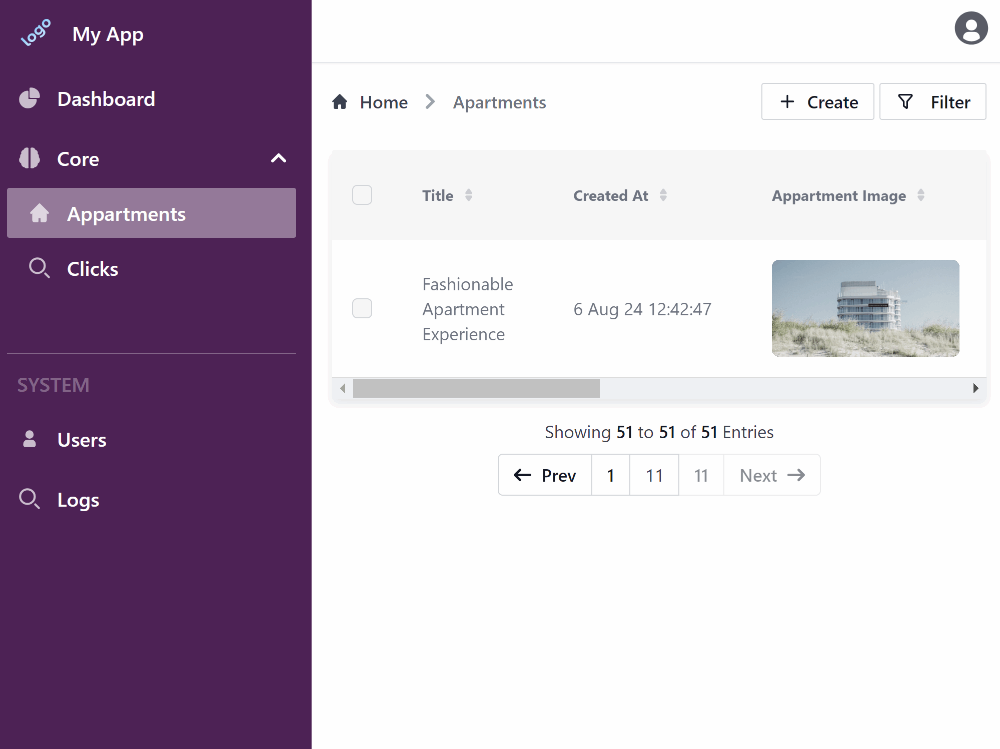

Couple of days ago we released a plugin which allows you to co-write texts and strings with the AI. 

Today LLM is already a must tool to speed-up writing, brainstorming, or generating ideas.

Here is how it looks in action:



<!-- truncate -->

# Simple controls

To control plugin we use our open-source [vue-suggestion-input](https://github.com/devforth/vue-suggestion-input).
It allows to:
* Complete suggestion with `Tab`.
* Complete word with `Ctrl + Right`.
* Regenerate suggestion with `Ctrl + Down`.
* On mobile suggestion word is accepted with swipe right on the screen.

## Want to try it out?

Go to a [Live Demo](https://demo.adminforth.dev/resource/aparts/create) and start creating a new apartment record. Type in the `title` and `description` field and see how the plugin works.

If you want to try it out on your hello-wrold admin panel, then, first follow the instructions in the [Getting Started](/docs/tutorial/gettingStarted) tutorial to create a new project. To install the plugin, then, follow the instructions in the [Chat-GPT plugin page](/docs/tutorial/Plugins/text-complete).


## Context matters, but with sane limit!

When the prompts are called, the plugin passes to LLM not only previous text in current field to complete, but also passes values of other fields in record edited. This allows to generate more relevant completions. 
For example if you have a record with fields `title` and `description`, and you are editing `description`, the plugin will pass `title` value to LLM as well.

But obviously longer prompts lead to higher LLM costs and longer response times. That is why we created mechanics to limit the length of prompts passed to LLM.

Limitation is done on 2 levels:
- plugin settings have `expert.promptInputLimit` - limits length of edited field passed to LLM. If field is longer, it will pass only last `promptInputLimit` characters.
- plugin settings have `expert.recordContext` which defines limits for other fields in record. Each field can't be longer then `maxFieldLength` (default is 300). If field is longer then it is split to parts `splitParts` and they are joined with '...'. Also if there are more non-empty fields then `maxFields`, then plugin selects top longest `maxFields` fields to pass to LLM.

In the end, total number of characters passed to LLM is limited by formula:

```
promptInputLimit + maxFields * maxFieldLength + <LLM request static part>
```

Where `<LLM request static part>` is a constant part of request to LLM which looks like this:

```
Continue writing for text/string field "${this.options.fieldName}" in the table "${resLabel}"\n
Record has values for the context: ${inputContext}\n
Current field value: ${currentVal}\n
Don't talk to me. Just write text. No quotes. Don't repeat current field value, just write completion\n
```

## Model configuration

Of course you can define which model to use for completion. By default plugin uses `gpt-4o-mini` model ($0.150 / 1M input tokens, $0.600 / 1M output tokens for Aug 2024). But you can change it to any other model available in OpenAI API. More powerful replacement is `gpt-4o` model ($5.00 / 1M input tokens, $15.00 / 1M output tokens for Aug 2024).

Also you can define other parameters for completion like:
- `maxTokens` - most likely you don't want to waste tokens on longer completions, so default is 50 tokens.
- `temperature` - model temperature, default is 0.7. You can increase it to get more creative completions (but with risk of getting nonsense). Or decrease it to get more conservative completions.
- `debounceTime` - debounce time in milliseconds, default is 300. After typing each character, plugin waits for `debounceTime` milliseconds before sending request to LLM. If new character is typed during this time, then timer is reset. This is done to prevent sending too many requests to LLM.

## Frontend story

When we were working on plugin, we wanted to make it as user-friendly as possible. 

Most frontend packages for completion have old-fashioned dropdowns, which are not very convenient to use.

We wanted to have something very similar to Copilot or Google doc. So we created our own package [vue-suggestion-input](https://github.com/devforth/vue-suggestion-input). It is also MIT and open-source so you can use it in your projects as well.

Under the hood vue-suggestion-input uses [quill](https://quilljs.com/) editor. Quill is one of the WYSIWYG editors which have really good
API to work with DOM inside of editor. Basically all pieces of content in editor are represented as so called blots. And best thing - you can create your own custom blot. So we created our own blot which is responsible for rendering completion suggestion. Then you just "dance" around positioning of selection, suggestion and text modification, and thees things are easy-peasy with quill API.