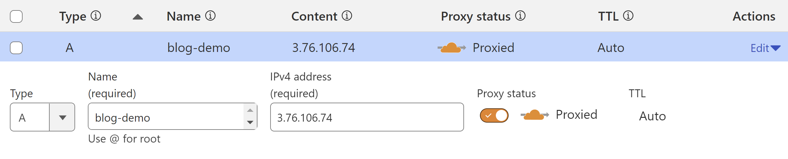

Many developers today are using copilots to write code faster and relax their minds from a routine tasks.

But what about writing plain text? For example blogs and micro-blogs: sometimes you want to share your progress but you are lazy for typing. Then you can give a try to AI-assisted blogging. Our Open-Source AdminForth framework has couple of new AI-capable plugins to write text and generate images.


For AI plugins are backed by OpenAI API, but their architecture allows to be easily extended for other AI providers once OpenAI competitors will reach the same or better level of quality.

Here we will suggest you simple as 1-2-3 steps to build and host a blog with AI assistant which will help you to write posts.

Our tech stack will include:

- [Nuxt.js](https://nuxt.com/) - SEO-friendly page rendering framework
- [AdminForth](https://adminforth.dev/) - Admin panel framework for creating posts
- [AdminForth RichEditor plugin](https://adminforth.dev/docs/tutorial/Plugins/RichEditor/) - WYSIWYG editor with AI assistant in Copilot style
- Node and typescript
- Prisma for migrations
- SQLite for database, though you can easily switch it to Postgres or MongoDB

## Prerequirements

We will use Node v20, if you not have it installed, we recommend [NVM](https://github.com/nvm-sh/nvm?tab=readme-ov-file#install--update-script)

```bash
nvm install 20
nvm alias default 20
nvm use 20
```

## Step 1: Create a new AdminForth project

```bash
mkdir ai-blog
cd ai-blog
npm init -y
npm install adminforth @adminforth/upload @adminforth/rich-editor @adminforth/chat-gpt \
 express slugify http-proxy @types/express typescript tsx @types/node --save-dev
npx --yes tsc --init --module NodeNext --target ESNext
```

## Step 2: Prepare environment

### OpenAI

To allocate OpenAI API key, go to https://platform.openai.com/, open Dashboard -> API keys -> Create new secret key.

### S3

1. Go to https://aws.amazon.com and login.
2. Go to Services -> S3 and create a bucket. Put in bucket name e.g. `my-ai-blog-bucket`. 
First of all go to your bucket settings, Permissions, scroll down to Block public access (bucket settings for this bucket) and uncheck all checkboxes.
Go to bucket settings, Permissions, Object ownership and select "ACLs Enabled" and "Bucket owner preferred" radio buttons.
3. Go to bucket settings, Permissions, scroll down to Cross-origin resource sharing (CORS) and put in the following configuration:

```json
[
    {
        "AllowedHeaders": [
            "*"
        ],
        "AllowedMethods": [
            "PUT"
        ],
        "AllowedOrigins": [
            "http://localhost:3500"
        ],
        "ExposeHeaders": []
    }
]
```

> ☝️ In AllowedOrigins add all your domains. For example if you will serve blog and admin on `https://blog.example.com/` you should add 
> `"https://blog.example.com"` to AllowedOrigins:
>
> ```json
> [
>      "https://blog.example.com",
>      "http://localhost:3500"
> ]
> ```
> Every character matters, so don't forget to add `http://` or `https://` and don't add slashes at the end of the domain.

4. Go to Services -> IAM and create a new user. Put in user name e.g. `my-ai-blog-bucket`.
5. Attach existing policies directly -> `AmazonS3FullAccess`. Go to your user -> `Add permissions` -> `Attach policies directly` -> `AmazonS3FullAccess`
6. Go to Security credentials and create a new access key. Save `Access key ID` and `Secret access key`.


### Create .env file in project directory

Create `.env` file with the following content:

```bash title=".env"
DATABASE_URL=file:./db/db.sqlite
ADMINFORTH_SECRET=<some random string>
OPENAI_API_KEY=...
AWS_ACCESS_KEY_ID=your_access_key_id
AWS_SECRET_ACCESS_KEY=your_secret_access_key
AWS_S3_BUCKET=my-ai-blog-bucket
AWS_S3_REGION=us-east-1
```


## Step 3: Initialize database

Create `./schema.prisma` and put next content there:


```yaml title="./schema.prisma" 
generator client {
  provider = "prisma-client-js"
}

datasource db {
  provider = "sqlite"
  url      = env("DATABASE_URL")
}

model User {
  id           String     @id
  createdAt    DateTime 
  email        String   @unique
  avatar       String?
  publicName   String?
  passwordHash String
  posts        Post[]
}

model Post {
  id          String     @id
  createdAt   DateTime 
  title       String
  slug        String
  picture     String?
  content     String
  published   Boolean  
  author      User?    @relation(fields: [authorId], references: [id])
  authorId    String?
  contentImages ContentImage[]
}

model ContentImage {
  id         String     @id
  createdAt  DateTime 
  img        String
  postId     String
  resourceId String
  post       Post      @relation(fields: [postId], references: [id])
}
```

Create database using `prisma migrate`:

```bash
npx -y prisma migrate dev --name init
```

## Step 4: Setting up AdminForth


Open `package.json`, set `type` to `module` and add `start` script:

```json title="./package.json"
{
  ...
//diff-add
  "type": "module",
  "scripts": {
    ...
//diff-add
    "start": "NODE_ENV=development tsx watch --env-file=.env index.ts",
//diff-add
    "startLive": "NODE_ENV=production APP_PORT=80 tsx index.ts"
  },
}
```

Create `index.ts` file in root directory with following content:

```ts title="./index.ts"
import express from 'express';
import AdminForth, { Filters, Sorts } from 'adminforth';
import userResource from './res/user.js';
import postResource from './res/posts.js';
import contentImageResource from './res/content-image.js';
import httpProxy from 'http-proxy';

declare var process : {
  env: {
    DATABASE_URL: string
    NODE_ENV: string,
    AWS_S3_BUCKET: string,
    AWS_S3_REGION: string,
  }
  argv: string[]
}

export const admin = new AdminForth({
  baseUrl: '/admin',
  auth: {
    usersResourceId: 'user',  // resource to get user during login
    usernameField: 'email',  // field where username is stored, should exist in resource
    passwordHashField: 'passwordHash',
  },
  customization: {
    brandName: 'My Admin',
    datesFormat: 'D MMM',
    timeFormat: 'HH:mm',
    emptyFieldPlaceholder: '-',
    styles: {
      colors: {
        light: {
          // color for links, icons etc.
          primary: 'rgb(47 37 227)',
          // color for sidebar and text
          sidebar: {main:'#EFF5F7', text:'#333'},
        },
      }
    }
  },
  dataSources: [{
    id: 'maindb',
    url:  process.env.DATABASE_URL?.replace('file:', 'sqlite://'),
  }],
  resources: [
    userResource,
    postResource,
    contentImageResource,
  ],
  menu: [
    {
      homepage: true,
      label: 'Posts',
      icon: 'flowbite:home-solid',
      resourceId: 'post',
    },
    { type: 'gap' },
    { type: 'divider' },
    { type: 'heading', label: 'SYSTEM' },
    {
      label: 'Users',
      icon: 'flowbite:user-solid',
      resourceId: 'user',
    }
  ],
});


if (import.meta.url === `file://${process.argv[1]}`) {
  // if script is executed directly e.g. node index.ts or npm start

  const app = express()
  app.use(express.json());
  const port = 3500;

  // needed to compile SPA. Call it here or from a build script e.g. in Docker build time to reduce downtime
  if (process.env.NODE_ENV === 'development') {
    await admin.bundleNow({ hotReload: true });
  }
  console.log('Bundling AdminForth done. For faster serving consider calling bundleNow() from a build script.');

  // api to server recent posts
  app.get('/api/posts', async (req, res) => {
    const { offset = 0, limit = 100, slug = null } = req.query;
    const posts = await admin.resource('post').list(
      [Filters.EQ('published', true), ...(slug ? [Filters.LIKE('slug', slug)] : [])],
      limit,
      offset,
      Sorts.DESC('createdAt'),
    );
    const authorIds = [...new Set(posts.map((p: any) => p.authorId))];
    const authors = (await admin.resource('user').list(Filters.IN('id', authorIds)))
      .reduce((acc: any, a: any) => {acc[a.id] = a; return acc;}, {});
    posts.forEach((p: any) => {
      const author = authors[p.authorId];
      p.author = { 
        publicName: author.publicName, 
        avatar: `https://${process.env.AWS_S3_BUCKET}.s3.${process.env.AWS_S3_REGION}.amazonaws.com/${author.avatar}`
      };
      p.picture = `https://${process.env.AWS_S3_BUCKET}.s3.${process.env.AWS_S3_REGION}.amazonaws.com/${p.picture}`;
    });
    res.json(posts);
  });

  // here we proxy all non-/admin requests to nuxt instance http://localhost:3000
  // this is done for demo purposes, in production you should do this using high-performance reverse proxy like traefik or nginx
  app.use((req, res, next) => {
    if (!req.url.startsWith('/admin')) {
      const proxy = httpProxy.createProxyServer();
      proxy.on('error', function (err, req, res) {
        res.send(`No response from Nuxt at http://localhost:3000, did you start it? ${err}`)
      });
      proxy.web(req, res, { target: 'http://localhost:3000' });
    } else {
      next();
    }
  });

  // serve after you added all api
  admin.express.serve(app)

  admin.discoverDatabases().then(async () => {
    if (!await admin.resource('user').get([Filters.EQ('email', 'adminforth@adminforth.dev')])) {
      await admin.resource('user').create({
        email: 'adminforth@adminforth.dev',
        passwordHash: await AdminForth.Utils.generatePasswordHash('adminforth'),
      });
    }
  });

  app.listen(port, () => {
    console.log(`\n⚡ AdminForth is available at http://localhost:${port}\n`)
  });
}
```

## Step 5: Create resources

Create `res` folder. Create `./res/user.ts` file with following content:

```ts title="./res/users.ts"
import AdminForth, { AdminForthDataTypes } from 'adminforth';
import { randomUUID } from 'crypto';
import UploadPlugin from '@adminforth/upload';

export default {
  dataSource: 'maindb',
  table: 'user',
  label: 'Users',
  recordLabel: (r: any) => `👤 ${r.email}`,
  columns: [
    {
      name: 'id',
      primaryKey: true,
      fillOnCreate: () => randomUUID(),
      showIn: ['list', 'filter', 'show'],
    },
    {
      name: 'email',
      required: true,
      isUnique: true,
      enforceLowerCase: true,
      validation: [
        AdminForth.Utils.EMAIL_VALIDATOR,
      ],
      type: AdminForthDataTypes.STRING,
    },
    {
      name: 'createdAt',
      type: AdminForthDataTypes.DATETIME,
      showIn: ['list', 'filter', 'show'],
      fillOnCreate: () => (new Date()).toISOString(),
    },
    {
      name: 'password',
      virtual: true,
      required: { create: true },
      editingNote: { edit: 'Leave empty to keep password unchanged' },
      minLength: 8,
      type: AdminForthDataTypes.STRING,
      showIn: ['create', 'edit'],
      masked: true,
      validation: [
        // request to have at least 1 digit, 1 upper case, 1 lower case
        AdminForth.Utils.PASSWORD_VALIDATORS.UP_LOW_NUM,
      ],
    },
    { name: 'passwordHash', backendOnly: true, showIn: [] },
    { 
      name: 'publicName',
      type: AdminForthDataTypes.STRING,
    },
    { name: 'avatar' },
  ],
  hooks: {
    create: {
      beforeSave: async ({ record, adminUser, resource }) => {
        record.passwordHash = await AdminForth.Utils.generatePasswordHash(record.password);
        return { ok: true };
      }
    },
    edit: {
      beforeSave: async ({ record, adminUser, resource }) => {
        if (record.password) {
          record.passwordHash = await AdminForth.Utils.generatePasswordHash(record.password);
        }
        return { ok: true }
      },
    },
  }
  plugins: [
    new UploadPlugin({
      pathColumnName: 'avatar',
      s3Bucket: process.env.AWS_S3_BUCKET,
      s3Region: process.env.AWS_S3_REGION,
      allowedFileExtensions: ['jpg', 'jpeg', 'png', 'gif', 'webm','webp'],
      maxFileSize: 1024 * 1024 * 20, // 20MB
      s3AccessKeyId: process.env.AWS_ACCESS_KEY_ID,
      s3SecretAccessKey: process.env.AWS_SECRET_ACCESS_KEY,
      s3ACL: 'public-read', // ACL which will be set to uploaded file
      s3Path: (
        { originalFilename, originalExtension }: {originalFilename: string, originalExtension: string }
      ) => `user-avatars/${new Date().getFullYear()}/${randomUUID()}/${originalFilename}.${originalExtension}`,
      generation: {
        provider: 'openai-dall-e',
        countToGenerate: 2,
        openAiOptions: {
          model: 'dall-e-3',
          size: '1024x1024',
          apiKey: process.env.OPENAI_API_KEY,
        },
      },
    }),
  ],
}
```


Create `posts.ts` file in res directory with following content:

```ts title="./res/post.ts"
import { AdminUser, AdminForthDataTypes } from 'adminforth';
import { randomUUID } from 'crypto';
import UploadPlugin from '@adminforth/upload';
import RichEditorPlugin from '@adminforth/rich-editor';
import ChatGptPlugin from '@adminforth/chat-gpt';
import slugify from 'slugify';

export default {
  table: 'post',
  dataSource: 'maindb',
  label: 'Posts',
  recordLabel: (r: any) => `📝 ${r.title}`,
  columns: [
    {
      name: 'id',
      primaryKey: true,
      fillOnCreate: () => randomUUID(),
      showIn: ['filter', 'show'],
    },
    {
      name: 'title',
      required: true,
      showIn: ['list', 'create', 'edit', 'filter', 'show'],
      maxLength: 255,
      minLength: 3,
      type: AdminForthDataTypes.STRING,
    },
    {
      name: 'picture',
      showIn: ['list', 'create', 'edit', 'filter', 'show'],
    },
    {
      name: 'slug',
      showIn: ['filter', 'show'],
    },
    {
      name: 'content',
      showIn: ['create', 'edit', 'filter', 'show'],
      type: AdminForthDataTypes.RICHTEXT,
    },
    {
      name: 'createdAt',
      showIn: ['list', 'filter', 'show',],
      fillOnCreate: () => (new Date()).toISOString(),
    },
    {
      name: 'published',
      required: true,
    },
    {
      name: 'authorId',
      foreignResource: {
        resourceId: 'user',
      },
      showIn: ['filter', 'show'],
      fillOnCreate: ({ adminUser }: { adminUser: AdminUser }) => {
        return adminUser.dbUser.id;
      }
    }
  ],
  hooks: {
    create: {
      beforeSave: async ({ record, adminUser }: { record: any, adminUser: AdminUser }) => {
        record.slug = slugify(record.title, { lower: true });
        return { ok: true };
      },
    },
    edit: {
      beforeSave: async ({ record, adminUser }: { record: any, adminUser: AdminUser }) => {
        if (record.title) {
          record.slug = slugify(record.title, { lower: true });
        }
        return { ok: true };
      },
    },
  },
  plugins: [
    new UploadPlugin({
      pathColumnName: 'picture',
      s3Bucket: process.env.AWS_S3_BUCKET,
      s3Region: process.env.AWS_S3_REGION,
      allowedFileExtensions: ['jpg', 'jpeg', 'png', 'gif', 'webm','webp'],
      maxFileSize: 1024 * 1024 * 20, // 20MB
      s3AccessKeyId: process.env.AWS_ACCESS_KEY_ID,
      s3SecretAccessKey: process.env.AWS_SECRET_ACCESS_KEY,
      s3ACL: 'public-read', // ACL which will be set to uploaded file
      s3Path: (
        { originalFilename, originalExtension }: {originalFilename: string, originalExtension: string }
      ) => `post-previews/${new Date().getFullYear()}/${randomUUID()}/${originalFilename}.${originalExtension}`,
      generation: {
        provider: 'openai-dall-e',
        countToGenerate: 2,
        openAiOptions: {
          model: 'dall-e-3',
          size: '1792x1024',
          apiKey: process.env.OPENAI_API_KEY,
        },
        fieldsForContext: ['title'],
      },
    }),
    new RichEditorPlugin({
      htmlFieldName: 'content',
      completion: {
        provider: 'openai-chat-gpt',
        params: {
          apiKey: process.env.OPENAI_API_KEY,
          model: 'gpt-4o',
        },
        expert: {
          debounceTime: 250,
        }
      }, 
      attachments: {
        attachmentResource: 'contentImage',
        attachmentFieldName: 'img',
        attachmentRecordIdFieldName: 'postId',
        attachmentResourceIdFieldName: 'resourceId',
      },
    }),
    new ChatGptPlugin({
      openAiApiKey: process.env.OPENAI_API_KEY,
      model: 'gpt-4o',
      fieldName: 'title',
      expert: {
        debounceTime: 250,
      }
    }),
  ]
}
```

Also create `content-image.ts` file in `res` directory with following content:

```ts title="./res/content-image.ts"

import { AdminForthDataTypes } from 'adminforth';
import { randomUUID } from 'crypto';
import UploadPlugin from '@adminforth/upload';

export default {
  table: 'contentImage',
  dataSource: 'maindb',
  label: 'Content Images',
  recordLabel: (r: any) => `🖼️ ${r.img}`,
  columns: [
    {
      name: 'id',
      primaryKey: true,
      fillOnCreate: () => randomUUID(),
    },
    {
      name: 'createdAt',
      type: AdminForthDataTypes.DATETIME,
      fillOnCreate: () => (new Date()).toISOString(),
    },
    {
      name: 'img',
      type: AdminForthDataTypes.STRING,
      required: true,
    },
    {
      name: 'postId',
      foreignResource: {
        resourceId: 'post',
      },
      showIn: ['list', 'filter', 'show'],
    },
    {
      name: 'resourceId',
    }
  ],
  plugins: [
    new UploadPlugin({
      pathColumnName: 'img',
      s3Bucket: process.env.AWS_S3_BUCKET,
      s3Region: process.env.AWS_S3_REGION,
      allowedFileExtensions: ['jpg', 'jpeg', 'png', 'gif', 'webm','webp'],
      maxFileSize: 1024 * 1024 * 20, // 20MB
      s3AccessKeyId: process.env.AWS_ACCESS_KEY_ID,
      s3SecretAccessKey: process.env.AWS_SECRET_ACCESS_KEY,
      s3ACL: 'public-read', // ACL which will be set to uploaded file
      s3Path: (
        { originalFilename, originalExtension }: {originalFilename: string, originalExtension: string }
      ) => `post-content/${new Date().getFullYear()}/${randomUUID()}/${originalFilename}.${originalExtension}`,
    }),
  ],
}
```

Now you can start your admin panel:

```bash
npm start
```

Open `http://localhost:3500/admin` in your browser and login with `adminforth@adminforth.dev` and `adminforth` credentials.
Set up your avatar (you can generate it with AI) and public name in user settings.


## Step 5: Create Nuxt project


Now let's initialize our seo-facing frontend:

```bash
npx nuxi@latest init seo
cd seo
npm install -D sass-embedded
npm run dev
```

Edit `app.vue`: 

```html title="./seo/app.vue"
<template>
  <div id="app">
    <NuxtPage />
  </div>
</template>


<style lang="scss">

$grColor1: #74E1FF;
$grColor2: #8580B4;
$grColor3: #5E53C3;
$grColor4: #4FC7E9;
$grColor5: #695BE9;

  #app {
    font-family: Avenir, Helvetica, Arial, sans-serif;
    -webkit-font-smoothing: antialiased;
    -moz-osx-font-smoothing: grayscale;
    // gradient with color spots
    animation: gradient 15s ease infinite;
    min-height: 100vh;
  }
  body {
    margin: 0;
    padding: 0;
    max-height: 100vh;
    overflow: overlay;
    background-image: radial-gradient(
  circle farthest-corner at top left, $grColor1 0%, rgba(225, 243, 97,0) 50%),
      radial-gradient(
      circle farthest-side at top right, $grColor2 0%, rgba(181, 176, 177,0) 10%),
      radial-gradient(circle farthest-corner at bottom right, $grColor3 0%, rgba(204, 104, 119, 0) 33%),
      radial-gradient(
          circle farthest-corner at top right, $grColor4 0%, rgba(155, 221, 240,0) 50%),
      radial-gradient(ellipse at bottom center, $grColor5 0%, rgba(254, 43, 0, 0) 80%); 
    background-attachment: fixed;
  }
</style>
```


Add folder `pages` and create `index.vue`:

```html title="./seo/pages/index.vue"
<template>
  <div class="container">
    <PostCard 
      v-for="post in posts" 
      :key="post.id" 
      :post="post"
    />
    <div class="no-posts" v-if="!posts.length">
      No posts added yet
      <a href="/admin">Add a first one in admin</a>
    </div>
  </div>
</template>

<style lang="scss">
.container {
  display: flex;
  justify-content: center;
  align-items: center;
  flex-wrap: wrap;
  flex-direction: column;
  gap: 1rem;
  padding-top: 2rem;
}

.no-posts {
  margin-top: 2rem;
  font-size: 1.5rem;
  text-align: center;
  background-color: rgba(255 244 255 / 0.43);
  padding: 2rem;
  border-radius: 0.5rem;
  border: 1px solid #FFFFFF;
  box-shadow: 0.2rem 0.3rem 2rem rgba(0, 0, 0, 0.1);
  color: #555;
  a {
    color: #333;
    text-decoration: underline;
    margin-top: 1rem;
    display: block;
    font-size: 1.2rem;
  }

}
</style>

<script lang="ts" setup>

import PostCard from '~/PostCard.vue'

const posts = ref([])

onMounted(async () => {
  const resp = await fetch(`/api/posts`);
  posts.value = await resp.json();
})

</script>
```

Finally, create `PostCard.vue` component:

```html title="./seo/PostCard.vue"
<template>
  <div class="post-card">
    
    <h2>{{ props.post.title }}</h2>
    <div class="content" v-html="props.post.content"></div>
    <div class="posted-at">
      <div>{{ formatDate(props.post.createdAt) }}</div>
      <div class="author">
        
        <div>
          {{ props.post.author.publicName }}
        </div>
      </div>
    </div>
  </div>
</template>

<script setup lang="ts">

const props = defineProps<{
  post: {
    title: string
    content: string
    createdAt: string // iso date
    picture?: string
    author: {
      publicName: string
      avatar: string
    }
  }
}>()


function formatDate(date: string) {
  // format to format MMM DD, YYYY using Intl.DateTimeFormat
  return new Intl.DateTimeFormat('en-US', {
    month: 'short',
    day: '2-digit',
    year: 'numeric'
  }).format(new Date(date))
}
</script>

<style lang="scss">

.post-card {
  background-color: rgba(255 244 255 / 0.43);
  padding: 2rem;
  border-radius: 0.5rem;
  border: 1px solid #FFFFFF;
  box-shadow: 0.2rem 0.3rem 2rem rgba(0, 0, 0, 0.1);
  max-width: calc(100vw - 4rem);
  width: 600px;
  color: #333;
  line-height: 1.8rem;

  >img {
    width: 100%;
    border-radius: 0.5rem;
    margin-bottom: 2rem;
  }
  
  h2 {
    margin: 0 0 2rem 0;
    font-size: 1.5rem;
  }

  .content {
    margin-top: 1rem;
  }

  .posted-at {
    margin-top: 1rem;
    font-size: 0.8rem;
    color: #666;
    display: flex;
    justify-content: space-between;
    align-items: center;
  }

  .author {
    display: flex;
    align-items: center;

    img {
      width: 2rem;
      height: 2rem;
      border-radius: 50%;
      margin-right: 0.5rem;
    }
    div {
      // flash wire dot line effect
      position: relative;
      overflow: hidden;
      border-radius: 1rem;
      padding: 0.2rem 0.5rem;
      font-size: 1rem;
      background: linear-gradient(90deg, rgb(0 21 255) 0%, rgb(0 0 0) 100%);
      background-size: 200% auto;
      background-clip: text;
      -webkit-background-clip: text;
      color: transparent; /* Hide the original text color */
      animation: shimmer 2s infinite;
      @keyframes shimmer {
        0% {
          background-position: -200% center;
        }
        100% {
          background-position: 200% center;
        }
      }

    }
  }

}

</style>
```

Now you can start your Nuxt project:

```bash
npm run dev
```

And run `npm start` if you did not run it previously:

```bash
npm start
```

Open `http://localhost:3500` in your browser and you will see your blog with posts from admin panel:


Go to `http://localhost:3500/admin` to add new posts.

## Step 6: Deploy

We will dockerize app to make it easy to deploy with many ways. We will wrap both Node.js adminforth app and Nuxt.js app into single container for simplicity using supervisor. However you can split them into two containers and deploy them separately e.g. using docker compose. 

Please note that in this demo example we routing requests to Nuxt.js app from AdminForth app using http-proxy. 
While this will work fine, it might give slower serving then if you would route traffik using dedicated reverse proxies like traefik or nginx.


### Dockerize in single container

Create `bundleNow.ts` file in root project directory:

```ts title="./bundleNow.ts"
import { admin } from './index.js';

await admin.bundleNow({ hotReload: false});
console.log('Bundling AdminForth done.');
```


Create `Dockerfile` in root project directory:

```dockerfile title="./Dockerfile"
FROM node:20-alpine
EXPOSE 3500
WORKDIR /app
RUN apk add --no-cache supervisor
COPY package.json package-lock.json ./
RUN npm ci
COPY seo/package.json seo/package-lock.json seo/
RUN cd seo && npm ci
COPY . .

RUN npx tsx bundleNow.ts
RUN cd seo && npm run build

RUN cat > /etc/supervisord.conf <<EOF
[supervisord]
nodaemon=true

[program:app]
command=npm run startLive
directory=/app
autostart=true
autorestart=true
stdout_logfile=/dev/stdout
stderr_logfile=/dev/stderr

[program:seo]
command=sh -c "cd seo && node .output/server/index.mjs"
directory=/app
autostart=true
autorestart=true
stdout_logfile=/dev/stdout
stderr_logfile=/dev/stderr

[program:prisma]
command=npx --yes prisma migrate dev --name init
directory=/app
autostart=true
stdout_logfile=/dev/stdout
stderr_logfile=/dev/stderr

EOF

CMD ["supervisord", "-c", "/etc/supervisord.conf"]
```

Create `.dockerignore` file in root project directory:

```bash title=".dockerignore"
.env
node_modules
seo/node_modules
.git
db
*.tar
.terraform*
terraform*
*.tf
```


Build and run your docker container locally:

```bash
sudo docker run -p80:3500 -v ./prodDb:/app/db --env-file .env -it $(docker build -q .)
```

Now you can open `http://localhost` in your browser and see your blog.

### Deploy to EC2 with terraform


First of all install Terraform as described here [https://developer.hashicorp.com/terraform/install#linux](terraform installation).

If you are on Ubuntu(WSL2 or native) you can use the following commands:

```bash
wget -O- https://apt.releases.hashicorp.com/gpg | sudo gpg --dearmor -o /usr/share/keyrings/hashicorp-archive-keyring.gpg
echo "deb [signed-by=/usr/share/keyrings/hashicorp-archive-keyring.gpg] https://apt.releases.hashicorp.com $(lsb_release -cs) main" | sudo tee /etc/apt/sources.list.d/hashicorp.list
sudo apt update && sudo apt install terraform
```


Create special AWS credentials for deployemnts by going to `AWS console` -> `IAM` -> `Users` -> `Add user` (e.g. my-ai-blog-user) -> Attach existing policies directly -> `AdministratorAccess` -> Create user. Save `Access key ID` and `Secret access key` into `~/.aws/credentials` file:

Create or open file:

```bash
code ~/.aws/credentials
```

```bash
...

[myaws]
aws_access_key_id = YOUR_ACCESS_KEY
aws_secret_access_key = YOUR_SECRET
```


Create file `main.tf` in root project directory:

```hcl title="./main.tf"
provider "aws" {
  region = "eu-central-1"
  profile = "myaws"
}

data "aws_ami" "amazon_linux" {
  most_recent = true
  owners      = ["amazon"]

  filter {
    name   = "name"
    values = ["amzn2-ami-hvm-*-x86_64-gp2"]
  }
}

data "aws_vpc" "default" {
  default = true
}

data "aws_subnet" "default_subnet" {
  filter {
    name   = "vpc-id"
    values = [data.aws_vpc.default.id]
  }

  filter {
    name   = "default-for-az"
    values = ["true"]
  }

  filter {
    name   = "availability-zone"
    values = ["eu-central-1a"]
  }
}

resource "aws_security_group" "instance_sg" {
  name   = "my-ai-blog-instance-sg"
  vpc_id = data.aws_vpc.default.id

  ingress {
    description = "Allow HTTP"
    from_port   = 80
    to_port     = 80
    protocol    = "tcp"
    cidr_blocks = ["0.0.0.0/0"]
  }

  # SSH
  ingress {
    description = "Allow SSH"
    from_port   = 22
    to_port     = 22
    protocol    = "tcp"
    cidr_blocks = ["0.0.0.0/0"]
  }

  egress {
    description = "Allow all outbound traffic"
    from_port   = 0
    to_port     = 0
    protocol    = "-1"
    cidr_blocks = ["0.0.0.0/0"]
  }
}

resource "aws_key_pair" "deployer" {
  key_name   = "terraform-deployer-key"
  public_key = file("~/.ssh/id_rsa.pub") # Path to your public SSH key
}


resource "aws_instance" "docker_instance" {
  ami                    = data.aws_ami.amazon_linux.id
  instance_type          = "t3a.micro"
  subnet_id              = data.aws_subnet.default_subnet.id
  vpc_security_group_ids = [aws_security_group.instance_sg.id]
  key_name               = aws_key_pair.deployer.key_name

  user_data = <<-EOF
    #!/bin/bash
    yum update -y
    amazon-linux-extras install docker -y
    systemctl start docker
    systemctl enable docker
    usermod -a -G docker ec2-user
  EOF

  tags = {
    Name = "my-ai-blog-instance"
  }
}

resource "null_resource" "build_image" {
  provisioner "local-exec" {
    command = "docker build -t blogapp . && docker save blogapp:latest -o blogapp_image.tar"
  }
  triggers = {
    always_run = timestamp() # Force re-run if necessary
  }
}

resource "null_resource" "remote_commands" {
  depends_on = [aws_instance.docker_instance, null_resource.build_image]

  triggers = {
    always_run = timestamp()
  }


  provisioner "file" {
    source      = "${path.module}/blogapp_image.tar"
    destination = "/home/ec2-user/blogapp_image.tar"
    
    connection {
      type        = "ssh"
      user        = "ec2-user"
      private_key = file("~/.ssh/id_rsa")
      host        = aws_instance.docker_instance.public_ip
    }
  }

  provisioner "file" {
    source      = "${path.module}/.env"
    destination = "/home/ec2-user/.env"
    
    connection {
      type        = "ssh"
      user        = "ec2-user"
      private_key = file("~/.ssh/id_rsa")
      host        = aws_instance.docker_instance.public_ip
    }
  }

  provisioner "remote-exec" {
    inline = [
      "while ! command -v docker &> /dev/null; do echo 'Waiting for Docker to be installed...'; sleep 1; done",
      "while ! sudo docker info &> /dev/null; do echo 'Waiting for Docker to start...'; sleep 1; done",
      "sudo docker system prune -af",
      "docker load -i /home/ec2-user/blogapp_image.tar",
      "sudo docker rm -f blogapp || true",
      "sudo docker run --env-file .env -d -p 80:3500 --name blogapp -v /home/ec2-user/db:/app/db blogapp"
    ]

    connection {
      type        = "ssh"
      user        = "ec2-user"
      private_key = file("~/.ssh/id_rsa")
      host        = aws_instance.docker_instance.public_ip
    }
  }

  
}

output "instance_public_ip" {
  value = aws_instance.docker_instance.public_ip
}

```


Now you can deploy your app to AWS EC2:

```bash
terraform init
terraform apply -auto-approve
```

> ☝️ To destroy and  stop billing run `terraform destroy -auto-approve`

> ☝️ To check logs run `ssh -i ~/.ssh/id_rsa ec2-user@$(terraform output instance_public_ip)`, then `sudo docker logs -n100 -f aiblog`

Terraform config will build Docker image locally and then copy it to EC2 instance. This approach allows to save build resources (CPU/RAM) on EC2 instance, however increases network traffic (image might be around 200MB). If you want to build image on EC2 instance, you can adjust config slightly: remove `null_resource.build_image` and change `null_resource.remote_commands` to build image on EC2 instance, however micro instance most likely will not be able to build and keep app running at the same time, so you will need to increase instance type or terminate app while building image (which introduces downtime so not recommended as well).


### Add HTTPs and CDN

For adding HTTPS and CDN you will use free Cloudflare service (though you can use paid AWS Cloudfront or any different way e.g. add Traefik and Let's Encrypt). Go to https://cloudflare.com and create an account. Add your domain and follow instructions to change your domain nameservers to Cloudflare ones.

Go to your domain settings and add A record with your server IP address, which was shown in output of `terraform apply` command.

```
Type: A
Name: blog
Value: x.y.z.w
Cloudflare proxy: orange (enabled)
```




## Useful links

* [Full source code of the project](https://github.com/devforth/adminforth-example-ai-blog)
* [Live demo of AI BLog](https://blog-demo.adminforth.dev/admin/resource/post)
* [AdminForth documentation](https://adminforth.dev/docs/tutorial/gettingStarted/)
* [AdminForth GitHub](https://github.com/devforth/adminforth)
* [Nuxt.js documentation](https://nuxt.com/docs/getting-started/introduction)