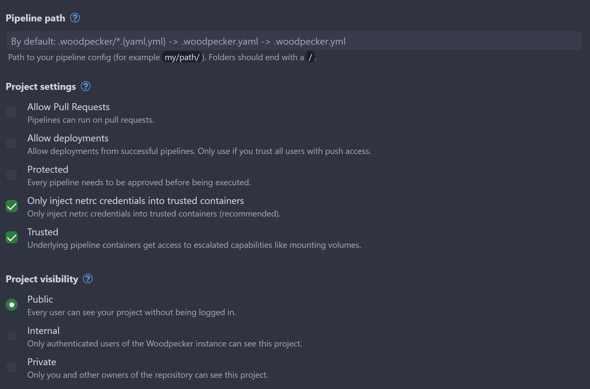

After first 600 versions of Adminforth we realized that manual ChangeLog is pretty hard to maintain precisely. It is pretty easy to forget to update it, or do a mistake in it. That is why we decided to move the idea of generating releases and ChangeLog from git commit messages.

In this post I will share our journey of how we did a transition from manual ChangeLog to automatic one.

## Prehistory

Before 1.6.0 AdminForth was using manual ChangeLog. We were reviwing PRs, merged them all to `main` branch and there did manually npm release. We were constantly releasing to `next` pre-release version from `main` and used `next` it internally on our projets for testing. Once we collected enough features and fixes, we were doing a release to `latest` version, and at this time we did release documentation. 
ChangeLog included only main "latest" chain of versions, so while we releasing to `next` we added items under one version in ChangeLog. So user was not able to distinguish `1.5.0-next.0` from `1.5.0-next.1` in ChangeLog.

Anyway this was a pretty good approach, but it was hard to maintain ChangeLog: first you have to write commit message, then write same message in ChangeLog. And from time to time we were missing updating ChangeLog at all. 

Also since release was manual from my PC there was a chance that I will forget to push tags to GitHub and release already happened. And chance that I will forget to push ChangeLog to GitHub.

Git tags were applied only after release and there again was a chance that I will forget to push them to GitHub before release.
So only one reliabile way to check what is difference in source code between versions was to use https://npmdiff.dev/ and not rely on git and ChangeLog.

Another thing is documentation. If I added something to documentation and decided to release it, there was a chance that I will release items for `next` version which are not yet in `latest` version. But this was easily solvable by maintaining `next` and `latest` branches instead of doing `next` development in `main` branch. In the end we switched to this approach.

Another thing - structure of repository. Historically for faster development in dev demo, we added all plugins into one repository. This was good for development(and very bad when count of plugins increased), and very bad for release process. Every plugin had its own version and its own ChangeLog. So we had to enter every plugin folder, do release,  and push ChangeLog to GitHub. This was very time consuming and error-prone. It started to be obvious that we need to split plugins to separate repositories what was done now.

## Transition

I will show a flow on empty fake small project to not overcomplicate things.
We will use minimal typescript package with `npm` and `semantic-release` to show how it works.

```
echo "# test-sem-release" >> README.md
git init
git add README.md
git commit -m "first commit"
git branch -M main
git remote add origin git@github.com:devforth/test-sem-release.git
git push -u origin main
```

Now lets init new `npm package`:

```
npm init -y
npm install typescript --save-dev
npx tsc --init
```

Create a file `index.ts`:

```
export const greet = (name: string): string => {
  return `Hello, ${name}!`;
};
```


In `package.json` add:

```
{
  "name": "@devforth/test-sem-release",
//diff-add
  "publishConfig": {
//diff-add
    "access": "public"
//diff-add
  },
  "version": "1.0.0",
  "main": "index.js",
  "scripts": {
    "test": "echo \"Error: no test specified\" && exit 1"
//diff-add
    "build": "tsc",
  },
  "author": "",
  "license": "ISC",
  "description": "",
//diff-add
  "release": {
//diff-add
    "branches": [main", "next"],
//diff-add
    "plugins": [
//diff-add
      [
//diff-add
        "@semantic-release/exec",
//diff-add
        {
//diff-add
          "prepareCmd": "npm run build"
//diff-add
        }
//diff-add
      ],
//diff-add
      "@semantic-release/commit-analyzer",
//diff-add
      "@semantic-release/release-notes-generator",
//diff-add
      "@semantic-release/npm",
//diff-add
      "@semantic-release/github"
//diff-add
    ],
//diff-add
  }
}
```

Make sure name in package.json has your organisation name like mine `@devforth/` and you have access to publish packages to npmjs.com.


Also install `semantic-release` and `@semantic-release/exec`:

```
npm i -D semantic-release @semantic-release/exec
```

We use `@semantic-release/exec` to run `npm run build` as prepare step for release. Of course you can run build before calling `semantic-release` in CI pipleine, but this approach will allow to nativeley integrate it with `semantic-release` and e.g. show build errors in semantic-release notification plugins.

## Connecting to CI

We will use Woodpecker CI for this example. Woodpecker is a free and open-source CI/CD tool that you can install to your own server / VPS and will not need to pay only for server. No limits on pipelines, users, repositories, etc. If you want to try it, we have [Woodpecker installation guide](https://devforth.io/blog/step-by-step-guide-to-modern-secure-ci-setup/)

Create a file `.woodpecker.yml` in root of your repository:

```
clone:
  git:
    image: woodpeckerci/plugin-git
    settings:
      partial: false
      depth: 5

steps:
  release:
    image: node:22
    when:
      - event: push
    volumes:
      - /var/run/docker.sock:/var/run/docker.sock
    commands:
      - npm clean-install
      - npm run build
      - npm audit signatures
      - npx semantic-release
    secrets:
      - GITHUB_TOKEN
      - NPM_TOKEN
```

Go to Woodpecker, authorize via GitHub, click "Add repository", find your repository and add it.

Disable "Project settings" -> "Allow Pull Requests" because we do not want to trigger builds on PRs.
Enable "Project settings" -> "Trusted"
Enable "Project Visibility" -> "Public"




### Generating GitHub acces token

if your repo is in GitHub organisation, you need first enable access to personal access tokens for your organisation (if not yet done)

1. In the upper-right corner of GitHub, select your profile photo, then click  Your organizations. 
2. Next to the organization, click Settings.
3. In the left sidebar, under  Personal access tokens, click Settings.
4. Select "Allow access via fine-grained personal access tokens"
5. We recommend setting "Require administrator approval"
6. "Allow access via personal access tokens (classic)"

Now go to your profile, click on "Settings" -> "Developer settings" -> "Personal access tokens" -> "Generate new token"

For permissions, select Contents: Read and Write
select Metadata: Read-only


In Woodpecker Go to settings, Secrets, Add Secret `GITHUB_TOKEN` and paste your token:


In "Available at following events" select "Push,  also you can select "Manual" if you want to trigger builds manually.


### Generating NPM token

Go to your npmjs.com account, click on "Profile Avatar" -> "Access Tokens" -> "Generate New Token" -> "New Granular Access Token".

Packages and scopes Permissions: Read and Write.

Add to Woodpecker as secret `NPM_TOKEN`


## Testing

For now we did not yet push anything to GitHub and did not publish anything to npm. 

Lets do it now.


Just push your first commit as:


```
feat: initial commit
```

This will trigger semantic-release to do first release v1.0.0.

Now change something is index.ts and push it as fix

```
fix: fix greet function
```

This will trigger semantic-release to do release v1.0.1.


Now change something in index.ts and push it as feat

```
feat: add new function
```

This will trigger semantic-release to do release v1.1.0 because we added new feature, not just fixed something.


### Next distribution channel

Now we will show how to release to `next` channel.

```
git checkout -b next
```

Change something and push it as fix

```
fix: fix greet function in next
```

Commit it and push:

```
git push --set-upstream origin next
```

This will trigger semantic-release to do release `v1.1.1-next.1`. Please not that it bumped patch version because we are in `next` channel.

Now lets add feature to next

```
feat: add new feature in next
```

It will trigger release `v1.2.0-next.1` because we added new feature and minor version was bumped. Please not that next number started from 1 again.

Noe lets merge `next` to `main` and push it:

```
git checkout main
git merge next
git push
```

This will trigger release `v1.2.0` because we merged `next` to `main` and it was a feature release.