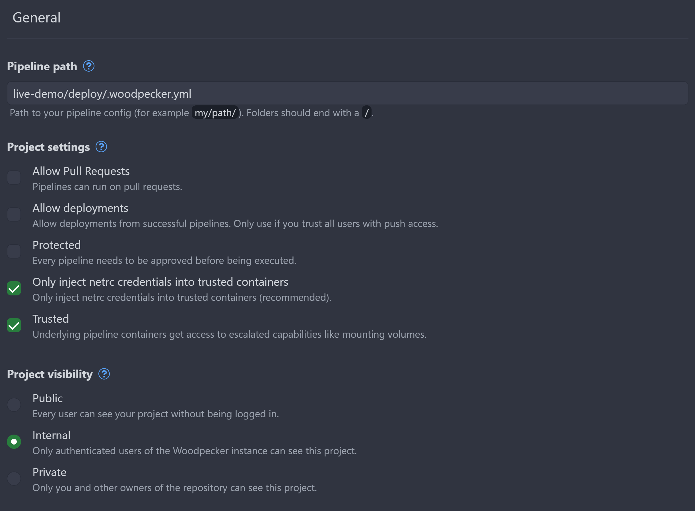
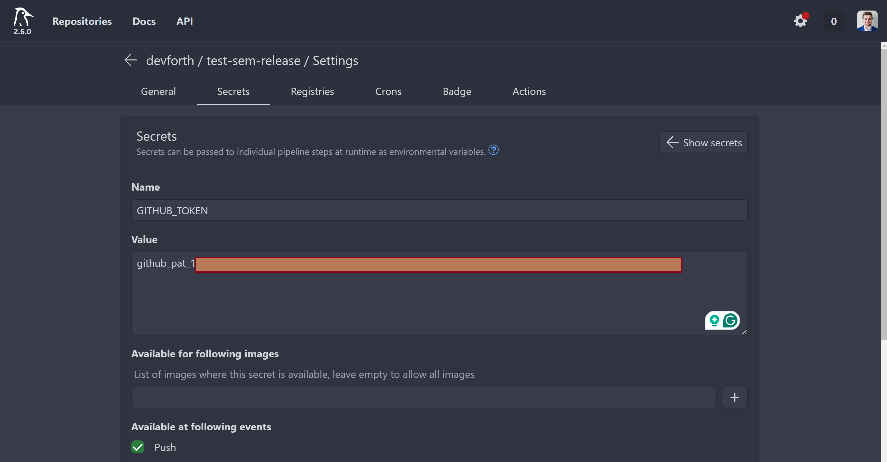
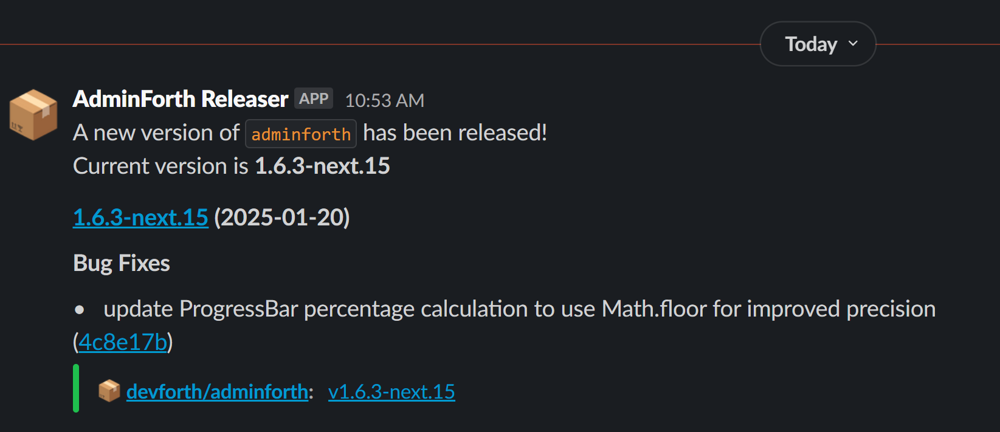

I have a feeling that after first ~600 versions of Adminforth we faced all possible issues with manual versioning and release notes. 

Manual versioning and CHANGELOG.md is unreliable as human beings are. It is pretty easy to forget it with relevant information, forget to include some changes, forget to push it to GitHub, push it at wrong time, and many more things.

That is why we decided to move the idea of generating versions, and GitHub releases from git commit messages using great tool called [semantic-release](https://semantic-release.gitbook.io/semantic-release/usage/configuration).

In this post I will explain why we did a transition from manual releases to automatic, what profits we got from it, and also will show you simple example how to do it in your project!

## Prehistory and issues

Before 1.6.0 AdminForth was using manual CHANGELOG.md. 

During development we were reviwing PRs, merged them all to `main` branch, pulled to local machine and there did manually npm release which also created a git tag and pushed it to GitHub.

We were constantly releasing to `next` pre-release version from `main` and used `next` internally on our projets for testing. 

### What is npm pre-release version?

If you are not familiar with pre-release versions, I can explain it on simple example.

If you have version `1.2.3` in your `package.json` and you run `npm version patch` it will bump version to `1.2.4`. If you run it again it will bump version to `1.2.5`.
If you have version `1.2.3` and run `npm version prerelease --preid=next` it will bump version to `1.2.4-next.0`. If you run it again it will bump version to `1.2.4-next.1`. If you run `npm version patch` now it will release version `1.2.4`, hoever if at last step you run `npm version minor` it would release version `1.3.0`.

Please pay attention that `npm` is pretty smart and aligned with normal software release cycle -- once you run `npm version pre-release` on stable version, it understands that you start working on new version and will bump patch version. Once you run `npm version patch` at pre-release version, it will release it as stable version without bumping patch number.

This is very useful because we can collect features and fixes in `next` version without releasing them to `latest` version, so users who do `npm install adminforth` will not get new experimental features and fixes, but thouse who want to test them early can do `npm install adminforth@next`. Our team also using `next` for commercial projects to test new features so in the end of the day we have more stable `latest` version.

In new automatic release process we preserved this approach, but made it in separate git branches.

Once we collected enough features and fixes in `next`, we were doing a release to `latest` version, and at this time we did release documentation. 

### Issue one -- easy to forget add something to CHANGELOG.md

So when I merged PRs to `main` branch, I had to check commits and write them to CHANGELOG.md. 

At this point I wasted time to understand how to call the change in CHANGELOG.md, and categorize it as `Added`, `Changed`, `Fixed`, `Removed`, `Security`.

Also there was a chance that I will skip some commit, or will understand wrong what it was about.

### Issue two -- CHANGELOG.md might be forgot to be changed before release as all

There was a chance that I will forget to update `CHANGELOG.md` at all. I merged PRs, I am hurry and doing release. 

Sometimes I will soon understand that I forgot to update it and will push it to GitHub. It will born another dump commit message like "Update a CHANGELOG.md". 

Also I am not sure that users are looking into `main` branch to see CHANGELOG, probably they see it in npmjs.com.

### Issue three -- lack of GitHub releases or need to maintain both

We did not have GitHub releases at all at that time. We had only tags. And tags were applied only after release.

But honestly, when I am by myself working with some pacakge, first try to find GitHub releases, though CHANGELOG.md.

So if I would add GitHub releases, I would have to do a lot of clicks or would need some script / CLI to create release notes. This process would have similar issues as with CHANGELOG.md.

### Issue four -- manual tags

Since release was manual from my PC there was a chance that I will do some minor fix, will forget to commit it, then will do release and release script will add tag to previous, irrelevant commit. 

In such projects with manual tags, there is only one reliabile way for package user to to check what is difference in source code between two versions: using some tool like https://npmdiff.dev/ and not rely on git and CHANGELOG

Since git tags were applied only after release and there again was a chance that I will forget to push them to GitHub with a release.

### Issue five -- dump commits

Since with every manual release we updated CHANGELOG.md and updated version in `pacakge.json` every time, we had to do a commit. 

So it borned a lot of dump commits like "Update CHANGELOG.md", "Update version to 1.2.3", "Update version to 1.2.4", "Update version to 1.2.5".

Sometime it wass forgot to be commited separately and was commited with other changes in some fix which is even worsen.

### Issue six -- releae delay and bus-factor

So if I was busy new features were waiting for release, becuase only I had access to do releases.

Sonner I passed access to some of my colleagues to do releases but from time to time it caused state desync and release issues between our PCs if someone forgot to push something to GitHub after release.

Even couple of release contrubuters are onboard, it still takes a time to do all the stuff with Changelog, version, tags, etc, so it delays release.

### Issue seven -- lack of pre-release versions changes

While we releasing to `next` we added items under one version in CHANGELOG for simplicity. It would be another extra time to add every `next` version in CHANGELOG and describe whole markdown for it. 

So user was not able to distinguish `1.5.0-next.0` from `1.5.0-next.1` in CHANGELOG, which was not an issue for `latest` users but issue for `next` users.


## Semantic-release -- what is it and how it works

`semantic-release` is a tool that solved all issues above. Basically it is a CLI tool that you run on your CI/CD server on every push to your repository. 

So on every push it analyzes commit messages from previous release and does next things:

- It understands what type of release it should do: major, minor, patch, pre-release depending on commit messages. E.g. if you have a commit message `feat: add new feature` it will do a minor release, if you have `fix: fix bug` it will do a patch release.
- It reads previous version from git tags and does a new version based on type of release. So it does not edit `package.json` file.
- It generates a GitHub tag and release notes based on commit messages. So you do not need to write CHANGELOG.md anymore.
- It publishes a new version to npmjs.com. So you do not need to do `npm publish` anymore.
- It is capable to release to `next` channel from separate `next` branch without version bumping. So you can collect features and fixes in `next` without releasing them to `latest`.
- It has plugins, for example to send Slack notifications about releases.

The sweet thing that it is all executed on CI/CD server, so you do not need to do anything manually.


## Ussage example

I will show a flow on empty fake small project to not overcomplicate things. 

This will allow you to apply it to your project once you ready.

We will use minimal typescript package with `npm` and `semantic-release` to show how it works.

First init new git repository:

```bash
echo "# test-sem-release" >> README.md
git init
git add README.md
git commit -m "first commit"
git branch -M main
git remote add origin git@github.com:devforth/test-sem-release.git
git push -u origin main
```

Now lets init new `npm package`:

```bash
npm init -y
npm install typescript --save-dev
npx tsc --init
```

Create a file `index.ts`:

```typescript title="index.ts"
export const greet = (name: string): string => {
  return `Hello, ${name}!`;
};
```


In `package.json` add:

```json
{
  "name": "@devforth/test-sem-release",
//diff-add
  "publishConfig": {
//diff-add
    "access": "public"
//diff-add
  },
  "version": "1.0.0",
  "main": "index.js",
  "scripts": {
    "test": "echo \"Error: no test specified\" && exit 1"
//diff-add
    "build": "tsc",
  },
  "author": "",
  "license": "ISC",
  "description": "",
//diff-add
  "release": {
//diff-add
    "branches": [
//diff-add
      "main",
//diff-add
      {
//diff-add
        "name": "next",
//diff-add
        "prerelease": true
//diff-add
      }
//diff-add
    ],
//diff-add
    "plugins": [
//diff-add
      "@semantic-release/commit-analyzer",
//diff-add
      "@semantic-release/release-notes-generator",
//diff-add
      "@semantic-release/npm",
//diff-add
      "@semantic-release/github"
//diff-add
    ],
//diff-add
  }
}
```

Make sure name in `package.json` has your organisation name like mine `@devforth/` and you have access to publish packages to npmjs.com.


Also install `semantic-release`:

```bash
npm i -D semantic-release
```


## Connecting to CI

We will use Woodpecker CI for this example. Woodpecker is a free and open-source CI/CD tool that you can install to your own server / VPS and will not need to pay for build minutes, and will only for server. No limits on pipelines, users, repositories, etc. If you want to try it, we have [Woodpecker installation guide](https://devforth.io/blog/step-by-step-guide-to-modern-secure-ci-setup/)

Create a file `.woodpecker.yml` in `deploy` directory:

```yaml title="deploy/.woodpecker.yml"
clone:
  git:
    image: woodpeckerci/plugin-git
    settings:
      partial: false
      depth: 5

steps:
  release:
    image: node:22
    when:
      - event: push
    commands:
      - npm clean-install
      - npm run build
      - npm audit signatures
      - npx semantic-release
    secrets:
      - GITHUB_TOKEN
      - NPM_TOKEN
```

Go to Woodpecker, authorize via GitHub, click `Add repository`, find your repository and add it.

Disable `Project settings` -> `Allow Pull Requests` because we do not want to trigger builds on PRs.
Enable `Project settings` -> `Trusted`
Enable `Project Visibility` -> `Internal` unless you want to make it public.

> We strictly recommend to use `Internal` visibility for your projects, because if you use `Public` visibility, your build logs will be public and if accidentally you will print some secret to console, it will be public (generally it happens when you debug something and print environment variables).




### Generating GitHub acces token

If your repo is in GitHub organisation, you need first enable access to personal access tokens for your organisation (if not yet done):

1. In the upper-right corner of GitHub, select your profile photo, then click `Your organizations`. 
2. Next to the organization, click `Settings`.
3. In the left sidebar, under  Personal access tokens, click `Settings`.
4. Select `Allow access via fine-grained personal access tokens`
5. We recommend setting `Require administrator approval`
6. "Allow access via personal access tokens (classic)"

Now go to your profile, click on `Settings` -> `Developer settings` -> `Personal access tokens` -> `Generate new token`

For permissions,
* Select `Contents`: `Read and Write`
* Select `Metadata`: `Read-only` (if not yet selected)


In Woodpecker go to `Settings`, `Secrets`, `Add Secret`, put name name: `GITHUB_TOKEN` and paste your token:



In `Available at following events` select `Push`.


### Generating NPM token

Go to your npmjs.com account, click on `Profile Avatar` -> `Access Tokens` -> `Generate New Token` -> `New Granular Access Token`.

Packages and scopes Permissions: Read and Write.

In similar way to GitHub token, add it to Woodpecker as secret with name `NPM_TOKEN`


## Testing

For now we did not yet push anything to GitHub and did not publish anything to npm. 

Lets do it now.

Just push your first commit as:


```sh
feat: initial commit
```

This will trigger semantic-release to do first release `v1.0.0`.

Now change something is index.ts and push it as fix

```sh
fix: fix greet function
```

This will trigger semantic-release to do release `v1.0.1`.


Now change something in `index.ts` and push it as feat

```sh
feat: add new function
```

This will trigger semantic-release to do release `v1.1.0` because we added new feature, not just fixed something.


### Next distribution channel

Now we will show how to release to `next` channel.

```sh
git checkout -b next
```

Change something and push it as fix

```sh
fix: fix greet function in next
```

Commit it and push:

```sh
git push --set-upstream origin next
```

This will trigger semantic-release to do release `v1.1.1-next.1`. Please not that it bumped patch version because we are in `next` channel.

Now lets add feature to next

```
feat: add new feature in next
```

It will trigger release `v1.2.0-next.1` because we added new feature and minor version was bumped. Please not that next number started from 1 again.

Noe lets merge `next` to `main` and push it:

```
git checkout main
git merge next
git push
```

This will trigger release `v1.2.0` because we merged `next` to `main` and it was a feature release.


## Slack notifications about releases

So now we have automatic releases with release notes on GitHub. 
For our internal team we use Slack and we want to get notifications about releases there.

```sh
npm i -D semantic-release-slack-bot
```

Into "release" section of `package.json` add slack plugin:

```
 "plugins": [
      "@semantic-release/commit-analyzer",
      "@semantic-release/release-notes-generator",
      "@semantic-release/npm",
      "@semantic-release/github",
//diff-add
      [
//diff-add
        "semantic-release-slack-bot",
//diff-add
        {
//diff-add
          "notifyOnSuccess": true,
//diff-add
          "notifyOnFail": true,
//diff-add
          "slackIcon": ":package:",
//diff-add
          "markdownReleaseNotes": true
//diff-add
        }
//diff-add
      ]
//diff-add
    ],
```


Also create channel in Slack, click on channel name, go to `Integrations` -> `Add an App` -> `Incoming Webhooks` -> `Add to Slack` -> "Add Incoming Webhook to Workspace" -> "Add to Slack" -> "Copy Webhook URL"

Add it to Woodpecker as secret `SLACK_WEBHOOK` environment variable.

Also add this secterd to `.woodpecker.yml`:

```yaml title="deploy/.woodpecker.yml"
    secrets:
      - GITHUB_TOKEN
      - NPM_TOKEN
//diff-add
      - SLACK_WEBHOOK
```


This will send notifications to Slack channel about succesfull releases when `npm run build` is done without errors:




## Should I maintain CHANGELOG.md anymore?

`semantic-release` has a plugin for generating not only GitHub release notes, but also CHANGELOG.md.

Since previusly we used CHANGELOG.md I thought it would be good to have it in project. But once I entered [plugin page](https://github.com/semantic-release/changelog) I got a notice which [explained complexity](https://semantic-release.gitbook.io/semantic-release/support/faq#should-release-notes-be-committed-to-a-changelog.md-in-my-repository-during-a-release) added for this approach.

So we ended with a simple [link to GitHub releases](https://github.com/devforth/adminforth/blob/main/CHANGELOG.md)
 
