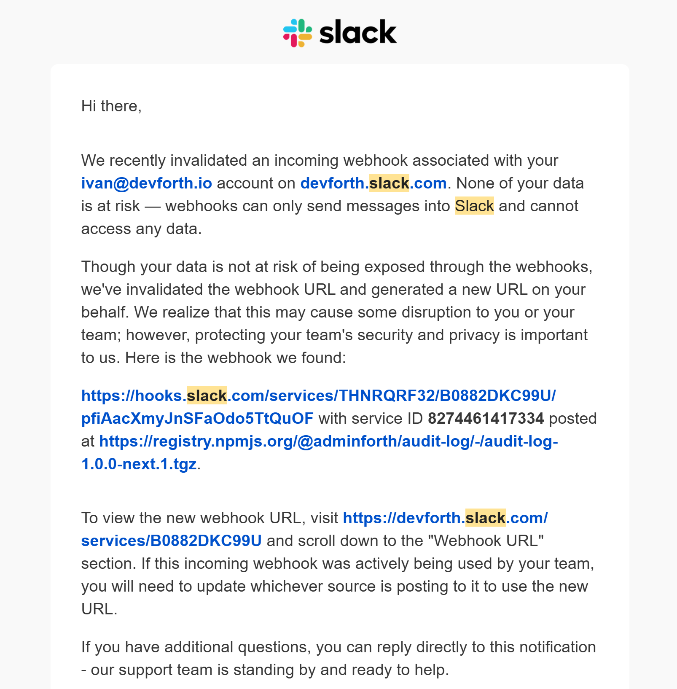
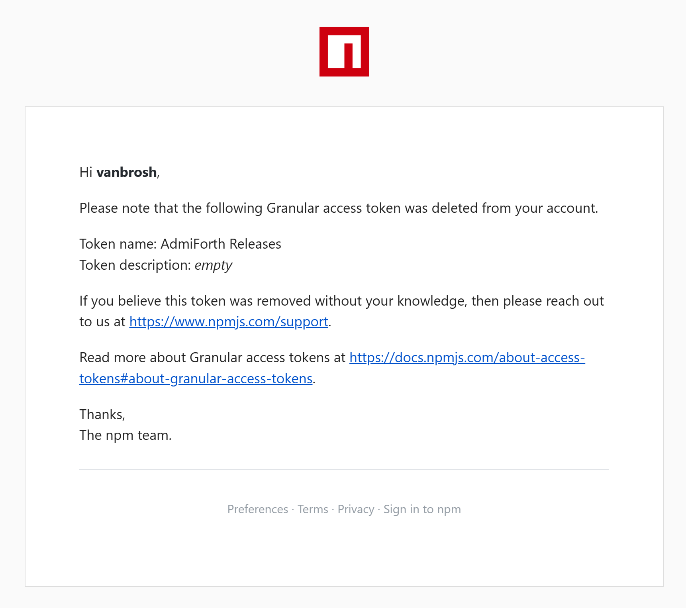

Our framework has a CI pipeline that runs `npm run build`, publishes the package to NPM (`npm publish`), and creates a new release on GitHub. It also sends a notification about the release to a Slack webhook for our team.

Secrets for these services were stored in our CI’s built-in Vault (we are running a self-hosted Woodpecker CI).

Recently, while moving plugins to separate repositories, I decided to try [Infisical](https://infisical.com/) for centralized secrets management instead of the internal CI Vault. Infisical provides a self-hosted open-source solution, has a well-organized UI, and offers better access control than our CI Vault. It was important to me that I could reuse secrets across different repositories without copying them every time I created a new plugin.

Here’s what I did:


```yaml title=".woodpecker.yml"
  
steps:
//diff-add
  init-secrets:
//diff-add
    when:
//diff-add
      - event: push
//diff-add
    image: infisical/cli
//diff-add
    environment:
//diff-add
      INFISICAL_TOKEN:
//diff-add
        from_secret: VAULT_TOKEN
//diff-add
    commands:
//diff-add
      - infisical export --domain https://vault.devforth.io/api --format=dotenv-export --env="prod" > .vault.env
//diff-add
    secrets:
//diff-add
      - VAULT_TOKEN

  release:
    image: node:20
    when:
      - event: push
    commands:
//diff-add
      - export $(cat .vault.env | xargs)
      - cd adminforth
      - npm clean-install
      - npm run build
      - npm audit signatures
      # does publish to npm, creates release on github, and sends notification to slack webhook
      - npx semantic-release 
//diff-remove
    secrets:
//diff-remove
      - VAULT_NPM_TOKEN
//diff-remove
      - VAULT_GITHUB_TOKEN
//diff-remove
      - VAULT_SLACK_TOKEN
```

Pretty dumb method to export secrets to the `.vault.env` file, but it was late evening, and I didn’t want to spend much time on it at the start.

I made the first push, and everything worked fine on the first attempt. I was happy.

Then I started adding the same code to the first plugin, and the plugin build failed with a very unexpected error.

It said that my NPM token was invalid. I was surprised and started printing the environment variables to see what was wrong (printing environment variables to the build log is a pretty bad practice and is the last thing you want to do, but I knew it was an internal CI, and the project was private).

I saw that my NPM token was still in the environment variables and was the same.

I went back to the first repository and retried the build. It failed with the same error.

I went to NPM and found out that the token had disappeared entirely from the list. I was shocked and recreated it.

On the next build, I discovered that the Slack webhook was also not working. However, GitHub releases were created without issues in both repositories.

Then I noticed an email push notification from Slack titled "Notification about invalidated webhook URLs."



This was the moment I realized that `npm publish` had simply taken my `.vault.env` file and published it to NPM.

Shortly after, I noticed a recent email from NPM titled "Granular access token deleted."



The next thing I did was revoke all tokens, including the GitHub token, which still worked, and unpublish all packages from NPM (though they might still be cloned by some caches/aggregators/archivers).

# How Services Handle Leaked Secret Tokens

## GitHub

GitHub was not able to recognize that the token had been leaked to an NPM package and revoke it. Although they do a pretty good job when you push other vendors’ secrets to a GitHub repository, it seems they don’t check NPM sources.

## NPM 

NPM detected that the NPM token was published to their registry and revoked it. However, it was hard to understand why—it was simply deleted. They sent an email, but it did not explain why the token was deleted or specify the source of the leak. Showing an error in the tokens list on the NPM website would have been the best option.

## Slack

I was surprised, but Slack did a great job. They monitor NPM (I don’t think they monitor the whole NPM registry; there’s probably some interesting technology behind it). They detected that the NPM token was published to the registry and invalidated it. They sent an email with a clear explanation of why it was invalidated and what steps to take next.

# Conclusion

We can talk a lot about bad programming practices, but the main takeaway is that we are human. And humans still make mistakes.  
It makes a lot of sense to monitor for such human errors.  

In my case, NPM and Slack saved me from a potential security breach. Without their intervention, I would have learned about the issue only when someone used my tokens for malicious purposes.  
GitHub didn’t detect or revoke the token, and many other services wouldn’t have done so either.

Here are some common recommendations I learned from this experience:

- Try to limit token access as much as possible to only the required granularity. Even if something is leaked, it won’t cause much harm. Don’t grant access to all resources/packages/repos unless it’s necessary.
- Check what you publish, especially when making changes to your build pipeline. I missed the fact that the `.env` file was being published.
- Appreciate services that monitor for leaks and respond to them. They can save you from potential security breaches.
