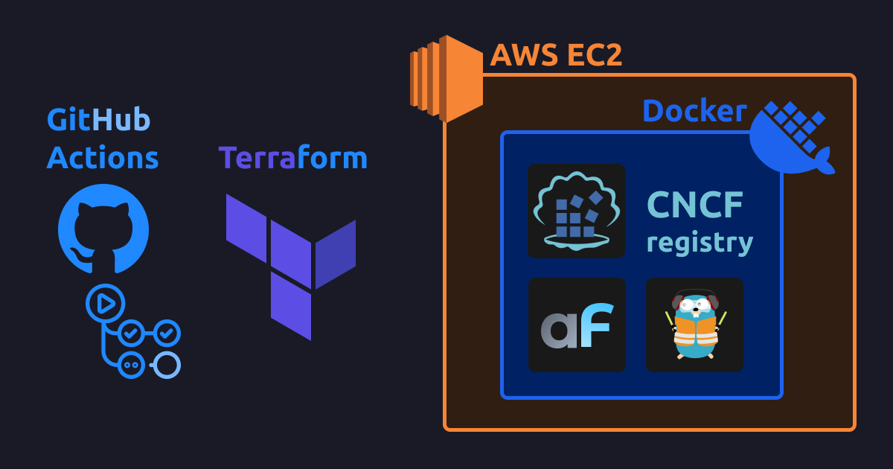

This guide is a hackers extended addition of [Deploying AdminForth to EC2 with Amazon ECR](/blog/compose-aws-ec2-ecr-terraform-github-actions/). The key difference in this post that we will not use Amazon ECR but self-host registry on EC2 itself. Automatically from terraform. And will see whether we will win something in terms of build time.

<!-- truncate -->


## Costs for Amazon ECR vs consts for self-hosted registry on EC2

Most of AWS services are formed from EC2 prices plus some extra overhead for own cost. In same way, Amazon ECR pricing is pretty same.

| Feature | Amazon ECR | Self-hosted registry on EC2 |
| --- | --- | --- |
| Storage | $0.10 per GB/month | $0.10 per GB/month for gp2 EBS volume |
| Data transfer for egress | $0.09 per GB | $0.09 per GB |

So as you can see there is still no difference in terms of cost. However the approach in this system allows to replace Amazon EC2 with any other cloud provider which does not charge for egress traffic.


# Bechnmarking build time

When I implmented this solution, I was curious whether it will be faster to build images on EC2 or on CI. So I did a little bit of testing.
First I used results form [deploying AdminForth to EC2 with Terraform without registry](/blog/compose-ec2-deployment-github-actions/) where we built images on EC2. Then I did the same test but with self-hosted registry on EC2 and compared to [deploying AdminForth to EC2 with Amazon ECR](/blog/compose-aws-ec2-ecr-terraform-github-actions/) where we built images on CI and pushed to Amazon ECR.

| Feature | Without Registry (build directly on EC2) | With self-hosted registry | With Amazon ECR |
| --- | --- | --- |
| Initial build time\* |  3m 13.541s | 2m 48.412s | 3m 54s |
| Rebuild time (changed `index.ts`)\*|  0m 51.653s | 0m 54.120s |

<sub>\* All tests done from local machine (Intel(R) Core(TM) Ultra 9 185H, Docker Desktop/WSL2 64 GB RAM, 300Mbps up/down) up to working state</sub>

So it indeed own self-hosted registry is faster then ECR and overall build time of pure AdminForth is faster then building on EC2. When ECR is slower then self-hosted registry, it is because of network speed.


# Chellenges when you build on CI


# Registry authorization and traffic encryption

Hosting custom CNCF registry, from other hand is a security responsibility. 

If you don't protect it right, someone will be able to push any image to your registry and then pull it to your EC2 instance. This is a big security issue, so we have to protect our registry. 

First of all we need to set some authorization to our registry so everyone who will push/pull images will be authorized. Here we have 2 options: HTTP basic auth and Client certificate auth. We will use first one as it is easier to setup. We will generate basic login and password automatically in terraform so no extra actions are needed from you.

But this is not enough. Basic auth is not encrypted, so someone can perform MITM attack and get your credentials. So we need to encrypt traffic between CI and registry. We can do it by using TLS certificates. So we will generate self-signed TLS certificates, and attach them to our registry.

Though the challenge is that we need to provide CA certificate to every daemon which will work with our registry. So we need to provide CA certificate to buildx daemon on CI, also if we want to do it from local machine, we need to provide CA certificate to local docker daemon.

# Practice - deploy setup

Assume you have your AdminForth project in `myadmin`.


## Step 1 - Dockerfile and .dockerignore


This guide assumes you have created your AdminForth application with latest version of `adminforth create-app` command. 
This command already creates a `Dockerfile` and `.dockerignore` for you, so you can use them as is.


## Step 2 - compose.yml

create folder `deploy` and create file `compose.yml` inside:

```yml title="deploy/compose.yml"


services:
  traefik:
    image: "traefik:v2.5"
    command:
      - "--api.insecure=true"
      - "--providers.docker=true"
      - "--entrypoints.web.address=:80"
    ports:
      - "80:80"
    volumes:
      - "/var/run/docker.sock:/var/run/docker.sock:ro"

  myadmin:
    image: localhost:5000/myadmin:latest
    pull_policy: always
    restart: always
    env_file:
      - .env.secrets.prod
    environment:
      - NODE_ENV=production
      - DATABASE_URL=sqlite://.db.sqlite
      - PRISMA_DATABASE_URL=file:.db.sqlite

    volumes:
      - myadmin-db:/code/db
    labels:
      - "traefik.enable=true"
      - "traefik.http.routers.myadmin.rule=PathPrefix(`/`)"
      - "traefik.http.services.myadmin.loadbalancer.server.port=3500"
      - "traefik.http.routers.myadmin.priority=2"

volumes:
  myadmin-db:
```

## Step 3 - create a SSH keypair

Make sure you are still in `deploy` folder, run next command:

```bash title="deploy"
mkdir .keys && ssh-keygen -f .keys/id_rsa -N ""
```

Now it should create `deploy/.keys/id_rsa` and `deploy/.keys/id_rsa.pub` files with your SSH keypair. Terraform script will put the public key to the EC2 instance and will use private key to connect to the instance. Also you will be able to use it to connect to the instance manually.

## Step 4 - create TLS certificates to encrypt traffic between CI and registry

Make sure you are still in `deploy` folder, run next command:

Run next command to create TLS certificates:

```bash 
openssl req -new -x509 -days 3650 -newkey rsa:4096 -nodes -keyout .keys/ca.key -subj "/CN=My Custom CA" -out .keys/ca.pem
```

This will create `deploy/.keys/ca.key` and `deploy/.keys/ca.pem` files.

## Step 5 - .gitignore file

Create `deploy/.gitignore` file with next content:

```bash
.terraform/
.keys/
*.tfstate
*.tfstate.*
*.tfvars
tfplan
.env.secrets.prod
```

## Step 6 - buildx bake file

Create file `deploy/docker-bake.hcl`:

```hcl title="deploy/docker-bake.hcl"
variable "REGISTRY_BASE" {
  default = "appserver.local:5000"
}

group "default" {
  targets = ["myadmin"]
}

target "myadmin" {
  context = "../myadmin"
  tags = ["${REGISTRY_BASE}/myadmin:latest"]
  cache-from = ["type=registry,ref=${REGISTRY_BASE}/myadmin:cache"]
  cache-to   = ["type=registry,ref=${REGISTRY_BASE}/myadmin:cache,mode=max,compression=zstd"]
  push = true
}
```


## Step 7 - main terraform file main.tf

First of all install Terraform as described here [terraform installation](https://developer.hashicorp.com/terraform/install#linux).


Create file `main.tf` in `deploy` folder:

```hcl title="deploy/main.tf"

locals {
  app_name = "<your_app_name>"
  aws_region = "us-east-1"
}

provider "aws" {
  region = local.aws_region
  profile = "myaws"
}

data "aws_ami" "ubuntu_linux" {
  most_recent = true
  owners      = ["amazon"]

  filter {
    name   = "name"
    values = ["ubuntu/images/hvm-ssd-gp3/ubuntu-noble-24.04-amd64-server-*"]
  }
}

data "aws_vpc" "default" {
  default = true
}

resource "aws_eip" "eip" {
 domain = "vpc"
}
resource "aws_eip_association" "eip_assoc" {
 instance_id   = aws_instance.app_instance.id
 allocation_id = aws_eip.eip.id
}

data "aws_subnet" "default_subnet" {
  filter {
    name   = "vpc-id"
    values = [data.aws_vpc.default.id]
  }

  filter {
    name   = "default-for-az"
    values = ["true"]
  }

  filter {
    name   = "availability-zone"
    values = ["${local.aws_region}a"]
  }
}

resource "aws_security_group" "instance_sg" {
  name   = "${local.app_name}-instance-sg"
  vpc_id = data.aws_vpc.default.id

  ingress {
    description = "Allow HTTP"
    from_port   = 80
    to_port     = 80
    protocol    = "tcp"
    cidr_blocks = ["0.0.0.0/0"]
  }

  ingress {
    description = "Allow Docker registry"
    from_port   = 5000
    to_port     = 5000
    protocol    = "tcp"
    cidr_blocks = ["0.0.0.0/0"]
  }

  # SSH
  ingress {
    description = "Allow SSH"
    from_port   = 22
    to_port     = 22
    protocol    = "tcp"
    cidr_blocks = ["0.0.0.0/0"]
  }

  egress {
    description = "Allow all outbound traffic"
    from_port   = 0
    to_port     = 0
    protocol    = "-1"
    cidr_blocks = ["0.0.0.0/0"]
  }
}

resource "aws_key_pair" "app_deployer" {
  key_name   = "terraform-deploy_${local.app_name}-key"
  public_key = file("./.keys/id_rsa.pub") # Path to your public SSH key
}

resource "aws_instance" "app_instance" {
  ami                    = data.aws_ami.ubuntu_linux.id
  instance_type          = "t3a.small"  # just change it to another type if you need, check https://instances.vantage.sh/
  subnet_id              = data.aws_subnet.default_subnet.id
  vpc_security_group_ids = [aws_security_group.instance_sg.id]
  key_name               = aws_key_pair.app_deployer.key_name

  # prevent accidental termination of ec2 instance and data loss
  # if you will need to recreate the instance still (not sure why it can be?), you will need to remove this block manually by next command:
  # > terraform taint aws_instance.app_instance
  lifecycle {
    prevent_destroy = true
    ignore_changes = [ami]
  }

  root_block_device {
    volume_size = 20 // Size in GB for root partition
    volume_type = "gp2"
    
    # Even if the instance is terminated, the volume will not be deleted, delete it manually if needed
    delete_on_termination = false
  }

  user_data = <<-EOF
    #!/bin/bash
    sudo apt-get update
    sudo apt-get install ca-certificates curl
    sudo install -m 0755 -d /etc/apt/keyrings
    sudo curl -fsSL https://download.docker.com/linux/ubuntu/gpg -o /etc/apt/keyrings/docker.asc
    sudo chmod a+r /etc/apt/keyrings/docker.asc

    # Add the repository to Apt sources:
    echo \
      "deb [arch=$(dpkg --print-architecture) signed-by=/etc/apt/keyrings/docker.asc] https://download.docker.com/linux/ubuntu \
      $(. /etc/os-release && echo "$VERSION_CODENAME") stable" | \
      sudo tee /etc/apt/sources.list.d/docker.list > /dev/null
    sudo apt-get update

    sudo apt-get install -y docker-ce docker-ce-cli containerd.io docker-buildx-plugin docker-compose-plugin screen

    systemctl start docker
    systemctl enable docker
    usermod -a -G docker ubuntu

    echo "done" > /home/ubuntu/user_data_done

  EOF

  tags = {
    Name = "${local.app_name}-instance"
  }
}

resource "null_resource" "wait_for_user_data" {
  provisioner "remote-exec" {
    inline = [
      "echo 'Waiting for EC2 software install to finish...'",
      "while [ ! -f /home/ubuntu/user_data_done ]; do echo '...'; sleep 2; done",
      "echo 'EC2 software install finished.'"
    ]

    connection {
      type        = "ssh"
      user        = "ubuntu"
      private_key = file("./.keys/id_rsa")
      host        = aws_eip_association.eip_assoc.public_ip
    }
  }

  depends_on = [aws_instance.app_instance]
}

resource "null_resource" "setup_registry" {
  provisioner "local-exec" {
    command = <<-EOF
      echo "Generating secret for local registry"
      sha256sum ./.keys/id_rsa | cut -d ' ' -f1 | tr -d '\n' > ./.keys/registry.pure

      echo "Creating htpasswd file for local registry"
      docker run --rm --entrypoint htpasswd httpd:2 -Bbn ci-user $(cat ./.keys/registry.pure) > ./.keys/registry.htpasswd

      echo "Generating server certificate for registry"
      openssl genrsa -out ./.keys/registry.key 4096
      echo "subjectAltName=DNS:appserver.local,DNS:localhost,IP:127.0.0.1" > san.ext
      openssl req -new -key ./.keys/registry.key -subj "/CN=appserver.local" -addext "$(cat san.ext)" -out ./.keys/registry.csr

      openssl x509 -req -days 365 -CA ./.keys/ca.pem -CAkey ./.keys/ca.key -set_serial 01 -in ./.keys/registry.csr -extfile san.ext -out ./.keys/registry.crt 

      echo "Copying registry secret files to the instance"
      rsync -t -avz -e "ssh -i ./.keys/id_rsa -o StrictHostKeyChecking=no" \
        ./.keys/registry.* ubuntu@${aws_eip_association.eip_assoc.public_ip}:/home/ubuntu/registry-auth
    EOF
  }

  provisioner "remote-exec" {
    inline = [<<-EOF
      # remove old registry if exists
      docker rm -f registry
      # run new registry
      docker run -d --network host \
        --name registry \
        --restart always \
        -v /home/ubuntu/registry-data:/var/lib/registry \
        -v /home/ubuntu/registry-auth:/auth\
        -e "REGISTRY_AUTH=htpasswd" \
        -e "REGISTRY_AUTH_HTPASSWD_REALM=Registry Realm" \
        -e "REGISTRY_AUTH_HTPASSWD_PATH=/auth/registry.htpasswd" \
        -e "REGISTRY_HTTP_TLS_CERTIFICATE=/auth/registry.crt" \
        -e "REGISTRY_HTTP_TLS_KEY=/auth/registry.key" \
        registry:2

      EOF
    ]

    connection {
      type        = "ssh"
      user        = "ubuntu"
      private_key = file("./.keys/id_rsa")
      host        = aws_eip_association.eip_assoc.public_ip
    }
  }

  triggers = {
    always_run = 1 # change number to redeploy registry (if for some reason it was removed)
  }

  depends_on = [null_resource.wait_for_user_data]
}


resource "null_resource" "sync_files_and_run" {

  provisioner "local-exec" {
    command = <<-EOF

      # map appserver.local to the instance (in CI we don't know the IP, so have to use this mapping)
      # so then in GA pipeline we will use 
      #  - name: Set up Docker Buildx
      #   uses: docker/setup-buildx-action@v3
      #   with:
      #     buildkitd-config-inline: |
      #       [registry."appserver.local:5000"]
      #         ca=["deploy/.keys/ca.pem"]

      grep -q "appserver.local" /etc/hosts || echo "${aws_eip_association.eip_assoc.public_ip} appserver.local" | sudo tee -a /etc/hosts

      # hosts modification may take some time to apply
      sleep 5

      # generate buildx authorization
      sha256sum ./.keys/id_rsa | cut -d ' ' -f1 | tr -d '\n' > ./.keys/registry.pure
      echo '{"auths":{"appserver.local:5000":{"auth":"'$(echo -n "ci-user:$(cat ./.keys/registry.pure)" | base64 -w 0)'"}}}' > ~/.docker/config.json

      echo "Running build"
      docker buildx bake --progress=plain --push --allow=fs.read=..

      # compose temporarily it is not working https://github.com/docker/compose/issues/11072#issuecomment-1848974315
      # docker compose --progress=plain -p app -f ./compose.yml build --push

      # if you will change host, pleasee add -o StrictHostKeyChecking=no
      echo "Copy files to the instance" 
      rsync -t -avz --mkpath -e "ssh -i ./.keys/id_rsa -o StrictHostKeyChecking=no" \
        --delete \
        --exclude '.terraform' \
        --exclude '.keys' \
        --exclude 'tfplan' \
        . ubuntu@${aws_eip_association.eip_assoc.public_ip}:/home/ubuntu/app/deploy/

      EOF
  }

  # Run docker compose after files have been copied
  provisioner "remote-exec" {
    inline = [<<-EOF
      # login to docker registry
      cat /home/ubuntu/registry-auth/registry.pure | docker login localhost:5000 -u ci-user --password-stdin
        
      cd /home/ubuntu/app/deploy

      echo "Spinning up the app"
      docker compose --progress=plain -p app -f compose.yml up -d --remove-orphans

      # cleanup unused cache (run in background to not block terraform)
      screen -dm docker system prune -f
      screen -dm docker exec registry registry garbage-collect /etc/docker/registry/config.yml --delete-untagged=true 
    EOF
    ]

    connection {
      type        = "ssh"
      user        = "ubuntu"
      private_key = file("./.keys/id_rsa")
      host        = aws_eip_association.eip_assoc.public_ip
    }


  }

  # Ensure the resource is triggered every time based on timestamp or file hash
  triggers = {
    always_run = timestamp()
  }

  depends_on = [aws_eip_association.eip_assoc, null_resource.setup_registry]
}


output "instance_public_ip" {
  value = aws_eip_association.eip_assoc.public_ip
}


######### META, tf state ##############


# S3 bucket for storing Terraform state
resource "aws_s3_bucket" "terraform_state" {
  bucket = "${local.app_name}-terraform-state"
}

resource "aws_s3_bucket_lifecycle_configuration" "terraform_state" {
  bucket = aws_s3_bucket.terraform_state.bucket

  rule {
    status = "Enabled"
    id = "Keep only the latest version of the state file"

    filter {
      prefix = ""
    }

    noncurrent_version_expiration {
      noncurrent_days = 30
    }
  }
}

resource "aws_s3_bucket_versioning" "terraform_state" {
  bucket = aws_s3_bucket.terraform_state.bucket

  versioning_configuration {
    status = "Enabled"
  }
}

resource "aws_s3_bucket_server_side_encryption_configuration" "terraform_state" {
  bucket = aws_s3_bucket.terraform_state.bucket

  rule {
    apply_server_side_encryption_by_default {
      sse_algorithm     = "AES256"
    }
  }
}


```

> 👆 Replace `<your_app_name>` with your app name (no spaces, only underscores or letters)


### Step 7.1 - Configure AWS Profile

Open or create file `~/.aws/credentials` and add (if not already there):

```ini
[myaws]
aws_access_key_id = <your_access_key>
aws_secret_access_key = <your_secret_key>
```


### Step 7.2 - Run deployment


We will run first deployment from local machine to create S3 bucket for storing Terraform state. In other words this deployment will create resources needed for storing Terraform state in the cloud and runnign deployment from GitHub actions.

```bash
terraform init
```

Now run deployement:

```bash
terraform apply -auto-approve
```

> 👆 Please note that this command might block ask you your `sudo` password to append `appserver.local` to `/etc/hosts` file. 

> 👆 Please note that command might show errors about pushing images, this is fine because current deployment is done here only to setup S3 bucket for state migration before migrating to cloud. 


## Step 8 - Migrate state to the cloud

First deployment had to create S3 bucket for storing Terraform state. Now we need to migrate the state to the cloud.

Add to the end of `main.tf`:

```hcl title="main.tf"

# Configure the backend to use the S3 bucket
terraform {
 backend "s3" {
   bucket         = "<your_app_name>-terraform-state"
   key            = "state.tfstate"  # Define a specific path for the state file
   region         = "us-east-1"
   profile        = "myaws"
   use_lockfile   = true
 }
}
```

> 👆 Replace `<your_app_name>` with your app name (no spaces, only underscores or letters). 
> Unfortunately we can't use variables, HashiCorp thinks it is too dangerous 😥


Now run:

```bash
terraform init -migrate-state
```

Now run test deployment:

```bash
terraform apply -auto-approve
```

Now you can delete local `terraform.tfstate` file and `terraform.tfstate.backup` file as they are in the cloud now.


## Step 9 - CI/CD - Github Actions

Create file `.github/workflows/deploy.yml`:

```yml title=".github/workflows/deploy.yml"
name: Deploy myadmin
run-name: ${{ github.actor }} builds myadmin 🚀
on: [push]
jobs:
  Explore-GitHub-Actions:
    runs-on: ubuntu-latest

    concurrency:
      group: build-group
      cancel-in-progress: false

    steps:
      - run: echo "🎉 The job was automatically triggered by a ${{ github.event_name }} event."
      - run: echo "🐧 This job is now running on a ${{ runner.os }} server"
      - run: echo "🔎 The name of your branch is ${{ github.ref }}"
      - name: Check out repository code
        uses: actions/checkout@v4

      - name: Set up Terraform
        uses: hashicorp/setup-terraform@v2
        with:
          terraform_version: 1.10.1 
      
      - name: Import Registry CA
        run: |
          mkdir -p deploy/.keys
          echo "$VAULT_REGISTRY_CA_PEM" > deploy/.keys/ca.pem
          echo "$VAULT_REGISTRY_CA_KEY" > deploy/.keys/ca.key
        env:
          VAULT_REGISTRY_CA_PEM: ${{ secrets.VAULT_REGISTRY_CA_PEM }}
          VAULT_REGISTRY_CA_KEY: ${{ secrets.VAULT_REGISTRY_CA_KEY }}


      - name: Set up Docker Buildx
        uses: docker/setup-buildx-action@v3
        with:
          buildkitd-config-inline: |
            [registry."appserver.local:5000"]
              ca=["deploy/.keys/ca.pem"]
              
          # use host network for resolving appserver.local
          driver-opts: network=host

      - name: Import registry SSH keys
        run: |
          mkdir -p deploy/.keys
          echo "$VAULT_SSH_PRIVATE_KEY" > deploy/.keys/id_rsa
          echo "$VAULT_SSH_PUBLIC_KEY" > deploy/.keys/id_rsa.pub
          chmod 600 deploy/.keys/id_rsa*
        env:
          VAULT_SSH_PRIVATE_KEY: ${{ secrets.VAULT_SSH_PRIVATE_KEY }}
          VAULT_SSH_PUBLIC_KEY: ${{ secrets.VAULT_SSH_PUBLIC_KEY }}

      - name: Setup AWS credentials
        run: |
          mkdir -p ~/.aws
          cat <<EOL > ~/.aws/credentials
          [myaws]
          aws_access_key_id=${VAULT_AWS_ACCESS_KEY_ID}
          aws_secret_access_key=${VAULT_AWS_SECRET_ACCESS_KEY}
          EOL
        env:
          VAULT_AWS_ACCESS_KEY_ID: ${{ secrets.VAULT_AWS_ACCESS_KEY_ID }}
          VAULT_AWS_SECRET_ACCESS_KEY: ${{ secrets.VAULT_AWS_SECRET_ACCESS_KEY }}

      - name: Prepare env
        run: |
          echo "ADMINFORTH_SECRET=$VAULT_ADMINFORTH_SECRET" > deploy/.env.secrets.prod
        env:
          VAULT_ADMINFORTH_SECRET: ${{ secrets.VAULT_ADMINFORTH_SECRET }}

      - name: Terraform build
        run: |
          cd deploy
          terraform init -reconfigure
          # example of unlocking tf state if needed
          # terraform force-unlock fb397548-8697-ea93-ab80-128a4f508fdf --force
          terraform plan -out=tfplan 
          terraform apply tfplan 
                
          
      - run: echo "🍏 This job's status is ${{ job.status }}."
```


### Step 8.1 - Add secrets to GitHub

Go to your GitHub repository, then `Settings` -> `Secrets` -> `New repository secret` and add:

- `VAULT_AWS_ACCESS_KEY_ID` - your AWS access key
- `VAULT_AWS_SECRET_ACCESS_KEY` - your AWS secret key
- `VAULT_SSH_PRIVATE_KEY` - execute `cat ~/.ssh/id_rsa` and paste to GitHub secrets
- `VAULT_SSH_PUBLIC_KEY` - execute `cat ~/.ssh/id_rsa.pub` and paste to GitHub secrets
- `VAULT_REGISTRY_CA_PEM` - execute `cat deploy/.keys/ca.pem` and paste to GitHub secrets
- `VAULT_REGISTRY_CA_KEY` - execute `cat deploy/.keys/ca.key` and paste to GitHub secrets
- `VAULT_ADMINFORTH_SECRET` - generate some random string and paste to GitHub secrets, e.g. `openssl rand -base64 32 | tr -d '\n'`


Now you can push your changes to GitHub and see how it will be deployed automatically.


### Adding secrets

Once you will have sensitive tokens/passwords in your apps you have to store them in a secure way. 

Simplest way is to use GitHub secrets. 

Let's imagine you have `OPENAI_API_KEY` which will be used one of AI-powered plugins of adminforth. We can't put this key to the code, so we have to store it in GitHub secrets.

Open your GitHub repository, then `Settings` -> `Secrets` -> `New repository secret` and add `VAULT_OPENAI_API_KEY` with your key.

Now open GitHub actions file and add it to the `env` section:

```yml title=".github/workflows/deploy.yml"
      - name: Prepare env
        run: |
          echo "ADMINFORTH_SECRET=$VAULT_ADMINFORTH_SECRET" > deploy/.env.secrets.prod
//diff-add
          echo "OPENAI_API_KEY=$VAULT_OPENAI_API_KEY" >> deploy/.env.secrets.prod
//diff-add
        env:
          VAULT_ADMINFORTH_SECRET: ${{ secrets.VAULT_ADMINFORTH_SECRET }}
//diff-add
          VAULT_OPENAI_API_KEY: ${{ secrets.VAULT_OPENAI_API_KEY }}
```


In the same way you can add any other secrets to your GitHub actions.


### Want to run builds from your local machine?

This guide originally was created to run full builds from GitHub actions only, so out of the box it will fail to push images to registry from your local machine.

But for debug purporses you can run it from your local machine too with some addition steps.

#### 1. You need to make local Docker buildx builder to trust self-signed TLS certificate

Create folder `deploy/.local` and create next files:

```toml title=deploy/.local/buildkitd.toml 
[registry."appserver.local:5000"]
  insecure = false
  ca = ["../.keys/ca.pem"]
```

```sh title=deploy/.local/create-builder.sh
#!/bin/bash
cd "$(dirname "$0")"
docker buildx rm mybuilder || true
docker buildx create --name mybuilder --driver docker-container   --use --config ./buildkitd.toml
```

Now create builder:

```bash
bash .local/create-builder.sh
```

#### 2. You need to deliver same secrets from local machine as from CI vault

Create file `deploy/.env.secrets.prod` with next content:

```sh
ADMINFORTH_SECRET=<your secret>
```

Please note that if you are running builds both from GA and local, the `ADMINFORTH_SECRET` should much to GA secret. Otherwise all existing users will be logged out.

#### 2. You need to add app.server.local to your hosts file (Windows/WSL only)

> This step is not needed on Linux / Mac because teraform provisioner will autiomatically add it to `/etc/hosts` file.
> However in WSL we can't modify Windows native hosts file, so we need to do it manually.

In power shell run 

```
Start-Process notepad "C:\Windows\System32\drivers\etc\hosts" -Verb runAs
```

Check your public IP in Terraform output and add

```
<your public ip> appserver.local
```

> Bad news is that instance public IP will be known only after first run, so some steps would fail because there will be no hosts mapping. However since EC2 provisioning takes some time it is even possible to copy IP from terminal and inser it to hosts file from first run 🤪


#### 3. Using local build from multiple projects

The easiest way would be probably to rename `appserver.local` to unique name for each project.

Then you can put all certificate mappings to a `buildkitd.toml` and move it along with `create-builder.sh` script to a common folder, e.g. home


