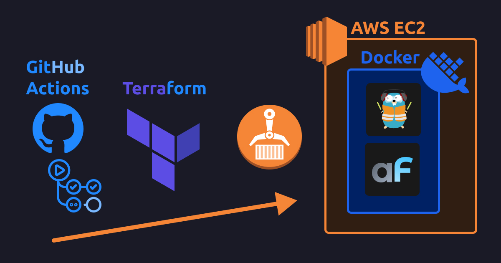

This guide shows how to deploy own Docker apps (with AdminForth as example) to Amazon EC2 instance with Docker and Terraform involving pushing images into Amazon ECR.

Needed resources:
- GitHub actions Free plan which includes 2000 minutes per month (1000 of 2-minute builds per month - more then enough for many projects, if you are not running tests). Extra builds would cost `0.008$` per minute.
- AWS account where we will auto-spawn EC2 instance. We will use `t3a.small` instance (2 vCPUs, 2GB RAM) which costs `~14$` per month in `us-east-1` region (cheapest region). Also it will take `$2` per month for EBS gp2 storage (20GB) for EC2 instance. 
- Also AWS ECR will charge for `$0.09` per GB of data egress traffic (from EC2 to the internet) - this needed to load docker build cache.

The setup shape:
- Build is done using IaaC approach with HashiCorp Terraform, so almoast no manual actions are needed from you. Every resource including EC2 server instance is described in code which is commited to repo.
- Docker build process is done on GitHub actions server, so EC2 server is not overloaded with builds
- Changes in infrastructure including changing server type, adding S3 Bucket, changing size of sever disk is also can be done by commiting code to repo.
- Docker images and build cache are stored on Amazon ECR
- Total build time for average commit to AdminForth app (with Vite rebuilds) is around 2 minutes.

<!-- truncate -->

# Building on CI versus building on EC2?

Previously we had a blog post about [deploying AdminForth to EC2 with Terraform without registry](/blog/compose-ec2-deployment-github-actions/). That method might work well but has a significant disadvantage - build process happens on EC2 itself and uses EC2 RAM and CPU. This can be a problem if your EC2 instance is well-loaded without extra free resources. Moreover, low-end EC2 instances have a small amount of RAM and CPU, so build process which involves vite/tsc/etc can be slow or even fail / cause OOM killer to crash EC2 instance.

So obviously to solve this problem we need to move the build process to CI, however it introduces new chellenges and we will solve them in this post.

Quick difference between approaches from previous post and current post:

| Feature | Without Registry | With ECR Registry |
| --- | --- | --- |
| How build happens | Source code is rsync-ed from CI to EC2 and docker build is done there | Docker build is done on CI and docker image is pushed to registry, then Docker on EC2 pulls from registry |
| Where build is done | On EC2 | On CI |
| How Docker build layers are cached | Cache is stored on EC2 | GitHub actions has no own Docker cache out of the box, so it should be stored in dedicated place (we use Amazon ECR) |
| Advantages | Cheaper (no egrass cache traffik from EC2) and faster | Build is done on CI, so EC2 server is not overloaded |
| Disadvantages | Build on EC2 requires additional server RAM / requires swap / overloads CPU | More terraform code is needed. Extra cost for egress traffik to GitHub for cache transfer |
| Initial build time\* | 3m 13.541s | 3m 54s |
| Rebuild time (changed `index.ts`)\*| 0m 51.653s | 0m 54.120s |

<sub>\* All tests done from local machine (Intel(R) Core(TM) Ultra 9 185H, Docker Desktop/WSL2 64 GB RAM, 300Mbps up/down) up to working state</sub>


## Chellenges when you build on CI

A little bit of theory.

When you move build process to CI you have to solve next chellenges:
1) We need to deliver built docker images to EC2 somehow (and only we)
2) We need to persist cache between builds

### Delivering images

#### Exporing images to tar files

Simplest option which you can find is save docker images to tar files and deliver them to EC2. We can easily do it in terraform (using `docker save -o ...` command on CI and `docker load ...` command on EC2). However this option has a significant disadvantage - it is slow. Docker images are big (always include all layers, without any options), so it takes infinity to do save/load and another infinity to transfer them to EC2 (via relatively slow rsync/SSH and relatively slow GitHub actions outbound connection).

#### Docker registry

Faster, right option which we will use here - involve Docker registry. Registry is a repository which stores docker images. It does it in a smart way - it saves each image as several layers, so if you will update last layer, then only last layer will be pushed to registry and then only last will be pulled to EC2. 
To give you row compare - whole-layers image might take `1GB`, but last layer created by `npm run build` command might take `50MB`. And most builds you will do only last layer changes, so it will be 20 times faster to push/pull last layer than whole image.
And this is not all, registry uses TLS HTTP protocol so it is faster then SSH/rsync encrypted connection. 

Of course you have to care about a way of registry authentication (so only you and your CI/EC2 can push/pull images).

What docker registry can you use? Pretty known options:
1) Docker Hub - most famous. It is free for public images, so literally every opensource project uses it. However it is not free for private images, and you have to pay for it. Payment model is pretty strange - you pay for user who can login, like 11$ per month, you might pay for your devops only but all this sounds strange. 
2) GHCR - Registry from GitHub. Has free plan but allows to store only 500MB and allows to transfer 1GB of traffic per month. Then you pay for every extra GB in storage (`$0.0008` per GB/day or `$0.24` per GB/month) and for every extra GB in traffic ($0.09 per GB). Probably small images will fit in free plan, but generally even alpine-based docker images are bigger than 500MB, so it is non-free option.
3) Amazon ECR - Same as GHCR but from Amazon. Price is `$0.10` per GB of storage per month and `$0.09` per GB of data transfer from Amazon (as all Amazon egress traffic). So it is cheaper than GHCR.
4) Self-hosted registry web system. In our software development company, we use Harbor. It is a powerful free open-source registry that can be installed to own server. It allows pushing and pulling without limit. Also, it has internal life-cycle rules that cleanup unnecessary images and layers. The main drawbacks of it are that it is not so fast to install and configure, plus you have to get a domain and another powerfull server to run it. So unless you are a software development company, it is not worth using it.
5) Self-hosted minimal CNCF Distribution [registry](https://distribution.github.io/distribution/) on EC2 itself. So since we already have EC2, we can run registry on it directly. The `registry` container is pretty light-weight and it will not consume a lot of extra CPU/RAM on server. Plus images will be stored close to application so pull will be fast, however securing this right is a bit tricky. If you want to try it we have special [EC2 with CNCF registry post](/blog/compose-ec2-deployment-github-actions-registry/).

In the post we will use Amazon ECR as registry (3rd way). 

### Persisting cache

Docker builds without layer cache persistence are possible but very slow. Most builds only change a couple of layers, and having no ability to cache them will cause the Docker builder to regenerate all layers from scratch. This can, for example, increase the Docker build time from a minute to ten minutes or even more.

Out of the box, GitHub Actions can't save Docker layers between builds, so you have to use external storage.

> Though some CI systems can persist docker build cache, e.g. open-source self-hosted Woodpecker CI allows it out of the box. However GitHub actions which is pretty popular, reasonably can't allow such free storage to anyone

So when build-in Docker cache can't be used, there is one alternative - Docker BuildKit external cache. 
So BuildKit allows you to connect external storage. There are several options, but most sweet for us is using Docker registry as cache storage (not only as images storage to deliver them to application server). 

Drawback is that buildx which is running on GitHub action server will download cache from registry which is inside of AWS. And all AWS egress traffic is charged. So you will pay for every build which uses cache. However cache is comnpressed. To give you idea basic alpine image with AdminForth cache is 180MB. One one commercial project we did full release within 2 months and 400 builds so it took `400 * 180MB * $0.09 / GB = $6.48` for cache transfer for whole project. 

> *BuildKit cache in Compose issue*
> Previously we used docker compose to build & run our app, it can be used to both build, push and pull images, but has [issues with external cache connection](https://github.com/docker/compose/issues/11072#issuecomment-1848974315). While they are not solved we have to use `docker buildx bake` command to build images. It is not so bad, but is another point of configuration which we will cover in this post.


# Prerequisites

I will assume you run Ubuntu (Native or WSL2).

You should have terraform, here is official repository: 

```
wget -O - https://apt.releases.hashicorp.com/gpg | sudo gpg --dearmor -o /usr/share/keyrings/hashicorp-archive-keyring.gpg
echo "deb [arch=$(dpkg --print-architecture) signed-by=/usr/share/keyrings/hashicorp-archive-keyring.gpg] https://apt.releases.hashicorp.com $(lsb_release -cs) main" | sudo tee /etc/apt/sources.list.d/hashicorp.list
sudo apt update && sudo apt install terraform
```


AWS CLI:

```bash
sudo snap install aws-cli --classic
```

Also you need Doker Daemon running. We recommend Docker Desktop running. ON WSL2 make sure you have Docker Desktop WSL2 integration enabled.

```bash
docker version
```

# Practice - deploy setup

Assume you have your AdminForth project in `myadmin`.


## Step 1 - Dockerfile and .dockerignore


This guide assumes you have created your AdminForth application with latest version of `adminforth create-app` command. 
This command already creates a `Dockerfile` and `.dockerignore` for you, so you can use them as is.


## Step 2 - compose.yml

create folder `deploy` and create file `compose.yml` inside:

```yml title="deploy/compose.yml"
services:
  traefik:
    image: "traefik:v2.5"
    command:
      - "--api.insecure=true"
      - "--providers.docker=true"
      - "--entrypoints.web.address=:80"
    ports:
      - "80:80"
    volumes:
      - "/var/run/docker.sock:/var/run/docker.sock:ro"

  myadmin:
    image: ${MYADMIN_REPO}:latest
    pull_policy: always
    restart: always
    env_file:
      - .env.secrets.prod

    volumes:
      - myadmin-db:/code/db
    labels:
      - "traefik.enable=true"
      - "traefik.http.routers.myadmin.rule=PathPrefix(`/`)"
      - "traefik.http.services.myadmin.loadbalancer.server.port=3500"
      - "traefik.http.routers.myadmin.priority=2"

volumes:
  myadmin-db:
```

## Step 3 - create a SSH keypair

Make sure you are still in `deploy` folder, run next command:

```bash title="deploy"
mkdir .keys && ssh-keygen -f .keys/id_rsa -N ""
```

Now it should create `deploy/.keys/id_rsa` and `deploy/.keys/id_rsa.pub` files with your SSH keypair. Terraform script will put the public key to the EC2 instance and will use private key to connect to the instance. Also you will be able to use it to connect to the instance manually.

## Step 4 - create TLS certificates to encrypt traffic between CI and registry

Make sure you are still in `deploy` folder, run next command:

Run next command to create TLS certificates:

```bash 
openssl req -new -x509 -days 3650 -newkey rsa:4096 -nodes -keyout .keys/ca.key -subj "/CN=My Custom CA" -out .keys/ca.pem
```

This will create `deploy/.keys/ca.key` and `deploy/.keys/ca.pem` files.

## Step 5 - .gitignore file

Create `deploy/.gitignore` file with next content:

```bash
.terraform/
.keys/
*.tfstate
*.tfstate.*
*.tfvars
tfplan
.env.secrets.prod
```

## Step 6 - buildx bake file

Create file `deploy/docker-bake.hcl`:

```hcl title="deploy/docker-bake.hcl"
variable "MYADMIN_REPO" {
  default = ""
}
group "default" {
  targets = ["myadmin"]
}

target "myadmin" {
  context = "../myadmin"
  tags = ["${MYADMIN_REPO}:latest"]
  cache-from = ["type=registry,ref=${MYADMIN_REPO}:cache"]
  cache-to   = ["type=registry,ref=${MYADMIN_REPO}:cache,mode=max,compression=zstd,image-manifest=true,oci-mediatypes=true"]
  push = true
}
```


## Step 7 - main terraform file main.tf

First of all install Terraform as described here [terraform installation](https://developer.hashicorp.com/terraform/install#linux).


Create file `main.tf` in `deploy` folder:

```hcl title="deploy/main.tf"

locals {
  app_name = "testtf"
  aws_region = "us-east-1"
}

provider "aws" {
  region = local.aws_region
  profile = "myaws"
}

data "aws_ami" "ubuntu_linux" {
  most_recent = true
  owners      = ["amazon"]

  filter {
    name   = "name"
    values = ["ubuntu/images/hvm-ssd-gp3/ubuntu-noble-24.04-amd64-server-*"]
  }
}

data "aws_vpc" "default" {
  default = true
}

resource "aws_eip" "eip" {
 domain = "vpc"
}

resource "aws_eip_association" "eip_assoc" {
 instance_id   = aws_instance.app_instance.id
 allocation_id = aws_eip.eip.id
}

data "aws_subnet" "default_subnet" {
  filter {
    name   = "vpc-id"
    values = [data.aws_vpc.default.id]
  }

  filter {
    name   = "default-for-az"
    values = ["true"]
  }

  filter {
    name   = "availability-zone"
    values = ["${local.aws_region}a"]
  }
}

resource "aws_security_group" "instance_sg" {
  name   = "${local.app_name}-instance-sg"
  vpc_id = data.aws_vpc.default.id

  ingress {
    description = "Allow HTTP"
    from_port   = 80
    to_port     = 80
    protocol    = "tcp"
    cidr_blocks = ["0.0.0.0/0"]
  }

  ingress {
    description = "Allow Docker registry"
    from_port   = 5000
    to_port     = 5000
    protocol    = "tcp"
    cidr_blocks = ["0.0.0.0/0"]
  }

  # SSH
  ingress {
    description = "Allow SSH"
    from_port   = 22
    to_port     = 22
    protocol    = "tcp"
    cidr_blocks = ["0.0.0.0/0"]
  }

  egress {
    description = "Allow all outbound traffic"
    from_port   = 0
    to_port     = 0
    protocol    = "-1"
    cidr_blocks = ["0.0.0.0/0"]
  }
}

resource "aws_key_pair" "app_deployer" {
  key_name   = "terraform-deploy_${local.app_name}-key"
  public_key = file("./.keys/id_rsa.pub") # Path to your public SSH key
}

resource "aws_instance" "app_instance" {
  ami                    = data.aws_ami.ubuntu_linux.id
  instance_type          = "t3a.small"  # just change it to another type if you need, check https://instances.vantage.sh/
  subnet_id              = data.aws_subnet.default_subnet.id
  vpc_security_group_ids = [aws_security_group.instance_sg.id]
  key_name               = aws_key_pair.app_deployer.key_name
  iam_instance_profile = aws_iam_instance_profile.ec2_profile.name

  # prevent accidental termination of ec2 instance and data loss
  # if you will need to recreate the instance still (not sure why it can be?), you will need to remove this block manually by next command:
  # > terraform taint aws_instance.app_instance
  lifecycle {
    prevent_destroy = true
    ignore_changes = [ami]
  }

  root_block_device {
    volume_size = 20 // Size in GB for root partition
    volume_type = "gp2"
    
    # Even if the instance is terminated, the volume will not be deleted, delete it manually if needed
    delete_on_termination = false
  }

  user_data = <<-EOF
    #!/bin/bash
    sudo apt-get update
    sudo apt-get install ca-certificates curl python3 python3-pip -y
    sudo install -m 0755 -d /etc/apt/keyrings
    sudo curl -fsSL https://download.docker.com/linux/ubuntu/gpg -o /etc/apt/keyrings/docker.asc
    sudo chmod a+r /etc/apt/keyrings/docker.asc

    # Add the repository to Apt sources:
    echo \
      "deb [arch=$(dpkg --print-architecture) signed-by=/etc/apt/keyrings/docker.asc] https://download.docker.com/linux/ubuntu \
      $(. /etc/os-release && echo "$VERSION_CODENAME") stable" | \
      sudo tee /etc/apt/sources.list.d/docker.list > /dev/null
    sudo apt-get update

    sudo apt-get install -y docker-ce docker-ce-cli containerd.io docker-buildx-plugin docker-compose-plugin screen

    systemctl start docker
    systemctl enable docker
    usermod -a -G docker ubuntu

    sudo snap install aws-cli --classic

    echo "done" > /home/ubuntu/user_data_done

  EOF

  tags = {
    Name = "${local.app_name}-instance"
  }
}

resource "null_resource" "wait_for_user_data" {
  provisioner "remote-exec" {
    inline = [
      "echo 'Waiting for EC2 software install to finish...'",
      "while [ ! -f /home/ubuntu/user_data_done ]; do echo '...'; sleep 2; done",
      "echo 'EC2 software install finished.'"
    ]

    connection {
      type        = "ssh"
      user        = "ubuntu"
      private_key = file("./.keys/id_rsa")
      host        = aws_eip_association.eip_assoc.public_ip
    }
  }

  depends_on = [aws_instance.app_instance]
}

resource "aws_ecr_repository" "myadmin_repo" {
  name = "${local.app_name}-myadmin"
  force_delete = true
}

resource "aws_ecr_lifecycle_policy" "safe_cleanup" {
  repository = aws_ecr_repository.myadmin_repo.name

  policy = jsonencode({
    rules = [
      {
        rulePriority = 1
        description  = "Delete untagged images older than 7 days"
        selection = {
          tagStatus     = "untagged"
          countType     = "sinceImagePushed"
          countUnit     = "days"
          countNumber   = 7
        }
        action = {
          type = "expire"
        }
      }
    ]
  })
}

resource "local_file" "compose_env" {
  content  = "MYADMIN_REPO=${aws_ecr_repository.myadmin_repo.repository_url}"
  filename = "${path.module}/.env.ecr"
}

// allow ec2 instance to login to ECR too pull images
resource "aws_iam_role" "ec2_role" {
  name = "${local.app_name}-ec2-role"

  assume_role_policy = jsonencode({
    Version = "2012-10-17",
    Statement = [{
      Effect = "Allow",
      Principal = {
        Service = "ec2.amazonaws.com"
      },
      Action = "sts:AssumeRole"
    }]
  })
}

resource "aws_iam_role_policy_attachment" "ecr_access" {
  role       = aws_iam_role.ec2_role.name
  policy_arn = "arn:aws:iam::aws:policy/AmazonEC2ContainerRegistryPowerUser"
}

resource "aws_iam_instance_profile" "ec2_profile" {
  name = "${local.app_name}-instance-profile"
  role = aws_iam_role.ec2_role.name
}

resource "null_resource" "sync_files_and_run" {

  provisioner "local-exec" {
    command = <<-EOF
      aws ecr get-login-password --region ${local.aws_region} --profile myaws | docker login --username AWS --password-stdin ${aws_ecr_repository.myadmin_repo.repository_url}

      echo "Running build"
      env $(cat .env.ecr | grep -v "#" | xargs) docker buildx bake --progress=plain --push --allow=fs.read=.. 

      # if you will change host, pleasee add -o StrictHostKeyChecking=no
      echo "Copy files to the instance" 
      rsync -t -avz --mkpath -e "ssh -i ./.keys/id_rsa -o StrictHostKeyChecking=no" \
        --delete \
        --exclude '.terraform' \
        --exclude '.keys' \
        --exclude 'tfplan' \
        . ubuntu@${aws_eip_association.eip_assoc.public_ip}:/home/ubuntu/app/deploy/

      EOF
  }

  # Run docker compose after files have been copied
  provisioner "remote-exec" {
    inline = [<<-EOF
      aws ecr get-login-password --region ${local.aws_region} | docker login --username AWS --password-stdin ${aws_ecr_repository.myadmin_repo.repository_url}

      cd /home/ubuntu/app/deploy

      echo "Spinning up the app"
      docker compose --progress=plain -p app  --env-file .env.ecr -f compose.yml up -d --remove-orphans

      # cleanup unused cache (run in background to not block terraform)
      screen -dm docker system prune -f
    EOF
    ]

    connection {
      type        = "ssh"
      user        = "ubuntu"
      private_key = file("./.keys/id_rsa")
      host        = aws_eip_association.eip_assoc.public_ip
    }


  }

  # Ensure the resource is triggered every time based on timestamp or file hash
  triggers = {
    always_run = timestamp()
  }

  depends_on = [aws_eip_association.eip_assoc, null_resource.wait_for_user_data]
}


output "instance_public_ip" {
  value = aws_eip_association.eip_assoc.public_ip
}


######### META, tf state ##############


# S3 bucket for storing Terraform state
resource "aws_s3_bucket" "terraform_state" {
  bucket = "${local.app_name}-terraform-state"
}

resource "aws_s3_bucket_lifecycle_configuration" "terraform_state" {
  bucket = aws_s3_bucket.terraform_state.bucket

  rule {
    status = "Enabled"
    id = "Keep only the latest version of the state file"

    filter {
      prefix = ""
    }

    noncurrent_version_expiration {
      noncurrent_days = 30
    }
  }
}

resource "aws_s3_bucket_versioning" "terraform_state" {
  bucket = aws_s3_bucket.terraform_state.bucket

  versioning_configuration {
    status = "Enabled"
  }
}

resource "aws_s3_bucket_server_side_encryption_configuration" "terraform_state" {
  bucket = aws_s3_bucket.terraform_state.bucket

  rule {
    apply_server_side_encryption_by_default {
      sse_algorithm     = "AES256"
    }
  }
}


```

> 👆 Replace `<your_app_name>` with your app name (no spaces, only underscores or letters)


### Step 7.1 - Configure AWS Profile

Open or create file `~/.aws/credentials` and add (if not already there):

```ini
[myaws]
aws_access_key_id = <your_access_key>
aws_secret_access_key = <your_secret_key>
```


### Step 7.2 - Run deployment


We will run first deployment from local machine to create S3 bucket for storing Terraform state. In other words this deployment will create resources needed for storing Terraform state in the cloud and runnign deployment from GitHub actions.

In `deploy` folder run:

```bash 
terraform init
```

Now run deployement:

```bash
terraform apply -auto-approve
```

> 👆 Please note that this command might block ask you your `sudo` password to append `appserver.local` to `/etc/hosts` file. 

> 👆 Please note that command might show errors about pushing images, this is fine because current deployment is done here only to setup S3 bucket for state migration before migrating to cloud. 


## Step 8 - Migrate state to the cloud

First deployment had to create S3 bucket for storing Terraform state. Now we need to migrate the state to the cloud.

Add to the end of `main.tf`:

```hcl title="main.tf"

# Configure the backend to use the S3 bucket
terraform {
 backend "s3" {
   bucket         = "<your_app_name>-terraform-state"
   key            = "state.tfstate"  # Define a specific path for the state file
   region         = "us-east-1"
   profile        = "myaws"
   use_lockfile   = true
 }
}
```

> 👆 Replace `<your_app_name>` with your app name (no spaces, only underscores or letters). 
> Unfortunately we can't use variables, HashiCorp thinks it is too dangerous 😥


Now run:

```bash
terraform init -migrate-state
```

Now run test deployment:

```bash
terraform apply -auto-approve
```

Now you can delete local `terraform.tfstate` file and `terraform.tfstate.backup` file as they are in the cloud now.


## Step 9 - CI/CD - Github Actions

Create file `.github/workflows/deploy.yml`:

```yml title=".github/workflows/deploy.yml"
name: Deploy myadmin
run-name: ${{ github.actor }} builds myadmin 🚀
on: [push]
jobs:
  Explore-GitHub-Actions:
    runs-on: ubuntu-latest

    concurrency:
      group: build-group
      cancel-in-progress: false

    steps:
      - run: echo "🎉 The job was automatically triggered by a ${{ github.event_name }} event."
      - run: echo "🐧 This job is now running on a ${{ runner.os }} server"
      - run: echo "🔎 The name of your branch is ${{ github.ref }}"
      - name: Check out repository code
        uses: actions/checkout@v4

      - name: Set up Terraform
        uses: hashicorp/setup-terraform@v2
        with:
          terraform_version: 1.10.1 
      
      - name: Import Registry CA
        run: |
          mkdir -p deploy/.keys
          echo "$VAULT_REGISTRY_CA_PEM" > deploy/.keys/ca.pem
          echo "$VAULT_REGISTRY_CA_KEY" > deploy/.keys/ca.key
        env:
          VAULT_REGISTRY_CA_PEM: ${{ secrets.VAULT_REGISTRY_CA_PEM }}
          VAULT_REGISTRY_CA_KEY: ${{ secrets.VAULT_REGISTRY_CA_KEY }}


      - name: Set up Docker Buildx
        uses: docker/setup-buildx-action@v3

      - name: Import registry SSH keys
        run: |
          mkdir -p deploy/.keys
          echo "$VAULT_SSH_PRIVATE_KEY" > deploy/.keys/id_rsa
          echo "$VAULT_SSH_PUBLIC_KEY" > deploy/.keys/id_rsa.pub
          chmod 600 deploy/.keys/id_rsa*
        env:
          VAULT_SSH_PRIVATE_KEY: ${{ secrets.VAULT_SSH_PRIVATE_KEY }}
          VAULT_SSH_PUBLIC_KEY: ${{ secrets.VAULT_SSH_PUBLIC_KEY }}

      - name: Setup AWS credentials
        run: |
          mkdir -p ~/.aws
          cat <<EOL > ~/.aws/credentials
          [myaws]
          aws_access_key_id=${VAULT_AWS_ACCESS_KEY_ID}
          aws_secret_access_key=${VAULT_AWS_SECRET_ACCESS_KEY}
          EOL
        env:
          VAULT_AWS_ACCESS_KEY_ID: ${{ secrets.VAULT_AWS_ACCESS_KEY_ID }}
          VAULT_AWS_SECRET_ACCESS_KEY: ${{ secrets.VAULT_AWS_SECRET_ACCESS_KEY }}

      - name: Prepare env
        run: |
          echo "ADMINFORTH_SECRET=$VAULT_ADMINFORTH_SECRET" > deploy/.env.secrets.prod
        env:
          VAULT_ADMINFORTH_SECRET: ${{ secrets.VAULT_ADMINFORTH_SECRET }}

      - name: Terraform build
        run: |
          cd deploy
          terraform init -reconfigure
          # example of unlocking tf state if needed
          # terraform force-unlock fb397548-8697-ea93-ab80-128a4f508fdf --force
          terraform plan -out=tfplan 
          terraform apply tfplan 
                
          
      - run: echo "🍏 This job's status is ${{ job.status }}."
```


### Step 10 - Add secrets to GitHub

Go to your GitHub repository, then `Settings` -> `Secrets` -> `New repository secret` and add:

- `VAULT_AWS_ACCESS_KEY_ID` - your AWS access key
- `VAULT_AWS_SECRET_ACCESS_KEY` - your AWS secret key
- `VAULT_SSH_PRIVATE_KEY` - execute `cat deploy/.keys/id_rsa` and paste to GitHub secrets
- `VAULT_SSH_PUBLIC_KEY` - execute `cat deploy/.keys/id_rsa.pub` and paste to GitHub secrets
- `VAULT_REGISTRY_CA_PEM` - execute `cat deploy/.keys/ca.pem` and paste to GitHub secrets
- `VAULT_REGISTRY_CA_KEY` - execute `cat deploy/.keys/ca.key` and paste to GitHub secrets
- `VAULT_ADMINFORTH_SECRET` - generate some random string and paste to GitHub secrets, e.g. `openssl rand -base64 32 | tr -d '\n'`


Now you can push your changes to GitHub and see how it will be deployed automatically.


### Adding secrets

Once you will have sensitive tokens/passwords in your apps you have to store them in a secure way. 

Simplest way is to use GitHub secrets. 

Let's imagine you have `OPENAI_API_KEY` which will be used one of AI-powered plugins of adminforth. We can't put this key to the code, so we have to store it in GitHub secrets.

Open your GitHub repository, then `Settings` -> `Secrets` -> `New repository secret` and add `VAULT_OPENAI_API_KEY` with your key.

Now open GitHub actions file and add it to the `env` section:

```yml title=".github/workflows/deploy.yml"
      - name: Prepare env
        run: |
          echo "ADMINFORTH_SECRET=$VAULT_ADMINFORTH_SECRET" > deploy/.env.secrets.prod
//diff-add
          echo "OPENAI_API_KEY=$VAULT_OPENAI_API_KEY" >> deploy/.env.secrets.prod
//diff-add
        env:
          VAULT_ADMINFORTH_SECRET: ${{ secrets.VAULT_ADMINFORTH_SECRET }}
//diff-add
          VAULT_OPENAI_API_KEY: ${{ secrets.VAULT_OPENAI_API_KEY }}
```


In the same way you can add any other secrets to your GitHub actions.

### How to connect to EC2 instance?

To connect to EC2 instance you can use SSH.

```bash
cd deploy
ssh -i ./.keys/id_rsa ubuntu@<your_ec2_ip>
```

IP address can be found in terminal output after terraform apply.

### Out of space on EC2 instance? Extend EBS volume

To upgrade EBS volume size you have to do next steps:

In `main.tf` file:

```hcl title="main.tf"
  root_block_device {
//diff-remove
    volume_size = 20 // Size in GB for root partition
//diff-add
    volume_size = 40 // Size in GB for root partition
    volume_type = "gp2"
  }
```

And run build. 

This will increase physical size of EBS volume, but you have to increase filesystem size too.

Login to EC2 instance:

```bash
ssh -i ./.keys/id_rsa ubuntu@<your_ec2_ip>
```

> You can find your EC2 IP in AWS console by visiting EC2 -> Instances -> Your instance -> IPv4 Public IP 


Now run next commands:

```bash
lsblk
```

This would show something like this:

```bash
NAME    MAJ:MIN RM  SIZE RO TYPE MOUNTPOINT
loop0     7:0    0 99.4M  1 loop /snap/core/10908
nvme0n1 259:0    0   40G  0 disk
└─nvme0n1p1 259:1    0   20G  0 part /
```

Here we see that `nvme0n1` is our disk and `nvme0n1p1` is our partition.

Now to extend partition run:

```bash
sudo growpart /dev/nvme0n1 1
sudo resize2fs /dev/nvme0n1p1
```

This will extend partition to the full disk size. No reboot is needed.


### Want slack notifications about build?

Create Slack channel and add [Slack app](https://slack.com/apps/A0F7YS25R-incoming-webhooks) to it. 

Then create webhook URL and add it to GitHub secrets as `SLACK_WEBHOOK_URL`.

Add this steps to the end of your GitHub actions file:

```yml title=".github/workflows/deploy.yml"
      - name: Notify Slack on success
        if: success()
        run: |
          curl -X POST -H 'Content-type: application/json' --data \
          "{\"text\": \"✅ *${{ github.actor }}* successfully built *${{ github.ref_name }}* with commit \\\"${{ github.event.head_commit.message }}\\\".\n:link: <${{ github.server_url }}/${{ github.repository }}/actions/runs/${{ github.run_id }}|View Build> | :link: <${{ github.server_url }}/${{ github.repository }}/commit/${{ github.sha }}|View Commit>\"}" \
          $SLACK_WEBHOOK_URL 
        env:
          SLACK_WEBHOOK_URL: ${{ secrets.SLACK_WEBHOOK_URL }}

      - name: Notify Slack on failure
        if: failure()
        run: |
          curl -X POST -H 'Content-type: application/json' --data \
          "{\"text\": \"❌ *${{ github.actor }}* failed to build *${{ github.ref_name }}* with commit \\\"${{ github.event.head_commit.message }}\\\".\n:link: <${{ github.server_url }}/${{ github.repository }}/actions/runs/${{ github.run_id }}|View Build> | :link: <${{ github.server_url }}/${{ github.repository }}/commit/${{ github.sha }}|View Commit>\"}" \
          $SLACK_WEBHOOK_URL 
        env:
          SLACK_WEBHOOK_URL: ${{ secrets.SLACK_WEBHOOK_URL }}

```

