Keycloak is an open-source identity and access management solution that provides authentication and authorization services. It can be used to secure applications and services by managing user identities, roles, and permissions.

In this guide, we will walk you through the process of setting up AdminForth authorization via Keycloak. Most important we will show you how to set up Keycloak in a Docker container and configure it to work with AdminForth.

<!-- truncate -->

## Prerequisites

- Docker installed on your machine
- Basic knowledge of Docker and Docker Compose

## Step 1: Create a Docker Compose File

Create a `docker-compose.yml` file in your project directory. This file will define the Keycloak service and its configuration.

```yaml
services:
  pg:
    image: postgres:latest
    environment:
      POSTGRES_USER: demo
      POSTGRES_PASSWORD: demo
      POSTGRES_DB: demo
    ports:
      - "5432:5432"
    volumes:
      - pg-data:/var/lib/postgresql/data
  keycloak:
    image: quay.io/keycloak/keycloak:latest
    command: start-dev
    environment:
      - KEYCLOAK_ADMIN=admin
      - KEYCLOAK_ADMIN_PASSWORD=admin
      - DB_VENDOR=postgres
      - DB_ADDR=pg
      - DB_DATABASE=demo
      - DB_USER=demo
      - DB_PASSWORD=demo
    ports:
      - "8080:8080"
    depends_on:
      - pg
    volumes:
      - keycloak-data:/opt/keycloak/data

volumes:
  keycloak-data:
```

Run service:

```bash
docker compose -p af-dev-demo up -d --build --remove-orphans --wait
```

## Step 2: Singn in to Keycloak and Create a Keycloak Realm

1. Open the Keycloak UI at `http://localhost:8080/`.
2. Sign in with the credentials `admin` and `admin`.

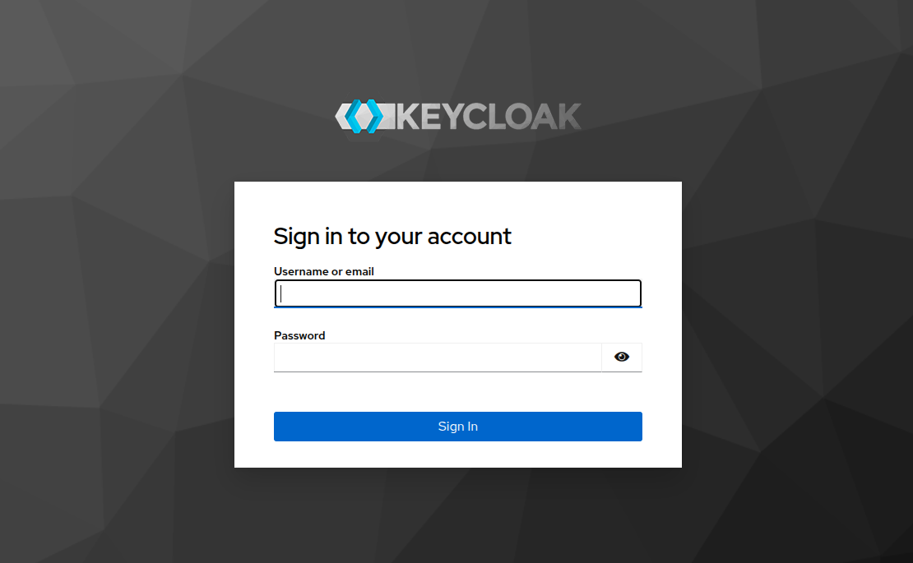

3. Select the "Realms" tab and click `Create Realm`.

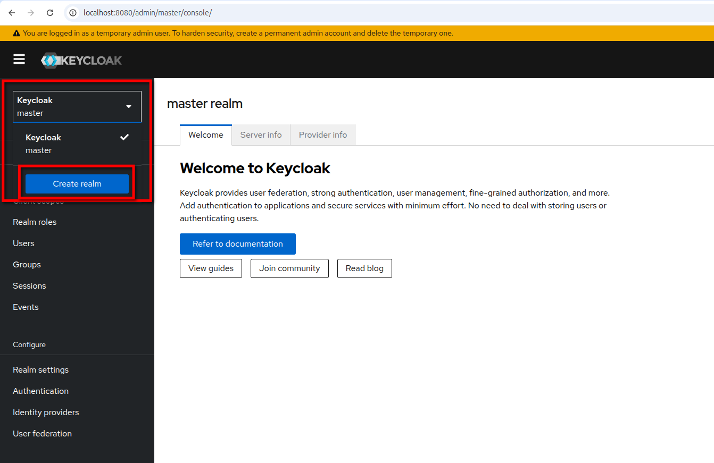

4. Enter a name for your realm and click `Create`.

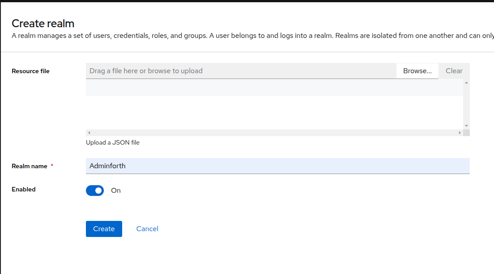

## Step 3: Create a Keycloak Client

1. Go to `Clients` tab and click `Create Client`.

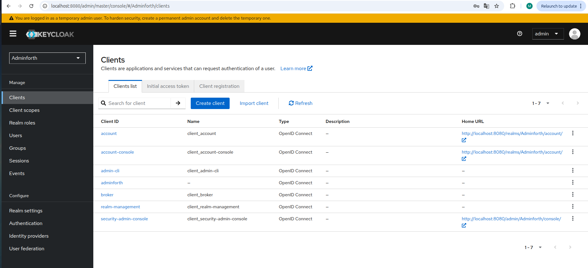

2. Choose `OpenID Connect`, enter a client ID for your client and click `Next`.

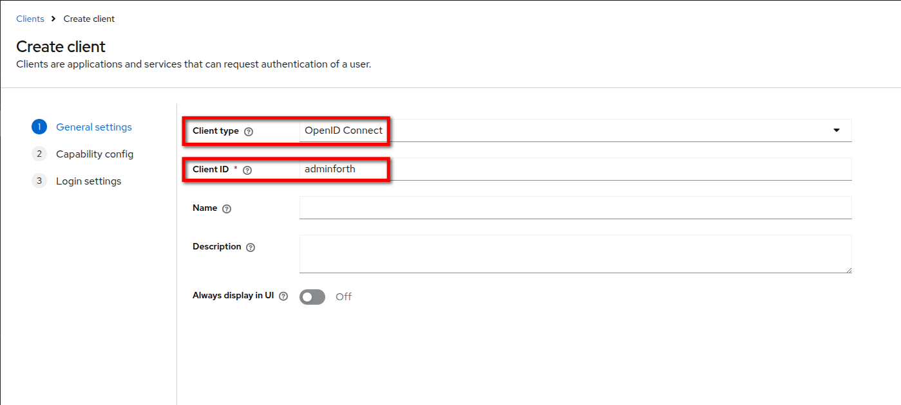

3. Swith `Client authentication` to `On` and click `Next`.

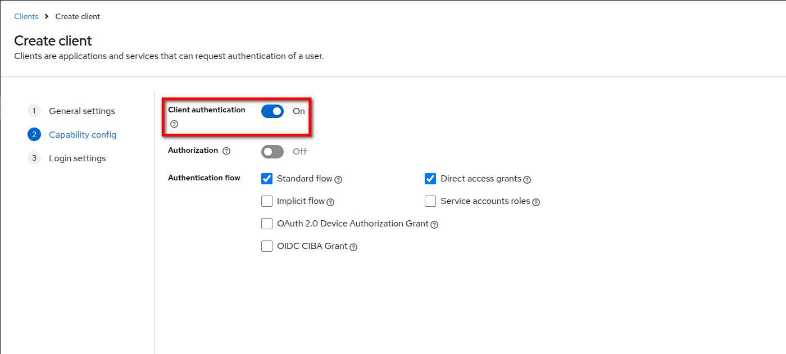

4. Enter a `Valid redirect URI` and click `Save`.

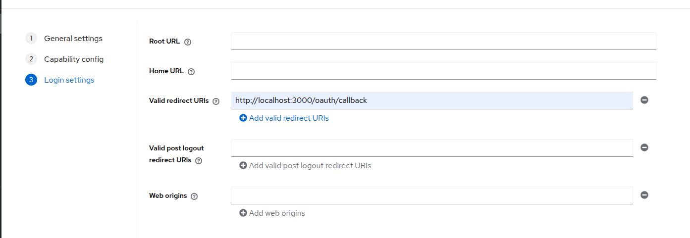

5. In the `Client details` go to `Credentials` tab and copy the `Client secret`.

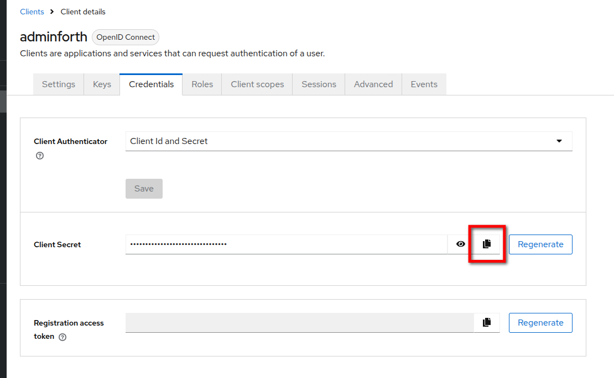

6. Add the credentials to your `.env` file:

```bash
KEYCLOAK_CLIENT_ID=your_keycloak_client_id
KEYCLOAK_CLIENT_SECRET=your_keycloak_client_secret
KEYCLOAK_REALM=your_keycloak_realm
KEYCLOAK_URL=http://localhost:8080
```

## Step 4: Create a Keycloak User

1. Go to `Users` tab and click `Create new user`.

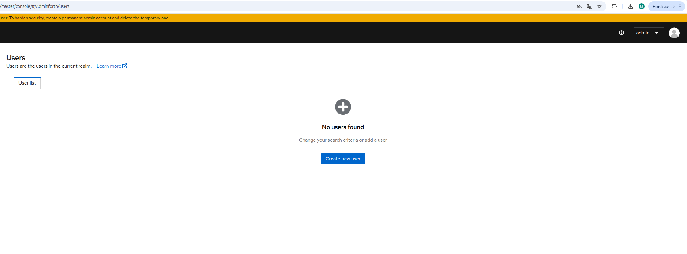

2. Enter a `Username`, `Email`, `First name` and `Last name` and click `Create`.

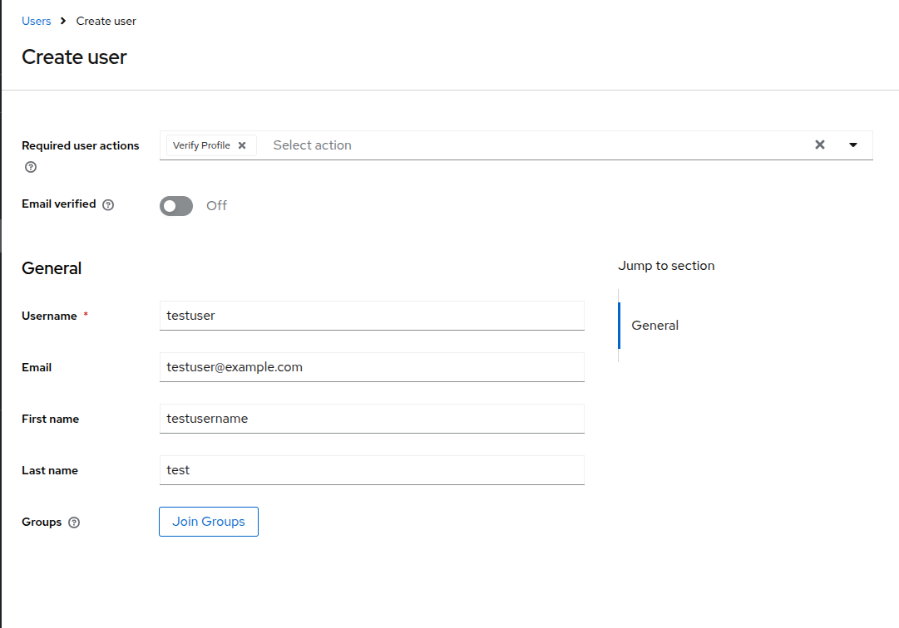

3. In the  `User details` go to `Credentials` tab and click `Set password`.

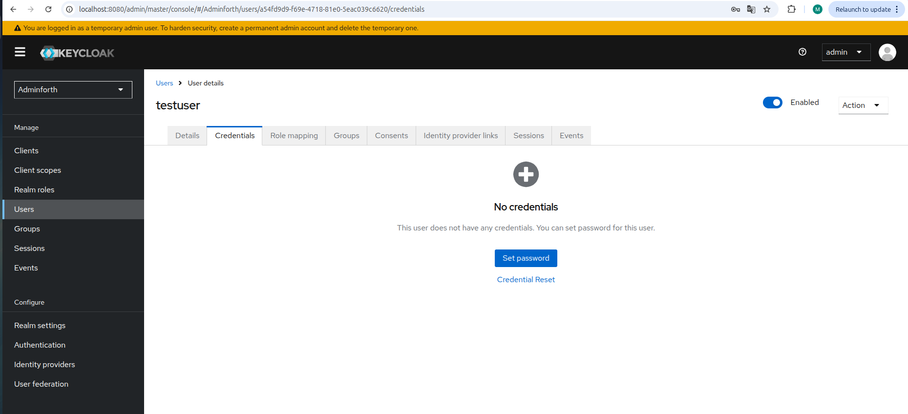

4. Enter a `Password`, turn `Temporary` to `Off` and click `Save`.

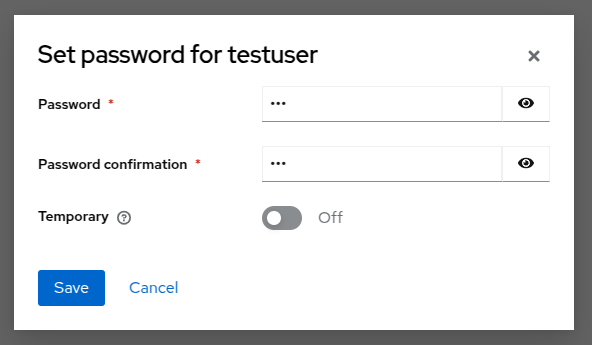

Finally, you can sign in to AdminForth with your Keycloak credentials. (if user with the same email exists in AdminForth)