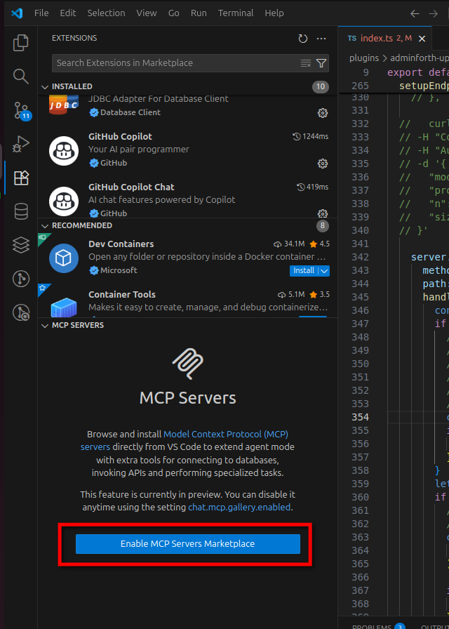
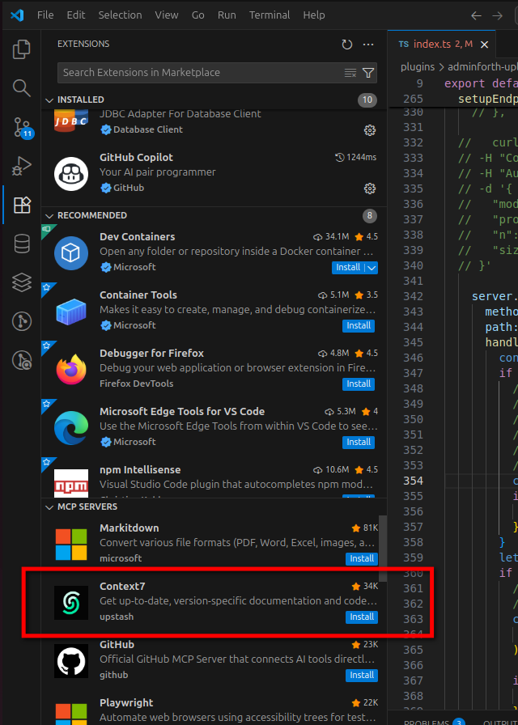
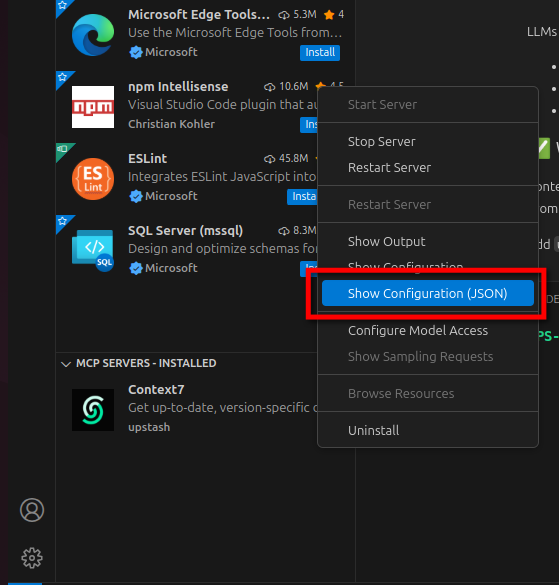
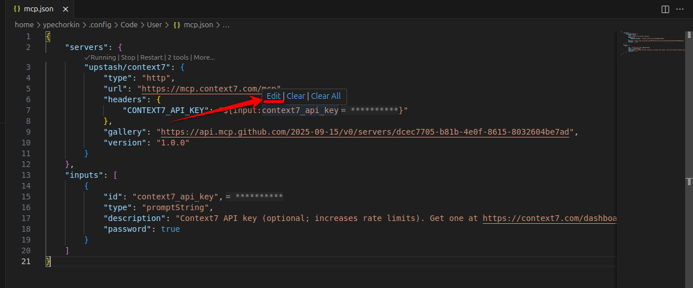
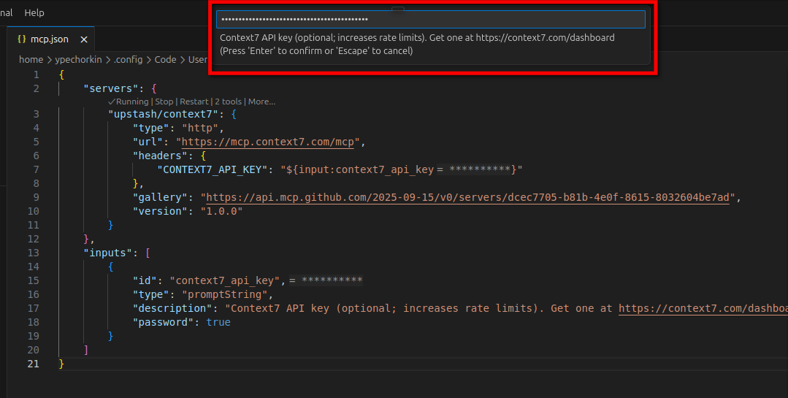
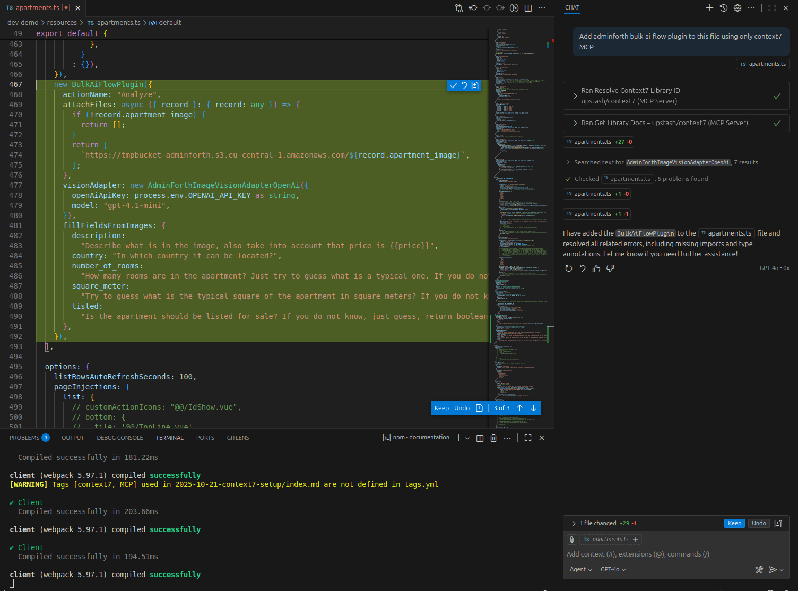
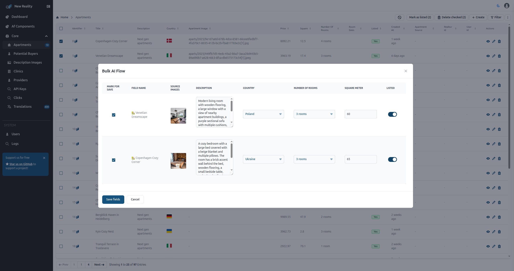

This guide shows how you can set up Context7 MCP in your Visual Studio Code IDE (VS Code)
<!-- truncate -->

### Preparation

First of all, you'll need to update VS Code to version 1.105.1 or higher. To check your version, go to `Help -> About`.

If you used a `.deb` file to install VS Code, just run these commands in the terminal to install updates:
```bash
sudo apt update 
sudo apt install code
```

Before opening VS Code, we need to get the Context7 API key. For this, go to https://context7.com/dashboard, create a new account, and copy the API key.

### Setup
 
Now we can proceed with the setup:
1) After opening VS Code, go to the extensions tab, where you'll see the new `MCP SERVERS` tab. Click on `Enable MCP Servers Marketplace`.


2) Find Context7 in the list and press `Install`:


3) Go to `Show Configuration JSON`:


4) Click `Edit`:


5) Insert your API key:


The installation is complete. You can now use it.

### Example: Installation of the Bulk-ai-flow Plugin

Here is an example prompt you can use to add the adminforth bulk-ai-flow plugin:

**Prompt:**  
`Add adminforth bulk-ai-flow plugin to this file using Context7 MCP`

**Generated Code:**  


**Result:**  


As we can see, the generation works really well.

### Tips
If you don’t want to add `use context7` to every prompt, you can [define a simple rule in your MCP client's rule section](https://github.com/upstash/context7?tab=readme-ov-file#-tips).

If you're using github copilot, you can:
1) In the root of your repository, create the .github directory if it does not already exist.
2) create a file named `.github/copilot-instructions.md`
3) Inside of new file add:

```txt
Always use context7 when I need code generation, setup or configuration steps, or
library/API documentation. This means you should automatically use the Context7 MCP
tools to resolve library id and get library docs without me having to explicitly ask.
```