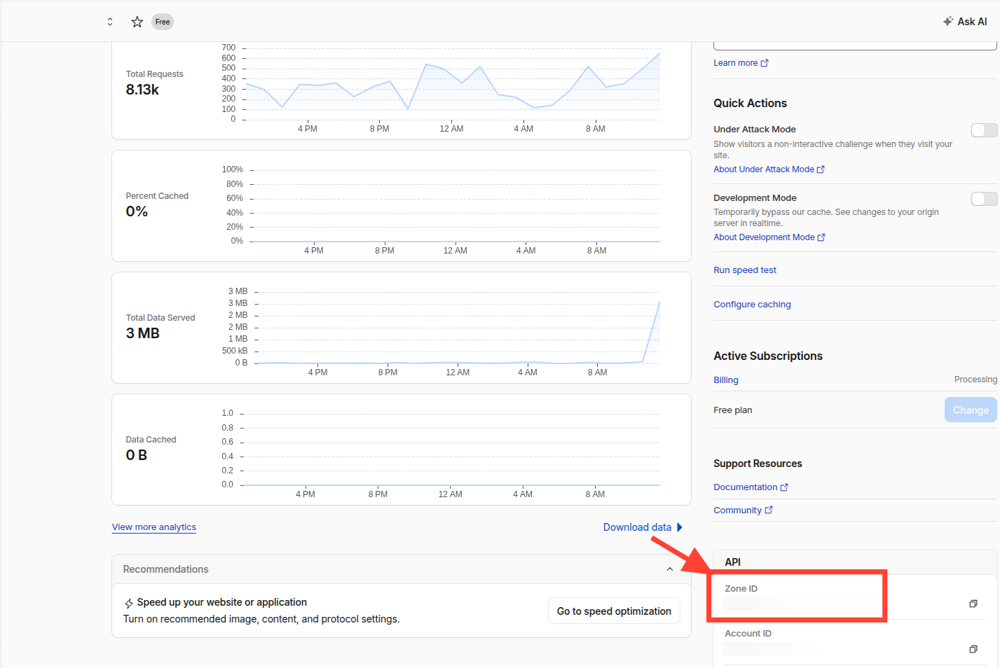
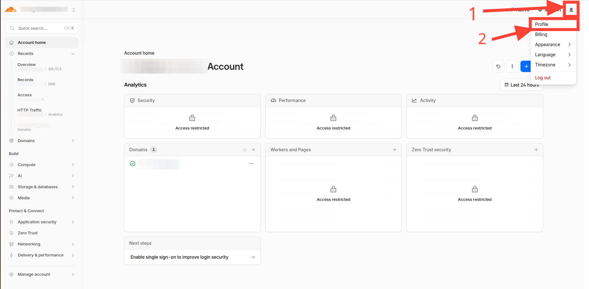
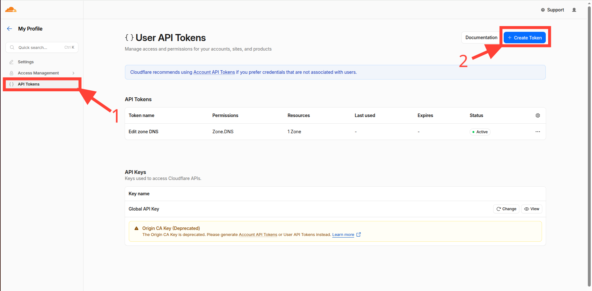
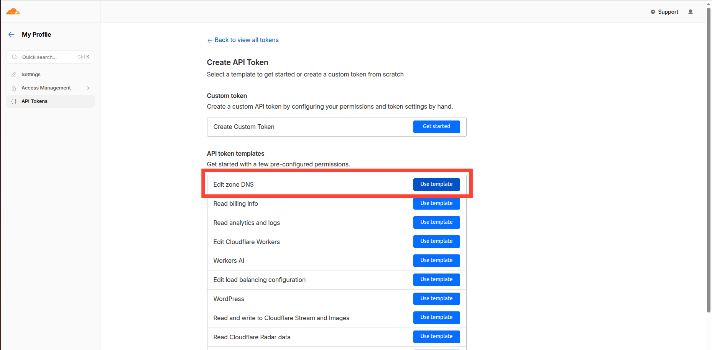
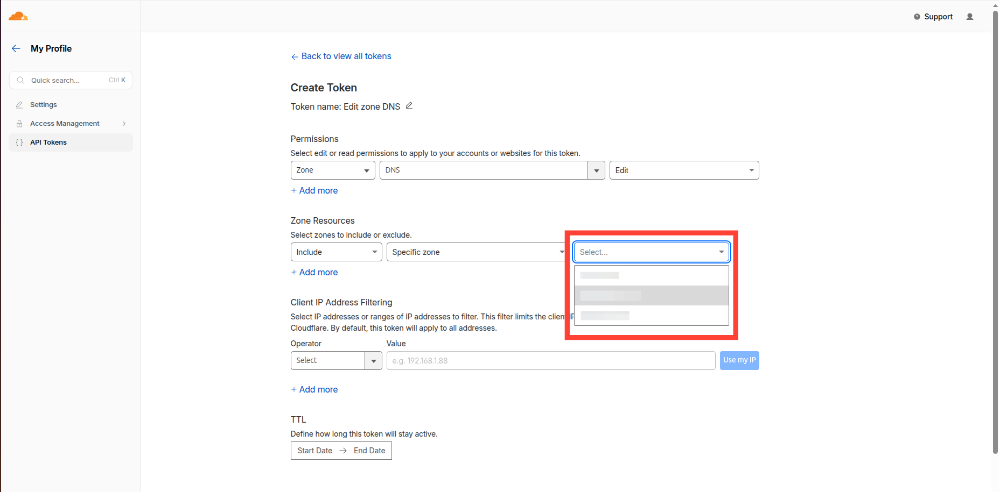
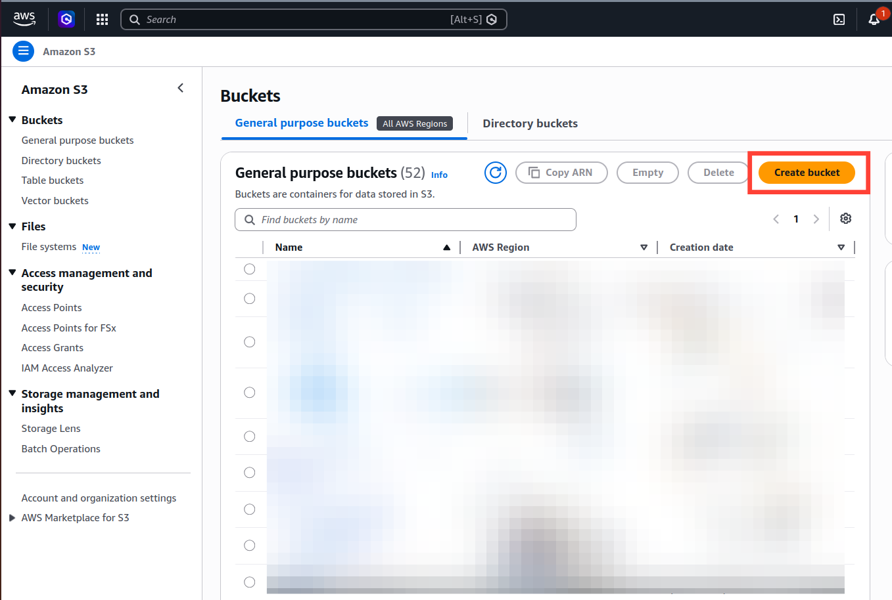
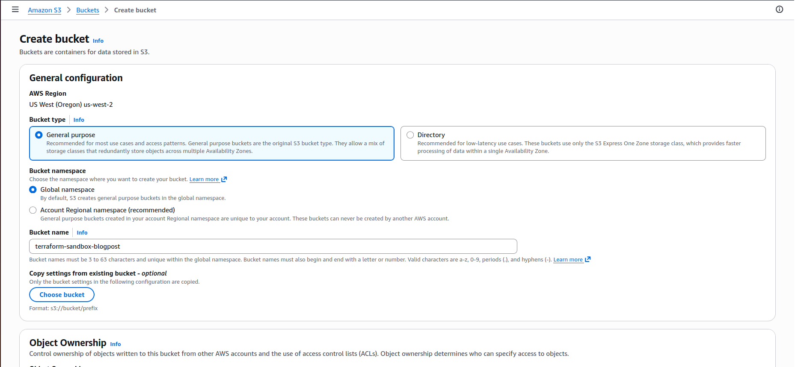

“Branch-based sandboxing” is a revolutionary approach to development that allows teams to create isolated environments—as close as possible to production—for each feature branch. This ensures that code changes are tested under realistic conditions before being merged into the main branch, which helps avoid issues like “it works on my machine” and ensures deployment stability.
The implementation described in this post covers the automatic creation of an isolated development/testing environment using the resources of an existing EC2 instance, as well as the scaling of those resources in the event of a shortage.

This guide covers:

- Automated EC2 infrastructure provisioning using Terraform
- K3s cluster installation and setup on EC2
- Cloudflare DNS management for custom domains
- GitHub Actions workflows for automated deployments and cleanup
- Monitoring and management practices

<!-- truncate -->

## Prerequisites

Before you begin, make sure you have the following:

- An AWS account with appropriate permissions
- A registered domain name with Cloudflare
- GitHub repository with Terraform and Helm files
- Required secrets configured in GitHub repository

Also you need to have installed:

- [Terraform](https://developer.hashicorp.com/terraform/install)
- [Helm](https://helm.sh/docs/intro/install/)
- [Helmfile](https://helmfile.readthedocs.io/en/latest/)
- [kubectl](https://kubernetes.io/docs/tasks/tools/install-kubectl-linux/)

## GitHub Secrets Configuration

In your GitHub repository settings, configure the following secrets:

- `CLOUDFLARE_API_TOKEN` - Cloudflare API token with DNS management permissions
- `CLOUDFLARE_ZONE_ID` - Your Cloudflare zone ID
- `SSH_PRIVATE_KEY` - Private SSH key for accessing the EC2 instance
- `AWS_ACCESS_KEY_ID` - AWS access key ID
- `AWS_SECRET_ACCESS_KEY` - AWS secret access key

You should use the same AWS account as in the main deployment, so if you have `AWS_ACCESS_KEY_ID` and `AWS_SECRET_ACCESS_KEY` in GitHub secrets, you can use the same for the branch sandboxing. No need to create new ones.

For get CLOUDFLARE_ZONE_ID go to your Cloudflare dashboard and select your domain. You will see the Zone ID in the top right corner. 


For get CLOUDFLARE_API_TOKEN go to your Cloudflare dashboard and select `My Profile` -> `API Tokens` -> `Create Token`. 
1) My profile

2) API Tokens

3) Edit zone DNS

4) Select domain and click "Continue to summary" (On next screen click "Create Token" button and copy the token value - it will not be shown again)


## Terraform Configuration

Let's say you're setting up a “sandboxing” branch for a repository deployed according to our guide **IaC Simplified: K3s on EC2 Deployments with Terraform, Helm, Ansible & Amazon ECR** (https://adminforth.dev/blog/k3s-ec2-deployment/), in that case, you won't need to edit the code provided in this manual at all.

*NOTE:* The documentation mentioned above describes the deployment of an application consisting of a single container. In other words, if you used the instructions in that documentation as a starting point and adapted them to deploy multiple containers, you will still need to make some minor adjustments.

It should also be noted that for this test environment, we chose the **AWS EC2 Auto Scaling Group** in conjunction with the official cluster autoscaler utility, as this is the built-in and most convenient way to implement such tasks. Furthermore, **AWS does not charge any additional fees for this**.

### Configure first deploy outputs

To seamlessly replicate the original infrastructure, we need to perform the following steps: 

1. Make sure you're using the **S3 backend** in your configuration (We didn't set this up in the instructions mentioned earlier, but if you're working as part of a team, you've most likely already done so. If not, I'll explain how to do it below—it only takes a couple of minutes)

2. Configure outputs from first deploy





*NOTE: Make sure to choose the same AWS region as your main deployment. I'm using us-west-2 as it is used in main deployment.*

Next, open your `main.tf` file located in the `deploy/terraform` directory and add the following configuration:

```hcl
terraform {
  required_providers {
    aws = {
      source  = "hashicorp/aws"
      version = "~> 5.0"
    }
  }
//diff-add
  backend "s3" {
    //diff-add
    bucket       = "terraform-sandbox-blogpost"
    //diff-add
    key          = "terraform.tfstate"
    //diff-add
    region       = "us-west-2"
    //diff-add
    use_lockfile = true
  //diff-add
  }
}
```
After this you need to run 

```bash
terraform init -migrate-state
```
in terraform directory

Also, we need to output the values we need for the sandbox deployment. In the same directory add (or edit) the `outputs.tf` file:

```hcl
//diff-add
output "ecr_repository_url" {
  //diff-add
  value = aws_ecr_repository.app_repo.repository_url
//diff-add
}
//diff-add
output "account_id" {
  //diff-add
  value = data.aws_caller_identity.current.account_id
//diff-add
}
//diff-add
output "aws_region" {
  //diff-add
  value = local.aws_region
//diff-add
}
//diff-add
output "public_ip" {
  //diff-add
  value = aws_instance.ec2_instance.public_ip
//diff-add
}
//diff-add
output "subnet_id" {
  //diff-add
  value = aws_subnet.public_a.id
//diff-add
}
//diff-add
output "security_group_id" {
  //diff-add
  value = aws_security_group.app_sg.id
//diff-add
}
//diff-add
output "iam_instance_profile" {
  //diff-add
  value = aws_iam_instance_profile.instance_profile.name
//diff-add
}
//diff-add
output "key_name" {
  //diff-add
  value = aws_key_pair.app_deployer.key_name
//diff-add
}
//diff-add
output "instance_type" {
  //diff-add
  value = aws_instance.ec2_instance.instance_type
//diff-add
}
```

Also you need to attach IAM policy to the instance profile created in the main deployment. This is required for the cluster autoscaler to be able to manage the Auto Scaling Group. Also we attach role for ECR repository pull only to the node role. So the autoscaled node instances can pull images from ECR.

```hcl title="[deploy/terraform/resvpc.tf]"
resource "aws_iam_role_policy_attachment" "ecr_access_policy" {
  policy_arn = "arn:aws:iam::aws:policy/AmazonEC2ContainerRegistryPullOnly"
  role       = aws_iam_role.node_role.name
}

resource "aws_iam_role_policy" "cluster_autoscaler_policy" {
  name = "${local.app_name}-cluster-autoscaler-policy"
  role = aws_iam_role.node_role.id

  policy = jsonencode({
    Version = "2012-10-17"
    Statement = [
      {
        Effect = "Allow"
        Action = [
          "autoscaling:DescribeAutoScalingGroups",
          "autoscaling:DescribeAutoScalingInstances",
          "autoscaling:DescribeLaunchConfigurations",
          "autoscaling:DescribeTags",
          "ec2:DescribeInstanceTypes",
          "ec2:DescribeLaunchTemplateVersions"
        ]
        Resource = ["*"]
      },
      {
        Effect = "Allow"
        Action = [
          "autoscaling:SetDesiredCapacity",
          "autoscaling:TerminateInstanceInAutoScalingGroup",
          "autoscaling:UpdateAutoScalingGroup"
        ]
        Resource = ["*"]
        Condition = {
          StringEquals = {
            "autoscaling:ResourceTag/k8s.io/cluster-autoscaler/enabled" = "true"
          }
        }
      }
    ]
  })
}
```

Make sure you attach the policies to the node role created in the main deployment. If you didn't create the node role in the main deployment, you should create it now. We attach it to the node role, because we create node instances using Auto Scaling Group. So the autoscaled node instances can pull images from ECR. Also you need to add cluster autoscaler deployment to the cluster.

```bash
terraform apply --auto-approve
```
in terraform directory

Make sure, that you're using the same values as in the main deployment, so if you're using different `ECR` repository name, `subnet_id`, `security_group_id`, `iam_instance_profile`, `key_name` or `instance_type` in your main deployment, you should use the same values in the sandbox deployment.

### Terraform Sandbox Configuration

Now we can start configuring the sandbox itself. Create a new directory called `deploy/sandboxing` inside the `deploy` directory. Inside that directory, create a directory called `terraform`.

Create `variables.tf` here:

```hcl  title="[deploy/sandboxing/terraform/variables.tf]"
variable "instance_type" {
  type        = string
  description = "EC2 Instance type for ASG workers"
  default     = "t3a.small"
}

variable "k3s_version" {
  type        = string
  description = "K3s version to install"
  default     = "v1.27.3+k3s1"
}

variable "k3s_token" {
  type        = string
  description = "K3s cluster token"
  sensitive   = true
}
```

Next, `main.tf`:

```hcl  title="[deploy/sandboxing/terraform/main.tf]"
terraform {
  required_providers {
    aws = {
      source  = "hashicorp/aws"
      version = "~> 5.0"
    }
  }
  backend "s3" {
    bucket       = "terraform-sandbox-blogpost"
    key          = "k3s-autoscaling-workers/terraform.tfstate"
    use_lockfile = true
    region       = "us-west-2"
  }
}

data "terraform_remote_state" "base" {
  backend = "s3"
  config = {
    bucket = "terraform-sandbox-blogpost"
    key    = "terraform.tfstate"
    region = "us-west-2"
  }
}

provider "aws" {
  region = data.terraform_remote_state.base.outputs.aws_region
}

data "aws_ami" "ubuntu_22_04" {
  most_recent = true
  owners      = ["099720109477"]

  filter {
    name   = "name"
    values = ["ubuntu/images/hvm-ssd/ubuntu-jammy-22.04-amd64-server-*"]
  }
}

resource "aws_launch_template" "worker" {
  name_prefix   = "k3s-worker-lt-"
  image_id      = data.aws_ami.ubuntu_22_04.id
  instance_type = var.instance_type
  key_name      = data.terraform_remote_state.base.outputs.key_name

  iam_instance_profile {
    name = data.terraform_remote_state.base.outputs.iam_instance_profile
  }

  network_interfaces {
    associate_public_ip_address = true
    security_groups             = [data.terraform_remote_state.base.outputs.security_group_id]
  }

  instance_market_options {
    market_type = "spot"
  }

  user_data = base64encode(templatefile("${path.module}/userdata.sh.tpl", {
    aws_region  = data.terraform_remote_state.base.outputs.aws_region
    account_id  = data.terraform_remote_state.base.outputs.account_id
    public_ip   = data.terraform_remote_state.base.outputs.public_ip
    k3s_version = var.k3s_version
    k3s_token   = var.k3s_token
  }))

  block_device_mappings {
    device_name = "/dev/sda1"
    ebs {
      volume_size           = 10
      volume_type           = "gp3"
      delete_on_termination = true
    }
  }

  lifecycle {
    create_before_destroy = true
  }
}

resource "aws_autoscaling_group" "workers" {
  name                = "k3s-workers-asg"
  min_size            = 0
  max_size            = 10
  desired_capacity    = 0
  vpc_zone_identifier = [data.terraform_remote_state.base.outputs.subnet_id]

  launch_template {
    id      = aws_launch_template.worker.id
    version = "$Latest"
  }

  tag {
    key                 = "Name"
    value               = "k3s-autoscaling-worker"
    propagate_at_launch = true
  }

  tag {
    key                 = "k8s.io/cluster-autoscaler/enabled"
    value               = "true"
    propagate_at_launch = true
  }

  tag {
    key                 = "k8s.io/cluster-autoscaler/my-sandbox-cluster"
    value               = "owned"
    propagate_at_launch = true
  }

  lifecycle {
    ignore_changes = [desired_capacity]
  }
}
```

Last file you need to create in this directory is `userdata.sh.tpl`:

```bash  title="[deploy/sandboxing/terraform/userdata.sh.tpl]"
#!/bin/bash
set -e
apt-get update
apt-get install -y awscli

echo '#!/bin/bash' > /usr/local/bin/update-ecr-token.sh
echo 'TOKEN=$(aws ecr get-login-password --region ${aws_region})' >> /usr/local/bin/update-ecr-token.sh
echo 'mkdir -p /etc/rancher/k3s' >> /usr/local/bin/update-ecr-token.sh
echo 'cat <<YAML > /etc/rancher/k3s/registries.yaml' >> /usr/local/bin/update-ecr-token.sh
echo 'configs:' >> /usr/local/bin/update-ecr-token.sh
echo '  "${account_id}.dkr.ecr.${aws_region}.amazonaws.com":' >> /usr/local/bin/update-ecr-token.sh
echo '    auth:' >> /usr/local/bin/update-ecr-token.sh
echo '      username: AWS' >> /usr/local/bin/update-ecr-token.sh
echo '      password: "$TOKEN"' >> /usr/local/bin/update-ecr-token.sh
echo 'YAML' >> /usr/local/bin/update-ecr-token.sh

echo 'systemctl restart k3s-agent || true' >> /usr/local/bin/update-ecr-token.sh
chmod +x /usr/local/bin/update-ecr-token.sh
/usr/local/bin/update-ecr-token.sh

echo "0 */10 * * * root /usr/local/bin/update-ecr-token.sh > /var/log/ecr-cron.log 2>&1" > /etc/cron.d/update-ecr-token

EC2_TOKEN=$(curl -s -X PUT "http://169.254.169.254/latest/api/token" -H "X-aws-ec2-metadata-token-ttl-seconds: 21600")
INSTANCE_ID=$(curl -H "X-aws-ec2-metadata-token: $EC2_TOKEN" -s http://169.254.169.254/latest/meta-data/instance-id)
AZ=$(curl -H "X-aws-ec2-metadata-token: $EC2_TOKEN" -s http://169.254.169.254/latest/meta-data/placement/availability-zone)
curl -sfL https://get.k3s.io | INSTALL_K3S_VERSION="${k3s_version}" K3S_URL="https://${public_ip}:6443" K3S_TOKEN="${k3s_token}" sh -s - agent --kubelet-arg="provider-id=aws:///$AZ/$INSTANCE_ID"
```

## Configure Cluster Autoscaler & Build sandbox images

This is the part most sensitive to your deployment; the current settings are configured to use a single image, AWS ECR as the Docker registry, and a Helmfile as the package manager. Adapt it to your needs.

In the `deploy/sandboxing` directory, create a file named `deploy/sandboxing/build-and-push-sandbox.sh`:

```bash  title="[deploy/sandboxing/build-and-push-sandbox.sh]"
#!/bin/bash
set -e

if [ -z "$REGION" ] || [ -z "$ACCOUNT_ID" ] || [ -z "$BRANCH_SLUG" ]; then
    echo "Error: REGION, ACCOUNT_ID, and BRANCH_SLUG must be set."
    exit 1
fi

SCRIPT_DIR="$(cd "$(dirname "${BASH_SOURCE[0]}")" && pwd)"
APP_SOURCE_CODE_PATH=${APP_SOURCE_CODE_PATH:-"${SCRIPT_DIR}/../../"}

REPO_URL="${ACCOUNT_ID}.dkr.ecr.${REGION}.amazonaws.com/myadmink3s"
TAG="${BRANCH_SLUG}"
IMAGE_FULL_TAG="${REPO_URL}:${TAG}"

echo "LOG: Logging in to ECR in region ${REGION}..."
aws ecr get-login-password --region "${REGION}" | docker login --username AWS --password-stdin "${ACCOUNT_ID}.dkr.ecr.${REGION}.amazonaws.com"

echo "LOG: Building Docker image..."
unset DOCKER_HOST
docker build --pull -t "${IMAGE_FULL_TAG}" "${APP_SOURCE_CODE_PATH}"

echo "LOG: Pushing image to ECR..."
docker push "${IMAGE_FULL_TAG}"
echo "LOG: Sandbox image build and push complete. IMAGE_FULL_TAG=${IMAGE_FULL_TAG}"
```

Here, you should pay attention to the **APP_SOURCE_CODE_PATH** variable and make sure it correctly points to the directory containing your source code and Dockerfile. Also, if necessary, repeat the `docker build` and `docker push` steps for the number of images you need.

Next, we need to configure the autoscaler. In the `deploy/sandboxing` directory, create a file named `deploy/sandboxing/manage-autoscaler.sh`:

```bash  title="[deploy/sandboxing/manage-autoscaler.sh]"
#!/bin/bash
set -e

SCRIPT_DIR="$(cd "$(dirname "${BASH_SOURCE[0]}")" && pwd)"

ACTION="install"

if [[ "$1" == "--uninstall" ]]; then
    ACTION="uninstall"
fi

REGION=$(grep -E '^\s*region\s*=\s*' "$SCRIPT_DIR/terraform/main.tf" | head -n 1 | awk -F'"' '{print $2}')

if [[ -z "$REGION" ]]; then
    echo "Error: Could not extract AWS Region from terraform/main.tf."
    exit 1
fi

echo "Using AWS Region: $REGION"

echo "=== Fetching Kubeconfig and K3s Token from master node ==="

BASE_IP=$(cd "$SCRIPT_DIR/../terraform" && terraform output -raw public_ip)
if [[ -z "$BASE_IP" ]]; then
    echo "Error: Cannot get public_ip from base terraform state. Make sure base infrastructure is applied."
    exit 1
fi

SSH_KEY="$SCRIPT_DIR/../.keys/id_rsa"
if [[ ! -f "$SSH_KEY" ]]; then
    echo "Error: SSH key not found at $SSH_KEY"
    exit 1
fi

chmod 600 "$SSH_KEY"
mkdir -p ~/.kube

ssh -o StrictHostKeyChecking=no -i "$SSH_KEY" ubuntu@"$BASE_IP" "sudo cat /etc/rancher/k3s/k3s.yaml" > ~/.kube/config
sed -i "s/127.0.0.1/$BASE_IP/g" ~/.kube/config
sed -i 's/certificate-authority-data:.*/insecure-skip-tls-verify: true/g' ~/.kube/config

echo "Kubeconfig successfully updated for K3s cluster at $BASE_IP"

K3S_TOKEN=$(ssh -o StrictHostKeyChecking=no -i "$SSH_KEY" ubuntu@"$BASE_IP" "sudo cat /var/lib/rancher/k3s/server/node-token")
if [[ -z "$K3S_TOKEN" ]]; then
    echo "Error: Failed to fetch K3s node token."
    exit 1
fi
echo "K3s token successfully fetched."

if [[ "$ACTION" == "install" ]]; then

    echo "=== Fixing ProviderID on Master Node ==="

    ssh -o StrictHostKeyChecking=no -i "$SSH_KEY" ubuntu@"$BASE_IP" "bash -s" << 'EOF'
    CURRENT_PROVIDER=$(sudo k3s kubectl get node $(hostname) -o jsonpath='{.spec.providerID}' 2>/dev/null || echo "")
    
    if [[ "$CURRENT_PROVIDER" != aws://* ]]; then
        echo "🔧 Fixing K3s ProviderID to match AWS format..."
        TOKEN=$(curl -s -X PUT "http://169.254.169.254/latest/api/token" -H "X-aws-ec2-metadata-token-ttl-seconds: 21600")
        INSTANCE_ID=$(curl -H "X-aws-ec2-metadata-token: $TOKEN" -s http://169.254.169.254/latest/meta-data/instance-id)
        AZ=$(curl -H "X-aws-ec2-metadata-token: $TOKEN" -s http://169.254.169.254/latest/meta-data/placement/availability-zone)
        
        sudo mkdir -p /etc/rancher/k3s/config.yaml.d
        sudo tee /etc/rancher/k3s/config.yaml.d/aws-provider.yaml > /dev/null <<INLINE_EOF
kubelet-arg:
  - "provider-id=aws:///${AZ}/${INSTANCE_ID}"
INLINE_EOF
        
        echo "Restarting K3s service to apply AWS Provider ID..."
        sudo k3s kubectl delete node $(hostname)
        sudo systemctl restart k3s
        sleep 15
    else
        echo "Master node already has the correct AWS ProviderID."
    fi

    if [ ! -f /usr/local/bin/k3s-node-sweeper.sh ]; then
        echo "Creating daily NotReady node sweeper script..."
        sudo tee /usr/local/bin/k3s-node-sweeper.sh > /dev/null << 'INNER_EOF'
#!/bin/bash
export KUBECONFIG=/etc/rancher/k3s/k3s.yaml
/usr/local/bin/kubectl get nodes | grep NotReady | awk '{print $1}' | xargs -r /usr/local/bin/kubectl delete node
INNER_EOF
        
        sudo chmod +x /usr/local/bin/k3s-node-sweeper.sh
        
        echo "0 0 * * * root /usr/local/bin/k3s-node-sweeper.sh >> /var/log/k3s-node-sweeper.log 2>&1" | sudo tee /etc/cron.d/k3s-node-sweeper > /dev/null
        echo "Daily cron job registered successfully (runs at 00:00)."
    else
        echo "Node sweeper cron job already configured."
    fi
EOF

    echo "=== 1. Provisioning ASG via Terraform ==="
    cd "$SCRIPT_DIR/terraform"
    terraform init
    
    terraform apply -var="k3s_token=$K3S_TOKEN" -auto-approve
    
    echo "=== 2. Installing Cluster Autoscaler via Helm ==="
    helm repo add autoscaler https://kubernetes.github.io/autoscaler
    helm repo update

    helm upgrade --install cluster-autoscaler autoscaler/cluster-autoscaler \
      --namespace kube-system \
      --version 9.33.0 \
      --set image.tag=v1.27.3 \
      --set autoDiscovery.clusterName=my-sandbox-cluster \
      --set autoDiscovery.tags[0]=k8s.io/cluster-autoscaler/enabled \
      --set autoDiscovery.tags[1]=k8s.io/cluster-autoscaler/my-sandbox-cluster \
      --set awsRegion="$REGION" \
      --set extraArgs.scale-down-delay-after-add=5m \
      --set extraArgs.scale-down-unneeded-time=5m \
      --set extraArgs.skip-nodes-with-system-pods=false \
      --set extraArgs.skip-nodes-with-local-storage=false

    echo "Installation completed successfully!"

elif [[ "$ACTION" == "uninstall" ]]; then
    echo "=== 1. Uninstalling Cluster Autoscaler via Helm ==="
    helm uninstall cluster-autoscaler --namespace kube-system || echo "Autoscaler already uninstalled or not found."

    echo "=== 2. Destroying ASG via Terraform ==="
    cd "$SCRIPT_DIR/terraform"
    terraform init
    terraform destroy -var="k3s_token=$K3S_TOKEN" -auto-approve
    
    echo "=== 3. Cleaning up Master Node ==="
    ssh -o StrictHostKeyChecking=no -i "$SSH_KEY" ubuntu@"$BASE_IP" "sudo rm -f /etc/cron.d/k3s-node-sweeper /usr/local/bin/k3s-node-sweeper.sh" || true
    echo "Cron job cleaned up from Master node."

    echo "Uninstallation completed successfully!"
fi
```

When running this specific script, we’ll activate the sandbox for our repository with just a single command.

Next is a file designed to address a problem that may seem minor at first glance but is actually very important: resource limits. Since we’re working with Kubernetes and AWS ASG, this is a mandatory requirement. When configuring a Kubernetes manifest or Helm chart, engineers do not always specify resource limits, and this is a common practice. However, because of this, the autoscaler—which is responsible for creating new instances—will not recognize the need for that new instance because it will not know even the approximate amount of resources being used.

Accordingly, you should create a file `default-limits.yaml` in the `deploy/sandboxing/` directory:

```yaml  title="[deploy/sandboxing/default-limits.yaml]"
apiVersion: v1
kind: LimitRange
metadata:
  name: sandbox-default-limits
spec:
  limits:
  - default:
      memory: "512Mi"
      cpu: "500m"
    defaultRequest:
      memory: "256Mi"
      cpu: "100m"
    type: Container
```

If you haven't specified resource limits in your deployment, you can change the limits we suggest if they don't suit your needs

1) `default` - sets the limits (maximum amount of RAM and CPU usage). In this example: `512Mi` of memory and `500m` (0.5) of CPU

2) `defaultRequest` - specifies the minimum amount of resources that the machine reserves for a specific container. The autoscaler will use this value as a baseline. In this example: `256Mi` of memory and `100m` (0.1) of CPU.

For more information about limit ranges, see [LimitRange](https://kubernetes.io/docs/concepts/policy/limit-range/)

## Provide GitHub Actions 

Now you need to create two folders, `.github/` and `.github/workflows/`, in the project root if your project hasn't used GitHub Actions before. Then, inside the second folder, create a file named `deploy-sandbox.yaml`.

``` yaml   title="[.github/workflows/deploy-sandbox.yaml]"
name: Auto Sandbox Management

on:
  push:
    branches-ignore:
      - main
      - master
      - dev
      - develop
  delete:

env:
  CF_API_TOKEN: ${{ secrets.CLOUDFLARE_API_TOKEN }}
  CF_ZONE_ID: ${{ secrets.CLOUDFLARE_ZONE_ID }}
  DOMAIN: "devtracklify.com"    # Change to your domain name
  K3S_VERSION: "v1.27.3+k3s1"   # Use same version as in master branch
  AWS_REGION: us-west-2         # Use same region as in master branch

jobs:
  deploy-sandbox:
    if: github.event_name == 'push'
    runs-on: ubuntu-latest
    steps:
      - name: Checkout Code
        uses: actions/checkout@v4

      - name: Configure AWS credentials
        uses: aws-actions/configure-aws-credentials@v4
        with:
          aws-access-key-id: ${{ secrets.AWS_ACCESS_KEY_ID }}
          aws-secret-access-key: ${{ secrets.AWS_SECRET_ACCESS_KEY }}
          aws-region: ${{ env.AWS_REGION }}

      - name: Sanitize Branch Name
        id: slug
        run: |
          RAW_BRANCH="${{ github.ref_name }}"
          CLEAN_BRANCH=$(echo "$RAW_BRANCH" | tr '[:upper:]' '[:lower:]' | sed 's/[^a-z0-9]/-/g' | sed 's/-\+/-/g' | sed 's/^-//' | sed 's/-$//')
          echo "BRANCH_SLUG=$CLEAN_BRANCH" >> $GITHUB_ENV
          echo "Final sandbox branch name: $CLEAN_BRANCH"

      - name: Setup Terraform & Kubectl
        uses: hashicorp/setup-terraform@v3

      - name: Setup Helmfile
        run: |
          wget -O helmfile_linux_amd64.tar.gz https://github.com/helmfile/helmfile/releases/download/v0.162.0/helmfile_0.162.0_linux_amd64.tar.gz
          tar -zxvf helmfile_linux_amd64.tar.gz
          sudo mv helmfile /usr/local/bin/helmfile
          rm helmfile_linux_amd64.tar.gz
          helm plugin install https://github.com/databus23/helm-diff

      - name: Get Base Infrastructure Outputs
        id: base_infra
        run: |
          cd ${GITHUB_WORKSPACE}/deploy/terraform/
          terraform init
          echo "BASE_IP=$(terraform output -raw public_ip)" >> $GITHUB_ENV
          echo "INSTANCE_TYPE=$(terraform output -raw instance_type)" >> $GITHUB_ENV
          echo "ACCOUNT_ID=$(terraform output -raw account_id)" >> $GITHUB_ENV
          echo "REGION=$(terraform output -raw aws_region)" >> $GITHUB_ENV
          echo "TAG=$(terraform output -raw hash)" >> $GITHUB_ENV

      - name: Fetch Kubeconfig via SSH
        run: |
          mkdir -p ~/.ssh
          echo "${{ secrets.SSH_PRIVATE_KEY }}" > ~/.ssh/id_rsa
          chmod 600 ~/.ssh/id_rsa
          
          mkdir -p ~/.kube
          ssh -o StrictHostKeyChecking=no -i ~/.ssh/id_rsa ubuntu@${{ env.BASE_IP }} "sudo cat /etc/rancher/k3s/k3s.yaml" > ~/.kube/config
          sed -i "s/127.0.0.1/${{ env.BASE_IP }}/g" ~/.kube/config
          sed -i 's/certificate-authority-data:.*/insecure-skip-tls-verify: true/g' ~/.kube/config
          chmod 600 ~/.kube/config

      - name: Setup Kubernetes Namespace and Limits
        run: |
          kubectl create namespace sandbox-${{ env.BRANCH_SLUG }} --dry-run=client -o yaml | kubectl apply -f -
          kubectl apply -f ${GITHUB_WORKSPACE}/deploy/sandboxing/default-limits.yaml -n sandbox-${{ env.BRANCH_SLUG }}

      - name: Manage Cloudflare DNS Record
        run: |
          SUBDOMAIN="${{ env.BRANCH_SLUG }}"
          FULL_DOMAIN="$SUBDOMAIN.${{ env.DOMAIN }}"
          
          RECORD_ID=$(curl -s -X GET "https://api.cloudflare.com/client/v4/zones/${{ env.CF_ZONE_ID }}/dns_records?name=$FULL_DOMAIN" \
            -H "Authorization: Bearer ${{ env.CF_API_TOKEN }}" | jq -r '.result[0].id')
            
          if [ "$RECORD_ID" == "null" ] || [ -z "$RECORD_ID" ]; then
            echo "Creating new DNS record..."
            curl -s -X POST "https://api.cloudflare.com/client/v4/zones/${{ env.CF_ZONE_ID }}/dns_records" \
              -H "Authorization: Bearer ${{ env.CF_API_TOKEN }}" \
              -H "Content-Type: application/json" \
              --data "{\"type\":\"A\",\"name\":\"$SUBDOMAIN\",\"content\":\"${{ env.BASE_IP }}\",\"ttl\":120,\"proxied\":false}"
          else
            echo "DNS record already exists. Skipping."
          fi

      - name: Build and Push Sandbox Image
        run: |
          cd ${GITHUB_WORKSPACE}/deploy/sandboxing
          ./build-and-push-sandbox.sh
        env:
          REGION: ${{ env.REGION }}
          ACCOUNT_ID: ${{ env.ACCOUNT_ID }}
          BRANCH_SLUG: ${{ env.BRANCH_SLUG }}

      - name: Deploy Application
        run: |
          export APP_NAMESPACE="sandbox-${{ env.BRANCH_SLUG }}"
          export APP_HOST="${{ env.BRANCH_SLUG }}.${{ env.DOMAIN }}"
          export IMAGE_FULL_TAG="${{ env.ACCOUNT_ID }}.dkr.ecr.${{ env.REGION }}.amazonaws.com/myadmink3s:${{ env.BRANCH_SLUG }}"
          # Use same image tag as in build-and-push-sandbox.sh
          cd ${GITHUB_WORKSPACE}/deploy/helm
          helmfile apply

  cleanup-sandbox:
    if: github.event_name == 'delete' && github.event.ref_type == 'branch'
    runs-on: ubuntu-latest
    steps:
      - name: Checkout Code
        uses: actions/checkout@v4

      - name: Configure AWS credentials
        uses: aws-actions/configure-aws-credentials@v4
        with:
          aws-access-key-id: ${{ secrets.AWS_ACCESS_KEY_ID }}
          aws-secret-access-key: ${{ secrets.AWS_SECRET_ACCESS_KEY }}
          aws-region: ${{ env.AWS_REGION }}

      - name: Sanitize Deleted Branch Name
        id: slug
        run: |
          RAW_BRANCH="${{ github.event.ref }}"
          CLEAN_BRANCH=$(echo "$RAW_BRANCH" | tr '[:upper:]' '[:lower:]' | sed 's/[^a-z0-9]/-/g' | sed 's/-\+/-/g' | sed 's/^-//' | sed 's/-$//')
          echo "BRANCH_SLUG=$CLEAN_BRANCH" >> $GITHUB_ENV

      - name: Setup Terraform & Kubectl
        uses: hashicorp/setup-terraform@v3

      - name: Get Base Infrastructure Outputs
        id: base_infra
        run: |
          cd ${GITHUB_WORKSPACE}/deploy/terraform/
          terraform init
          echo "BASE_IP=$(terraform output -raw public_ip)" >> $GITHUB_ENV

      - name: Fetch Kubeconfig via SSH
        run: |
          mkdir -p ~/.ssh
          echo "${{ secrets.SSH_PRIVATE_KEY }}" > ~/.ssh/id_rsa
          chmod 600 ~/.ssh/id_rsa
          
          mkdir -p ~/.kube
          ssh -o StrictHostKeyChecking=no -i ~/.ssh/id_rsa ubuntu@${{ env.BASE_IP }} "sudo cat /etc/rancher/k3s/k3s.yaml" > ~/.kube/config
          sed -i "s/127.0.0.1/${{ env.BASE_IP }}/g" ~/.kube/config
          sed -i 's/certificate-authority-data:.*/insecure-skip-tls-verify: true/g' ~/.kube/config
          chmod 600 ~/.kube/config

      - name: Delete K3s Namespace
        run: |
          kubectl delete namespace sandbox-${{ env.BRANCH_SLUG }} --ignore-not-found=true

      - name: Delete Cloudflare DNS Record
        run: |
          FULL_DOMAIN="${{ env.BRANCH_SLUG }}.${{ env.DOMAIN }}"
          
          RECORD_ID=$(curl -s -X GET "https://api.cloudflare.com/client/v4/zones/${{ env.CF_ZONE_ID }}/dns_records?name=$FULL_DOMAIN" \
            -H "Authorization: Bearer ${{ env.CF_API_TOKEN }}" | jq -r '.result[0].id')
          
          if [ "$RECORD_ID" != "null" ] && [ -n "$RECORD_ID" ]; then
            curl -s -X DELETE "https://api.cloudflare.com/client/v4/zones/${{ env.CF_ZONE_ID }}/dns_records/$RECORD_ID" \
              -H "Authorization: Bearer ${{ env.CF_API_TOKEN }}"
          fi
```

This file is responsible for creating a new isolated environment when pushing to a new branch. Please note the comments in the code that indicate variables you will most likely need to replace with your own.

## Deploying a Sandbox

Now, to ensure that a new environment is created whenever you push to a new branch, all you need to do is run the script `deploy/sandboxing/manage-autoscaler.sh`. Once it finishes, a new sandbox and a DNS record for the domain you specified will be created, and all of this will be automatically deleted when the branch is deleted. Simply run the following in the terminal:

```bash
bash deploy/sandboxing/manage-autoscaler.sh
```

If you no longer need this feature, simply add the `--uninstall` parameter to the command:

```bash
bash deploy/sandboxing/manage-autoscaler.sh --uninstall
```
You should run the uninstall command only after removing all sandbox branches,
because if you don't, the DNS entries will remain and you'll have to delete them manually.