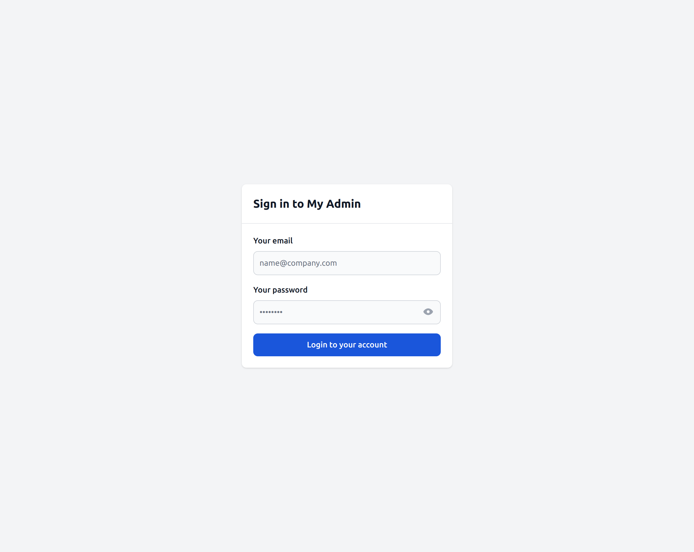
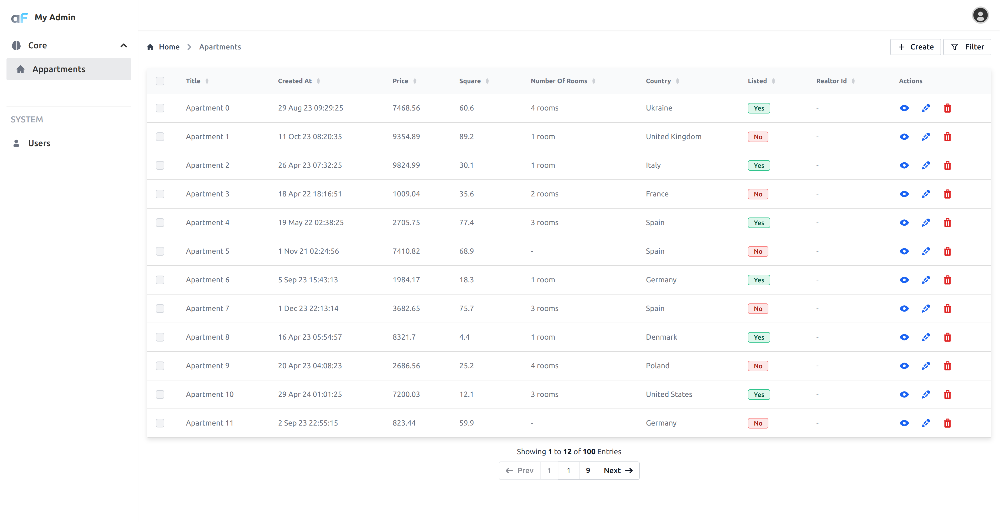

# Getting Started

This Getting Started Page has some explanations and tables with various field types. 
For faster and shorter hello world example check out [Hello World](./01-helloWorld.md)

## Prerequisites

AdminForth requires Node v18 or higher:

```bash
nvm install 20
nvm alias default 20
nvm use 20
```

## Installation

```bash
mkdir myadmin
cd myadmin
npm init -y
npm install adminforth
```

AdminForth does not provide own HTTP server, but can add own listeners over exisitng [Express](https://expressjs.com/) server (Fastify support is planned in future). This allows to create custom APIs for backoffice in a way you know.

```bash
npm install express
```

You can use AdminForth in pure Node, but we recommend using TypeScript for better development experience:

```bash
npm install typescript@5.4.5 tsx@4.11.2  @types/express  @types/node --save-dev
```

Also we will store secret for JWTs in .env file:

```bash
npm install dotenv --save-dev
```

## Basic Philosophy

AdminForth connects to existing databases and provides a backoffice for managing data including CRUD operations, filtering, sorting, and more.

Database should be already created by using any database management tool, ORM or migrator. AdminForth does not provide a way to create tables or columns in the database.

Once you have a database, you pass a connection string to AdminForth and define resources(tables) and columns you would like to see in backoffice. For most DBs AdminForth can "discover" column types and constraints (e.g. max-length) by connecting to DB. However you can redefine them in AdminForth configuration. Type and constraints definition are take precedence over DB schema.

Also in AdminForth you can define in "Vue" way:
* how each field will be rendered
* create own pages e.g. Dashboards
* insert injections into standard pages (e.g. add diagram to list view)


## Setting up a first demo

In the demo we will create a simple database with 2 tables: `apartments` and `users`. We will just use plain SQL to create tables and insert some fake data.

Users table will be used to store a credentials for login into backoffice itself.

Open `package.json`, set `type` to `module` and add `start` script:

```json title="./package.json"
{
  ...
//diff-add
  "type": "module",
  "scripts": {
    ...
//diff-add
    "start": "tsx watch --env-file=.env index.ts"
  },
}
```

Create `.env` file in root directory with following content:

```bash title="./.env"
DATABASE_FILE=./db.sqlite
DATABASE_FILE_URL=file:${DATABASE_FILE}
ADMINFORTH_SECRET=123
NODE_ENV=development
```

> ☝️ In production:
> 1) you should set `NODE_ENV` to `production` so it will not waste extra resources on hot reload.
> 2) You should autogenerate `ADMINFORTH_SECRET`


> ☝️ If you are using Git, obviously you should make sure you will never commit `.env` file to the repository, because
it might contain your own sensitive secrets. So to follow best practices, we recommend to add `.env` into `.gitignore` and create `.env.sample` as template for other repository users.
> During deployment you should set `ADMINFORTH_SECRET` in environment variables of Docker image or in other way without using `.env` file.

## Database creation

> ☝️ For demo purposes we will create a database using Prisma and SQLite. 
> You can also create it using any other favorite tool or ORM and skip this step.


Create `./schema.prisma` and put next content there:

```text title="./schema.prisma"
generator client {
  provider = "prisma-client-js"
}

datasource db {
  provider = "sqlite"
  url      = env("DATABASE_FILE_URL")
}

model users {
  id            String     @id
  created_at    DateTime 
  email         String   @unique
  role          String     
  password_hash String
}

model apartments {
  id                String     @id
  created_at        DateTime? 
  title             String 
  square_meter      Float?
  price             Decimal
  number_of_rooms   Int?
  description       String?
  country           String?
  listed            Boolean
  realtor_id        String?
}

```

Create database using `prisma migrate`:

```bash
npx --yes prisma migrate dev --name init
```


Create `index.ts` file in root directory with following content:

```ts title="./index.ts"
import express from 'express';
import AdminForth, { Filters } from 'adminforth';
import usersResource from "./resources/users";
import apartmentsResource from "./resources/apartments";


const ADMIN_BASE_URL = '';

export const admin = new AdminForth({
  baseUrl : ADMIN_BASE_URL,
  auth: {
    usersResourceId: 'users',  // resource to get user during login
    usernameField: 'email',  // field where username is stored, should exist in resource
    passwordHashField: 'password_hash',
    rememberMeDays: 30, // users who will check "remember me" will stay logged in for 30 days
  },
  customization: {
    brandName: 'My Admin',
    datesFormat: 'D MMM YY',
    timeFormat: 'HH:mm:ss',
    emptyFieldPlaceholder: '-',
  },
  dataSources: [
    {
      id: 'maindb',
      url: `sqlite://${process.env.DATABASE_FILE}`
    },
  ],
  resources: [
    apartmentsResource,
    usersResource,
  ],
  menu: [
    {
      label: 'Core',
      icon: 'flowbite:brain-solid', // any icon from iconify supported in format <setname>:<icon>, e.g. from here https://icon-sets.iconify.design/flowbite/
      open: true,
      children: [
        {
          homepage: true,
          label: 'Apartments',
          icon: 'flowbite:home-solid',
          resourceId: 'aparts',
        },
      ]
    },
    {
      type: 'gap'
    },
    {
      type: 'divider'
    },
    {
      type: 'heading',
      label: 'SYSTEM',
    },
    {
      label: 'Users',
      icon: 'flowbite:user-solid',
      resourceId: 'users',
    }
  ],
});

if (import.meta.url === `file://${process.argv[1]}`) {
  // if script is executed directly e.g. node index.ts or npm start


  const app = express()
  app.use(express.json());
  const port = 3500;

  // needed to compile SPA. Call it here or from a build script e.g. in Docker build time to reduce downtime
  await admin.bundleNow({ hotReload: process.env.NODE_ENV === 'development'});
  console.log('Bundling AdminForth done. For faster serving consider calling bundleNow() from a build script.');


  // serve after you added all api
  admin.express.serve(app)

  admin.discoverDatabases().then(async () => {
    if (!await admin.resource('users').get([Filters.EQ('email', 'adminforth')])) {
      await admin.resource('users').create({
        email: 'adminforth',
        password_hash: await AdminForth.Utils.generatePasswordHash('adminforth'),
        role: 'superadmin',
      });
    }
  });

  app.listen(port, () => {
    console.log(`Example app listening at http://localhost:${port}`)
    console.log(`\n⚡ AdminForth is available at http://localhost:${port}${ADMIN_BASE_URL}\n`)
  });
}
```

Next step you need to create `resources` folder.

Create `apartments.ts` in `resources`:
```ts title="/apartments.ts"
import { AdminForthDataTypes } from 'adminforth';

export default {
  dataSource: 'maindb',
  table: 'apartments',
  resourceId: 'aparts', // resourceId is defaulted to table name but you can redefine it like this e.g. 
  // in case of same table names from different data sources
  label: 'Apartments',   // label is defaulted to table name but you can change it
  recordLabel: (r) => `🏡 ${r.title}`,
  columns: [
    {
      name: 'id',
      label: 'Identifier',  // if you wish you can redefine label, defaulted to uppercased name
      showIn: ['filter', 'show'], // show column in filter and in show page
      primaryKey: true,
      fillOnCreate: ({ initialRecord, adminUser }) => Math.random().toString(36).substring(7),  // called during creation to generate content of field, initialRecord is values user entered, adminUser object of user who creates record
    },
    {
      name: 'title',
      required: true,
      showIn: ['list', 'create', 'edit', 'filter', 'show'],  // all available options
      maxLength: 255,  // you can set max length for string fields
      minLength: 3,  // you can set min length for string fields
    },
    {
      name: 'created_at',
      type: AdminForthDataTypes.DATETIME,
      allowMinMaxQuery: true,
      showIn: ['list', 'filter', 'show', 'edit'],
      fillOnCreate: ({ initialRecord, adminUser }) => (new Date()).toISOString(),
    },
    {
      name: 'price',
      allowMinMaxQuery: true,  // use better experience for filtering e.g. date range, set it only if you have index on this column or if you sure there will be low number of rows
      editingNote: 'Price is in USD',  // you can put a note near field on editing or creating page
    },
    {
      name: 'square_meter',
      label: 'Square',
      allowMinMaxQuery: true,
      minValue: 1,  // you can set min /max value for number columns so users will not be able to enter more/less
      maxValue: 1000,
    },
    {
      name: 'number_of_rooms',
      allowMinMaxQuery: true,
      enum: [
        { value: 1, label: '1 room' },
        { value: 2, label: '2 rooms' },
        { value: 3, label: '3 rooms' },
        { value: 4, label: '4 rooms' },
        { value: 5, label: '5 rooms' },
      ],
    },
    {
      name: 'description',
      sortable: false,
      showIn: ['show', 'edit', 'create', 'filter'],
    },
    {
      name: 'country',
      enum: [{
        value: 'US',
        label: 'United States'
      }, {
        value: 'DE',
        label: 'Germany'
      }, {
        value: 'FR',
        label: 'France'
      }, {
        value: 'UK',
        label: 'United Kingdom'
      }, {
        value: 'NL',
        label: 'Netherlands'
      }, {
        value: 'IT',
        label: 'Italy'
      }, {
        value: 'ES',
        label: 'Spain'
      }, {
        value: 'DK',
        label: 'Denmark'
      }, {
        value: 'PL',
        label: 'Poland'
      }, {
        value: 'UA',
        label: 'Ukraine'
      }, {
        value: null,
        label: 'Not defined'
      }],
    },
    {
      name: 'listed',
      required: true,  // will be required on create/edit
    },
    {
      name: 'realtor_id',
      foreignResource: {
        resourceId: 'users',
      }
    }
  ],
  options: {
    listPageSize: 12,
    allowedActions: {
      edit: true,
      delete: true,
      show: true,
      filter: true,
    },
  },
}
```

Create `users.ts` in `resources`:
```ts title="/users.ts"
import AdminForth, { AdminForthDataTypes } from 'adminforth';
export default {
  dataSource: 'maindb',
  table: 'users',
  resourceId: 'users',
  label: 'Users',
  recordLabel: (r) => `👤 ${r.email}`,
  columns: [
    {
      name: 'id',
      primaryKey: true,
      fillOnCreate: ({ initialRecord, adminUser }) => Math.random().toString(36).substring(7),
      showIn: ['list', 'filter', 'show'],
    },
    {
      name: 'email',
      required: true,
      isUnique: true,
      validation: [
        // you can also use AdminForth.Utils.EMAIL_VALIDATOR which is alias to this object 
        {
          regExp: '^[a-zA-Z0-9._%+-]+@[a-zA-Z0-9.-]+\\.[a-zA-Z]{2,}$',
          message: 'Email is not valid, must be in format example@test.com'
        },
      ]
    },
    {
      name: 'created_at',
      type: AdminForthDataTypes.DATETIME,
      showIn: ['list', 'filter', 'show'],
      fillOnCreate: ({ initialRecord, adminUser }) => (new Date()).toISOString(),
    },
    {
      name: 'role',
      enum: [
        { value: 'superadmin', label: 'Super Admin' },
        { value: 'user', label: 'User' },
      ]
    },
    {
      name: 'password',
      virtual: true,  // field will not be persisted into db
      required: { create: true }, // make required only on create page
      editingNote: { edit: 'Leave empty to keep password unchanged' },
      type: AdminForthDataTypes.STRING,
      showIn: ['create', 'edit'], // to show field only on create and edit pages
      masked: true, // to show stars in input field

      minLength: 8,
      validation: [
        // request to have at least 1 digit, 1 upper case, 1 lower case
        AdminForth.Utils.PASSWORD_VALIDATORS.UP_LOW_NUM,
      ],
    },
    { name: 'password_hash', backendOnly: true, showIn: [] }
  ],
  hooks: {
    create: {
      beforeSave: async ({ record, adminUser, resource }) => {
        record.password_hash = await AdminForth.Utils.generatePasswordHash(record.password);
        return { ok: true };
      }
    },
    edit: {
      beforeSave: async ({ record, adminUser, resource }) => {
        if (record.password) {
          record.password_hash = await AdminForth.Utils.generatePasswordHash(record.password);
        }
        return { ok: true }
      },
    },
  }
}
```


Now you can run your app:


```bash
npm start
```

Open http://localhost:3500 in your browser and login with credentials `adminforth` / `adminforth`.




## Generating fake records

```ts title="./index.ts"
//diff-add
async function seedDatabase() {
//diff-add
  if (await admin.resource('aparts').count() > 0) {
//diff-add
    return
//diff-add    
  }
//diff-add  
  for (let i = 0; i <= 50; i++) {
//diff-add    
    await admin.resource('aparts').create({
//diff-add      
      id: `${i}`,
//diff-add      
      title: `Apartment ${i}`,
//diff-add      
      square_meter: (Math.random() * 100).toFixed(1),
//diff-add      
      price: (Math.random() * 10000).toFixed(2),
//diff-add      
      number_of_rooms: Math.floor(Math.random() * 4) + 1,
//diff-add      
      description: 'Next gen apartments',
//diff-add      
      created_at: (new Date(Date.now() - Math.random() * 60 * 60 * 24 * 14 * 1000)).toISOString(),
//diff-add      
      listed: i % 2 == 0,
//diff-add      
      country: `${['US', 'DE', 'FR', 'UK', 'NL', 'IT', 'ES', 'DK', 'PL', 'UA'][Math.floor(Math.random() * 10)]}`
//diff-add      
    });
//diff-add    
  };
//diff-add  
};

if (import.meta.url === `file://${process.argv[1]}`) {

  ...

  admin.discoverDatabases().then(async () => {
    if (!await admin.resource('users').get([Filters.EQ('email', 'adminforth')])) {
      await admin.resource('users').create({
        email: 'adminforth',
        password_hash: await AdminForth.Utils.generatePasswordHash('adminforth'),
        role: 'superadmin',
      });
    }
//diff-add
    await seedDatabase();
  });

```
This will create records during first launch. Now you should see:



## Possible configuration options

Check [AdminForthConfig](/docs/api/types/AdminForthConfig/type-aliases/AdminForthConfig.md) for all possible options.