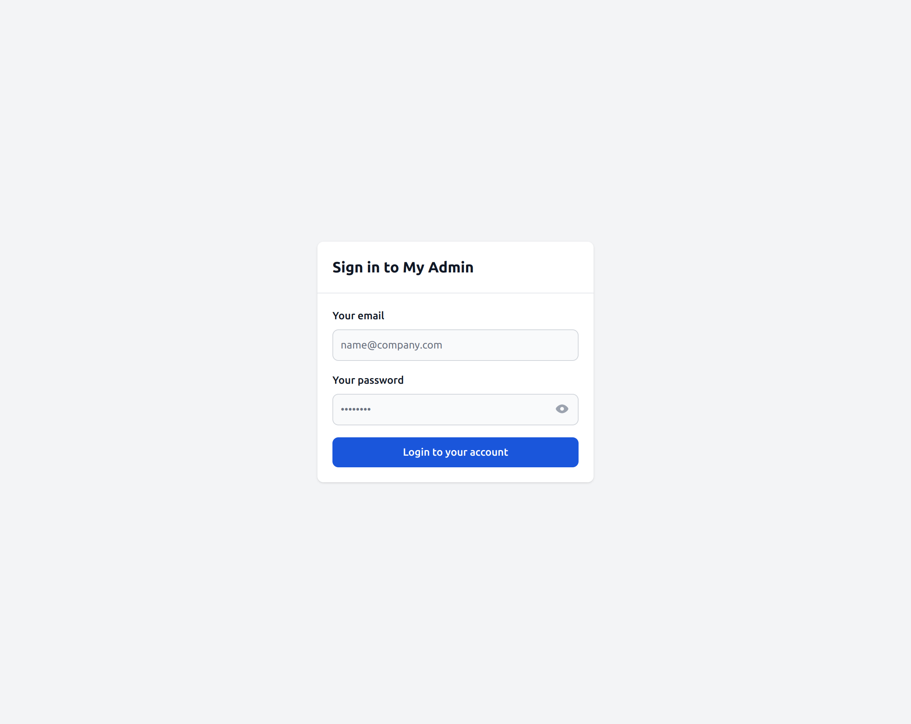

# Hello world app without CLI

While AdminForth CLI is the fastest way to create a new project, you can also create a new project manually.

This might help you better understand how AdminForth project is structured and how to customize it.

Here we create database with users and posts tables and admin panel for it.

Users table will be used to store a credentials for login into admin panel itself.

When back-office user creates a new post it will be automatically assigned using `authorId` to the user who created it.

## Prerequisites

We will use Node v20 for this demo. If you have other Node versions, we recommend using [NVM](https://github.com/nvm-sh/nvm?tab=readme-ov-file#install--update-script) to switch them easily:

```bash
nvm install 20
nvm alias default 20
nvm use 20
```

## Installation

```bash
mkdir af-hello
cd af-hello
pnpm init
pnpm add adminforth express@^4 @dotenvx/dotenvx @types/express typescript tsx @types/node prisma @prisma/client -D
npx --yes tsc --init --module NodeNext --target ESNext
```

## Environment variables

Create two files in your project's root directory:

- `.env.local` — Place your non-sensitive environment variables here (e.g., local database paths, default configurations). This file can be safely committed to your repository as a demo or template configuration.
- `.env` — Store sensitive tokens and secrets here (for example, `ADMINFORTH_SECRET` and other private keys). Ensure that `.env` is added to your `.gitignore` to prevent accidentally committing sensitive data.

Put the following content to the `.env.local` file:

```bash title="./.env.local"
ADMINFORTH_SECRET=123
NODE_ENV=development
DATABASE_URL=sqlite://.db.sqlite
PRISMA_DATABASE_URL=file:.db.sqlite
```

> ☝️ Production best practices:
>
> 1) Most likely you not need `.env` file at all, instead you should use environment variables (from Docker, Kubernetes, Operating System, etc.)
> 2) Set `NODE_ENV` to `production` in your deployment environment to optimize performance and disable development features like hot reloading.
> 3) You should generate very unique value `ADMINFORTH_SECRET` and store it in Vault or other secure place.

## Setting up the scripts

Open `package.json` and add the following scripts:

```json title="./package.json"
{
  ...
//diff-add
  "type": "module",
  "scripts": {
    ...
//diff-add
    "dev": "pnpm _env:dev tsx watch index.ts",
//diff-add
    "prod": "pnpm _env:prod tsx index.ts",
//diff-add
    "start": "pnpm dev",
//diff-add
    "makemigration": "pnpm _env:dev npx --yes prisma migrate dev --create-only",
//diff-add
    "migrate:local": "pnpm _env:dev npx --yes prisma migrate deploy",
//diff-add
    "migrate:prod": "pnpm _env:prod npx --yes prisma migrate deploy",
//diff-add
    "_env:dev": "dotenvx run -f .env -f .env.local --",
//diff-add
    "_env:prod": "dotenvx run -f .env.prod --"
  },
//diff-add
  "engines": {
    //diff-add
    "author": "",
    //diff-add
    "node": ">=20"
    //diff-add
  },
}
```

Create `./pnpm-workspace.yaml` and put next content there:

```json title="./pnpm-workspace.yaml"
onlyBuiltDependencies:
  - better-sqlite3
```

Run installation command to apply all dependencies
```bash
pnpm install
```

## Setting up AdminForth

Create `index.ts` file in root directory with following content:

```ts title="./index.ts"
import express from 'express';
import AdminForth from 'adminforth';
import usersResource from "./resources/adminuser.js";
import { fileURLToPath } from 'url';
import path from 'path';
import { Filters } from 'adminforth';
import { initApi } from './api.js';
import { logger } from 'adminforth';

const ADMIN_BASE_URL = '';

export const admin = new AdminForth({
  baseUrl: ADMIN_BASE_URL,
  auth: {
    usersResourceId: 'adminuser',
    usernameField: 'email',
    passwordHashField: 'password_hash',
    rememberMeDuration: '30d', 
    loginBackgroundImage: 'https://images.unsplash.com/photo-1534239697798-120952b76f2b?q=80&w=3389&auto=format&fit=crop&ixlib=rb-4.0.3&ixid=M3wxMjA3fDB8MHxwaG90by1wYWdlfHx8fGVufDB8fHx8fA%3D%3D',
    loginBackgroundPosition: '1/2',
    loginPromptHTML: async () => { 
      const adminforthUserExists = await admin.resource("adminuser").count(Filters.EQ('email', 'adminforth')) > 0;
      if (adminforthUserExists) {
        return "Please use <b>adminforth</b> as username and <b>adminforth</b> as password"
      }
    },
  },
  customization: {
    brandName: "myadmin",
    title: "myadmin",

    datesFormat: 'DD MMM',
    timeFormat: 'HH:mm a',
  showBrandNameInSidebar: true,
  showBrandLogoInSidebar: true,
    emptyFieldPlaceholder: '-',
    styles: {
      colors: {
        light: {
          primary: '#1a56db',
          sidebar: { main: '#f9fafb', text: '#213045' },
        },
        dark: {
          primary: '#82ACFF',
          sidebar: { main: '#1f2937', text: '#9ca3af' },
        }
      }
    },
  },
  dataSources: [
    {
      id: 'maindb',
      url: `${process.env.DATABASE_URL}`
    },
  ],
  resources: [
    usersResource
  ],
  menu: [
    { type: 'heading', label: 'SYSTEM' },
    {
      label: 'Users',
      icon: 'flowbite:user-solid',
      resourceId: 'adminuser'
    }
  ],
});

if (fileURLToPath(import.meta.url) === path.resolve(process.argv[1])) {
  const app = express();
  app.use(express.json());

  initApi(app, admin);

  const port = 3500;
  
  admin.bundleNow({ hotReload: process.env.NODE_ENV === 'development' }).then(() => {
    logger.info('Bundling AdminForth SPA done.');
  });

  admin.express.serve(app);

  admin.discoverDatabases().then(async () => {
    if (await admin.resource('adminuser').count() === 0) {
      await admin.resource('adminuser').create({
        email: 'adminforth',
        password_hash: await AdminForth.Utils.generatePasswordHash('adminforth'),
        role: 'superadmin',
      });
    }
  });

  admin.express.listen(port, () => {
    logger.info(`\x1b[38;5;249m ⚡ AdminForth is available at\x1b[1m\x1b[38;5;46m http://localhost:${port}${ADMIN_BASE_URL}\x1b[0m\n`);
  });
}

```

> ☝️ For simplicity we defined whole configuration in one file. Normally once configuration grows you should
> move each resource configuration to separate file and organize them to folder and import them in `index.ts`.

Create `api.ts` file in root directory with following content:

```ts title="./api.ts"
import { Express, Response } from "express";
import { IAdminForth, IAdminUserExpressRequest } from "adminforth";
import * as z from "zod";

export function initApi(app: Express, admin: IAdminForth) {
  app.get(`${admin.config.baseUrl}/api/hello/`,

    admin.express.withSchema(
      {
        description: "Returns example data from a custom Express API together with the current authenticated AdminForth user.",
        response: z.object({
          message: z.string(),
          users: z.array(z.record(z.string(), z.unknown())),
          adminUser: z.record(z.string(), z.unknown()),
        }),
      },

      // you can use data API to work with your database https://adminforth.dev/docs/tutorial/Customization/dataApi/
      // and admin.express.authorize to inject req.adminUser
      admin.express.authorize(
        async (req: IAdminUserExpressRequest, res: Response) => {
          const allUsers = await admin.resource("adminuser").list([]);
          res.json({
            message: "Hello from AdminForth API!",
            users: allUsers,
            adminUser: req.adminUser,
          });
        }
      )
    )
  );
}
```

>Install and import Zod before using this pattern: `pnpm add zod` or `npm install zod`, then `import * as z from 'zod';`. `admin.express.withSchema(...)` will convert the Zod schema to OpenAPI for you.


Update `tsconfig.json` file in root directory with following content: 
```ts title="./tsconfig.json"
{
  "compilerOptions": {
    "target": "esnext",
    "module": "nodenext",
    "esModuleInterop": true,
    "forceConsistentCasingInFileNames": true,
    "strict": true
  },
  "exclude": ["node_modules", "dist"]
}
```

Create new directory `./resources/adminuser.ts` with following content:

```ts title="./resources/adminuser.ts"
import AdminForth, { AdminForthDataTypes } from 'adminforth';
import type { AdminForthResourceInput, AdminForthResource, AdminUser } from 'adminforth';
import { randomUUID } from 'crypto';
import { logger } from 'adminforth';

async function allowedForSuperAdmin({ adminUser }: { adminUser: AdminUser }): Promise<boolean> {
  return adminUser.dbUser.role === 'superadmin';
}

export default {
  dataSource: 'maindb',
  table: 'adminuser',
  resourceId: 'adminuser',
  label: 'Admin Users',
  recordLabel: (r) => `👤 ${r.email}`,
  options: {
    allowedActions: {
      edit: allowedForSuperAdmin,
      delete: allowedForSuperAdmin,
    },
  },
  columns: [
    {
      name: 'id',
      primaryKey: true,
      type: AdminForthDataTypes.STRING,
      fillOnCreate: ({ initialRecord, adminUser }) => randomUUID(),
      showIn: {
        edit: false,
        create: false,
      },
    },
    {
      name: 'email',
      required: true,
      isUnique: true,
      type: AdminForthDataTypes.STRING,
      validation: [
        // you can also use AdminForth.Utils.EMAIL_VALIDATOR which is alias to this object
        {
          regExp: '^[a-zA-Z0-9._%+-]+@[a-zA-Z0-9.-]+\\.[a-zA-Z]{2,}$',
          message: 'Email is not valid, must be in format example@test.com'
        },
      ]
    },
    {
      name: 'created_at',
      type: AdminForthDataTypes.DATETIME,
      showIn: {
        edit: false,
        create: false,
      },
      fillOnCreate: ({ initialRecord, adminUser }) => (new Date()).toISOString(),
    },
    {
      name: 'role',
      type: AdminForthDataTypes.STRING,
      enum: [
        { value: 'superadmin', label: 'Super Admin' },
        { value: 'user', label: 'User' },
      ]
    },
    {
      name: 'password',
      virtual: true,  // field will not be persisted into db
      required: { create: true }, // make required only on create page
      editingNote: { edit: 'Leave empty to keep password unchanged' },
      type: AdminForthDataTypes.STRING,
      showIn: { // to show field only on create and edit pages
        show: false,
        list: false,
        filter: false,
      },
      masked: true, // to show stars in input field

      minLength: 8,
      validation: [
        // request to have at least 1 digit, 1 upper case, 1 lower case
        AdminForth.Utils.PASSWORD_VALIDATORS.UP_LOW_NUM,
      ],
    },
    {
      name: 'password_hash',
      type: AdminForthDataTypes.STRING,
      backendOnly: true,
      showIn: { all: false }
    }
  ],
  hooks: {
    create: {
      beforeSave: async ({ record, adminUser, resource }: { record: any, adminUser: AdminUser, resource: AdminForthResource }) => {
        record.password_hash = await AdminForth.Utils.generatePasswordHash(record.password);
        return { ok: true };
      }
    },
    edit: {
      beforeSave: async ({ oldRecord, updates, adminUser, resource }: { oldRecord: any, updates: any, adminUser: AdminUser, resource: AdminForthResource }) => {
        logger.info(`Updating user, ${updates}`);
        if (oldRecord.id === adminUser.dbUser.id && updates.role) {
          return { ok: false, error: 'You cannot change your own role' };
        }
        if (updates.password) {
          updates.password_hash = await AdminForth.Utils.generatePasswordHash(updates.password);
        }
        return { ok: true }
      },
    },
  },
} as AdminForthResourceInput;
```

Create new directory `./custom/tsconfig.json` with following content:
```ts title="./custom/tsconfig.json"
{
  "compilerOptions": {
    "baseUrl": ".",
    "paths": {
      "@/*": ["../node_modules/adminforth/dist/spa/src/*"],
      "@@/*": ["./*"]
    }
  }
}
```

## Database creation

> ☝️ For demo purposes we will create a database using Prisma and SQLite.
> You can also create it using any other favorite tool or ORM and skip this step.

Create `./schema.prisma` and put next content there:

```text title="./schema.prisma"
generator client {
  provider = "prisma-client-js"
}

datasource db {
  provider = "sqlite"
}

model adminuser {
  id            String     @id
  email         String     @unique
  password_hash String
  role          String
  created_at    DateTime
}
```

Create `./prisma.config.ts` and put next content there:

```ts title="./prisma.config.ts"
import 'dotenv/config'
import { defineConfig, env } from 'prisma/config'

export default defineConfig({
  datasource: {
    url: env('PRISMA_DATABASE_URL'),
  },
})
```


Create database using `prisma migrate`:

```bash
pnpm run makemigration --name init ; pnpm run migrate:local
```

Now you can run your app:

```bash
pnpm start
```

Open http://localhost:3500 in your browser and login with credentials `adminforth` / `adminforth`.



## Initializing custom directory

If you are not using CLI, you can create `custom` directory and initialize it with `npm`:

```bash
cd ./custom
npm init -y
```

We will use this directory for all custom components. If you want to call your dir with other name then `custom`, just set [customComponentsDir option](/docs/api/Back/interfaces/AdminForthConfigCustomization/#customcomponentsdir)


Also, for better development experience we recommend to create file `custom/tsconfig.json` with the following content:

```json
{
  "compilerOptions": {
    "baseUrl": ".",
    "paths": {
      "@/*": [
        "../node_modules/adminforth/dist/spa/src/*"
      ],
      "*": [
        "../node_modules/adminforth/dist/spa/node_modules/*"
      ],
      "@@/*": [
        "."
      ]
    }
  }
}
```

## Possible configuration options

Check [AdminForthConfig](/docs/api/Back/interfaces/AdminForthConfig.md) for all possible options.
