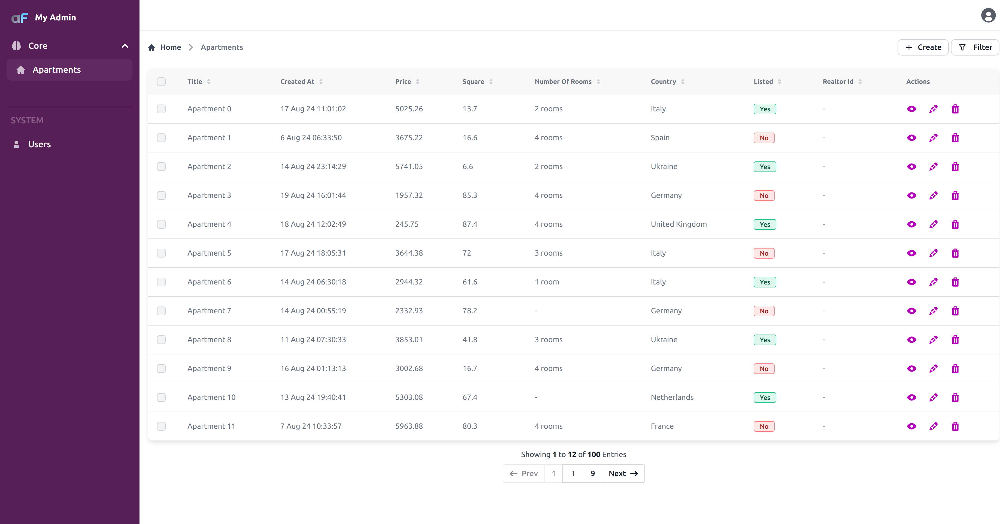

# Branding and Theming

The first things you would probably like to change are the logo, favicon and the name of the admin application. 

You can place your logo and favicon files into the `custom` directory e.g. replacing existing default `logo.svg` and `favicon.png` files.

Then you can change the branding of the application in the configuration:

```ts title='./index.ts'

const admin = new AdminForth({
  ...
  customization: {
//diff-remove
    brandName: "myadmin",
//diff-add
    brandName: 'My App',  // used in login page and sidebar
//diff-remove
    title: "myadmin",
//diff-add
    title: 'My App Admin',  // used to set HTML title tag
    brandLogo: '@@/assets/logo.svg', // replace with your images in custom/assets  directory
    favicon: '@@/assets/favicon.png',
  },
  ...
});
```

Please note that `@@/` is a special prefix which tells AdminForth to look for the file in the `custom` directory. 
You can use `@@/` prefix for all paths in the configuration and also import images like this in your custom components e.g.:

```ts
<template>
  
</template>
```

## Removing brand name from sidebar

If you are using logo image which has branded title inside, you might
want completely remove default text brand name from sidebar:

```ts title='./index.ts'
brandName: 'My App',
//diff-add
showBrandNameInSidebar: false,
```

`brandName` will still be used in the other places e.g. login form.

## Theming

AdminForth uses TailwindCSS for styling. You are able to customize the look of the application by changing the TailwindCSS configuration.

Use [styles.ts](https://github.com/devforth/adminforth/blob/main/adminforth/modules/styles.ts) file to see which variables are available for change.

Let's say your brand has a primary purple color and you wish to make side bar purple with white text.

In `index.ts` file set the `styles` property in the configuration:

```ts title='./index.ts'

const admin = new AdminForth({
  ...
  customization: {
    styles: {
      colors: {
        light: {
//diff-add
          // color for links, icons etc.
//diff-remove
          primary: '#1a56db',
//diff-add
          primary: '#b400b8',
//diff-add
          // color for sidebar and text
//diff-remove
          sidebar: { main: '#f9fafb', text: '#213045' },
//diff-add
          sidebar: { main:'#571e58', text: 'white'},
        },
      }
    } 
  },
  ...
});
```
Here is how it looks:


## Single theme

If you want to enforce a consistent theme and disable the theme switcher, you can configure AdminForth to use only one theme variant. 

```ts title='./index.ts'

const admin = new AdminForth({
  ...
  customization: {
  //diff-add
    singleTheme: "light",
    styles: {
      ...
      }
    } 
  },
  ...
});
```


## Square vs rounded buttons?

Not an issue, just change:

```ts title='./index.ts'
styles: {
//diff-add
  borderRadius: {
//diff-add
    "default": "0px"
//diff-add
  }
}
```

## Login background

To make login interface less boring background image matters.

For example you might want to get [free sweet background](https://unsplash.com/s/photos/secure?license=free) from Unsplash like
[Nate Watson's apartments view](https://images.unsplash.com/photo-1516501312919-d0cb0b7b60b8?q=80&w=3404&auto=format&fit=crop&ixlib=rb-4.0.3&ixid=M3wxMjA3fDB8MHxwaG90by1wYWdlfHx8fGVufDB8fHx8fA%3D%3D).

Download it to `custom` directory, and just set it in the configuration:


```ts title='./index.ts'
const admin = new AdminForth({
  ...
  auth: {
    ...
//diff-add
    loginBackgroundImage: '@@/photo-1516501312919-d0cb0b7b60b8.jpeg',
  },
  ...
});
```
Here is how it looks:


You can also set background position and size:

```ts title='./index.ts'

auth: {
  ...
  loginBackgroundImage: '@@/photo-1516501312919-d0cb0b7b60b8.jpeg',
//diff-add
  loginBackgroundPosition: 'over',
}
```

`loginBackgroundPosition` accepts values:

- `over` - image will be over the whole login page with cover mode
- `1/2`(default), `3/4`, `2/5`, `3/5` etc. - image will be in the left side of the login page with cover mode

### Disabling background blend mode

When using `loginBackgroundPosition: 'over'`, AdminForth applies a background blend mode by default to ensure text readability over the background image. If you want to disable this blend mode and display the background image without any overlay effects, you can add:

```ts title='./index.ts'
auth: {
  ...
  loginBackgroundImage: '@@/photo-1516501312919-d0cb0b7b60b8.jpeg',
  loginBackgroundPosition: 'over',
//diff-add
  removeBackgroundBlendMode: true,
}

```

## Custom items in html head

If you want to add custom elements to the HTML head, you can define them in the configuration:

```ts title='./index.ts'
customization: {
  customHeadItems: [
    {
      tagName: 'link',
      attributes: {
        rel: 'stylesheet',
        href: 'https://example.com/custom.css'
      }
    },
    {
      tagName: 'script',
      attributes: {
        src: 'https://example.com/custom.js',
        defer: true
      }
    },
    {
      tagName: 'meta',
      attributes: {
        name: 'theme-color',
        content: ' #000000'
      }
    }
  ]
}

```