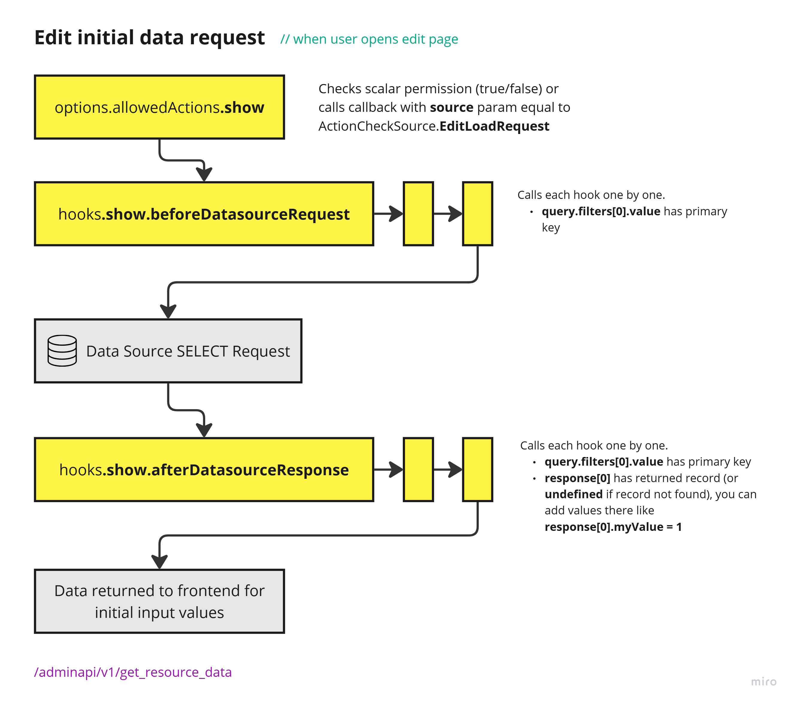
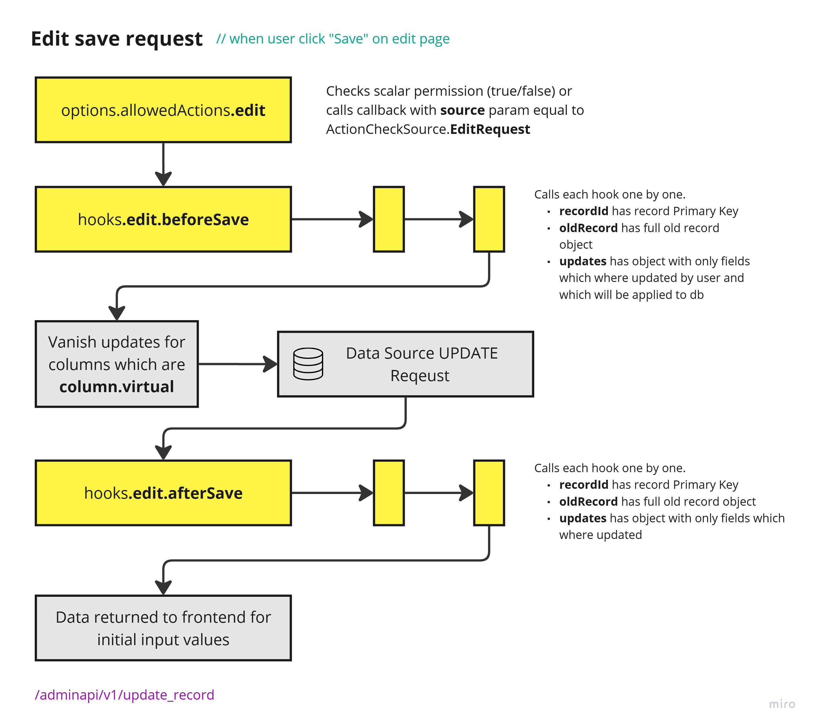
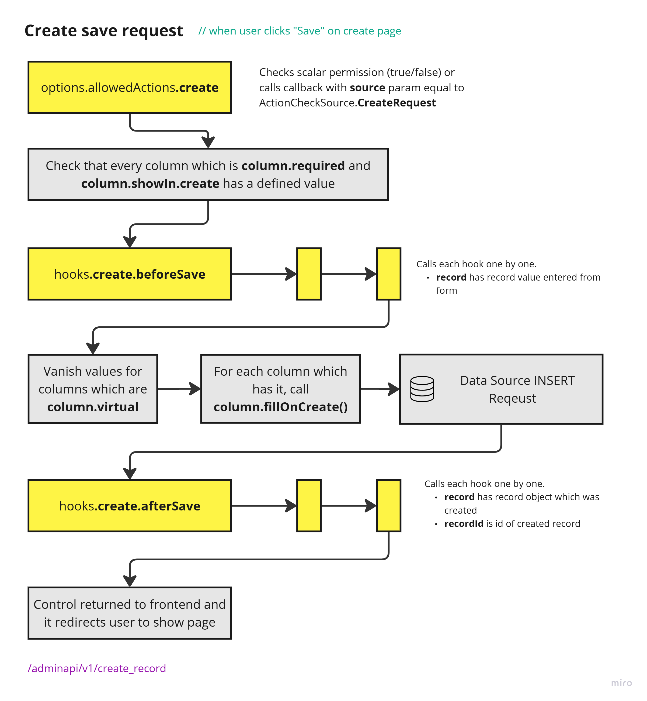
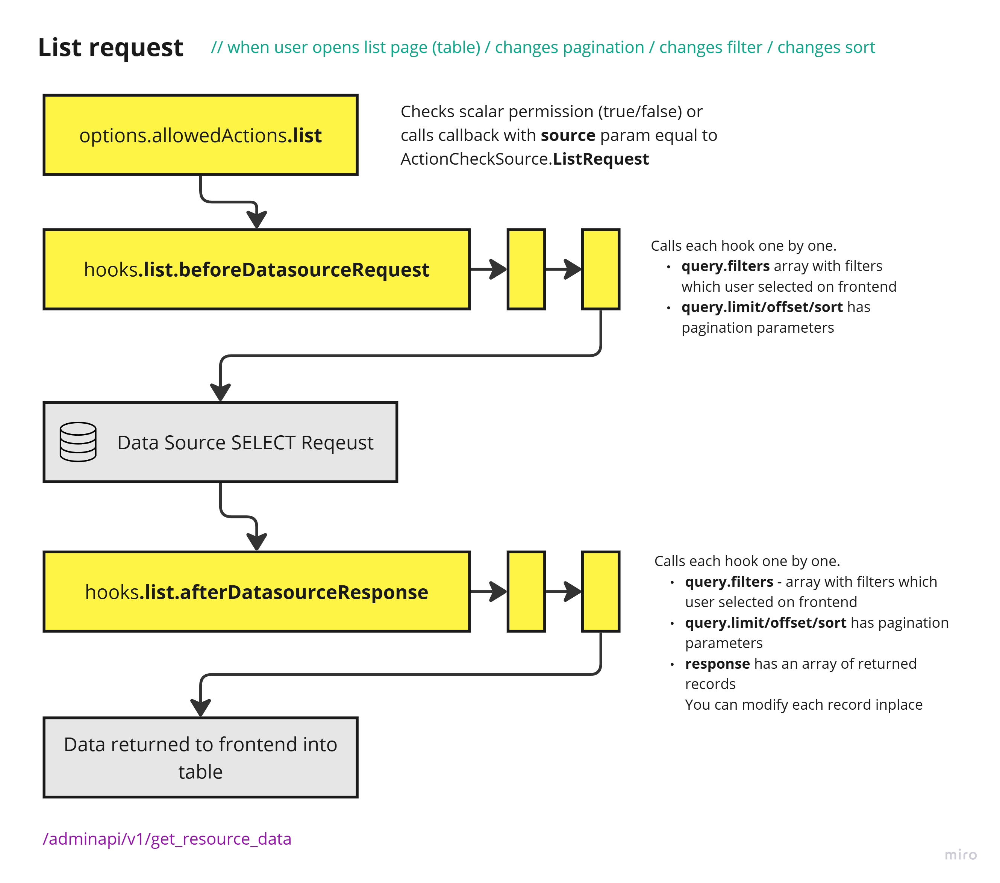
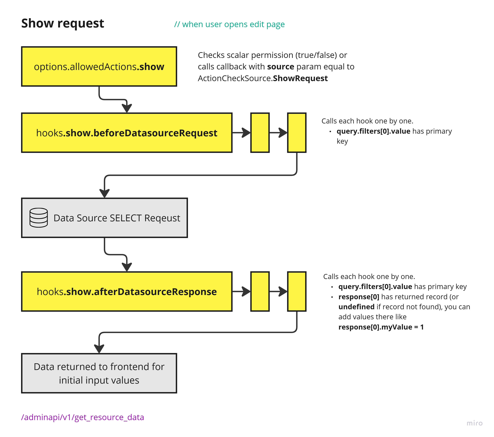

# Hooks

Hooks are used to:

- modify the data before it is saved to the database on create or update
- execute something after data were saved or deleted
- change the query before fetching items from the database
- modify the fetched data before it is displayed in the list and show
- prevent the request to db depending on some condition (Better use [allowedActions](./05-limitingAccess.md) for this)

Every hook is executed when AdminForth frontend (Vue SPA) makes some internal API HTTP request to the backend. Every hook function is always executed only on backend side (Node.js) from the HTTP request handler and allows you to perform some actions before or after the actual request to datasource (database) is made. This is most flexible way to control flow and extend it with custom logic.


Every hook must return one of two objects:
1) If everything is fine and request flow should be continued hook should return `{ ok: true }`
2) If for some reason you need to interrupt request flow in hook you should return `{ ok: false, error: 'some error message for user' }`. This is
handy for access-related tasks, though most of such tasks should be solved with [allowedActions](./05-limitingAccess.md) and not hooks.

Every hook is array of async functions, so you can have multiple hooks for one event. 
For simplicity of course you can specify hook as scalar async function and not as array, but internally it will be anyway converted to array with single element just after app start. Plugins can push new own hooks in front of yours (using `unshift`) or after yours (using `push`). For example audit log plugin adds hooks for registration of all changes in the database.

Here we will consider possible flows one by one


### Performance notice

Every hook function is async, so you can use `await` inside it to perform some async operations like fetching data from another service or database, but please remember that while hook will not finish its execution, the request flow will be waiting for it. So every delay awaited in hook will delay the whole request. That is why we encourage you to use parallel async operations in hooks (like Promise.all) to make them faster. 

If multiple hooks are defined (e.g. plugin might add own hook to `list.beforeDatasourceRequest` after you will already add one in your config), then hooks will be executed one by one, and can't be parallelized. This ensures that different hooks will not interfere with each other, but also means that if you have bootleneck in one hook, all other hooks will wait for it and whole request will be slower. 


## Initial data for edit page flow

When user opens edit page, AdminForth makes a request to the backend to get the initial data for the form.



Practically you can use `show.afterDatasourceResponse` to modify or add some data before it is displayed on the edit page. 

For example [upload plugin](/docs/tutorial/Plugins/05-0-upload/) uses this hook to generate signed preview URL so user can see existing uploaded file preview  in form, and at the same time database stores only original file path which might be not accessible without presigned URL.

## Saving data on edit page

When user clicks the "Save" button on edit page, AdminForth makes a request to the backend to save the data.



Practically you can use `edit.beforeSave` hook to modify the data or populate new fields before it is saved to the database.

> 👆 Note: according to diagram you should understand that interrupting flow from `edit.afterSave` does not prevent data modification in DB

## Saving data on create page

When user clicks the "Save" button from create page, AdminForth makes a request to the backend to create new record.



### Example: modify the created object before it is saved to the database

Let's add reference to `adminUser` when user creates a new apartment:

```ts title='./resources/apartments.ts'
// diff-add
import type { AdminUser } from  'adminforth';

{
  ...
  resourceId: 'aparts',
  columns: [
    ...
    {
      name: 'realtor_id',
      ...
//diff-add
      showIn: { // don't even show this field in create
//diff-add
        create: false,
//diff-add
        filter: false,
//diff-add
      },
      ...
    },
    ...
  ],
  ...
//diff-add
  hooks: {
//diff-add
    create: {
//diff-add
      beforeSave: async ({ adminUser, record }: { adminUser: AdminUser, record: any }) => {
//diff-add
        record.realtor_id = adminUser.dbUser.id;
//diff-add
        return { ok: true };
//diff-add
      }
//diff-add
    }
//diff-add
  }
}
```

In this way user who creates the apartment will be assigned as a realtor. Also user can't set other realtor then himself, even if he will make request using curl/devtools because hook will override the value.

## List page flow

When user opens the list page, AdminForth makes a request to the backend to get the list of items.



### Example: limit access in list to user-related records

For example we can prevent the user to see Apartments created by other users. Superadmin user still can see all:

```ts title='./resources/apartments.ts'
{
  ...
  hooks: {
    list: {
      beforeDatasourceRequest: async ({
        query, adminUser, resource,
      }: {
        query: any; adminUser: AdminUser; resource: AdminForthResource;
      }) => {
        if (adminUser.dbUser.role === "superadmin") {
          return { ok: true };
        }

        // this function will skip existing realtor_id filter if it supplied already from UI or previous hook, and will add new one for realtor_id
        query.filterTools.replaceOrAddTopFilter(Filters.EQ('realtor_id', adminUser.dbUser.id))
       
        return { ok: true };
      },
    },
  },
}
```

This hook will prevent the user to see Apartments created by other users in list, however if user will be able to discover
the apartment id, he will be able to use show page to see the apartment details, that is why separate limiting for show page is required as well. Below we will discover how to limit access to show page.

### Modify record after it is returned from database

You can also change resource data after it was loaded.

For example, you can change the way columns value is displayed by changing the value itself:

```ts title='./resources/apartments.ts'
{
  ...
  hooks: {
    list: {
//diff-add
      afterDatasourceResponse: async ({ response }: { response: any }) => {
//diff-add
        response.forEach((r: any) => {
//diff-add
          r.price = `$${r.price}`;
//diff-add
        });
//diff-add
        return { ok: true, error: "" };
//diff-add
      },
    },
  },
}
```

### Dropdown list of foreignResource

By default if there is `foreignResource` like we use for demo on `realtor_id` column, the filter will suggest a
select dropdown with list of all Realtors. 

This might bring us a leak where explorer will get id's of other users in the system which might be not desired 

Let's limit it:

```ts title='./resources/apartments.ts'
{
  ...

  foreignResource: { 
    
    ...

    hooks: {
      dropdownList: {
        beforeDatasourceRequest: async ({ adminUser, query }: { adminUser: AdminUser, query: any }) => {
          if (adminUser.dbUser.role !== "superadmin") {
            query.filtersTools.replaceOrAddTopFilter(Filters.EQ("id", adminUser.dbUser.id));
          };
          return {
            "ok": true,
          };
        }
      },
    },
  }
}
```

> ☝️☝️☝️ This hooks should be written only inside column. If you'll add it in resource hooks - it won't work

In our case we limit the dropdown list to show only the current user, however you can use same sample to list only objects who are related to the current user in case if you will have relation configurations which require to show related objects which belongs to the current user.

Flow diagram for dropdown list:


## Show page flow

When user opens the show page, AdminForth makes a request to the backend to get the item. This request ia absolutely the same as one for edit initial data, because naturally for most of cases data for show page are the same as initial data for edit page.

However if you still need to distinguish between these two cases you can use `query.source` parameter in hook (we do not mentioned it in diagram for simplicity and rare demand).

Here is show request flow:




### Example show limiting:

```ts title='./resources/apartments.ts'
{
  ...
  hooks: {
    show: {
      afterDatasourceResponse: async ({
        adminUser, response,
      }: {
        adminUser: AdminUser; response: any;
      }) => {
        if (adminUser.dbUser.role === "superadmin") {
          return { ok: true, response };
        }
        if (response[0].realtor_id.pk !== adminUser.dbUser.id) {
          return { ok: false, error: "You are not allowed to see this record" };
        }
        return { ok: true, response };
      }
    }
  }
}
```

> 👆 Please note that we use `response[0].realtor_id.pk` because this field has `foreignResource` in column option is set
> Otherwise you would use  just `response[0].realtor_id`

Important notice: Using hook to filter out list of items for list page or list of items for dropdown makes a lot of sense because gives ability to change filter of database request. However using hook for show page is not reasonable:

First of all it semantically better aligns with using `allowedActions` interface. For this particular case you must use [allowedActions.show](./05-limitingAccess.md#disable-showing-the-resource-based-on-owner)

Secondly limiting access from this hook will not prevent executing other hooks (e.g. `beforeDatasourceRequest`), when allowedActions check
always performed before any hooks and any database requests. 

## All hooks

Check all hooks in the [API reference](/docs/api/Back/interfaces/AdminForthResource).