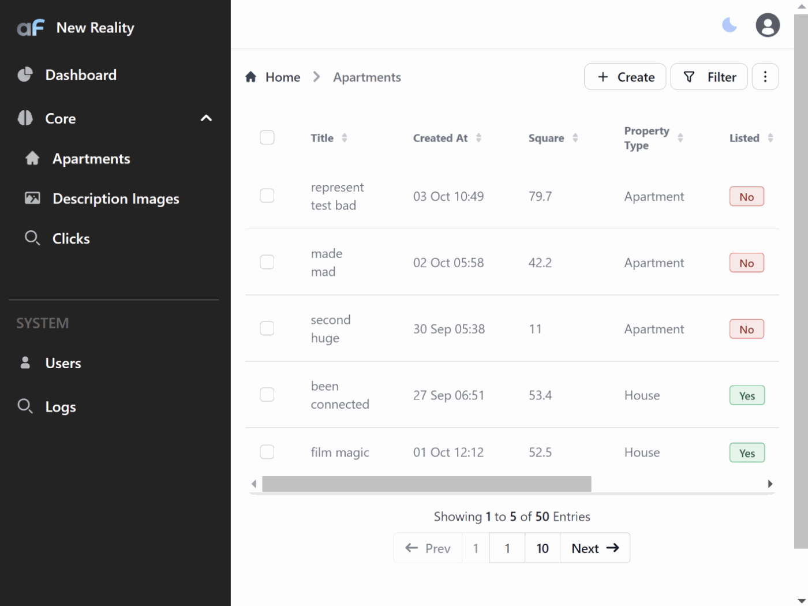

# Custom pages

Most Admin Panels should have some Dashboards or custom pages. 

In AdminForth creation of custom page is very simple.


Create a Vue component in the `custom` directory of your project, e.g. `Dashboard.vue`:

```html title="./custom/Dashboard.vue"
<template>
  <div class="px-4 py-4 bg-blue-50 dark:bg-gray-900 dark:shadow-none min-h-screen">
  
    <div class="grid grid-cols-1 md:grid-cols-2 lg:grid-cols-3 xl:grid-cols-4 gap-4">
      <div class="max-w-md w-full bg-white rounded-lg shadow dark:bg-gray-800 p-4 md:p-5" v-if="data">
        <div>
          <h5 class="leading-none text-3xl font-bold text-gray-900 dark:text-white pb-2">{{ data.totalAparts }}</h5>
          <p class="text-base font-normal text-gray-500 dark:text-gray-400">{{  $t('Apartment last 7 days | Apartments last 7 days', data.totalAparts) }}</p>
        </div>
        <BarChart
          :data="apartsCountsByDaysChart"
          :series="[{
            name: $t('Added apartments'),
            fieldName: 'count',
            color: COLORS[0],
          }]"
          :options="{
            chart: {
              height: 130,
            },
            yaxis: {
              stepSize: 1,
              labels: { show: false },
            },
            grid: {
              show: false,
            }
          }"
        />
      </div>

      <div class="max-w-md w-full bg-white rounded-lg shadow dark:bg-gray-800 p-4 md:p-5" v-if="data">
        <p class="text-base font-normal text-gray-500 dark:text-gray-400">{{ $t('Top countries') }}</p>
        <PieChart
          :data="topCountries"
          :options="{
            chart: { type: 'pie'},
            legend: {
              show: false,
            },
            dataLabels: {
              enabled: true,
              formatter: function (value, o) {
                const countryISO = o.w.config.labels[o.seriesIndex];
                return countryISO;
              }
            },
          }"
        />
      </div>

      <div class="w-full bg-white rounded-lg shadow dark:bg-gray-800 p-4 md:p-5 lg:row-span-2 xl:col-span-2" v-if="data">
        <div class="grid grid-cols-2 py-3">
          <dl>
            <dt class="text-base font-normal text-gray-500 dark:text-gray-400 pb-1">{{ $t('Listed price') }}</dt>
            <dd class="leading-none text-xl font-bold dark:text-green-400" :style="{color:COLORS[0]}">{{
              new Intl.NumberFormat('en-US', { style: 'currency', currency: 'USD', maximumFractionDigits: 0, }).format(
                data.totalListedPrice,
              ) }}
            </dd>
          </dl>
          <dl>
            <dt class="text-base font-normal text-gray-500 dark:text-gray-400 pb-1">{{ $t('Unlisted price') }}</dt>
            <dd class="leading-none text-xl font-bold dark:text-red-500" :style="{color:COLORS[1]}">{{
              new Intl.NumberFormat('en-US', { style: 'currency', currency: 'USD', maximumFractionDigits: 0, }).format(
                data.totalUnlistedPrice,
              ) }}
            </dd>
          </dl>
        </div>

        <BarChart
          :data="listedVsUnlistedCountByDays"
          :series="[{
            name: $t('Listed Count'),
            fieldName: 'listed',
            color: COLORS[0],
          },
          {
            name: $t('Unlisted Count'),
            fieldName: 'unlisted',
            color: COLORS[1],
          }]"
          :options="{
            chart: {
              height: 500,
            },
            xaxis: {
              labels: { show: true },
              stepSize: 1,  // since count is integer, otherwise axis will be float
            },
            yaxis: {
              labels: { show: true }
            },
            grid: {
              show: true,
            },
            plotOptions: {
              bar: { 
                horizontal: true, // by default bars are vertical
              }
            },
          }"
        />

      </div>

      <div class="max-w-md w-full bg-white rounded-lg shadow dark:bg-gray-800 p-4 md:p-5" v-if="data">
        <p class="text-base font-normal text-gray-500 dark:text-gray-400">{{  $t('Apartment by rooms') }}</p>
        <PieChart
          :data="apartsCountsByRooms"
          :options="{
            chart: { type: 'donut'},
            plotOptions: {
              pie: {
                donut: {
                  labels: {
                    total: {
                      show: true,
                      label: $t('Total square'),
                      formatter: () => `${data.totalSquareMeters.toFixed(0)} m²`,
                    },
                  },
                },
              },
            },
          }"
        />
      </div>

      <div class="max-w-md w-full bg-white rounded-lg shadow dark:bg-gray-800 p-4 md:p-5" v-if="data">
        <p class="text-base font-normal text-gray-500 dark:text-gray-400">{{ $t('Unlisted vs Listed price' ) }}</p>

        <AreaChart 
          :data="listedVsUnlistedPriceByDays"
          :series="[{
            name: $t('Listed'),
            fieldName: 'listedPrice',
            color: COLORS[0],
          },
          {
            name: $t('Unlisted'),
            fieldName: 'unlistedPrice',
            color: COLORS[1],
          }]"
          :options="{
            chart: {
              height: 250,
            },
            yaxis: {
              labels: {
                formatter: function (value) {
                  return '$' + value;
                }
              }
            },
          }"
        />
      </div>

    </div>
  </div>
</template>

<script setup lang="ts">
import { ref, type Ref, onMounted, computed } from 'vue';
import dayjs from 'dayjs';
import { callApi } from '@/utils';
import { useI18n } from 'vue-i18n';
import adminforth from '@/adminforth';
import { AreaChart, BarChart, PieChart } from '@/afcl';

const data: Ref<{listedVsUnlistedPriceByDays: any, listedVsUnlistedByDays: any, 
  apartsByDays: any, apartsCountsByRooms: any, topCountries: any, totalAparts: any} | null> = ref(null);

const { t } = useI18n();

const COLORS = ["#4E79A7", "#F28E2B", "#E15759", "#76B7B2", "#59A14F"]

const apartsCountsByDaysChart = computed(() => {
  return data.value.apartsByDays?.reverse().map(
    (item) => ({
      x: dayjs(item.day).format('DD MMM'),
      count: item.count
    })
  );
});

const listedVsUnlistedPriceByDays = computed(() => {
  return data.value.listedVsUnlistedPriceByDays?.map(
    (item) => ({
      x: dayjs(item.day).format('DD MMM'),
      listedPrice: item.listedPrice.toFixed(2),
      unlistedPrice: item.unlistedPrice.toFixed(2),
    })
  );
});

const listedVsUnlistedCountByDays = computed(() => {
  return data.value.listedVsUnlistedByDays?.map(
    (item) => ({
      x: dayjs(item.day).format('DD MMM'),
      listed: item.listed,
      unlisted: item.unlisted,
    })
  );
});

const apartsCountsByRooms = computed(() => {
  return data.value.apartsCountsByRooms?.map(
    (item, i) => ({
      label: t(`{number_of_rooms} rooms`, { number_of_rooms: item.number_of_rooms }),
      amount: item.count,
      color: COLORS[i],
    })
  );
});

const topCountries = computed(() => {
  return data.value.topCountries?.map(
    (item, i) => ({
      label: item.country,
      amount: item.count,
      color: COLORS[i],
    })
  );
});

onMounted(async () => {
  // Fetch data from the API
  try {
    data.value = await callApi({path: '/api/dashboard/', method: 'GET'});
  } catch (error) {
    adminforth.alert({
      message: t(`Error fetching data: {message}`, { message: error.message }),
      variant: 'danger',
    });
  }
})
</script>
```

> ☝️ use https://flowbite.com/ to get pre-designed tailwind design blocks for your pages

Now let's add this page to the AdminForth menu and make it homepage instead of Apartments page:

```ts title="/index.ts"
menu: [
//diff-add
    {
//diff-add
      label: 'Dashboard',
//diff-add
      path: '/overview',
//diff-add
      homepage: true,
//diff-add
      icon: 'flowbite:chart-pie-solid',
//diff-add
      component: '@@/Dashboard.vue',
//diff-add
    },
    {
      label: 'Core',
      icon: 'flowbite:brain-solid',
      open: true,
      children: [
        {
//diff-remove
          homepage: true,  
          label: 'Apartments',
          icon: 'flowbite:home-solid',
          resourceId: 'aparts',
        },
      ]
    },
```


> ☝️ To find icon go to https://icon-sets.iconify.design/flowbite/?query=chart, click on icon you like and copy name:


You might notice that in mounted hook page fetches custom endpoint '/api/dashboard-stats'. 
Now we have to define this endpoint in the backend to make our page work:


## Defining custom API for own page and components


Open `index.ts` file and add the following code *BEFORE* `admin.express.serve(` !

```ts title="/index.ts"

import type { IAdminUserExpressRequest } from 'adminforth';
import express from 'express';

....

app.get(`${ADMIN_BASE_URL}/api/dashboard/`,
  admin.express.authorize(
    async (req:IAdminUserExpressRequest, res: express.Response) => {
      const days = req.body.days || 7;
      const apartsByDays = admin.resource('aparts').dataConnector.client.prepare(
        `SELECT 
          strftime('%Y-%m-%d', created_at) as day, 
          COUNT(*) as count 
        FROM apartments 
        GROUP BY day 
        ORDER BY day DESC
        LIMIT ?;
        `
      ).all(days);

      const totalAparts = apartsByDays.reduce((acc: number, { count }: { count:number }) => acc + count, 0);

      // add listed, unlisted, listedPrice, unlistedPrice
      const listedVsUnlistedByDays = admin.resource('aparts').dataConnector.client.prepare(
        `SELECT 
          strftime('%Y-%m-%d', created_at) as day, 
          SUM(listed) as listed, 
          COUNT(*) - SUM(listed) as unlisted,
          SUM(listed * price) as listedPrice,
          SUM((1 - listed) * price) as unlistedPrice
        FROM apartments
        GROUP BY day
        ORDER BY day DESC
        LIMIT ?;
        `
      ).all(days);

      const apartsCountsByRooms = await admin.resource('aparts').dataConnector.client.prepare(
        `SELECT 
          number_of_rooms, 
          COUNT(*) as count 
        FROM apartments 
        GROUP BY number_of_rooms 
        ORDER BY number_of_rooms;
        `
      ).all();

      const topCountries = await admin.resource('aparts').dataConnector.client.prepare(
        `SELECT 
          country, 
          COUNT(*) as count 
        FROM apartments 
        GROUP BY country 
        ORDER BY count DESC
        LIMIT 4;
        `
      ).all();

      const totalSquare = admin.resource('aparts').dataConnector.client.prepare(
        `SELECT 
          SUM(square_meter) as totalSquare 
        FROM apartments;
        `
      ).get();

      const listedVsUnlistedPriceByDays = admin.resource('aparts').dataConnector.client.prepare(
        `SELECT 
          strftime('%Y-%m-%d', created_at) as day, 
          SUM(listed * price) as listedPrice,
          SUM((1 - listed) * price) as unlistedPrice
        FROM apartments
        GROUP BY day
        ORDER BY day DESC
        LIMIT ?;
        `
      ).all(days);
        
      const totalListedPrice = Math.round(listedVsUnlistedByDays.reduce((
        acc: number, { listedPrice }: { listedPrice:number }
      ) => acc + listedPrice, 0));
      const totalUnlistedPrice = Math.round(listedVsUnlistedByDays.reduce((
        acc: number, { unlistedPrice }: { unlistedPrice:number } 
      ) => acc + unlistedPrice, 0));

      res.json({ 
        apartsByDays,
        totalAparts,
        listedVsUnlistedByDays,
        apartsCountsByRooms,
        topCountries,
        totalSquareMeters: totalSquare.totalSquare,
        totalListedPrice,
        totalUnlistedPrice,
        listedVsUnlistedPriceByDays,
      });
    }
  )
);

// serve after you added all api
admin.express.serve(app)
admin.discoverDatabases();

```


> ☝️ Please note that we are using `admin.express.authorize` middleware to check if the user is logged in. If you want to make this endpoint public, you can remove this middleware. If user is not logged in, the request will return 401 Unauthorized status code, and protect our statistics from leak.

> ☝️ Moreover if you wrap your endpoint with `admin.express.authorize` middleware, you can access `req.adminUser` object in your endpoint to get the current user information.

> ☝️ AdminForth does not provide any facility to access data in database. You are free to use any ORM like Prisma, TypeORM, Sequelize,
mongoose, or just use raw SQL queries against your tables.


Demo:



## Custom pages without menu item

Sometimes you might need to add custom page but don't want to add it to the menu.

In this case you can add custom page using `customization.customPages` option:

```ts title="/index.ts"
new AdminForth({
  // ...
  customization: {
    customPages: [
      {
        path: '/setup2fa', // route path
        component: { 
          file: '@@/pages/TwoFactorsSetup.vue',
          meta: { 
            title: 'Setup 2FA',  // meta title for this page
            customLayout: true  // don't include default layout like menu/header
          }
        }
      }
    ]
  }
})
```

This will register custom page with path `/setup2fa` and will not include it in the menu. 

You can navigate user to this page using any router link, e.g.:

```html
<template>
  <Link to="/setup2fa">Setup 2FA</Link>
</template>
```

Add to your `<script setup>` section:

```ts
import { Link } from '@/afcl';
```

If you set `customLayout: true` in the `meta` object, it will not include default layout like sidebar and header, so you can create your own layout for this page. 

### Disable redirects to login page (Public pages)

Any route which has sidebar and header (e.g. default CRUD pages or menu item with `component`) uses internal AdminForth REST API to fetch menu items and user information, so it passes authentication check and if authentication cookie is not provided or has expired JWT user gets redirected to the login page.

In case if you set `customLayout: true`, it will not call these APIs so user will not be automatically redirected to the login page in case of expired or not-provided authentication cookie. That feature allows you to implement public pages without authentication, e.g. Terms of Service, Privacy Policy and many others. In case if you need to check if user is logged in just call any custom API which has `admin.express.authorize` middleware. Obviously for public pages if they use any APIs you should create API endpoint WITHOUT `admin.express.authorize` middleware.

> Please note that AdminForth uses classic SPA Vue app, so even public pages will be rendered by JavaScript in the browser and not on the server side. If your public page should be indexed by search engines, you should use some SSR framework like Nuxt.js to create such pages. At the same time public pages can still be usefull if you don't focus on old-fashioned search engines (modern search engines can index SPA pages as well) or if indexing is not important for such pages at all (e.g. Terms of Service, Privacy Policy, Contact Us and many others).

### Passing meta attributes to the page


You can add custom meta attributes to the page by passing `meta` object to the page:


```ts title="/index.ts"

    customPages: [
      {
        path: '/setup2fa', // route path
        component: { 
          file: '@@/pages/TwoFactorsSetup.vue',
          meta: { 
            title: 'Setup 2FA',  // meta title for this page
            customLayout: true,  // don't include default layout like menu/header
    //diff-add
            myAttribute: 'a1'
          }
        }
      }
    ]
```

To access passed meta attributes in your page, you can use `useRoute` hook:

```ts
import { useRoute } from 'vue-router';

const route = useRoute();

console.log(route.meta.myAttribute);  // a1
```

## Settings View 

If you want to add a Settings section to your project:

```ts title='./index.ts' 
export const admin = new AdminForth({
  baseUrl : ADMIN_BASE_URL,
  auth: {
    //diff-add
    userMenuSettingsPages: [
      //diff-add
      {
        //diff-add
        pageLabel: 'Profile settings',
        //diff-add
        component: '@@/ProfileSettings.vue',
        //diff-add
        // Specify a slug if you want a custom URL path.
        //diff-add
        // For example, without a slug, the URL will be:
        //diff-add
        //   example.com/settings/profile-settings
        //diff-add
        // With a custom slug, you could have:
        //diff-add
        //   example.com/settings/users-settings
        //diff-add
        slug: "users-settings",
        //diff-add
        icon:"flowbite:user-solid"
        //diff-add
      },
      //diff-add
      {
        //diff-add
        pageLabel: 'Security',
        //diff-add
        component: "@@/MySecrets.vue",
        //diff-add
        icon: "flowbite:lock-solid"
        //diff-add
      }
      //diff-add
    ],
  }
});
```

After this, you will have a custom Settings section in the users menu:


