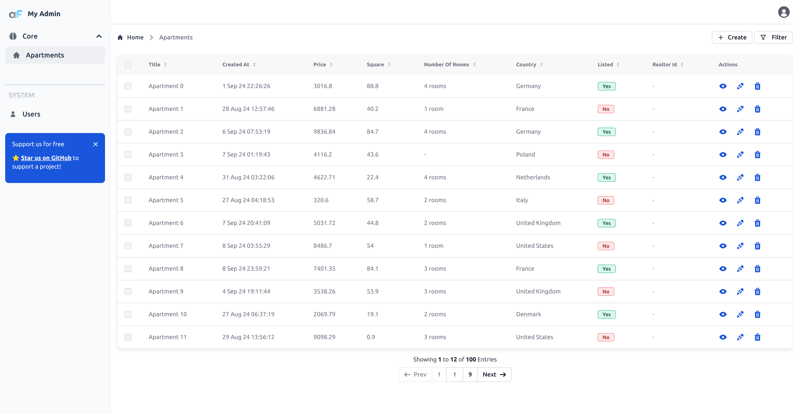

# Alerts and confirmations

When you are writing custom components or pages you might need to show alerts or confirmations to the user.

For example if fetch to the API fails you might want to show an error message to the user.

AdminForth has very simple [frontend API](/docs/api/FrontendAPI/interfaces/FrontendAPIInterface) for this.

To see an example of alerts, you can call them yourself.

Create a Vue component in the custom directory of your project, e.g. Alerts.vue:

```html title="./custom/Alerts.vue"
<template>
    <div class="ml-3 mt-16">
        <button @click="callAlert($t('Example success alert'))" class="focus:outline-none text-white bg-green-700 hover:bg-green-800 focus:ring-4 focus:ring-green-300 font-medium rounded-lg text-sm px-5 py-2.5 me-2 mb-2 dark:bg-green-600 dark:hover:bg-green-700 dark:focus:ring-green-800">{{$t('Call alert')}}</button>
        <button @click="callConfirmation" class="focus:outline-none text-white bg-red-700 hover:bg-red-800 focus:ring-4 focus:ring-red-300 font-medium rounded-lg text-sm px-5 py-2.5 me-2 mb-2 dark:bg-red-600 dark:hover:bg-red-700 dark:focus:ring-red-900">{{$t('Confirmation')}}</button>
        <button @click="callAlert($t('Example danger alert'),'warning')" class="focus:outline-none text-white bg-orange-500 hover:bg-orange-400 focus:ring-4 focus:ring-orange-100 font-medium rounded-lg text-sm px-5 py-2.5 me-2 mb-2 dark:bg-orange-600 dark:hover:bg-orange-700 dark:focus:ring-orange-900">{{$t('Danger alert')}}</button>
    </div>
</template>
<script setup>
import adminforth from '@/adminforth';
import { useI18n } from 'vue-i18n';
const { t } = useI18n();

function callAlert(message,variant='success'){
    adminforth.alert({message: message, variant: variant})
};
async function callConfirmation(){
    const isConfirmed = await adminforth.confirm({message: t('Are you sure?'), yes: t('Yes'), no: t('No')})
}
</script>
```

Now let's add this page to the AdminForth menu:

```html title="/index.ts"
menu: [
//diff-add
{
//diff-add
    label: 'Alerts',
//diff-add
    icon: 'flowbite:bell-active-alt-solid',
//diff-add
    component: '@@/Alerts.vue',
//diff-add
    path: '/alerts'
//diff-add
}
```
Here is how alert looks:


And here is how confirmation looks:


## Announcement


You can notify users of important information by displaying an announcement badge in side bar:

```ts title="/index.ts"

  customization: {
//diff-add
    announcementBadge: (adminUser: AdminUser) => {
//diff-add
      return { 
//diff-add
        html: '⭐ <a href="https://github.com/devforth/adminforth" style="font-weight: bold; text-decoration: underline" target="_blank">Star us on GitHub</a> to support a project!',
//diff-add
        closable: true,
//diff-add
        title: 'Support us for free',
//diff-add
      }
//diff-add
    }
  },
```

Here's what the announcement will look like:
