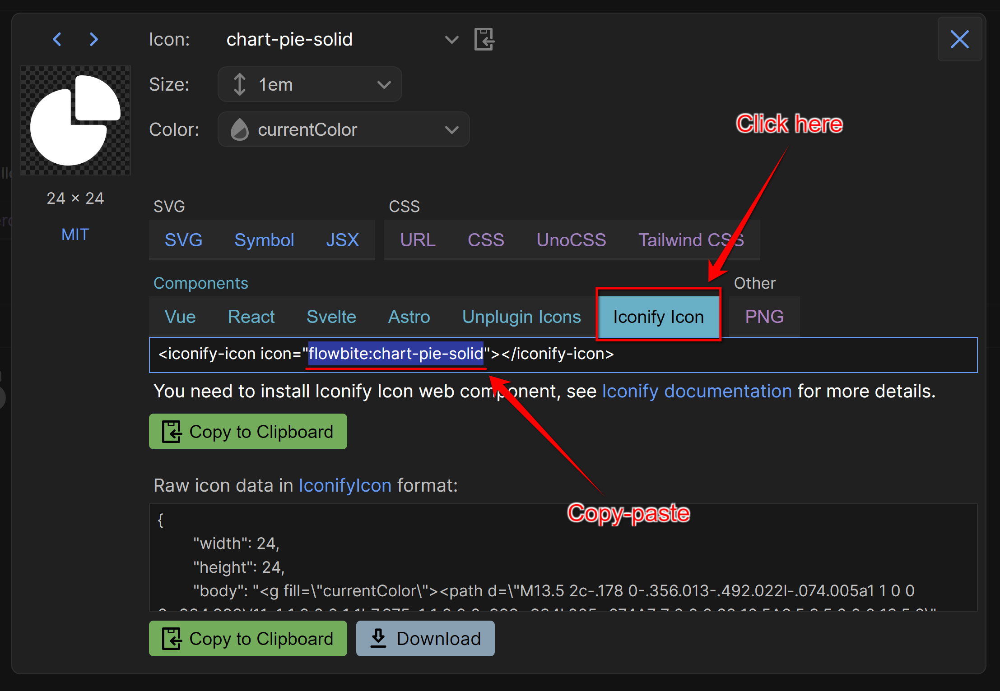

# Menu Configuration


## Icons

Adminforth uses [Iconify](https://iconify.design/) icons everywhere, including the menu. 

You can set an icon for each menu item using the `icon` field.

You can use any icon from the [Iconify Gallery](https://icon-sets.iconify.design/) in the format `<setname>:<icon>`. For example, `flowbite:brain-solid`.



> 👋 With deep respect to Alex Kozack who created great [iconify-prerendered](https://github.com/cawa-93/iconify-prerendered) MIT package used by AdminForth. It uses a scheduled job to prerender all icons from Iconify to icons font and then publish them to npm

## Grouping 

You can created a group of menu items with open or close:

E.g. create group "Blog" with Items who link to resource "posts" and "categories":
  
```ts title='./index.ts'
  {
    ...
    menu: {
      items: [
        {
          label: 'Blog',
          icon: 'flowbite:brain-solid',
          open: true,
          children: [
            {
              label: 'Posts',
              icon: 'flowbite:book-open-outline',
              resourceId: 'posts',
            },
            {
              label: 'Categories',
              icon: 'flowbite:folder-duplicate-outline',
              resourceId: 'categories',
            },
          ],
        },
      ],
    },
    ...
  }
```

If it is rare Group you can make it `open: false` so it would not take extra space in menu, but admin users will be able to open it by clicking on the group name.

## Gap

You can put one or several gaps between menu items:

```ts title='./index.ts'
{
  ...
  menu: {
    items: [
      {
        label: 'Posts',
        icon: 'flowbite:book-open-outline',
        resourceId: 'posts',
      },
      {
        type: 'gap',
      },
      {
        type: 'gap',
      },
      {
        label: 'Categories',
        icon: 'flowbite:folder-duplicate-outline',
        resourceId: 'categories',
      },
  },
  ...
}
```

## Divider

To split menu items with a line you can use a divider:

```ts title='./index.ts'
{
  ...
  menu: {
    items: [
      {
        label: 'Posts',
        icon: 'flowbite:book-open-outline',
        resourceId: 'posts',
      },
      {
        type: 'divider',
      },
      {
        label: 'Categories',
        icon: 'flowbite:folder-duplicate-outline',
        resourceId: 'categories',
      },
  },
  ...
}
```


## Heading

You can add a heading to the menu:

```ts title='./index.ts'
{
  ...
  menu: {
    items: [
      {
        type: 'heading',
        label: 'Editings',
      },
      {
        label: 'Posts',
        icon: 'flowbite:book-open-outline',
        resourceId: 'posts',
      },
      {
        label: 'Categories',
        icon: 'flowbite:folder-duplicate-outline',
        resourceId: 'categories',
      },
  },
  ...
}
```


## Badge

You can add a badge near the menu item title (e.g. to get coubnt of unread messages). To do this, you need to add a `badge` field to the menu item configuration:

```ts title='./index.ts'
{
  ...
  menu: {
    items: [
      {
        badge:  (adminUser: AdminUser) => {
          return 10
        },
        ...,
      },
    ],
  },
  ...
}
```