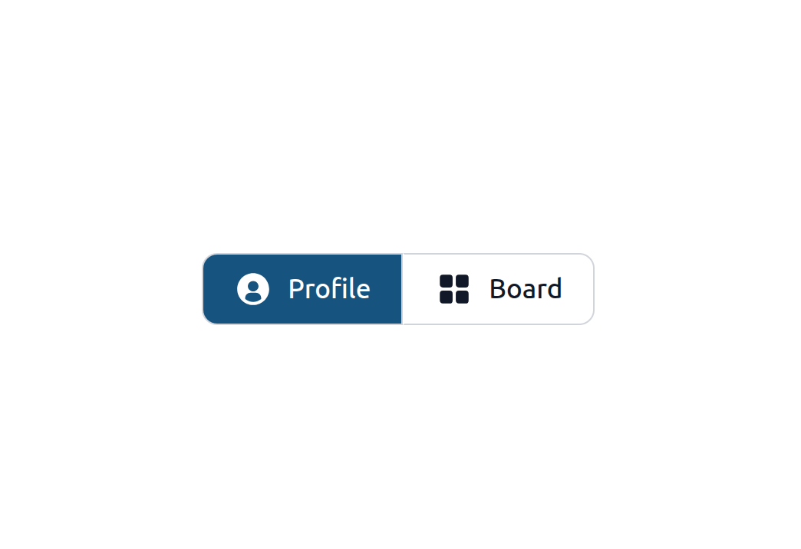
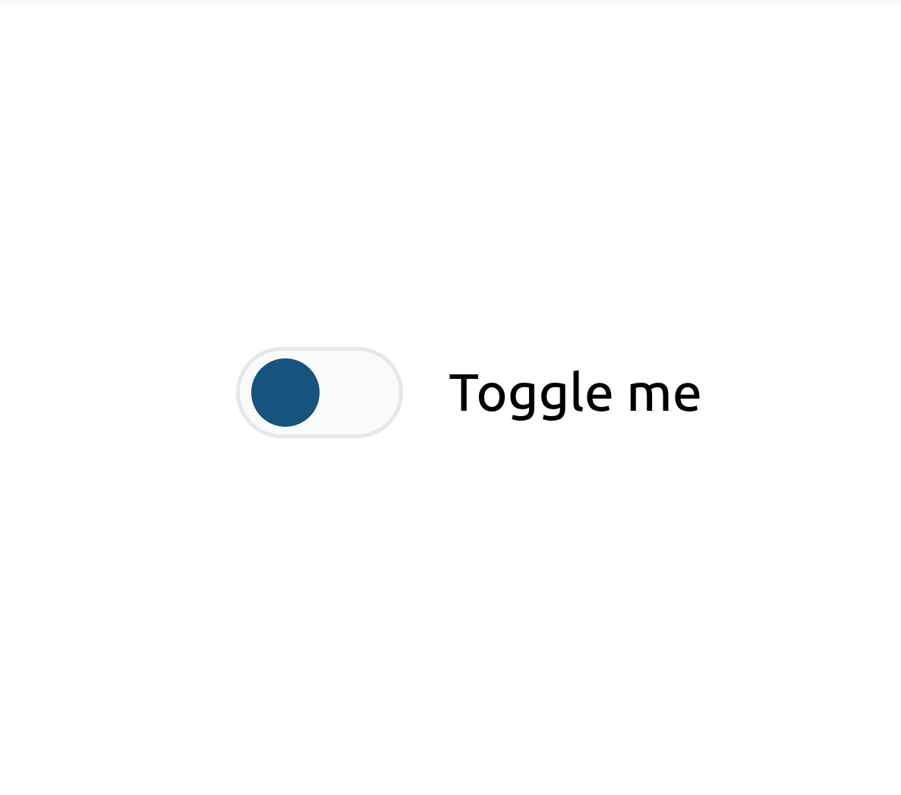
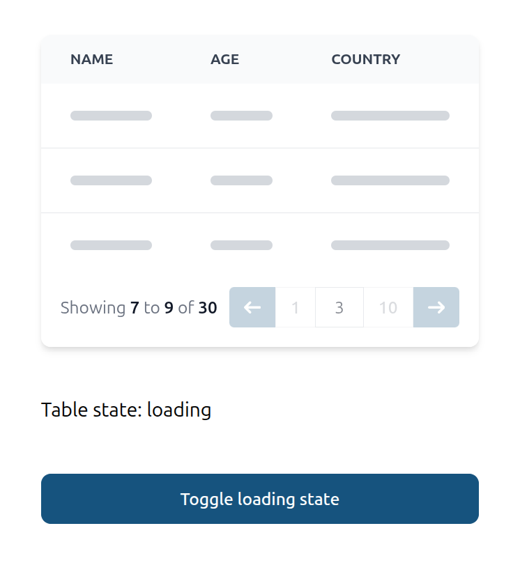
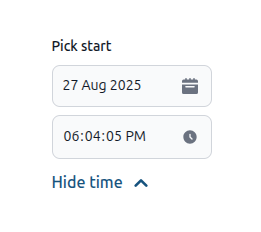

# AdminForth Components Library

AFCL is a set of components which you can use as build blocks in your AdminForth application. 
AFCL allows to keep the design consistent with minimal efforts and build new pages faster.
AFCL components follow styling standard and respect theme colors.

Components set is always growing, so you can expect new components to be added in the future.

## Button


<div class="split-screen" >
  <div >
```js
import { Button } from '@/afcl'
```

```html
<Button @click="doSmth" 
    :loader="false" class="w-full">
  Your button text
</Button>

<Button @click="doSmth" 
    :loader="true" class="w-full mt-4">
  Your button text
</Button>
```
</div>
<div>

</div>
</div>


loader prop would show loader when it's true.

## Button Group
### With active button
<div class="split-screen" >

```ts
import { IconGridSolid, IconUserCircleSolid } from '@iconify-prerendered/vue-flowbite';
import { ButtonGroup } from '@/afcl'

const activeButton = ref('')

    ...

<ButtonGroup v-model="activeButton">  
  <template #button:Profile>
    <div class="flex px-4 py-2">
      <IconUserCircleSolid class="w-5 h-5 me-2"/>
      Profile
    </div>
  </template>
  <template #button:Dashboard>
    <div class="flex px-4 py-2">
      <IconGridSolid class="w-5 h-5 me-2"/>
      Board
    </div>
  </template>
</ButtonGroup>
```



</div>

### With solid color

<div class="split-screen" >

```ts
  import { ButtonGroup } from '@/afcl'
  import { IconPlusOutline, IconCaretDownSolid } from '@iconify-prerendered/vue-flowbite';

    ...

    <ButtonGroup :solidColor="true">
        <template #button:Profile>
            <div class="flex px-4 py-2" @click="console.log("Add passkey got clicked")">
                <IconPlusOutline class="w-5 h-5 me-2"/>
                <p>Add Local Passkey</p>
            </div>
        </template>
        <template #button:Dropdown>
            <div id="dropdown-button" class="flex px-2 py-2" @click="console.log("Dropdown got clicked")">
                <IconCaretDownSolid class="w-5 h-5"/>
            </div>
        </template>
    </ButtonGroup>

```


</div>


## Link


<div class="split-screen" >
  <div >

```js
import { Link } from '@/afcl'
```

```html
<Link to="/login">Go to login</Link>
```
</div>
<div>

</div>
</div>

## LinkButton

Looks like button but works like link. Uses `router-link` under the hood.


<div class="split-screen" >
  <div >
```js
import { LinkButton } from '@/afcl'
```

```html
<LinkButton to="/login">Go to login</LinkButton>
```
</div>
<div>

</div>
</div>

## Select

```js
import { Select } from '@/afcl'


const selected = ref(null)
```

### Single

<div class="split-screen" >
  <div >
```html
<Select
  class="w-full"
  :options="[
    {label: 'Last 7 days', value: '7'}, 
    {label: 'Last 30 days', value: '30'}, 
    {label: 'Last 90 days', value: '90'},
    {label: 'None', value: null}
  ]"
  v-model="selected"
></Select>
```
</div>
<div>

</div>
</div>

### Multiple

<div class="split-screen" >
  <div >

```js
//diff-remove
const selected = ref(null)
//diff-add
const selected = ref([])
```

```html
<Select
  class="w-full"
  :options="[
    {label: 'Last 7 days', value: '7'}, 
    {label: 'Last 30 days', value: '30'}, 
    {label: 'Last 90 days', value: '90'},
    {label: 'None', value: null}
  ]"
  v-model="selected"
//diff-add
  multiple
></Select>
```
  </div>
  <div>
  
  </div>
</div>


### Custom slots for item

You can customize item and selected item using slots.

<div class="split-screen" >
  <div >
```html
<Select
  class="w-full"
  :options="[
    {label: 'Last 7 days', value: '7', records: 110},
    {label: 'Last 30 days', value: '30', records: 320},
    {label: 'Last 90 days', value: '90', records: 310},
    {label: 'None', value: null}
  ]"
  v-model="selected"
>
//diff-add
  <template #item="{option}">
//diff-add
    <div>
//diff-add
      <span>{{ option.label }}</span>
//diff-add
      <span class="ml-2 opacity-50">{{ option.records }} records</span>
//diff-add
    </div>
//diff-add
  </template>
//diff-add
  <template #selected-item="{option}">
//diff-add
    <span>{{ option.label }} 💫</span>
//diff-add
  </template>
</Select>
```
  </div>
  <div>
    
  </div>
</div>


### Extra item

You might need to put some extra item at bottom of list

<div class="split-screen" >
  <div >
```html
<Select
  class="w-full"
  :options="[
    {label: 'Last 7 days', value: '7'}, 
    {label: 'Last 30 days', value: '30'}, 
    {label: 'Last 90 days', value: '90'},
  ]"
  v-model="selected"
>
//diff-add
  <template #extra-item>
//diff-add
    <LinkButton to="/ranges">Manage ranges</LinkButton>
//diff-add
  </template>

</Select>
```
  </div>
  <div>
   
  </div>
</div>

## Input


<div class="split-screen" >
  <div >
```js
import { Input } from '@/afcl'
```

```html
<Input type="number" class="w-full">
  <template #suffix>
    USD
  </template>
</Input>
```

  </div>
  <div>
    
  </div>
</div>


<div class="split-screen" >
  <div >
```js
import { Input } from '@/afcl'
import { IconSearchOutline } from '@iconify-prerendered/vue-flowbite'
```


```html
<Input type="text" class="w-full">
  <template #rightIcon>
    <IconSearchOutline class="w-5 h-5 text-gray-400"/>
  </template>
</Input>
```


  </div>
  <div>
    
  </div>
</div>

## Textarea
<div class="split-screen" >
  <div >
```ts
import { Textarea } from '@/afcl'
```

```ts
    <Textarea
      v-model="textAreaInput"
      placeholder="Enter some text..."
      class="w-64"
    />
```
  </div>
  <div>
    
  </div>
</div>

## Tooltip
  
Wrap an element on which you would like to show a tooltip with the `Tooltip` component and add a `tooltip` slot to it.
  


<div class="split-screen" >
  <div >

```js
import { Tooltip } from '@/afcl'
```

```html
<Tooltip>
    <a :href="`https://google.com?q=adminforth`" target="_blank" >
        <IconCardSearch class="w-5 h-5 me-2"/>
    </a>

    <template #tooltip>
        Search for AdminForth
    </template>
</Tooltip>
```
  </div>
  <div>
    
  </div>
</div>


## VerticalTabs

Wrap each tab lable in tamplate with v-slot value `tab:TAB_ALIAS`. Wrap each tab content in tamplate with v-slot value `TAB_ALIAS`. `TAB_ALIAS` is a unique identifier for each tab here. Place all templates inside `VerticalTabs` component.

```js
import { VerticalTabs } from '@/afcl'
import { IconGridSolid, IconUserCircleSolid } from '@iconify-prerendered/vue-flowbite';
```

<div class="split-screen" >
  <div>
  ```html
  <VerticalTabs>
    <template #tab:Profile>
      <IconUserCircleSolid class="w-5 h-5 me-2"/>
      Profile
    </template>
    <template #tab:Dashboard>
      <IconGridSolid class="w-5 h-5 me-2"/>
      Board
    </template>
    <template #Profile>
      <h3 class="text-lg font-bold text-gray-900 dark:text-white mb-2">Profile Tab</h3>
      <p class="mb-2">This is some placeholder content the Profile tab's associated content</p>
    </template>
    <template #Dashboard>
      Dashboard Tab Content 
    </template>
  </VerticalTabs>
  ```
  </div>
  <div>
  
  </div>
</div>


## Checkbox

<div class="split-screen" >
  <div >

```ts
import { Checkbox } from '@/afcl'
const enable = ref(false)
```


```html
<Checkbox v-model="enable">
  Enable
</Checkbox>
```
  </div>
  <div>
  
  </div>
</div>

## Card 

### Custom card
If you need custom card, you can make it without 
<div class="split-screen">
```ts
<Card>
  <p class="font-semibold text-gray-600 text-xl dark:text-gray-300">Total Profit</p>
  <p class="text-green-500 font-bold mt-2">$100,000</p>
</Card>
```


</div>

### Standart card
<div class="split-screen">

```ts
import { Card } from '@/afcl'

  ...

  <Card
    title="This is a large card"
    description="Description text for large card. This is a large card. Very nice card. Big one. You can put here any content you want."
  >
  </Card>

  <Card
    size="md"
    title="This is a medium card"
    description="Description text for medium card. This is a medium card. Very nice card. Big one. You can put here any content you want."
  >
  </Card>

  <Card
    size="sm"
    title="This is a small card"
    description="Description text for small card. This is a small card. Very nice card. Big one. You can put here any content you want."
  >
  </Card>
```


</div>

## Toggle

<div class="split-screen" >
  <div >

```ts
import Toggle from '@/afcl/Toggle.vue';
```


```html
  <Toggle 
    :disabled="false" 
    @update:modelValue="toggleSwitchHandler"> 
    <p>Click me</p> 
  </Toggle>
```
  </div>
  <div>
  
  </div>
</div>


## Dialog (Pop-up)

<div class="split-screen" >
  <div>

```ts
import { Dialog } from '@/afcl';
import { Button } from '@/afcl';
```

```html
<Dialog class="w-96">
  <template #trigger>
    <Button>Dialog Toggle</Button>
  </template>

  <div class="space-y-4">
    <p>This is the first paragraph of dialog content.</p>
    <p>And this is the second paragraph.</p>
  </div>
</Dialog>
```
  </div>
  <div>
  
  </div>
</div>

### Header
You can add header to the dialog by using header prop.

<div class="split-screen" >
  <div>

```html
//diff-remove
<Dialog class="w-96">
//diff-add
<Dialog
//diff-add
  class="w-96"
//diff-add
  header="Dialog Header"
//diff-add
>
  <template #trigger>
    <Button>Dialog Toggle</Button>
  </template>

  <div class="space-y-4">
    <p>This is the first paragraph of dialog content.</p>
    <p>And this is the second paragraph.</p>
  </div>
</Dialog>
```
  </div>
  <div>
  
  </div>
</div>

If you want to remove close button in header, you can add `:header-close-button="false"` prop to `<Dialog>`.

### Buttons
By default dialog will have just one "Close" button. If you want to change that, you can set `buttons` to a desirable array.

<div class="split-screen" >
  <div>
  
```html
<Dialog
  class="w-96"
  header="Dialog Header"
//diff-add
  :buttons="[
//diff-add
    { label: 'Save', onclick: (dialog) => { doSave(); dialog.hide(); } },
//diff-add
    { label: 'Close', onclick: (dialog) => dialog.hide() },
//diff-add
  ]"
>
  <template #trigger>
    <Button>Dialog Toggle</Button>
  </template>

  <div class="space-y-4">
    <p>This is the first paragraph of dialog content.</p>
    <p>And this is the second paragraph.</p>
  </div>
</Dialog>
```
  </div>
  <div>
  
  </div>
</div>

Dialog component will render each button using afcl `Button` component. You can pass any props to those buttons by adding `options` field to a button item.

<div class="split-screen" >
  <div>
  
```html
<Dialog
  class="w-96"
  header="Dialog Header"
  :buttons="[
//diff-remove
    { label: 'Save', onclick: (dialog) => { doSave(); dialog.hide(); } },
//diff-add
    {
//diff-add
      label: 'Save',
//diff-add
      options: {
//diff-add
        disabled: savingIsAllowed,
//diff-add
      },
//diff-add
      onclick: (dialog) => { doSave(); dialog.hide(); },
//diff-add
    },
    { label: 'Close', onclick: (dialog) => dialog.hide() },
  ]"
>
  <template #trigger>
    <Button>Dialog Toggle</Button>
  </template>

  <div class="space-y-4">
    <p>This is the first paragraph of dialog content.</p>
    <p>And this is the second paragraph.</p>
  </div>
</Dialog>
```
  </div>
  <div>
  
  </div>
</div>

### Dialog persistence
Default behavior of the Dialog component will allow user to close it by just clicking outside. You can prevent that by setting `clickToCloseOutside` to `false`.

<div class="split-screen" >
  <div>
  
```html
<Dialog
  class="w-96"
  header="Dialog Header"
  :buttons="[
    {
      label: 'Save',
      options: {
        disabled: savingIsAllowed,
      },
      onclick: (dialog) => { doSave(); dialog.hide(); },
    },
    { label: 'Close', onclick: (dialog) => dialog.hide() },
  ]"
//diff-add
  :click-to-close-outside="false"
>
  <template #trigger>
    <Button>Dialog Toggle</Button>
  </template>

  <div class="space-y-4">
    <p>This is the first paragraph of dialog content.</p>
    <p>And this is the second paragraph.</p>
  </div>
</Dialog>
```
  </div>
  <div>
  </div>
</div>

### Programatically open or close dialog

If you want to control dialog programmatically, you can use `ref` to get a reference to the dialog component. 

```html
<Dialog ref="confirmDialog" class="w-96">
  <div class="space-y-4">
    The dialog content goes here.
  </div>
</Dialog>
```

Now you can open and close dialog by calling `open` and `close` methods.

```ts

const confirmDialog = ref(null);

const openDialog = () => {
  confirmDialog.value.open();
}

const closeDialog = () => {
  confirmDialog.value.close();
}
```

### Before open/close dialog handlers
If you want to run custom logic before the dialog opens or closes by passing callback props:

```ts
<Dialog 
  class="w-96" 
  :beforeCloseFunction="onBeforeOpen" 
  :beforeOpenFunction="onBeforeClose"
>
  <template #trigger>
    <Button>Dialog Toggle</Button>
  </template>

  <div class="space-y-4">
    <p>This is the first paragraph of dialog content.</p>
    <p>And this is the second paragraph.</p>
  </div>
</Dialog>
```
Now you can pass before open/close functions:
```ts
const counter = ref(0);

function onBeforeOpen() {
  counter.value++;
  console.log(`custom open function called ${counter.value}`);
}

function onBeforeClose() {
  counter.value++;
  console.log(`custom close function called ${counter.value}`);
}
```

### Ask for extra confirmation before close

If you want dialog to ask user for conformation when he tryes to close dialog, you can add: 

```ts
<Dialog 
  ref="confirmDialog" 
  class="w-96"
  //diff-add
  :closable="false"
  //diff-add
  :askForCloseConfirmation="true"
  //diff-add
  closeConfirmationText='Are you sure you want to close this dialog?',
>
  <div class="space-y-4">
    The dialog content goes here.
  </div>
</Dialog>
```

## Dropzone

```ts
import { Ref } from 'vue'
import { Dropzone } from '@/afcl'

const files: Ref<File[]> = ref([])

watch(files, (files) => {
  console.log('files selected', files);
  setTimeout(() => {
    // clear
    files.length = 0;
  }, 5000);
})
```

<div class="split-screen" >
  <div >


```html
<Dropzone
  :extensions="['.jpg', '.jpeg', '.png']"
  :maxSizeBytes="1024 * 1024 * 2"
  :multiple="false"
  v-model="files"
/>

```
  </div>
  <div>
    
  </div>
</div>

## Table

<div class="split-screen" >
  <div >

```ts
import { Table } from '@/afcl'
```

```html
<Table
  :columns="[
    { label: 'Name', fieldName: 'name' },
    { label: 'Age', fieldName: 'age' },
    { label: 'Country', fieldName: 'country' },
  ]"
  :data="[
    { name: 'John', age: 30, country: 'US' },
    { name: 'Rick', age: 25, country: 'CA' },
    { name: 'Alice', age: 35, country: 'UK' },
    { name: 'Colin', age: 40, country: 'AU' },
  ]"
></Table>
```
  </div>
  <div>
    
  </div>
</div>

### No even highlights

<div class="split-screen" >
  <div >

```html
<Table
  :columns="[
    { label: 'Name', fieldName: 'name' },
    { label: 'Age', fieldName: 'age' },
    { label: 'Country', fieldName: 'country' },
  ]"
  :data="[
    { name: 'John', age: 30, country: 'US' },
    { name: 'Rick', age: 25, country: 'CA' },
    { name: 'Alice', age: 35, country: 'UK' },
    { name: 'Colin', age: 40, country: 'AU' },
  ]"
//diff-add
  :evenHighlights="false"
></Table>
```
  </div>
  <div>
    
  </div>
</div>

### Custom cell

```ts
import { Table } from '@/afcl'
const isoFlagToEmoji = (iso) => iso.toUpperCase().replace(/./g, char => String.fromCodePoint(char.charCodeAt(0) + 127397))
```

<div class="split-screen" >
  <div >

```html
<Table
  :columns="[
    { label: 'Name', fieldName: 'name' },
    { label: 'Age', fieldName: 'age' },
    { label: 'Country', fieldName: 'country' },
  ]"
  :data="[
    { name: 'John', age: 30, country: 'US' },
    { name: 'Rick', age: 25, country: 'CA' },
    { name: 'Alice', age: 35, country: 'BR' },
    { name: 'Colin', age: 40, country: 'AU' },
  ]"
>
//diff-add
  <template #cell:country="{item}">
//diff-add
    {{ isoFlagToEmoji(item.country) }}
//diff-add
  </template>
</Table>
```
  </div>
  <div>
    
  </div>
</div>

### Custom header

<div class="split-screen" >
  <div >
```html
        <Table
  :columns="[
    { label: 'Name', fieldName: 'name' },
    { label: 'Age', fieldName: 'age' },
    { label: 'Country', fieldName: 'country' },
  ]"
  :data="[
    { name: 'John', age: 30, country: 'US' },
    { name: 'Rick', age: 25, country: 'CA' },
    { name: 'Alice', age: 35, country: 'BR' },
    { name: 'Colin', age: 40, country: 'AU' },
  ]"
>
//diff-add
<template #header:country>
//diff-add
    🌍 Geo
//diff-add
</template>
</Table>
```
  </div>
  <div>
    
  </div>
</div>


### Pagination

Table provides front-end side pagination. You can set `pageSize` (default is 10) to set how many rows to show per page.
If there is less then `pageSize` rows, pagination will not be shown.

<div class="split-screen" >
  <div >

```html
<Table
  :columns="[
    { label: 'Name', fieldName: 'name' },
    { label: 'Age', fieldName: 'age' },
    { label: 'Country', fieldName: 'country' },
  ]"
  :data="[
    { name: 'John', age: 30, country: 'US' },
    { name: 'Rick', age: 25, country: 'CA' },
    { name: 'Alice', age: 35, country: 'BR' },
    { name: 'Colin', age: 40, country: 'AU' },
  ]"
//diff-add
  :pageSize="3"
>
</Table>
```
  </div>
  <div>
  
  </div>
</div>

### Server-side pagination

To load pages dynamically, simply pass async callback to data:

```ts
async function loadPageData(data) {  
  const { offset, limit } = data;
  // in real app do await callAdminForthApi or await fetch to get date, use offset and limit value to slice data
  return {
    data: [
      { name: 'John', age: offset, country: 'US' },
      { name: 'Rick', age: offset+1, country: 'CA' },
      { name: 'Alice', age: offset+2, country: 'BR' },
    ],
    total: 3 // should return total amount of records in database
  }
}

<Table
  :columns="[
    { label: 'Name', fieldName: 'name' },
    { label: 'Age', fieldName: 'age' },
    { label: 'Country', fieldName: 'country' },
  ]"
//diff-remove
  :data="[...] 
//diff-add
  :data="loadPageData"

  :pageSize="3"> 
</Table>
```
> 👆 The page size is used as the limit for pagination.

### Sorting

Table supports column sorting out of the box.

- By default, columns are NOT sortable. Enable sorting per column with `sortable: true`.
- Clicking a sortable header cycles sorting in a tri-state order:
  - none → ascending → descending → none
  - When it returns to "none", the sorting is cleared.

Basic example (client-side sorting when `data` is an array):
```html
<Table
  :columns="[
    { label: 'Name', fieldName: 'name', sortable: true },
    { label: 'Age', fieldName: 'age', sortable: true },
    // disable sort for a specific column
    { label: 'Country', fieldName: 'country', sortable: false },
  ]"
  :data="[
    { name: 'John', age: 30, country: 'US' },
    { name: 'Rick', age: 25, country: 'CA' },
    { name: 'Alice', age: 35, country: 'BR' },
    { name: 'Colin', age: 40, country: 'AU' },
  ]"
  :pageSize="3"
/>
```

You can also predefine a default sort:

```html
<Table
  :columns="[
    { label: 'Name', fieldName: 'name', sortable: true },
    { label: 'Age', fieldName: 'age', sortable: true },
    { label: 'Country', fieldName: 'country' },
  ]"
  :data="rows"
  defaultSortField="age"
  defaultSortDirection="desc"
/>
```

Notes:
- Client-side sorting supports nested field paths using dot-notation, e.g. `user.name`.
- When a column is not currently sorted, a subtle double-arrow icon is shown; arrows switch up/down for ascending/descending.

#### Nested field path sorting

You can sort by nested properties of objects in rows using dot-notation in `fieldName`.

Example:

```html
<Table
  :columns="[
    { label: 'User Name', fieldName: 'user.name', sortable: true },
    { label: 'User Email', fieldName: 'user.email', sortable: true },
    { label: 'City', fieldName: 'user.address.city', sortable: true },
    { label: 'Country', fieldName: 'user.address.country' },
  ]"
  :data="[
    { user: { name: 'Alice', email: 'alice@example.com', address: { city: 'Berlin', country: 'DE' } } },
    { user: { name: 'Bob', email: 'bob@example.com', address: { city: 'Paris', country: 'FR' } } },
    { user: { name: 'Carlos', email: 'carlos@example.com', address: { city: 'Madrid', country: 'ES' } } },
    { user: { name: 'Dana', email: 'dana@example.com', address: { city: 'Rome', country: 'IT' } } },
    { user: { name: 'Eve', email: 'eve@example.com', address: { city: null, country: 'US' } } },
  ]"
  :pageSize="3"
/>
```

Behavior details:
- The path is split on dots and resolved step by step: `user.address.city`.
- Missing or `null` nested values are pushed to the bottom for ascending order (and top for descending) because `null/undefined` are treated as greater than defined values in asc ordering.
- Works the same for client-side sorting and for server-side loaders: when using an async loader the same `sortField` (e.g. `user.address.city`) is passed so you can implement equivalent ordering on the backend.
- Date objects at nested paths are detected and compared chronologically.
- Numeric comparison is stable for mixed numeric strings via Intl.Collator with numeric option.

Edge cases to consider in your own data:
- Deeply missing branches like `user.profile.settings.locale` simply result in `undefined` and will follow the null ordering logic above.
- Arrays are not traversed; if you need array-specific sorting you should pre-normalize data into scalar fields before passing to the table.

### Server-side sorting

When you provide an async function to `data`, the table will pass the current sort along with pagination params.

Signature of the loader receives:

```ts
type LoaderArgs = {
  offset: number;
  limit: number;
  sortField?: string; // undefined when unsorted
  sortDirection?: 'asc' | 'desc'; // only when sortField is set
}
```

Example using `fetch`:

```ts
async function loadPageData({ offset, limit, sortField, sortDirection }) {
  const url = new URL('/api/products', window.location.origin);
  url.searchParams.set('offset', String(offset));
  url.searchParams.set('limit', String(limit));
  if (sortField) url.searchParams.set('sortField', sortField);
  if (sortField && sortDirection) url.searchParams.set('sortDirection', sortDirection);

  const { data, total } = callAdminForthApi('getProducts', {limit, offset, sortField, sortDirection});
  return { data, total };
}

<Table
  :columns="[
    { label: 'ID', fieldName: 'id' },
    { label: 'Title', fieldName: 'title' },
    { label: 'Price', fieldName: 'price' },
  ]"
  :data="loadPageData"
  :pageSize="10"
/>
```

Events you can listen to:

```html
<Table
  :columns="columns"
  :data="loadPageData"
  @update:sortField="(f) => currentSortField = f"
  @update:sortDirection="(d) => currentSortDirection = d"
  @sort-change="({ field, direction }) => console.log('sort changed', field, direction)"
/>
```

### Table loading states

For tables where you load data externally and pass them to `data` prop as array (including case with front-end pagination) you might want to show skeleton loaders in table externaly using `isLoading` props.

For tables with server-side paganation which use async function in data prop you can listen for `@update:tableLoading` to get table internal loading state, in other words this event will let you know when server side function started and finished execution, so you might use it e.g. to disable some external filter buttons and so on.

<div class="split-screen">

```ts
import { Table, Button } from "@/afcl"
const isTableLoading = ref(false);
const tableState = ref("loading");

  ...

  <Table
    :columns="[
      { label: 'Name', fieldName: 'name' },
      { label: 'Age', fieldName: 'age' },
      { label: 'Country', fieldName: 'country' },
    ]"
    :data="loadPageData" 
    //diff-add
    :isLoading="isTableLoading"
    :pageSize="3"
    //diff-add
    @update:tableLoading="(loading) => loading === true ? tableState = 'loading' : tableState = 'loaded'"
  >
  </Table>

  <p> Table state: {{ tableState }} </p>

  <Button @click="isTableLoading.value=!isTableLoading.value"> Toggle loading state</Button>
```
  

</div>


### Making header and pagination sticky

If you want to make table header or pagination, you can add `makeHeaderSticky`, `makePaginationSticky`

```
  <Table
    class="min-h-[200px] max-h-[250px]"
    makeHeaderSticky
    makePaginationSticky
    :columns="[
      { label: 'Name', fieldName: 'name' },
      { label: 'Age', fieldName: 'age' },
      { label: 'Country', fieldName: 'country' },
    ]"
    :data="[
      { name: 'John', age: 30, country: 'US' },
      { name: 'Rick', age: 25, country: 'CA' },
      { name: 'Alice', age: 35, country: 'UK' },
      { name: 'Colin', age: 40, country: 'AU' },
    ]"
  ></Table>
```

## ProgressBar

<div class="split-screen" >
  <div>
  ```html
   <ProgressBar
    :currentValue="2600"
    :minValue="0"
    :maxValue="5000"
    />
  ```
  </div>
  <div>
  
  </div>
</div>

### Custom labels

Custom labels in the ProgressBar component allow you to customize the text displayed on the left and right sides of the progress bar. You can also customize the format of the value and the progress text.

<div class="split-screen" >
  <div>
  ```html
  <ProgressBar
    :currentValue="1070"
    :minValue="0"
    :maxValue="5000"
    :leftLabel="'Level 2'"
    :rightLabel="'Level 3'"
    :formatter="(value: number) => `${value} points`"
    :progressFormatter="(value: number, percentage: number) => `${value} done`"
  />
  ```
  </div>
  <div>
  
  </div>
</div>

## Skeleton

Skeleton component is used to display a loading state for a component. You can use prop `type` to set the type of the skeleton.

<div class="split-screen" >
  <div>
  ```html
    <div class="flex flex-col gap-2">
      <Skeleton class="w-full h-4" />
      <Skeleton class="w-full h-2" />
      <Skeleton class="w-full h-2" />
      <Skeleton class="w-full h-2" />
      <Skeleton class="w-full h-2" />
    </div>
  ```
  </div>
  <div>
  
  </div>
</div>

### Skeleton image

<div class="split-screen" >
  <div>
  ```html
  <Skeleton type="image" class="w-full h-full" />
  ```
  </div>
  <div>
  
  </div>
</div>

### Skeleton video

<div class="split-screen" >
  <div>
  ```html
  <Skeleton type="video" class="w-full h-full" />
  ```
  </div>
  <div>
  
  </div>
</div>

### Skeleton avatar

<div class="split-screen" >
  <div>
  ```html
  <Skeleton type="avatar" class="w-20 h-20" />
  ```
  </div>
  <div>
  
  </div>
</div>

## Spinner

Spinner component is used to display a loading state for a component.

<div class="split-screen" >
  <div>
  ```html
  <Spinner class="w-10 h-10" />
  ```
  </div>
  <div>
  
  </div>
</div>

## Country Flag

The Country Flag component displays national flags using ISO 3166-1 alpha-2 country codes.

<div class="split-screen" >
  <div>
  ```html
  <CountryFlag countryCode="ua" />
  ```
  </div>
  <div>
  
  </div>
</div>


## Bar Chart

Under the hood AdminForth uses MIT-licensed [ApexCharts](https://apexcharts.com/). It has very rich variety of options, you can pass
any of native settings to `options` prop. Here we will only show some basics.


<div class="split-screen" >
  <div >
```html
<BarChart
  :data="[
    { count: 1, x: '02 Jun 2025'}, 
    { count: 5, x: '03 Jun 2025'}, 
    { count: 3, x: '04 Jun 2025'}, 
    { count: 4, x: '05 Jun 2025'}, 
    { count: 2, x: '06 Jun 2025'}, 
  ]"
  :series="[{
    name: $t('Added apartments'),
    fieldName: 'count',
    color: '#4E79A7',
  }]"
  :options="{
    chart: {
      height: 250,
    },
  }"
/>
```
  </div>
  <div>
    
  </div>

</div>


### Y-axis labels

<div class="split-screen" >

  <div >
```html
<BarChart
  :data="[
    { count: 1, x: '02 Jun 2025'}, 
    { count: 5, x: '03 Jun 2025'}, 
    { count: 3, x: '04 Jun 2025'}, 
    { count: 4, x: '05 Jun 2025'}, 
    { count: 2, x: '06 Jun 2025'}, 
  ]"
  :series="[{
    name: $t('Added apartments'),
    fieldName: 'count',
    color: '#4E79A7',
  }]"
  :options="{
    chart: {
      height: 250,
    },
//diff-add
    yaxis: {
//diff-add
      stepSize: 1, // needed if your data is integer
//diff-add
      labels: {
//diff-add
        show: true,
//diff-add
        style: {
//diff-add
          fontFamily: 'Inter, sans-serif',
//diff-add
          cssClass: 'text-xs font-normal fill-gray-500 dark:fill-gray-400'
//diff-add
        }
//diff-add
      }
//diff-add
    }
  }"
/>
```
  </div>
  <div>
  
  </div>
</div>


### X-axis labels and formatting labels

<div class="split-screen" >

  <div >
```html
<BarChart
  :data="[
    { count: 1, x: '02 Jun 2025'}, 
    { count: 5, x: '03 Jun 2025'}, 
    { count: 3, x: '04 Jun 2025'}, 
    { count: 4, x: '05 Jun 2025'}, 
    { count: 2, x: '06 Jun 2025'}, 
  ]"
  :series="[{
    name: $t('Added apartments'),
    fieldName: 'count',
    color: '#4E79A7',
  }]"
  :options="{
    chart: {
      height: 250,
    },
//diff-add
    xaxis: {
//diff-add
      labels: {
//diff-add
        show: true,
//diff-add
        formatter: function (value) {
//diff-add
          return dayjs(value).format('DD MMM');
//diff-add
        },
//diff-add
        style: {
//diff-add
          fontFamily: 'Inter, sans-serif',
//diff-add
          cssClass: 'text-xs font-normal fill-gray-500 dark:fill-gray-400'
//diff-add
        }
//diff-add
      }
//diff-add
    }
  }"
/>
```
  </div>
  <div>
  
  </div>
</div>

### Grid

<div class="split-screen" >

  <div >
```html
<BarChart
  :data="[
    { count: 1, x: '02 Jun 2025'}, 
    { count: 5, x: '03 Jun 2025'}, 
    { count: 3, x: '04 Jun 2025'}, 
    { count: 4, x: '05 Jun 2025'}, 
    { count: 2, x: '06 Jun 2025'}, 
  ]"
  :series="[{
    name: $t('Added apartments'),
    fieldName: 'count',
    color: '#4E79A7',
  }]"
  :options="{
    chart: {
      height: 250,
    },
//diff-add
    grid: {
//diff-add
      show: true,
//diff-add
      borderColor: 'rgba(0, 0, 0, 0.1)',
//diff-add
      strokeDashArray: 4, 
//diff-add
      position: 'back',
//diff-add
      xaxis: {
//diff-add
        lines: {
//diff-add
          show: true
//diff-add
        }
//diff-add
      },
//diff-add
      yaxis: {  
//diff-add
        lines: {
//diff-add
          show: true
//diff-add
        }
//diff-add
      }
//diff-add
    }
  }"
/>
```
  </div>
  <div>
  
  </div>
</div>

### Data labels

<div class="split-screen" >

  <div >
```html
<BarChart
  :data="[
    { count: 1, x: '02 Jun 2025'}, 
    { count: 5, x: '03 Jun 2025'}, 
    { count: 3, x: '04 Jun 2025'}, 
    { count: 4, x: '05 Jun 2025'}, 
    { count: 2, x: '06 Jun 2025'}, 
  ]"
  :series="[{
    name: $t('Added apartments'),
    fieldName: 'count',
    color: '#4E79A7',
  }]"
  :options="{
    chart: {
      height: 250,
    },
//diff-add
    dataLabels: {
//diff-add
      formatter: function (value) {
//diff-add
        return `⬆️ ${value}`;
//diff-add
      },
//diff-add
      enabled: true,
//diff-add
      style: {
//diff-add
        fontSize: '12px',
//diff-add
        fontFamily: 'Inter, sans-serif',
//diff-add
      }
//diff-add
    }
  }"
/>
```
  </div>
  <div>
  
  </div>
</div>

### Stacked bars and legend

<div class="split-screen" >

  <div >
```html
<BarChart
  :data="[
    { countCars: 2, countBikes: 3, x: '02 Jun 2025'}, 
    { countCars: 5, countBikes: 1, x: '03 Jun 2025'}, 
    { countCars: 3, countBikes: 4, x: '04 Jun 2025'}, 
    { countCars: 4, countBikes: 2, x: '05 Jun 2025'}, 
    { countCars: 2, countBikes: 3, x: '06 Jun 2025'},
  ]"
  :series="[
    {
      name: $t('Cars'),
      fieldName: 'countCars',
      color: '#4E79A7',
    },
    {
      name: $t('Bikes'),
      fieldName: 'countBikes',
      color: '#F28E2B',
    }
  ]"
  :options="{
    chart: {
      height: 250,
//diff-add
      stacked: true,
    },
//diff-add
    legend: {
//diff-add
      show: true,
//diff-add
    },
  }"
/>
```
  </div>
  <div>
  
  </div>
</div>

### Horizontal bars

<div class="split-screen" >

  <div >
```html
<BarChart
  :data="[
    { countCars: 2, countBikes: 3, x: '02 Jun 2025'}, 
    { countCars: 5, countBikes: 1, x: '03 Jun 2025'}, 
    { countCars: 3, countBikes: 4, x: '04 Jun 2025'}, 
    { countCars: 4, countBikes: 2, x: '05 Jun 2025'}, 
    { countCars: 2, countBikes: 3, x: '06 Jun 2025'},
  ]"
  :series="[
    {
      name: $t('Cars'),
      fieldName: 'countCars',
      color: '#4E79A7',
    },
    {
      name: $t('Bikes'),
      fieldName: 'countBikes',
      color: '#F28E2B',
    }
  ]"
  :options="{
    chart: {
      height: 250,
      type: 'bar',
    },
//diff-add
    plotOptions: {
//diff-add
      bar: {
//diff-add
        horizontal: true,
//diff-add
      }
//diff-add
    },
    legend: {
      show: true,
    },
  }"
/>
```
  </div>
  <div>

  </div>
</div>

## Area Chart

```ts
import { AreaChart } from '@/afcl'
```

<div class="split-screen" >

  <div >
```html
<AreaChart
  :data="[
    { count: 1, x: '02 Jun 2025'}, 
    { count: 5, x: '03 Jun 2025'}, 
    { count: 3, x: '04 Jun 2025'}, 
    { count: 4, x: '05 Jun 2025'}, 
    { count: 2, x: '06 Jun 2025'}, 
  ]"
  :series="[{
    name: $t('Added apartments'),
    fieldName: 'count',
    color: '#4E79A7',
  }]"
  :options="{
    chart: {
      height: 250,
    },
  }"
/>
</div>
  <div>
  
  </div>
</div>

### Multiple lines

<div class="split-screen" >

  <div >
```html
<AreaChart
  :data="[
    { countCars: 2, countBikes: 3, x: '02 Jun 2025'}, 
    { countCars: 5, countBikes: 1, x: '03 Jun 2025'}, 
    { countCars: 3, countBikes: 4, x: '04 Jun 2025'}, 
    { countCars: 4, countBikes: 2, x: '05 Jun 2025'}, 
    { countCars: 2, countBikes: 3, x: '06 Jun 2025'},
  ]"
  :series="[
    {
      name: $t('Cars'),
      fieldName: 'countCars',
      color: '#4E79A7',
    },
    {
      name: $t('Bikes'),
      fieldName: 'countBikes',
      color: '#F28E2B',
    }
  ]"
  :options="{
    chart: {
      height: 250,
    },
  }"
/>
```
  </div>
  <div>
  
  </div>
</div>

### Stacked area

<div class="split-screen" >

  <div >
```html
<AreaChart
  :data="[
    { countCars: 2, countBikes: 3, x: '02 Jun 2025'}, 
    { countCars: 5, countBikes: 1, x: '03 Jun 2025'}, 
    { countCars: 3, countBikes: 4, x: '04 Jun 2025'}, 
    { countCars: 4, countBikes: 2, x: '05 Jun 2025'}, 
    { countCars: 2, countBikes: 3, x: '06 Jun 2025'},
  ]"
  :series="[
    {
      name: $t('Cars'),
      fieldName: 'countCars',
      color: '#4E79A7',
    },
    {
      name: $t('Bikes'),
      fieldName: 'countBikes',
      color: '#F28E2B',
    }
  ]"
  :options="{
    chart: {
      height: 250,
//diff-add
      stacked: true,
    },
  }"
/>
```
  </div>
  <div>
  
  </div>
</div>

### Data labels

<div class="split-screen" >

  <div >
```html
<AreaChart
  :data="[
    { count: 2, x: '02 Jun 2025'}, 
    { count: 5, x: '03 Jun 2025'}, 
    { count: 3, x: '04 Jun 2025'}, 
    { count: 4, x: '05 Jun 2025'}, 
    { count: 2, x: '06 Jun 2025'},
  ]"
  :series="[
    {
      name: $t('Cars'),
      fieldName: 'count',
      color: '#4E79A7',
    },
  ]"
  :options="{
    chart: {
      height: 250,
    },
    dataLabels: {
      enabled: true,
      style: {
        fontSize: '12px',
        fontFamily: 'Inter, sans-serif',
      }
    },
    grid: {
      padding: {
        left: 10, // to fit the labels
        right: 10,
      },
    },
  }"
/>
```
  </div>
  <div>
  
  </div>
</div>

### Grid, x-axis and y-axis labels

See [Bar Chart](#bar-chart) for details, the config is the same.


## Pie Chart

```ts
import { PieChart } from '@/afcl'
```

### Basic

<div class="split-screen" >

  <div >
```html
<PieChart
  :data="[
    { amount: 5, label: 'Cars'},
    { amount: 3, label: 'Bikes'},
    { amount: 2, label: 'Trucks'},
    { amount: 1, label: 'Boats'},
  ]"
  :options="{
    chart: {
      height: 250,
    },
  }"
/>
```
  </div>
  <div>
  
  </div>
</div>

### Pie with data labels

<div class="split-screen" >

  <div >
```html
<PieChart
  :data="[
    { amount: 5, label: 'Cars'},
    { amount: 3, label: 'Bikes'},
    { amount: 2, label: 'Trucks'},
    { amount: 1, label: 'Boats'},
  ]"
  :options="{
    chart: {
      height: 250,
    },
//diff-add
    dataLabels: {
//diff-add
      enabled: true,
//diff-add
    },
//diff-add
    plotOptions: {
//diff-add
      pie: {
//diff-add
        dataLabels: {
//diff-add
          offset: -10, // Moves labels closer to or further from the slices
//diff-add
          minAngleToShowLabel: 10, // Ensures that small slices don't show labels
//diff-add
        },
//diff-add
        expandOnClick: true,
// diff-add
      },
// diff-add
    },
  }"
/>
```
  </div>
  <div>
  
  </div>
</div>


### Donut Chart


<div class="split-screen" >

  <div >
```html
<PieChart
  :data="[
    { amount: 5, label: 'Cars'},
    { amount: 3, label: 'Bikes'},
    { amount: 2, label: 'Trucks'},
    { amount: 1, label: 'Boats'},
  ]"
  :options="{
    chart: {
      height: 250,
  //diff-add
      type: 'donut',
    },
  }"
/>
```
  </div>
  <div>
  
  </div>
</div>

### Fill donut with total info

<div class="split-screen" >

  <div >
```html
<PieChart
  :data="[
    { amount: 5, label: 'Cars'},
    { amount: 3, label: 'Bikes'},
    { amount: 2, label: 'Trucks'},
    { amount: 1, label: 'Boats'},
  ]"
  :options="{
    chart: {
      height: 250,
      type: 'donut',
    },
//diff-add
    plotOptions: {
//diff-add
      pie: {
//diff-add
        donut: {
//diff-add
          labels: {
//diff-add
            total: {
//diff-add
              show: true,
//diff-add
              label: $t('Total wheels'),
//diff-add
              formatter: () => `11`,
//diff-add
            },
//diff-add
          },
//diff-add
        },
//diff-add
      },
    },
  }"
/>
```
  </div>
  <div>
  
  </div>
</div>

### Radial bar chart

<div class="split-screen" >

  <div >
```html
  <PieChart
  :data="[
    { amount: 80, label: 'Cars'},
    { amount: 50, label: 'Bikes'},
    { amount: 30, label: 'Trucks'},
    { amount: 70, label: 'Boats'},
  ]"
  :options="{
    chart: {
//diff-add
      height: '300px',
//diff-add
      width: '100%',
//diff-add
      type: 'radialBar',
//diff-add
      sparkline: {
//diff-add
        enabled: true,
//diff-add
      },
//diff-add
    },
//diff-add
    plotOptions: {
//diff-add
      radialBar: {
//diff-add
        track: {
//diff-add
          background: '#E5E7EB',
//diff-add
        },
//diff-add
        dataLabels: {
//diff-add
          name: {
//diff-add
            offsetY: -10
//diff-add
          },
//diff-add
          value: {
//diff-add
            offsetY: 2,
//diff-add
          }
//diff-add
        },
//diff-add
        hollow: {
//diff-add
          margin: 0,
//diff-add
          size: '32%',
//diff-add
        }
//diff-add
      },
//diff-add
    },
//diff-add
    legend: {
//diff-add
      show: true,
//diff-add
      position: 'bottom',
//diff-add
    },
    
  }"
/>
```
  </div>
  <div>
  
  </div>
</div>

## Mixed Chart

```ts
import { MixedChart } from '@/afcl'
```

### Basic

<div class="split-screen" >

  <div>
  ```html
  <MixedChart
    :data="[
      { x: '02 Jun 2025', avgPrice: 100, listedPrice: 100, unlistedPrice: 100},
      { x: '03 Jun 2025', avgPrice: 280, listedPrice: 130, unlistedPrice: 200},
      { x: '04 Jun 2025', avgPrice: 150, listedPrice: 90, unlistedPrice: 60},
      { x: '05 Jun 2025', avgPrice: 100, listedPrice: 100, unlistedPrice: 100},
      { x: '06 Jun 2025', avgPrice: 200, listedPrice: 290, unlistedPrice: 180},
      { x: '07 Jun 2025', avgPrice: 100, listedPrice: 100, unlistedPrice: 100},
    ]"
    :series="[
      { name: $t('Avg Price'), fieldName: 'avgPrice', type: 'line', color: COLORS[0] },
      { name: $t('Listed Price'), fieldName: 'listedPrice', type: 'column', color: COLORS[1] },
      { name: $t('Unlisted Price'), fieldName: 'unlistedPrice', type: 'area', color: COLORS[2] },
      
    ]"
    :options="{
      chart: {
        height: 350,
      },
      stroke: {
        width: [6, 0, 6],  // Line: 6px, Column: 0px (no border), Area: 6px
      },
      fill: {
        opacity: [1, 0.85, 0.25], // Line: 1, Column: 0.85, Area: 0.25
      },
    }"
  />
  ```
</div>
  <div>
    
  </div>
</div>

## Json Viewer

```ts
import { JsonViewer } from '@/afcl'
```

### Basic

<div class="split-screen" >

  <div>
  ```html
      <JsonViewer 
      :value="[
        {
          id: 1,
          name: 'Alice',
          meta: {
            age: 30,
            hobbies: ['reading', 'biking'],
          }
        },
        {
          id: 2,
          name: 'Bob',
        }
      ]" 
      :expandDepth="2" 
    />
  ```
</div>
  <div>
    
  </div>
</div>

## Date picker

```ts
import { DatePicker } from '@/afcl';
const datePickerValue = ref()
```

### Basic
<div class="split-screen" >

<div>
```html
<DatePicker
  v-model:valueStart="datePickerValue"
  :column="{ type: 'datetime' }"
  label="Pick start"
/>
```
</div>
  <div>
    
  </div>
</div>


