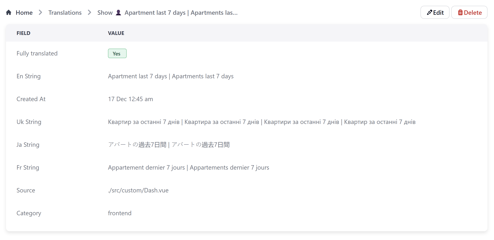

# Internationalization (i18n)

This plugin allows you translate your AdminForth application to multiple languages.
Main features:
- Stores all translation strings in your application in a single AdminForth resource. You can set [allowed actions](/docs/tutorial/Customization/limitingAccess/#disable-some-action-based-on-logged-in-user-record-or-role) only  to Developers/Translators role if you don't want other users to see/edit the translations.
- Supports AI completion adapters to help with translations. For example, you can use OpenAI ChatGPT to generate translations. Supports correct pluralization, even for Slavic languages.
- Supports any number of languages.


Under the hood it uses vue-i18n library and provides several additional facilities to make the translation process easier.


## Installation

To install the plugin:

```bash
npm install @adminforth/i18n --save
npm install @adminforth/completion-adapter-open-ai-chat-gpt --save
```

For example lets add translations to next 4 languages: Ukrainian, Japanese, French, Spanish. Also we will support basic translation for English.


Add a model for translations, if you are using prisma, add something like this:

```ts title='./schema.prisma'
model translations {
    id              String   @id
    en_string       String
    created_at      DateTime
    uk_string       String?  // translation for Ukrainian language
    ja_string       String?  // translation for Japanese language
    fr_string       String?  // translation for French language
    es_string       String?  // translation for Spanish language
    category        String
    source          String?
    completedLangs   String?
    
    // we need both indexes on en_string+category and separately on category
    @@index([en_string, category])
    @@index([category])
}
```

If you want more languages, just add more fields like `uk_string`, `ja_string`, `fr_string`, `es_string` to the model.

Next, add resource for translations:

```ts title='./resources/translations.ts'

import AdminForth, { AdminForthDataTypes, AdminForthResourceInput } from "adminforth";
import CompletionAdapterOpenAIChatGPT from "@adminforth/completion-adapter-open-ai-chat-gpt";
import I18nPlugin from "@adminforth/i18n";
import { v1 as uuid } from "uuid";


export default {
  dataSource: "maindb",
  table: "translations",
  resourceId: "translations",
  label: "Translations",

  recordLabel: (r: any) => `✍️ ${r.en_string}`,
  plugins: [
    new I18nPlugin({
      supportedLanguages: ['en', 'uk', 'ja', 'fr'],

      // names of the fields in the resource which will store translations
      translationFieldNames: {
        en: 'en_string',
        uk: 'uk_string',
        ja: 'ja_string',
        fr: 'fr_string',
      },

      // name of the field which will store the category of the string
      // this helps to categorize strings and deliver them efficiently
      categoryFieldName: 'category',

      // optional field to store the source (e.g. source file name)
      sourceFieldName: 'source',

      // optional field store list of completed translations
      // will hel to filter out incomplete translations
      completedFieldName: 'completedLangs',

      completeAdapter: new CompletionAdapterOpenAIChatGPT({
        openAiApiKey: process.env.OPENAI_API_KEY as string,
        model: 'gpt-4o-mini',
        expert: {
          // for UI translation it is better to lower down the temperature from default 0.7. Less creative and more accurate
          temperature: 0.5,
        },
      }),
    }),

  ],
  options: {
    listPageSize: 30,
  },
  columns: [
    {
      name: "id",
      fillOnCreate: ({ initialRecord, adminUser }: any) => uuid(),
      primaryKey: true,
      showIn: [],
    },
    {
      name: "en_string",
      type: AdminForthDataTypes.STRING,
      label: 'English',
    },
    {
      name: "created_at",
      fillOnCreate: ({ initialRecord, adminUser }: any) => new Date().toISOString(),
    },
    {
      name: "uk_string",
      type: AdminForthDataTypes.STRING,
      label: 'Ukrainian',
    },
    {
      name: "ja_string",
      type: AdminForthDataTypes.STRING,
      label: 'Japanese',
    },
    {
      name: "fr_string",
      type: AdminForthDataTypes.STRING,
      label: 'French',
    },
    {
      name: "completedLangs",
    },
    {
      name: "source",
      showIn: ['filter', 'show'],
      type: AdminForthDataTypes.STRING,
    },
    {
      name: "category",
      showIn: ['filter', 'show', 'list'],
      type: AdminForthDataTypes.STRING,
    }
  ],
} as AdminForthResourceInput;
```

Add `OPENAI_API_KEY` to your `.env` file:

```bash
OPENAI_API_KEY=your_openai_api_key
```

Also add the resource to main file and add menu item in `./index.ts`:

```ts title='./index.ts'

//diff-add
import translations from "./resources/translations";
...

const adminForth = new AdminForth({
  ...
  resources: [
    ...
//diff-add
    translations,
  ],
  menu: [
    ...
//diff-add
    {
//diff-add
      label: 'Translations',
//diff-add
      icon: 'material-symbols:translate',
//diff-add
      resourceId: 'translations',
//diff-add
    },
  ],
  ...
});

```

This is it, now you should restart your app and see the translations resource in the menu. 

You can add translations for each language manually or use Bulk actions to generate translations with AI completion adapter.

For simplicity you can also use filter to get only untranslated strings and complete them one by one (filter name "Fully translated" in the filter).


## Translation for custom components

To translate custom components, you should simply wrap all strings in $t function. For example:

Now create file `CustomLoginFooter.vue` in the `custom` folder of your project:

```html title="./custom/CustomLoginFooter.vue"
<template>
  <div class="text-center text-gray-500 text-sm mt-4">
//diff-remove
    By logging in, you agree to our <a href="#" class="text-blue-500">Terms of Service</a> and <a href="#" class="text-blue-500">Privacy Policy</a>
//diff-add
    {{$t('By logging in, you agree to our')}} <a href="#" class="text-blue-500">{{$t('Terms of Service')}}</a> {{$t('and')}} <a href="#" class="text-blue-500">{{$t('Privacy Policy')}}</a>
  </div>
</template>
```

### Variables in frontend translations

You can use variables in translations in same way like you would do it with vue-i18n library. 

This is generally helps to understand the context of the translation for AI completion adapters and simplifies the translation process, even if done manually.

For example if you have string "Showing 1 to 10 of 100 entries" you can of course simply do

```html
{{ $t('Showing')}} {{from}} {{$t('to')}} {{to}} {{$t('of')}} {{total}} {{$t('entries') }}
``` 

And it will form 4 translation strings. But it is much better to have it as single string with variables like this:

```html
{{ $t('Showing {from} to {to} of {total} entries', { from, to, total } ) }}
```


For example, let's add user greeting to the header.

```html title="./custom/Header.vue"
<template>
  <div class="flex items-center justify-between p-4 bg-white shadow-md">
    <div class="text-lg font-semibold text-gray-800">
      {{ $t('Welcome, {name}', { name: adminUser.username }) }}
    </div>
  </div>
</template>

<script setup lang="ts">
import type { AdminForthResourceColumnCommon, AdminForthResourceCommon, AdminUser } from '@/types/Common';

const props = defineProps<{
    column: AdminForthResourceColumnCommon;
    record: any;
    meta: any;
    resource: AdminForthResourceCommon;
    adminUser: AdminUser
}>();
</script>
```

How to use such component

```typescript title="./index.ts"

const adminForth = new AdminForth({
  ...
  customization{ 
    globalInjections: {
      header: {
        file: '@@/Header.vue',
      },
    }
  },
  ...
});

```

### HTML in translations

Sometimes you might want to have HTML in translations. You can use `i18n-t` translation component for this. For example:

```html
<span class="hidden sm:inline">
  <i18n-t keypath="Showing {from} to {to} of {total} Entries" tag="p"  >
    <template v-slot:from>
      <strong>{{ from }}</strong>
    </template>
    <template v-slot:to>
      <strong>{{ to }}</strong>
    </template>
    <template v-slot:total>
      <strong>{{ totalRows }}</strong>
    </template>
  </i18n-t>
</span>
```

### Pluralization

Frontend uses same pluralization rules as vue-i18n library. You can use it in the same way. For example:

```html
{{ $t('Apartment last 7 days | Apartments last 7 days', data.totalAparts) }}
```

For English it will use 2 pluralization forms (1 and other), for Slavic languages, LLM adapter will be instructed to generate 4 forms: for zero, for one, for 2-4 and for 5+:




## Limiting access to translating

If you want to limit access to translations resource only to developers or translators, you can use [limiting access](/docs/tutorial/Customization/limitingAccess/) feature. 

Please note that access to "Translate selected" bulk action which uses LLM AI translation adapter is determined by allowedActions.edit permission of resource.

## Translations in custom APIs

Sometimes you need to return a translated error or success message from your API. You can use special `tr` function for this.

For simple example let's move previous example to format string on the backend side:

```html title="./custom/Header.vue"
<template>
  <div class="flex items center justify-between p-4 bg-white shadow-md">
    <div class="text-lg font-semibold text-gray-800">
      {{ greeting }}
    </div>
  </div>
</template>

<script setup lang="ts">
import type { AdminForthResourceColumnCommon, AdminForthResourceCommon, AdminUser } from '@/types/Common';
import { callApi } from '@/utils';
import { ref, onMounted } from 'vue';

const greeting: Ref<string> = ref('');

onMounted(async () => {
  try {
    const data = await callApi({path: '/api/greeting', method: 'GET'});
    greeting.value = data.text;
  } catch (error) {
    window.adminforth.alert({
      message: `Error fetching data: ${error.message}`,
      variant: 'danger',
      timeout: 'unlimited'
    });
    return;
  }
})
</script>
```

And on the backend side you can use tr function to translate the string:

```ts title="./index.ts"
  app.get(`${ADMIN_BASE_URL}/api/greeting`, 
    admin.express.authorize(
      admin.express.translatable(
        async (req, res) => {
          res.json({
            text: await req.tr('Welcome, {name}', 'customApis', { name: req.adminUser.username }),
          });
        }
      )
    )
  );

  // serve after you added all api
  admin.discoverDatabases();
  admin.express.serve(app)
```

As you can see we should use `admin.express.translatable` middleware which will inject `tr` function to the request object.
First param is the string to translate, second is the category of the string (actually you can use any string here), and the third is the variables object.

If you don't use params, you can use `tr` without third param:

```typescript
{
  text: await tr('Welcome, dear user', 'customApis'),
}
```

> 🙅‍♂️ Temporary limitation: For now all translations strings for backend (adminforth internal and for from custom APIs)
 appear in Translations resource and table only after they are used. So greeting string will appear in the Translations table only after the first request to the API which reaches the `tr` function call. 
> So to collect all translations you should use your app for some time and make sure all strings are used at
> In future we plan to add backend strings collection in same way like frontend strings are collected.

## Translating messaged within bulk action

Label adn confirm strings of bulk actions are already translated by AdminForth, but 
`succesMessage` returned by action function should be translated manually because of the dynamic nature of the message.

Let's rework the bulk action from [bulkActions](/docs/tutorial/Customization/bulkActions/) to use translations:

```ts title="./resources/apartments.ts"
import { AdminUser } from 'adminforth';
import { admin } from '../index';

{
  ...
  resourceId: 'aparts',
     ...
     options: {
        bulkActions: [
          {
            label: 'Mark as listed',
            icon: 'flowbite:eye-solid',
            // if optional `confirm` is provided, user will be asked to confirm action
            confirm: 'Are you sure you want to mark all selected apartments as listed?',
            action: function ({selectedIds, adminUser }: {selectedIds: any[], adminUser: AdminUser }) {
              const stmt = admin.resource('aparts').dataConnector.db.prepare(`UPDATE apartments SET listed = 1 WHERE id IN (${selectedIds.map(() => '?').join(',')})`);
              stmt.run(...selectedIds);
//diff-remove
              return { ok: true, error: false, successMessage: `Marked ${selectedIds.length} apartments as listed` };
//diff-add
              return { ok: true, error: false, successMessage: await tr('Marked {count} apartments as listed', 'apartments', { count:   selectedIds.length }) };
            },
          }
        ],
      }
}
```

## Translating external application

You can use this module not only to translate Admin area of your application but also to translate other services of your application.
This will allow you to reuse the same functionality and AI completion adapters for all your translations. For example in this app we 
will consider that we have a Nuxt.js SEO-centric frontend which we want to translate with [vue-i18n](https://vue-i18n.intlify.dev/).

To do it you need to use 2 exposed methods from the plugin: `feedCategoryTranslations` and `getCategoryTranslations`. 

First of all, at some step, e.g. CI pipeline you should get all translation strings from your external app and feed them ao an own rest API like `'/feed-nuxt-strings'`, this API might look like this

```ts title="./index.ts"
  app.get(`${ADMIN_BASE_URL}/feed-nuxt-strings`, 
    async (req, res) => {
      // req.body will be an array of objects like:
      // [{
      //    path: 'Login',
      //    file: 'src/views/Login.vue:35',
      // }]

      const messagesForFeed = req.body.map((mk: any) => {
        return {
          en_string: mk.path,
          source: mk.file,
        };
      });

      admin.getPluginByClassName<I18nPlugin>('I18nPlugin').feedCategoryTranslations(
        messagesForFeed,
        'nextApp'
      )

      res.json({
        ok: true
      });
    }
  );

```

For extracting 18n messages we use [vue-i18n-extract](https://github.com/Spittal/vue-i18n-extract) package. 
You can add extract command to `package.json`:

```json
{
  "scripts": {
    "i18n:extract": "echo '{}' > i18n-empty.json && vue-i18n-extract report --vueFiles './src/**/*.?(js|vue)' --output ./i18n-messages.json --languageFiles 'i18n-empty.json' --add",
    "i18n:feed-to-backoffice": "npm run i18n:extract && curl -X POST -H 'Content-Type: application/json' -d @i18n-messages.json http://adminforth:3000/feed-nuxt-strings"
    ""
  }
}
```

Make sure to replace `adminforth:3000` with AdminForth API URL. We are assuming it is docker container name in internal docker network.

So in the pipeline you should run `npm run i18n:feed-to-backoffice` to extract messages from your Nuxt.js app and feed them to AdminForth.

> 👆 The example method is just a stub, please make sure you not expose endpoint to public or add some simple authorization on it,
> otherwise someone might flood you with dump translations requests.

Then in your Nuxt.js app you should call this API and store the strings in the same.

Next part. When we will need translations on the nuxt instance, we should use [vue-i18n's lazy loading feature](https://vue-i18n.intlify.dev/guide/advanced/lazy):

```typescript title="./your-buxt-app-source-file.ts"
import { callAdminForthApi } from '@/utils';

export async function loadLocaleMessages(i18n, locale) {
  // load locale messages with dynamic import
  const messages = await callAdminForthApi({
    path: `/api/translations/?lang=${locale}`,
    method: 'GET',
  });

  // set locale and locale message
  i18n.global.setLocaleMessage(locale, messages.default)

  return nextTick()
}
```

See [vue-i18n's lazy loading feature](https://vue-i18n.intlify.dev/guide/advanced/lazy) to understand where better to call `loadLocaleMessages` function.

Here is how API for messages will look:

```ts title="./index.ts"
app.get(`${ADMIN_BASE_URL}/api/translations/`, 
  async (req, res) => {
    const lang = req.query.lang;
    const messages = await admin.getPluginByClassName<I18nPlugin>('I18nPlugin').getCategoryTranslations('nextApp', lang);
    res.json(messages);
  }
);
```

