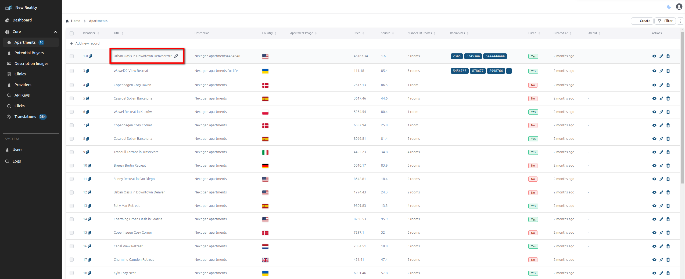

# List in place edit

The List in Place Edit plugin allows you to edit records directly in the list view.

## Usage

First, install the plugin:

```bash
npm i @adminforth/list-in-place-edit --save
```

Import plugin:

```ts title="./resources/apartments.ts"
import ListInPlaceEditPlugin from "@adminforth/list-in-place-edit";
```

Now instantiate the plugin and add it to the configuration:

```ts title="./resources/apartments.ts"

{
  ...
  plugins: [
    new ListInPlaceEditPlugin({
      columns: ["title", "description"],
    }),
  ],
}
```

Here is how it looks:


