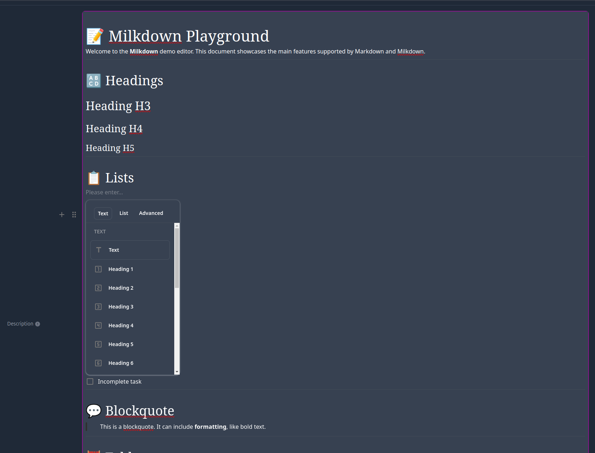
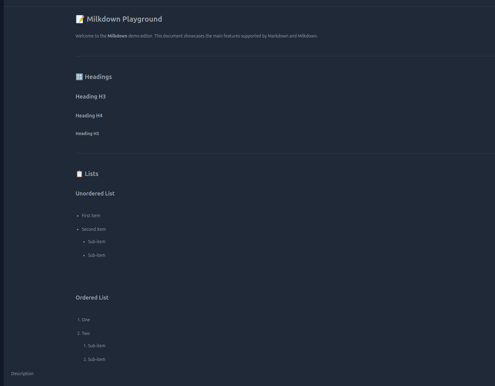
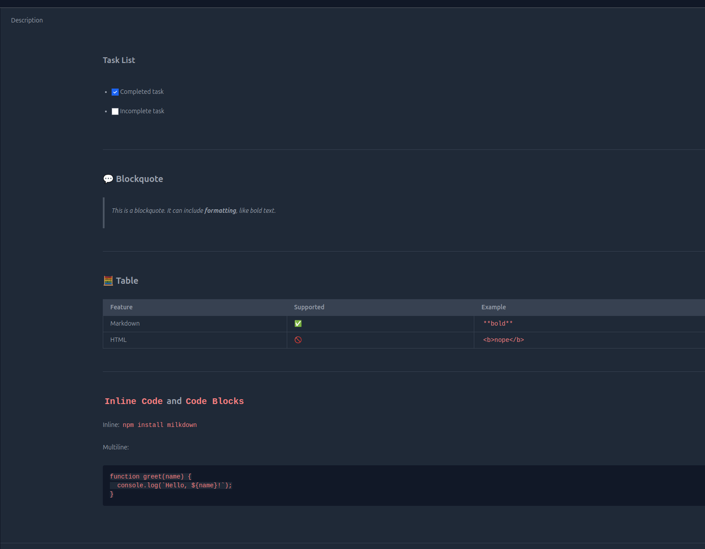

# Markdown

The Markdown plugin enables Markdown support in AdminForth, allowing users to create and edit fields using Markdown syntax and save rich content in Markdown syntax. 

Also, it allows previewing of Markdown fields in the show page.

## Installation

To install the plugin:

```bash
npm install @adminforth/markdown --save
```

### Usage

Instantiate the plugin in your apartments resource file for 'description' field.

```typescript title="./resources/apartments.ts"
import MarkdownPlugin from '@adminforth/markdown';

// ... existing resource configuration ...

plugins: [
  new MarkdownPlugin({fieldName: "description"}),
]
```

> Please note that plugin can only work on TEXT and STRING fields

Here is how it looks in the create view:



Here is how it looks in show view:




