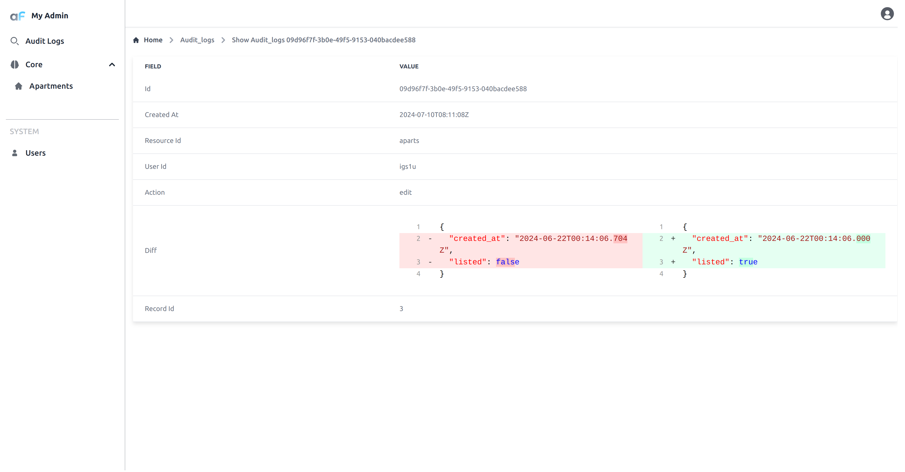

AuditLog plugin allows to log all changes in the resources done from the admin panel. 
It will allow you to figure out who and when made changes in the data. 
Requires separate table in the database to store logs.

## Installation


```bash
npm i @adminforth/audit-log --save
```

Create `auditLogs.ts` in `resources` folder:

```ts title="./resources/auditLogs.ts"
import AuditLogPlugin from '@adminforth/audit-log';
import { AdminForthDataTypes } from 'adminforth'
import { v4 as uuid } from 'uuid';
```

[Getting Started](<../001-gettingStarted.md>) will be used as base for this example.


## Creating table for storing activity data
For the first, to track records changes, we need to set up the database and table with certain fields inside where tracked data will be stored.

First of all you should create this table in your own database `./schema.prisma`:

```ts title='./schema.prisma'
model audit_logs {
  id                String      @id
  created_at        DateTime  /// timestamp of applied change
  resource_id       String    /// identifier of resource where change were applied
  user_id           String    /// identifier of user who made the changes
  action            String    /// type of change (create, edit, delete)
  diff              String?   /// delta betwen before/after versions
  record_id         String?   /// identifier of record that been changed
}
```

And `prisma migrate`:

```bash
npm run makemigration -- --name add-audit-logs && npm run migrate:local
```

Also to make this code start 

## Setting up the resource and dataSource for plugin
Logger sets up for all the resources by default. But you can exclude unwanted resources with option "excludeResourceIds". In this example, we'll exclude resource "adminuser" from logging.

Also, it excludes itself to avoid infinte logging loop.

Add this code in `auditLogs.ts`:

```ts title='./resources/auditLogs.ts'

import AuditLogPlugin from "@adminforth/audit-log/index.js";
import { AdminForthDataTypes } from "adminforth";
import { randomUUID } from "crypto";

export default {
  dataSource: 'maindb', 
  table: 'audit_logs',
  columns: [
    { name: 'id', primaryKey: true, required: false, fillOnCreate: ({initialRecord}: any) => randomUUID(),
      showIn: {
        list: false,
        edit: false,
        create: false,
        filter: false,
      } },
    { name: 'created_at', required: false },
    { name: 'resource_id', required: false },
    { name: 'user_id', required: false, 
        foreignResource: {
        resourceId: 'adminuser',
      } },
    { name: 'action', required: false },
    { name: 'diff', required: false, type: AdminForthDataTypes.JSON, showIn: {
        list: false,
        edit: false,
        create: false,
        filter: false,
      } },
    { name: 'record_id', required: false },
  ],
  options: {
    allowedActions: {
      edit: false,
      delete: false,
      create: false
    }
  },
  plugins: [
    new AuditLogPlugin({
      // if you want to exclude some resources from logging
      //excludeResourceIds: ['adminuser'],
      resourceColumns: {
        resourceIdColumnName: 'resource_id',
        resourceActionColumnName: 'action',
        resourceDataColumnName: 'diff',
        resourceUserIdColumnName: 'user_id',
        resourceRecordIdColumnName: 'record_id',
        resourceCreatedColumnName: 'created_at'
      }
    }),
  ],
}
```

Then you need to import `./resources/auditLogs`:

```ts title="./index.ts"
//diff-add
import auditLogsResource from "./resources/auditLogs"


... new AdminForth({
  dataSources: [...],
    ...
  resources: [
    apartmentsResource,
    usersResource,
//diff-add
    auditLogsResource
  ],
    ...
]
```

Also, we need to add it to menu:
```ts
menu: [
  ...
//diff-add
  {
//diff-add
      label: 'Audit Logs',
//diff-add
      icon: 'flowbite:search-outline',
//diff-add
      resourceId: 'audit_logs',
//diff-add
  }
]
```

That's it! Now you can see the logs in the table 



<!-- See [API Reference](/docs/api/plugins/audit-log/types/type-aliases/PluginOptions.md) for more all options. -->


## Logging custom actions

Audit log is able to catch only standard actions like `create`, `update`, `delete` or custom bulk actions.

If you have a custom, self coded actions in your API, you can log them by calling `logCustomAction` method of `AuditLogPlugin` instance:

```ts title="./resources/index.ts"

app.get(`${ADMIN_BASE_URL}/api/dashboard/`,
  admin.express.authorize(
    async (req, res) => {

      admin.getPluginByClassName<AuditLogPlugin>('AuditLogPlugin').logCustomAction({
        resourceId: 'aparts',
        recordId: null, // recordId can be null if not applicable
        actionId: 'visitedDashboard', // any random string you want to useto identify this action 
        oldData: null, // old data, can be null if not applicable
        data: { dashboard: 'main' }, // new data or any data you want to log
        user: req.adminUser,
        headers: req.headers //required if you want log client ip
      })

      ....

```

## Logging client ip address

Audit log can also log the client's IP address if needed.

First, you need to migrate the `audit_logs` table in `./schema.prisma`:

```ts title='./schema.prisma'
model audit_logs {
  id                String      @id
  created_at        DateTime  /// timestamp of applied change
  resource_id       String    /// identifier of resource where change were applied
  user_id           String    /// identifier of user who made the changes
  action            String    /// type of change (create, edit, delete)
  diff              String?   /// delta betwen before/after versions
  record_id         String?   /// identifier of record that been changed
//diff-add
  ip_address        String?   /// client ip address
}
```

And `prisma migrate`:

```bash
npm run makemigration -- --name add-ip-address-to-audit-logs && npm run migrate:local
```

Also, update the resource configuration in `./resources/auditLogs.ts`:

```ts title='./resources/auditLogs.ts'
  export default {
    dataSource: 'maindb', 
    table: 'audit_logs',
    columns: [
      ...
      { name: 'action', required: false },
      { name: 'diff', required: false, type: AdminForthDataTypes.JSON, showIn: {
          list: false,
          edit: false,
          create: false,
          filter: false,
        } },
      { name: 'record_id', required: false },
      //diff-add
      { name: 'ip_address', required: false },
    ],
    ...
    plugins: [
      new AuditLogPlugin({
        resourceColumns: {
          resourceIdColumnName: 'resource_id',
          resourceActionColumnName: 'action',
          resourceDataColumnName: 'diff',
          resourceUserIdColumnName: 'user_id',
          resourceRecordIdColumnName: 'record_id',
          resourceCreatedColumnName: 'created_at'
//diff-add
          resourceIpColumnName: "ip_address",
        }
      }),
    ],
  }
```