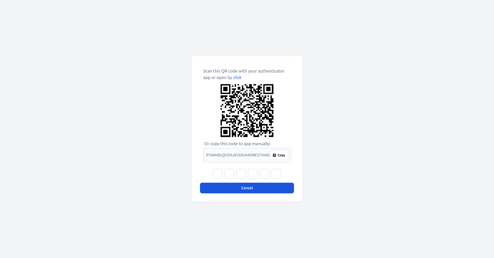
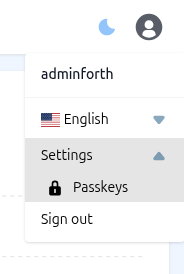
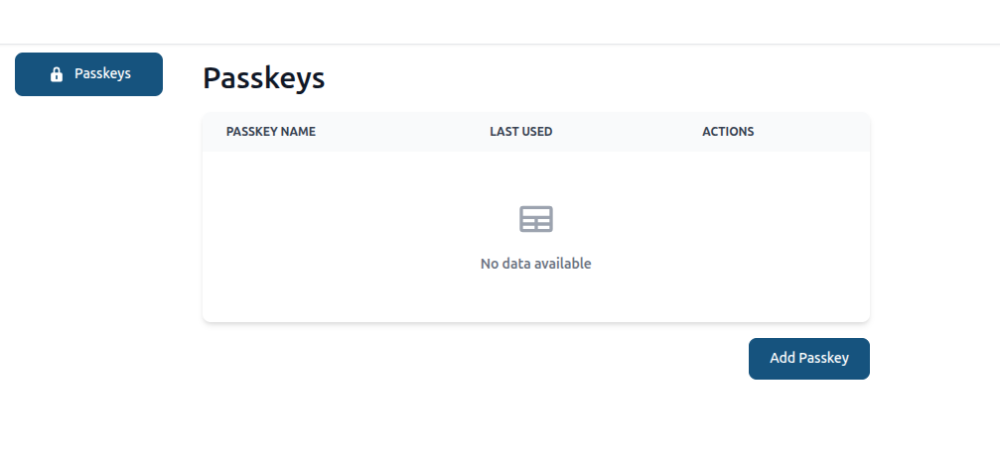
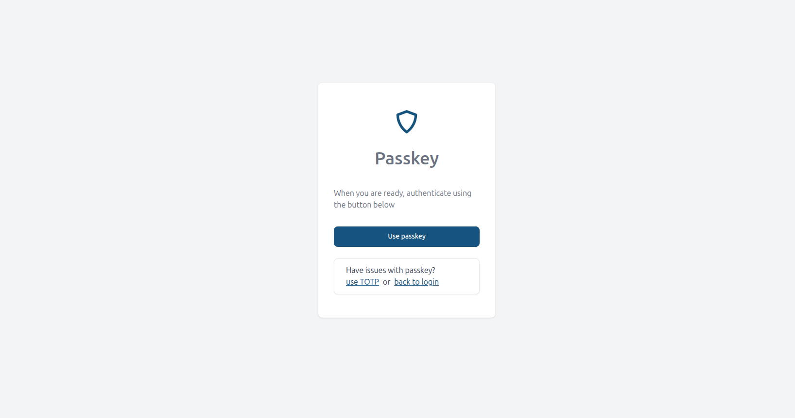

# Two-Factor Authentication Plugin

The Two-Factor Authentication Plugin provides an additional layer of security to the application by requiring users to provide a second form of authentication in addition to their password. This plugin supports  authenticator apps.

## Installation

``` bash
npm i @adminforth/two-factors-auth --save
```

Plugin is already installed into adminforth, to import:

```ts title="/adminuser.ts"
import TwoFactorsAuthPlugin from '@adminforth/two-factors-auth';
```

Plugin required some additional setup, to make it work properly. It should be added to the resource auth resource. In our example we will add it to the user resource .

```ts title='./schema.prisma'
model adminuser {
  id            String     @id
  created_at    DateTime
  email         String   @unique
  role          String
  password_hash String
//diff-add
  secret2fa     String?
}
```

Then:

```bash
npm run makemigration -- --name add-2fa-secret ; npm run migrate:local


```

And add it to `adminuser.ts`

```ts tittle="./resources/adminuser.ts"
{
    table: 'adminuser',
//diff-add
    plugins: [
//diff-add
        new TwoFactorsAuthPlugin ({ twoFaSecretFieldName: 'secret2fa', timeStepWindow: 1 }),
//diff-add
    ],
    columns: [
        ...
//diff-add
        {
//diff-add
            name: 'secret2fa',
//diff-add
            showIn: { all: false },
//diff-add
            backendOnly: true,
//diff-add
        }
    ],
  }
```

> 💡 **Note**: Time-Step Size
>
> By default, `timeStepWindow` is set to `1`, which means the Two-Factor Authentication Plugin will check the current 30-second time-step, as well as one step before and after, to validate a TOTP code. This aligns with [RFC 6238](https://www.rfc-editor.org/rfc/rfc6238) best practices to accommodate slight clock drift between the server and the user's device.
>
> For example, if a code is generated between **12:00:00** and **12:00:30**, it will typically expire at **12:00:30**. However, with a `timeStepWindow` of `1`, the plugin will continue to accept it up to **12:00:59** (the “next” 30-second step), preventing users from being locked out if their device clock is a few seconds off. Once the clock hits **12:01:00**, that previous code will be treated as expired.
>
> If you find users frequently encountering code mismatches due to clock drift, you can increase `timeStepWindow` to `2`. **However, be cautious: larger windows can reduce overall security!**
>
> ❗ With a `timeStepWindow` set to `0`, the plugin will pass all the expired codes, which is not secure and should only be used for testing purposes.

Thats it! Two-Factor Authentication is now enabled:


## Disabling Two-Factor Authentication locally

If it is not convenient to enter the code every time you log in during local development, you can disable Two-Factor Authentication
for the dev environment using `usersFilterToApply` option.

```ts title='./index.ts'

    plugins: [
        new TwoFactorsAuthPlugin ({
          twoFaSecretFieldName: 'secret2fa',
//diff-add
          usersFilterToApply: (adminUser: AdminUser) => {
//diff-add
            // if this method returns true, 2FA will be enforced for this user, if returns false - 2FA will be disabled
//diff-add
            if (process.env.NODE_ENV === 'development') {
//diff-add
              return false;
//diff-add
            }
//diff-add
            return true;
//diff-add
          },
        }),
    ],
```

## Select which users should use Two-Factor Authentication

By default plugin enforces Two-Factor Authentication for all users.

If you wish to enforce 2FA only for specific users, you can again use `usersFilterToApply` option:

```ts title='./adminuser.ts'
  usersFilterToApply: (adminUser: AdminUser) => {
    // disable 2FA for users which email is 'adminforth' or 'adminguest'
    return !(['adminforth', 'adminguest'].includes(adminUser.dbUser.email));
  },
```

You can even add a boolean column to the user table to store whether the user should use 2FA or not:

In `schema.prisma`:

```ts title='./schema.prisma'
model adminuser {
  id            String     @id
  created_at    DateTime
  email         String   @unique
  role          String
  password_hash String
  secret2fa     String?
//diff-add
  use2fa        Boolean?  @default(false)
}
```

Then run:

```bash
npm run makemigration -- --name add-use2fa ; npm run migrate:local
```

Then in `adminuser.ts`:


```ts title='./adminuser.ts'
{
    resourceId: 'adminuser',
    ...
    columns: [
        ...
        {
            name: 'use2fa',
        }
        ...
    ],
    options: {
      allowedActions: {
        delete: async ({ adminUser }: { adminUser: AdminUser }) => {
          // only superadmin can delete users
          return adminUser.dbUser.role === 'superadmin';
        },
        create: async ({ adminUser }: { adminUser: AdminUser }) => {
          // only superadmin can create users
          return adminUser.dbUser.role === 'superadmin';
        },
        edit: async ({ adminUser, meta }: { adminUser: AdminUser }) => {
          // user can modify only his own record
          const { oldRecord } = meta;
          return adminUser.dbUser.id === oldRecord.id;
        },
      }
    },
    plugins: [
        new TwoFactorsAuthPlugin ({
          twoFaSecretFieldName: 'secret2fa',
          usersFilterToApply: (adminUser: AdminUser) => {
            return adminUser.dbUser.use2fa;
          },
        }),
    ],
}
```

## Allow Specific Users to Skip Two-Factor Authentication Setup

By default, all users are required to setup Two-Factor Authentication if it is enabled.

If you want to allow specific users to **skip** the 2FA setup, you can use the `usersFilterToAllowSkipSetup` option:

```ts title='./adminuser.ts'
...
plugins: [
        new TwoFactorsAuthPlugin ({
          twoFaSecretFieldName: 'secret2fa',
          ...
        //diff-add
          usersFilterToAllowSkipSetup: (adminUser: AdminUser) => {
            //diff-add
            // allow skip setup 2FA for users which email is 'adminforth' or 'adminguest'
            //diff-add
            return !(['adminforth', 'adminguest'].includes(adminUser.dbUser.email));
            //diff-add
          },
        }),
],
...
```

## Custom label in authenticator app

If you want to have custom label in authenticator app, you can specify it: 

```ts label="./adminuser"
  plugins: [
    new TwoFactorsAuthPlugin ({
      twoFaSecretFieldName: 'secret2fa',
        ...
      customBrandPrefix: "TechStore",
    }),
  ],
```

## Passkeys setup

If you want to use both passkeys and TOTP simultaneously, you can set them up as follows:

First, you need to create a passkeys table in your schema.prisma file:

```ts title='./schema.prisma'
  //diff-add
  model passkeys {
  //diff-add
    credential_id           String @id 
  //diff-add
    user_id                 String
  //diff-add
    meta                    String
  //diff-add
    @@index([user_id])
  //diff-add
  }
```

And make migration:

```bash
npm run makemigration -- --name add-passkeys ; npm run migrate:local
```


Next, you need to create a new resource for passkeys:

```ts title='./resources/passkeys.ts'
  import { AdminForthDataTypes, AdminForthResourceInput } from "../../adminforth";

  export default {
    dataSource: 'maindb',
    table: 'passkeys',
    resourceId: 'passkeys',
    label: 'Passkeys',
    columns: [
      {
        name: 'credential_id',
        label: 'Credential ID',
        primaryKey: true,
      },
      {
        name: 'user_id',
        label: 'User ID',
      },
      {
        name: "meta",
        type: AdminForthDataTypes.JSON,
        label: "Meta",
      }
    ],
    plugins: [],
    options: {},
  } as AdminForthResourceInput;
```

Add the new resource to index.ts:

```ts title='./index.ts'
    ...
  //diff-add
  import passkeysResource from './resources/passkeys.js';
    ...

  resources: [
    ...
    //diff-add
    passkeysResource,
    ...
  ],
```

Now, update the settings of the Two-Factor Authentication plugin:

```ts tittle='./resources/adminuser.ts'
  plugins: [
    new TwoFactorsAuthPlugin ({ 
      twoFaSecretFieldName: 'secret2fa', 
      timeStepWindow: 1       
      //diff-add
      passkeys: {
        //diff-add
        credentialResourceID: "passkeys",
        //diff-add
        credentialIdFieldName: "credential_id",
        //diff-add
        credentialMetaFieldName: "meta",
        //diff-add
        credentialUserIdFieldName: "user_id",
        //diff-add
        settings: {
          // diff-add
          expectedOrigin: "http://localhost:3000",   // important, set it to your backoffice origin (starts from scheme, no slash at the end)
          //diff-add
          // relying party config
          //diff-add
          rp: {
              //diff-add
              name: "New Reality",
              
              //diff-add
              // optionaly you can set expected id explicitly if you need to:
              //diff-add
              // id: "localhost",
              //diff-add
            },
            //diff-add
            user: {
              //diff-add
                nameField: "email",
                //diff-add
                displayNameField: "email",
                //diff-add
            },
            //diff-add
            authenticatorSelection: {
              // diff-add
              // impacts a way how passkey will be created
              // diff-add
              // - platform - using browser internal authenticator (e.g. Google Chrome passkey / Google Password Manager )
              // diff-add
              // - cross-platform - using external authenticator (e.g. Yubikey, Google Titan etc)
              // diff-add
              // - both - plging will show both options to the user
              // diff-add
              // Can be "platform", "cross-platform" or "both"
              // diff-add
                authenticatorAttachment: "platform",
                //diff-add
                requireResidentKey: true,
                //diff-add
                userVerification: "required",
                //diff-add
            },
            //diff-add
        },
        //diff-add
      } 
    }),
  ],
```

> ☝️ most likely you should set `passkeys.settings.expectedOrigin` from your process.env depending on your env (e.g. http://localhost:3500 for local dev, https://admin.yourproduct.com for production etc)


> 💡**Note** By default `passkeys.settings.rp.id` is generated from the expectedOrigin so you don't need to set it
> unless you know what you are doing. Manual setting might be needed for sub-domains isolation.
> By default, if you set expected origin to https://localhost:3500 it will use "localhost" as rpid
> If you set origin to https://myadmin.myproduct.com -> it will use  "myadmin.myproduct.com"  as rpid 

The setup is complete. To create a passkey:

> 1) Go to the user menu
> 2) Click settings
> 3) Select "passkeys"

 

> 4) Add passkey

 


After adding passkey you can use passkey, instead of TOTP:

 

> 💡 **Note**: Adding a passkey does not remove the option to use TOTP. If you lose access to your passkey, you can log in using TOTP and reset your passkey.


