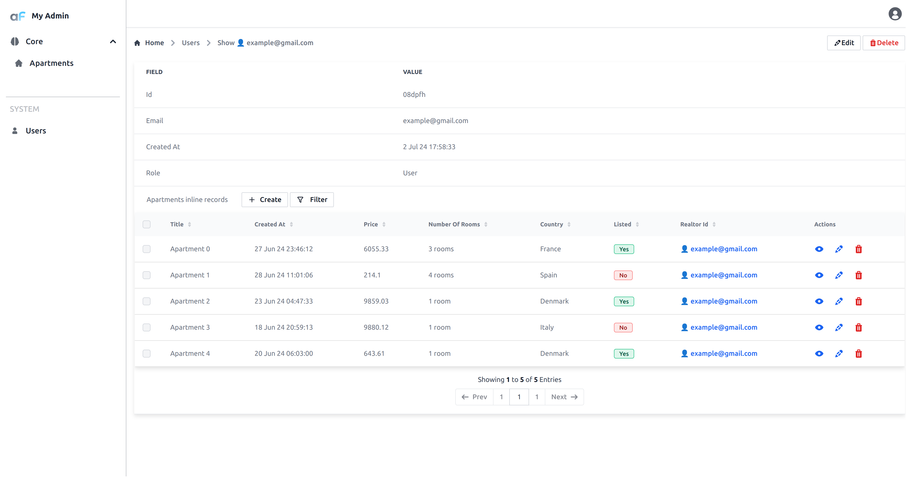

Foreign inline list plugin allows to display a list (table) of items from a foreign table in the show view.

## Usage


Import plugin:

```bash
npm i @adminforth/foreign-inline-list --save
```

```ts title="./resources/adminuser.ts"
import ForeignInlineListPlugin from '@adminforth/foreign-inline-list';
import { AdminForthResource, AdminForthResourceColumn } from 'adminforth';
```


In [Getting Started](<../001-gettingStarted.md>) we created a `'aparts'` resource which has a field `'realtor_id'`.
This field refers to record from `'adminuser'` resource. To remind you, we configured this relation using `foreignResource` setting in the column configuration:

```typescript title="./resources/apartments.ts"
// 
export default {
  resourceId: 'aparts',
  ...
  columns: [
    ...
    {
      name: 'realtor_id',
      foreignResource: {
        resourceId: 'adminuser',  // this means that aparts.realtor_id refers to primary key of 'adminuser' resource
                              // this is Many-To-One relatin: many aparts can refer to one user
      }
    }
  ],
}
```

This means that we can display a list of apartments in the user's show view.

Add to your `'adminuser'` resource configuration the plugin instance:


```ts title="./resources/adminuser.ts"
{ 
    ...
    resourceId: 'adminuser',
    ...
//diff-add
    plugins: [
//diff-add
      new ForeignInlineListPlugin({
//diff-add
        foreignResourceId: 'aparts',
//diff-add
        modifyTableResourceConfig: (resourceConfig: AdminForthResource) => {
//diff-add
          // hide column 'square_meter' from both 'list' and 'filter'
//diff-add
          const column = resourceConfig.columns.find((c: AdminForthResourceColumn) => c.name === 'square_meter')!.showIn = { all: false };
//diff-add
          resourceConfig.options!.listPageSize = 1;
//diff-add
          // feel free to console.log and edit resourceConfig as you need
//diff-add
        },
//diff-add
      }),
//diff-add
    ],
}
```

You can use the `modifyTableResourceConfig` callback to modify which columns to show in the list and filter of the foreign table.



> 👆 To make plugin work, the specified resource (defined with `foreignResourceId`) should have one (and only one) column that refers to the current resource on which you add a plugin.
> In our case we add plugin to `adminuser` resource, so the `aparts` resource should have one column with `foreignResource.resourceId` equal to `adminuser` resourceId.

## Default filters

If you need to add default filters for the foreign resource based on your current record (for example show apartment only from Italy, when user have country Italy), you can use defaultFilters callback:
>👆 This example won't work until you'll add counrty field in your adminuser resource and it's only for demonstrating concept of callback

```ts title="./resources/adminuser.ts"

  ...

  new ForeignInlineListPlugin({

    ...
      //diff-add
      defaultFilters: (record: any) => {
        //diff-add
        return [
          //diff-add
          {
            //diff-add
            field: "country",
            //diff-add
            operator: AdminForthFilterOperators.EQ,
            //diff-add
            value: record.country,
            //diff-add
          }
          //diff-add
        ]
        //diff-add
      }

    ...

  })

  ...

```

>👆It also makes sense to modify the table resource and hide the country field from filters, because this value is hardcoded and equals the country from the record:  


```ts

  ...

  new ForeignInlineListPlugin({

    ...

    //diff-add
    modifyTableResourceConfig: (resourceConfig: AdminForthResource) => {
      //diff-add
      const column = resourceConfig.columns.find((c: AdminForthResourceColumn) => c.name === 'country')!.showIn = {
        //diff-add
        list: true,
        //diff-add
        show: true,
        //diff-add
        edit: true,
        //diff-add
        create: true,
        //diff-add
        filter: false
        //diff-add
      };
      //diff-add
    },

    defaultFilters: (record: any) => {
      return [
        {
          field: "country",
          operator: AdminForthFilterOperators.EQ,
          value: record.country,
        }
      ]
    }

    ...

  })

  ...
  
```
