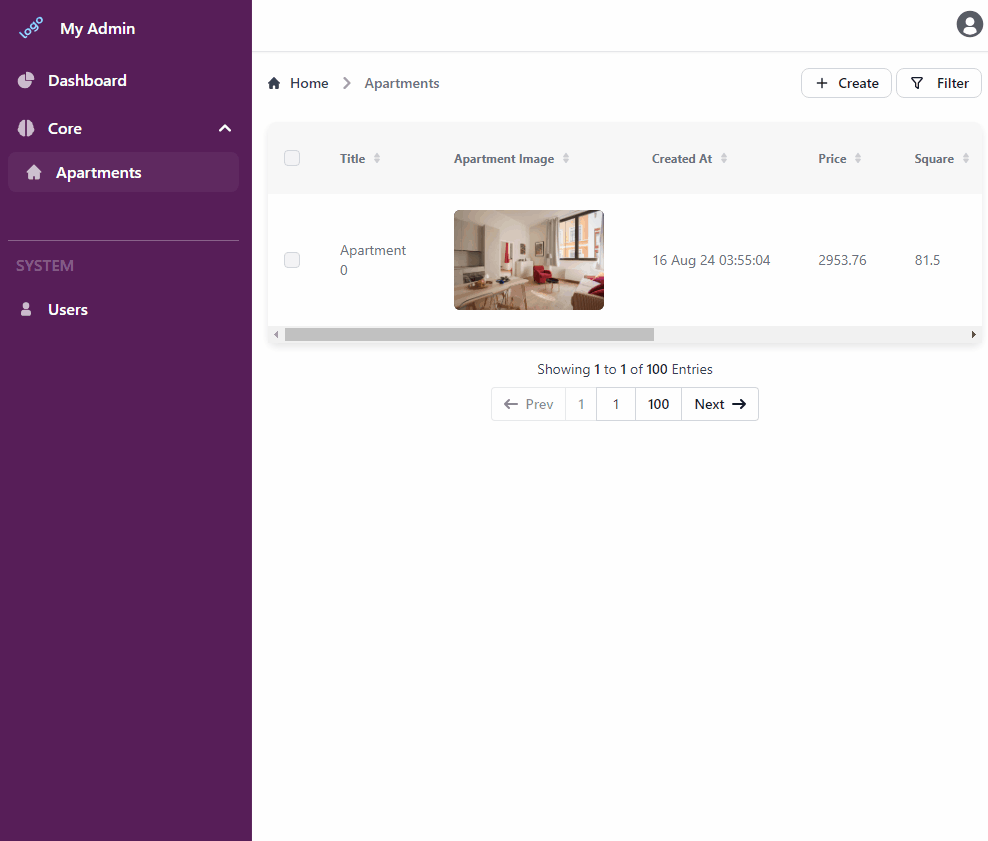

# Text Complete

This plugin allows you to auto-complete text and string fields using OpenAI Chat GPT models.

## Installation

```
npm i @adminforth/text-complete --save
npm i @adminforth/completion-adapter-open-ai-chat-gpt --save
```

Go to https://platform.openai.com/, open `Dashboard` -> `API keys` -> `Create new secret key`. Paste value in your `.env` file:

```env title=.env
...
OPENAI_API_KEY=your_key
```

Add plugin installation to any text or string column.

For example let's add it for title and description in `aparts` resource configuration which we created in [Getting Started](../001-gettingStarted.md) tutorial.

```ts title="./resources/apartments.ts"
//diff-add
import TextCompletePlugin from '@adminforth/text-complete';
//diff-add
import CompletionAdapterOpenAIChatGPT from "@adminforth/completion-adapter-open-ai-chat-gpt";


export const admin = new AdminForth({
  ...
  resourceId: 'aparts',
  columns: [
    ...
  ],
  plugins: [
    ...
//diff-add
    new TextCompletePlugin({
//diff-add
      fieldName: 'title',
//diff-add
      adapter: new CompletionAdapterOpenAIChatGPT({
//diff-add
        openAiApiKey: process.env.OPENAI_API_KEY as string,
//diff-add
        model: 'gpt-5-nano', // default "gpt-5-nano"
//diff-add
        expert: {
//diff-add
            temperature: 0.7 //Model temperature, default 0.7
//diff-add
        }
//diff-add
      }),
//diff-add
    }),
//diff-add
    new TextCompletePlugin({
//diff-add
      fieldName: 'description',
//diff-add
      adapter: new CompletionAdapterOpenAIChatGPT({
//diff-add
        openAiApiKey: process.env.OPENAI_API_KEY as string,
//diff-add
      }),
//diff-add
      // expert: {
//diff-add
        // maxTokens: 50, // token limit to generate for each completion. 50 is default
//diff-add
        // promptInputLimit: 500, // Limit in characters of edited field to be passed to Model. 500 is default value
//diff-add
        // debounceTime: 300, // Debounce time in milliseconds. 300 is default value
//diff-add
      // }
//diff-add
    }),

  ]

  ...

});
```

Here is how it looks:

!


## Initial prompt


If you want to generate field by your own prompt, you can use `initialPrompt` property in plugin configuration.

```ts title="./resources/apartments.ts"
    new TextCompletePlugin({
      fieldName: 'description',
//diff-add
      initialPrompt: `I need to introduce apartment '{{title}}' to people who have a pets and afraid that apartment is not pet friendly. I need short but very attractive description if it. It should have CTAs and Emojis. write \n\n once you are done.`,
//diff-add
      expert: {
//diff-add
        stop: ['\n\n'],
//diff-add
        maxTokens: 500,
//diff-add
      },
    }),
```

> **Note:** `{{title}}` is a placeholder for the value of the field `title`. It will be replaced with the actual value of the field when generating the prompt. You can use any field name from your resource configuration.
> **Note:** `stop` is a property of the model that tells it when to stop generating text. In this case, we are telling it to stop when it sees `\n\n`.