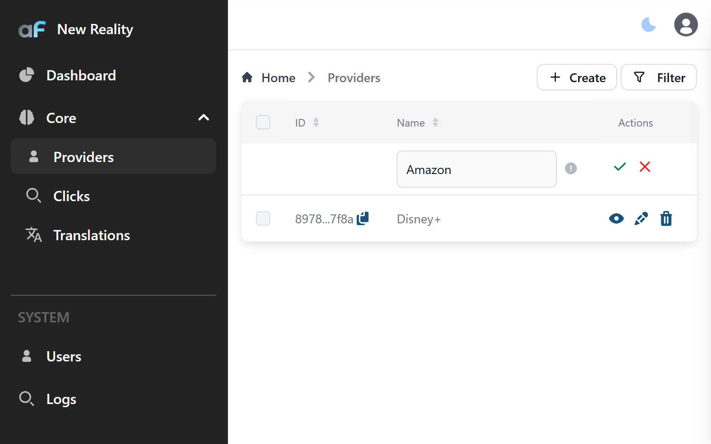

# Inline Create

The Inline Create plugin enables inline create in AdminForth, allowing users to create records directly in the list view.

## Installation

To install the plugin:

```bash
npm install @adminforth/inline-create --save
```


### Usage

Configure the plugin in your apartments resource file:

```typescript title="./resources/apartments.ts"
import InlineCreatePlugin from '@adminforth/inline-create';

// ... existing resource configuration ...

plugins: [
  new InlineCreatePlugin({}),
]
```

Here is how it looks:


