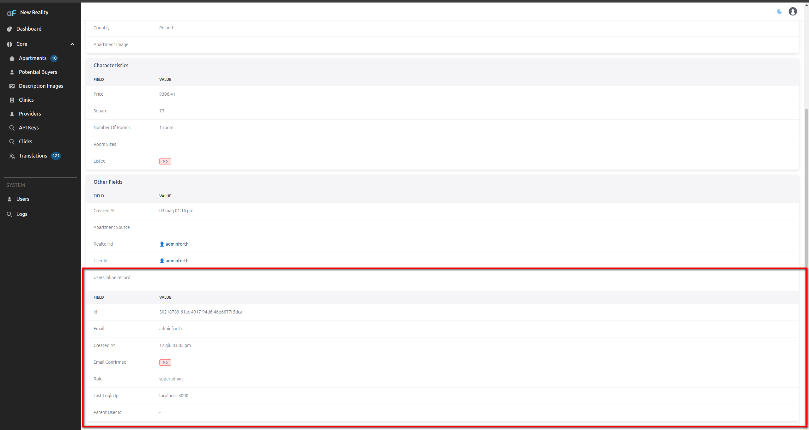

Allows to add an inline show of connected foreign resource records on a adminforth show page.

Foreign inline show plugin allows to display a show of items from a foreign table in the show view.

## Usage


Import plugin:

```bash
npm i @adminforth/foreign-inline-show --save
```

```ts title="./resources/adminuser.ts"
import ForeignInlineShowPlugin from '@adminforth/foreign-inline-show';
import { AdminForthResource, AdminForthResourceColumn } from 'adminforth';
```


In [Getting Started](<../001-gettingStarted.md>) we created a `'aparts'` resource which has a field `'realtor_id'`.
This field refers to record from `'adminuser'` resource. To remind you, we configured this relation using `foreignResource` setting in the column configuration:

```typescript title="./resources/apartments.ts"
// 
export default {
  resourceId: 'aparts',
  ...
  columns: [
    ...
    {
      name: 'realtor_id',
      foreignResource: {
        resourceId: 'adminuser',  // this means that aparts.realtor_id refers to primary key of 'adminuser' resource
                              // this is Many-To-One relatin: many aparts can refer to one user
      }
    }
  ],
}
```

This means that we can display a show of user in the apartments show view.

Add to your `'apartments'` resource configuration the plugin instance:

```ts title="./resources/apartments.ts"
{ 
    ...
    resourceId: 'aparts',
    ...
//diff-add
    plugins: [
//diff-add
      new ForeignInlineShowPlugin({
//diff-add
        foreignResourceId: 'users',
//diff-add
      }),
//diff-add
    ],
}
```



> 👆 To make plugin work, the specified resource (defined with `foreignResourceId`) should have one (and only one) column that refers to the current resource on which you add a plugin.
> In our case we add plugin to `adminuser` resource, so the `aparts` resource should have one column with `foreignResource.resourceId` equal to `adminuser` resourceId.