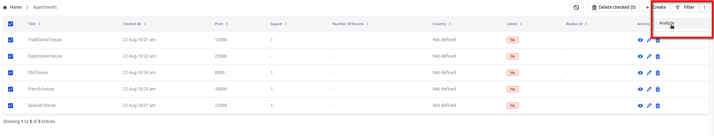
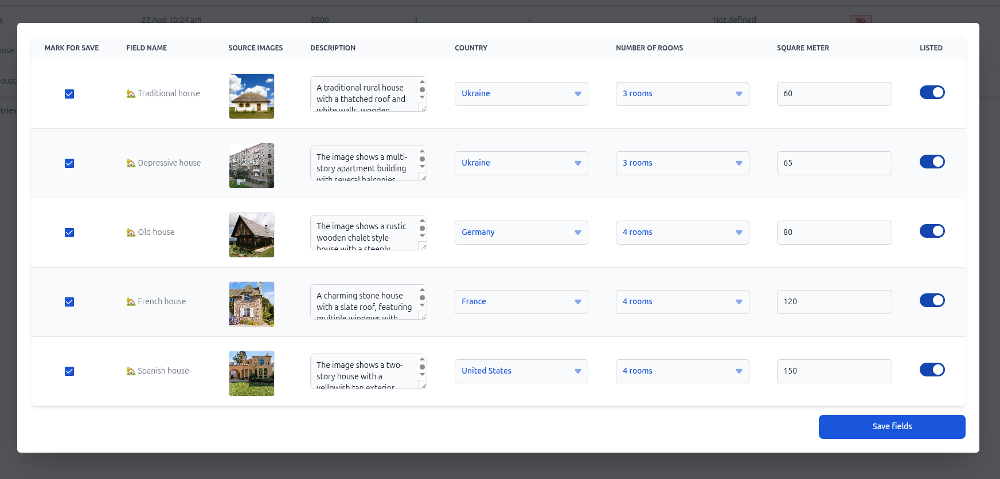
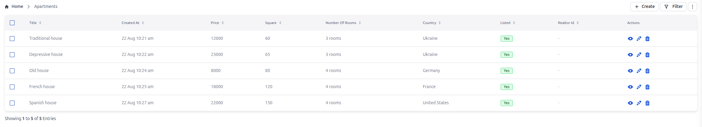

# Bulk AI Flow
This plugin allows filling fields in records based on data from other fields using AI.

## Installation

To install the plugin:

```bash
npm install @adminforth/bulk-ai-flow --save
```

You'll also need an image vision adapter:

```bash
npm install @adminforth/image-vision-adapter-openai --save
```


## Setup
Add a column for storing the URL or path to the image in the database, add this statement to the `./schema.prisma`:

```ts title="./schema.prisma"
model apartments {
  id                String     @id
  created_at        DateTime?
  title             String
  square_meter      Float?
  price             Decimal
  number_of_rooms   Int?
  description       String?
  country           String?
  listed            Boolean
  realtor_id        String?
//diff-add
  image_url         String?
}
```

Migrate prisma schema:

```bash
npm run makemigration -- --name add-apartment-image-url ; npm run migrate:local
```

Add credentials in your `.env.local` file:
```ts title=".env"
...

//diff-add
OPENAI_API_KEY=your_secret_openai_key

...
```


Add column to `aparts` resource configuration:

```ts title="./resources/apartments.ts"
//diff-add
import BulkAiFlowPlugin  from '@adminforth/bulk-ai-flow';
//diff-add
import AdminForthImageVisionAdapterOpenAi from '@adminforth/image-vision-adapter-openai';

export const admin = new AdminForth({
  ...
  resourceId: 'aparts',
  columns: [
    ...
//diff-add
    {
//diff-add
        name: 'image_url',
//diff-add
        label: 'Image',
//diff-add
        showIn: { list: false, create: true, edit: true},
//diff-add
    }
    ...
  ],
  plugins: [
    ...
  //diff-add
    plugins: [
    //diff-add
    new BulkAiFlowPlugin({
    //diff-add
      actionName: 'Analyze',
    //diff-add
      attachFiles: async ({ record }: { record: any }) => {
    //diff-add
        return [record.image_url];
    //diff-add
      },
    //diff-add
      adapter: new AdminForthImageVisionAdapterOpenAi(
    //diff-add
        {
    //diff-add
          openAiApiKey:  process.env.OPENAI_API_KEY as string,
    //diff-add
          model: 'gpt-4.1-mini',
    //diff-add
        }
    //diff-add
      ),
    //diff-add
      outputFields: [{ 
    //diff-add
        'description': 'describe what is in the image, also include fact that price is {{price}}', 
    //diff-add
        'country': 'In which country it can be located?', 
    //diff-add
        'number_of_rooms': 'How many rooms are in the apartment? If you do not know, just guess',
    //diff-add
        'square_meter': 'What is the square of the apartment in square meters? If you do not know, just guess',
    //diff-add
        'listed': 'Is the apartment should be listed for sale? If you do not know, just guess, return boolean value',
    //diff-add
      }],
    //diff-add
    }),
    //diff-add
  ],

  
  ...

});
```

## Usage
1. Select fields you want to fill
2. Click on the three dots menu
3. Click analyze 

4. Wait for finish analyze
5. Check and edit result

6. Save changhes

