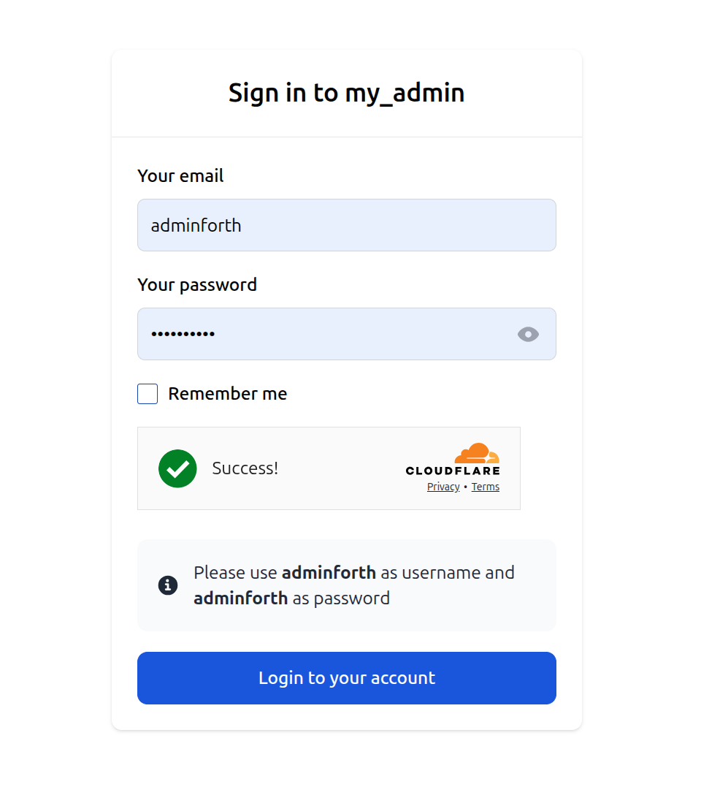

# Login Captcha

(this plugin experemental and not yet fully tested)

This plugin provides a captcha for the login page to enhance security.

## Installation

To install the plugin, run the following command:

```bash
npm i @adminforth/login-captcha
```

You will also need to install a captcha adapter. For example, to use the Cloudflare adapter, run:

```bash
npm i @adminforth/login-captcha-adapter-cloudflare
```

## Usage

To use the plugin, add it to your user resource file. Here's an example:

```ts template="./resources/adminuser.ts"
// Import the plugin and adapter
import CaptchaPlugin from "@adminforth/login-captcha";
import CaptchaAdapterCloudflare from "@adminforth/captcha-adapter-cloudflare";

...

// Add the plugin to the `plugins` array
plugins: [
    new CaptchaPlugin({ 
      captchaAdapter: new CaptchaAdapterCloudflare({
        siteKey: "YOUR_SITE_KEY", // Replace with your site key
        secretKey: "YOUR_SECRET_KEY", // Replace with your secret key
      }),
    }),
]
```

## Result

After setting up the plugin, your login page will include a captcha. Below is an example of how it will look:


