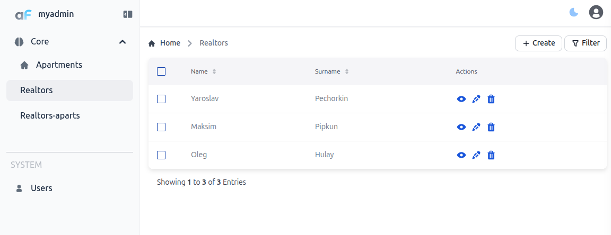
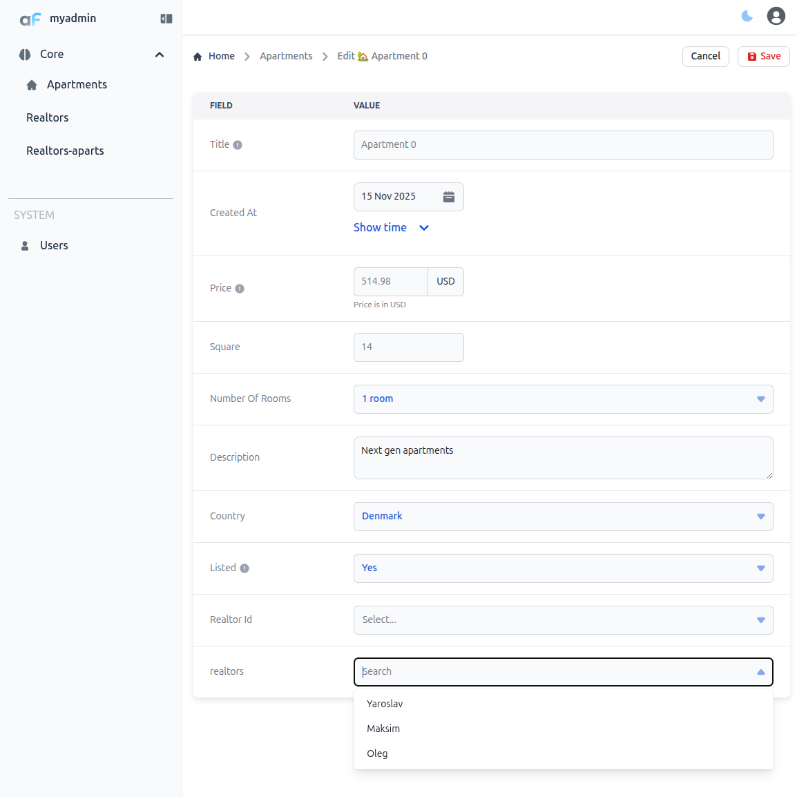
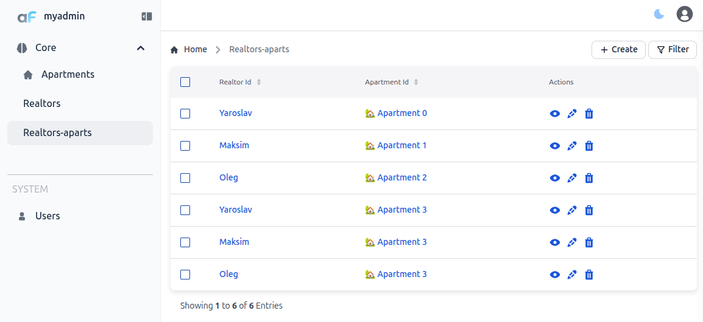

# Many2Many

This plugin lets you manage many-to-many relationships.

## Installation

Install the plugin:

```bash
npm i @adminforth/many2many
```

## Setting up

Let's say we want to implement a relationship where every apartment can have many realtors and each realtor can have many apartments.
We'll also need a junction resource to connect realtors and apartments.

First, create the `realtors` table and the junction table `realtorsAparts`:


```ts title="./schema.prisma"
//diff-add
model realtors {
  //diff-add
  id            String @id
  //diff-add
  name          String
  //diff-add
  surname       String
  //diff-add
}
//diff-add
model realtorsAparts {
  //diff-add
  id            String @id
  //diff-add
  realtorId     String
  //diff-add
  apartmentId   String
  //diff-add
}
```

Migrate the Prisma schema:

```bash 
npm run makemigration -- --name add-realtors-and-realtorsAparts; npm run migrate:local
```

Now create a resource for the realtors:

```ts title="./resources/realtors.ts"
import { AdminForthDataTypes, AdminForthResourceInput } from 'adminforth';

export default {
  dataSource: 'maindb',
  table: 'realtors',
  resourceId: 'realtors', 
  label: 'Realtors',
  recordLabel: (r) => ` ${r.name}`,
  columns: [
    {
      name: 'id',
      type: AdminForthDataTypes.STRING,
      label: 'Identifier',
      showIn: {
        list: false,
        edit: false,
        create: false,
      },
      primaryKey: true,
      fillOnCreate: ({ initialRecord, adminUser }) => Math.random().toString(36).substring(7),
    },
    {
      name: 'name',
      required: true,
      showIn: { all: true },
      type: AdminForthDataTypes.STRING,
      maxLength: 255,
      minLength: 3,
    },
    {
      name: "surname",
      required: true,
      showIn: { all: true },
      type: AdminForthDataTypes.STRING,
      maxLength: 100,
      minLength: 3,
    }
  ],
  options: {
    listPageSize: 12,
    allowedActions: {
      edit: true,
      delete: true,
      show: true,
      filter: true,
    },
  },
} as AdminForthResourceInput;
```

And one for the junction table `realtorsAparts`:

```ts title="./resources/realtorsAparts.ts"
import { AdminForthDataTypes, AdminForthResourceInput } from 'adminforth';

export default {
  dataSource: 'maindb',
  table: 'realtorsAparts',
  resourceId: 'realtorsAparts', 
  label: 'Realtors-aparts',
  columns: [
    {
      name: 'id',
      type: AdminForthDataTypes.STRING,
      label: 'Identifier',
      showIn: {
        list: false,
        edit: false,
        create: false,
      },
      primaryKey: true,
      fillOnCreate: ({ initialRecord, adminUser }) => Math.random().toString(36).substring(7),
    },
    {
      name: 'realtorId',
      foreignResource: { 
        resourceId: 'realtors', 
        searchableFields: ['name'], 
        searchIsCaseSensitive: true 
      }
    },
    {
      name: 'apartmentId',
      foreignResource: { 
        resourceId: 'aparts',
        searchableFields: ['title'],
        searchIsCaseSensitive: true 
      }
    },
  ],
  options: {
    listPageSize: 12,
    allowedActions: {
      edit: true,
      delete: true,
      show: true,
      filter: true,
    },
  },
} as AdminForthResourceInput;
```

Now add the plugin resources to the main config file:

```ts title="./index.ts"

//diff-add 
import realtorsResource from './resources/realtors.js';
//diff-add 
import realtorsApartsResource from './resources/realtorsAparts.js';

  ...


dataSources: [
    {
      id: 'maindb',
      url: `${process.env.DATABASE_URL}`
    },
  ],
  resources: [
    ...
    //diff-add
    realtorsResource,
    //diff-add
    realtorsApartsResource
  ]

  ...

  menu: [

    ...
    //diff-add
    {
      //diff-add
      label: 'Realtors',
      //diff-add
      resourceId: 'realtors'
      //diff-add
    },
    //diff-add
    {
      //diff-add
      label: 'Realtors-aparts',
      //diff-add
      resourceId: 'realtorsAparts'
      //diff-add
    },

    ...

  ]

```

Finally, add the plugin to the `apartments` resource:


```ts title="./resources/apartments.ts"
//diff-add
import Many2ManyPlugin from '@adminforth/many2many';

  ...

  plugins: [
    ...

    //diff-add
    new Many2ManyPlugin({
      //diff-add
      linkedResourceId: 'realtors',
      //diff-add
    })

    ...
  ]

  ...

```


The plugin is set up. Create some records in the `realtors` table:

Now, when creating an apartment, you can select (link) one or more realtors.

After saving the record, rows in the junction table are created automatically:



## Disable automatic cleanup of the junction table
By default, when you delete a realtor or an apartment, all related rows in the junction table are deleted automatically. To avoid this behavior, add:

```ts

  ...

    new Many2ManyPlugin({
      linkedResourceId: 'realtors',
      //diff-add
      dontDeleteJunctionRecords: true, // prevents automatic deletion of related junction rows
    })

  ...

```

## Making editable fields for the both resources

There might be cases, when you want to make fields editable on both resources. For these cases you can just create second instance of plugin on the second resource and it will allow you to use this plugin from the both resources.

```ts title="./resources/apartments.ts"
//diff-add
import Many2ManyPlugin from '@adminforth/many2many';

  ...

  plugins: [
    ...

    //diff-add
    new Many2ManyPlugin({
      //diff-add
      linkedResourceId: 'realtors',
      //diff-add
    })

    ...
  ]

  ...

```


and


```ts title="./resources/realtors.ts"
//diff-add
import Many2ManyPlugin from '@adminforth/many2many';

  ...

  plugins: [
    ...

    //diff-add
    new Many2ManyPlugin({
      //diff-add
      linkedResourceId: 'aparts',
      //diff-add
    })

    ...
  ]

  ...

```