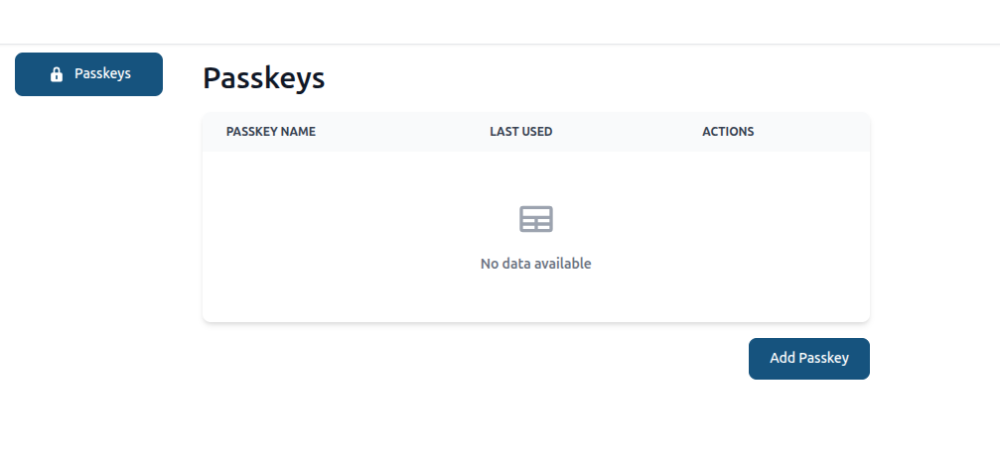
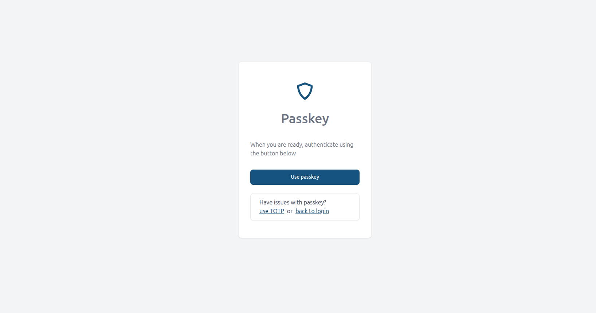

# Two-Factor Authentication Plugin

The Two-Factor Authentication Plugin provides an additional layer of security to the application by requiring users to provide a second form of authentication in addition to their password. This plugin supports  authenticator apps.

Plugin supports next 2FA methods:
- TOTP (Time-based One-Time Password) via authenticator apps (Google Authenticator, Authy, Microsoft Authenticator, etc)
- Upgrade to Passkeys (WebAuthn) alongside TOTP (with TOTP as alternative method)

Also it supports both:

- Multi-Factor Authentication (MFA): asking for 2FA on every login (or single WebAuthn passkey login)
- Step-Up MFA: asking for 2FA again on critical operations (custom actions, secure save etc)


## Installation

``` bash
npm i @adminforth/two-factors-auth --save
```

To import:

```ts title="/adminuser.ts"
import TwoFactorsAuthPlugin from '@adminforth/two-factors-auth';
```

Plugin required some additional setup, to make it work properly. It should be added to the resource auth resource. In our example we will add it to the user resource .

```ts title='./schema.prisma'
model adminuser {
  id            String     @id
  created_at    DateTime
  email         String   @unique
  role          String
  password_hash String
//diff-add
  secret2fa     String?
}
```

Then:

```bash
npm run makemigration -- --name add-2fa-secret ; npm run migrate:local
```

And add it to `adminuser.ts`

```ts tittle="./resources/adminuser.ts"
{
    table: 'adminuser',
//diff-add
    plugins: [
//diff-add
        new TwoFactorsAuthPlugin ({ twoFaSecretFieldName: 'secret2fa', timeStepWindow: 1 }),
//diff-add
    ],
    columns: [
        ...
//diff-add
        {
//diff-add
            name: 'secret2fa',
//diff-add
            showIn: { all: false },
//diff-add
            backendOnly: true,
//diff-add
        }
    ],
  }
```

> 💡 **Note**: Time-Step Size
>
> By default, `timeStepWindow` is set to `1`, which means the Two-Factor Authentication Plugin will check the current 30-second time-step, as well as one step before and after, to validate a TOTP code. This aligns with [RFC 6238](https://www.rfc-editor.org/rfc/rfc6238) best practices to accommodate slight clock drift between the server and the user's device.
>
> For example, if a code is generated between **12:00:00** and **12:00:30**, it will typically expire at **12:00:30**. However, with a `timeStepWindow` of `1`, the plugin will continue to accept it up to **12:00:59** (the “next” 30-second step), preventing users from being locked out if their device clock is a few seconds off. Once the clock hits **12:01:00**, that previous code will be treated as expired.
>
> If you find users frequently encountering code mismatches due to clock drift, you can increase `timeStepWindow` to `2`. **However, be cautious: larger windows can reduce overall security!**
>
> ❗ With a `timeStepWindow` set to `0`, the plugin will pass all the expired codes, which is not secure and should only be used for testing purposes.

Thats it! Two-Factor Authentication is now enabled:


## Disabling Two-Factor Authentication locally

If it is not convenient to enter the code every time during local development, you can disable Two-Factor Authentication for the dev environment using `usersFilterToApply` option:

```ts title='./index.ts'

    plugins: [
        new TwoFactorsAuthPlugin ({
          twoFaSecretFieldName: 'secret2fa',
//diff-add
          usersFilterToApply: (adminUser: AdminUser) => {
//diff-add
            // if this method returns true, 2FA will be enforced for this user, if returns false - 2FA will be disabled
//diff-add
            if (process.env.NODE_ENV === 'development') {
//diff-add
              return false;
//diff-add
            }
//diff-add
            return true;
//diff-add
          },
        }),
    ],
```

> Note: you can enable it temporarey while testing two-factor authentication flow locally and then disable.

## Select which users should use Two-Factor Authentication

By default plugin enforces Two-Factor Authentication for all users.

If you wish to enforce 2FA only for specific users, you can again use `usersFilterToApply` option:

```ts title='./adminuser.ts'
  usersFilterToApply: (adminUser: AdminUser) => {
    // disable 2FA for users which email is 'adminforth' or 'adminguest'
    return !(['adminforth', 'adminguest'].includes(adminUser.dbUser.email));
  },
```

Other users (for whom this function returns false) will not be even suggested to setup 2FA and it will be not requested for them, nor on login, nor on step-up MFA requests (such requests will be automatically passed for them without any popups)

### Control 2FA per-user via DB field

You can even add a boolean column to the user table to store whether the user should use 2FA or not:

In `schema.prisma`:

```ts title='./schema.prisma'
model adminuser {
  id            String     @id
  created_at    DateTime
  email         String   @unique
  role          String
  password_hash String
  secret2fa     String?
  //diff-add
  use2fa        Boolean?  @default(false)
}
```

Then run:

```bash
npm run makemigration -- --name add-use2fa ; npm run migrate:local
```

Then in `adminuser.ts`:


```ts title='./adminuser.ts'
{
    resourceId: 'adminuser',
    ...
    columns: [
        ...
        {
            name: 'use2fa',
        }
        ...
    ],
    options: {
      allowedActions: {
        delete: async ({ adminUser }: { adminUser: AdminUser }) => {
          // only superadmin can delete users
          return adminUser.dbUser.role === 'superadmin';
        },
        create: async ({ adminUser }: { adminUser: AdminUser }) => {
          // only superadmin can create users
          return adminUser.dbUser.role === 'superadmin';
        },
        edit: async ({ adminUser, meta }: { adminUser: AdminUser }) => {
          // user can modify only his own record
          const { oldRecord } = meta;
          return adminUser.dbUser.id === oldRecord.id;
        },
      }
    },
    plugins: [
        new TwoFactorsAuthPlugin ({
          twoFaSecretFieldName: 'secret2fa',
          usersFilterToApply: (adminUser: AdminUser) => {
            return adminUser.dbUser.use2fa;
          },
        }),
    ],
}
```

## Allow Specific Users to Skip Two-Factor Authentication Setup

By default, all users are required to setup Two-Factor Authentication if it is enabled (enforced).

If you want to allow specific users to **skip** the 2FA setup (but still suggest it as optional possibility), you can use the `usersFilterToAllowSkipSetup` option:

```ts title='./adminuser.ts'
...
plugins: [
  new TwoFactorsAuthPlugin ({
    twoFaSecretFieldName: 'secret2fa',
    ...
  //diff-add
    usersFilterToAllowSkipSetup: (adminUser: AdminUser) => {
      //diff-add
      // allow skip setup 2FA for users which email is 'adminforth' or 'adminguest'
      //diff-add
      return (['adminforth', 'adminguest'].includes(adminUser.dbUser.email));
      //diff-add
    },
  }),
],
...
```

So such users will have suggestion to setup 2FA, but will be able to skip it with "Skip for now" button.


## Step-Up MFA (Two-Factor re-authentication on critical operations)

### Request 2FA on custom Actions

You might want to to allow to call some custom critical/money related actions with additional 2FA approval. This eliminates risks caused by user cookies theft by some virous/doorway software after login.

To do it, first, create frontend custom component which wraps and intercepts click event to menu item, and in click handler do a call to `window.adminforthTwoFaModal.getCode(cb?)` frontend API exposed by this plugin. This is awaitable call wich shows 2FA popup and asks user to authenticate with 2nd factor (if passkey is enabled it will be suggested first, with ability to fallback to TOTP)

```ts title='/custom/RequireTwoFaGate.vue'
<template>
  <div class="contents" @click.stop.prevent="onClick">
    <slot />  <!-- render action default content - button/icon -->
  </div>
</template>

<script setup lang="ts">
  const emit = defineEmits<{ (e: 'callAction', payload?: any): void }>();
  const props = defineProps<{ disabled?: boolean; meta?: Record<string, any> }>();

  async function onClick() {
    if (props.disabled) {
      return;
    }
  
    const verificationResult = await window.adminforthTwoFaModal.get2FaConfirmationResult();  // this will ask user to enter code

    emit('callAction', { verificationResult }); // then we pass this verification result to action (from fronted to backend)
  }
</script>
```

Now we need to use verification result which we got from user on frontend, inside of backend action handler and verify that it is valid (and not expired):

```ts title='/adminuser.ts'
options: {
  actions: [
    {
      name: 'Auto submit',
      icon: 'flowbite:play-solid',
      allowed: () => true,
      action: async ({ recordId, adminUser, adminforth, response, extra }) => {
        //diff-add
        const verificationResult = extra?.verificationResult
        //diff-add
        if (!verificationResult) {
          //diff-add
          return { ok: false, error: 'No verification result provided' };
        //diff-add
        }
        //diff-add
        const t2fa = adminforth.getPluginByClassName<TwoFactorsAuthPlugin>('TwoFactorsAuthPlugin');
        //diff-add
        const result = await t2fa.verify(verificationResult, {
        //diff-add
          adminUser: adminUser,
        //diff-add
          userPk: adminUser.pk,
        //diff-add
          extra: extra,
        //diff-add
        });

        //diff-add
        if (!result?.ok) {
          //diff-add
          return { ok: false, error: result?.error ?? 'Provided 2fa verification data is invalid' };
          //diff-add
        }
        //diff-add
        await adminforth
        //diff-add
          .getPluginByClassName<AuditLogPlugin>('AuditLogPlugin')
          //diff-add
          .logCustomAction({
            //diff-add
            resourceId: 'aparts',
            //diff-add
            recordId: null,
            //diff-add
            actionId: 'visitedDashboard',
            //diff-add
            oldData: null,
            //diff-add
            data: { dashboard: 'main' },
            //diff-add
            user: adminUser,
            //diff-add
          });

          //your critical action logic 
      
        return { ok: true, successMessage: 'Auto submitted' };
      },
      showIn: { showButton: true, showThreeDotsMenu: true, list: true },
      //diff-add
      customComponent: '@@/RequireTwoFaGate.vue',
    },
  ],
}
```

### Request 2FA for create/edit (secure save gating)

To protect create and edit operations, use a Save Interceptor injected on the page to gate the save with 2FA, and forward the result to the backend for verification. This avoids wrapping the Save button and works with the default UI.

Frontend (Save Interceptor component injected via pageInjections):

```vue title='/custom/SaveInterceptor.vue'
<script setup>
import { useAdminforth } from '@/adminforth';

const { registerSaveInterceptor } = useAdminforth();

registerSaveInterceptor(async ({ action, values, resource }) => {
  // action is 'create' or 'edit'
  const modal = (window as any)?.adminforthTwoFaModal;
  if (modal?.get2FaConfirmationResult) {
    const confirmationResult = await modal.get2FaConfirmationResult('Confirm to save changes');
    if (!confirmationResult) {
      return { ok: false, error: 'Two-factor authentication cancelled' };
    }
    // Pass data to backend; the view will forward extra.confirmationResult to meta.confirmationResult
    return { ok: true, extra: { confirmationResult } };
  }
  else {
    throw new Error('No Two-Factor Authentication modal found, please ensure you have latest version of @adminforth/two-factors-auth installed and instantiated on resource');
  }
  return { ok: false, error: 'Two-factor authentication code is required' };
});
</script>

<template></template>
```

Resource injection (edit/create):

```ts
options: {
  pageInjections: {
    edit: { bottom: [{ file: '@@/SaveInterceptor.vue' }] },
    create: { bottom: [{ file: '@@/SaveInterceptor.vue' }] },
  }
}
```
Note: You can use any injection which executes JS on a page where Save bottom is rendered, not only bottom

Backend (resource hook verification):

```ts
// Inside resource config
hooks: {
  edit: {
    beforeSave: async ({ adminUser, adminforth, response, extra }) => {
      const t2fa = adminforth.getPluginByClassName('TwoFactorsAuthPlugin');
      if (!t2fa) {
        return { ok: false, error: 'TwoFactorsAuthPlugin is not configured' };
      }

      const confirmationResult = extra?.body?.meta?.confirmationResult;
      if (!confirmationResult) {
        return { ok: false, error: 'Two-factor authentication confirmation result is missing' };
      }

      const verifyRes = await t2fa.verify(confirmationResult, {
        adminUser,
        userPk: adminUser.pk,
        extra
      });
      if (!verifyRes || 'error' in verifyRes) {
        return { ok: false, error: verifyRes?.error || 'Two-factor verification failed' };
      }
      return { ok: true };
    },
  },
  create: {
    beforeSave: async ({ adminUser, adminforth, response, extra }) => {
      const t2fa = adminforth.getPluginByClassName('TwoFactorsAuthPlugin');
      if (!t2fa) {
        return { ok: false, error: 'TwoFactorsAuthPlugin is not configured' };
      }

      const confirmationResult = extra?.body?.meta?.confirmationResult;
      if (!confirmationResult) {
        return { ok: false, error: 'Two-factor authentication confirmation result is missing' };
      }

      const verifyRes = await t2fa.verify(confirmationResult, {
        adminUser,
        userPk: adminUser.pk,
        extra
      });
      if (!verifyRes || 'error' in verifyRes) {
        return { ok: false, error: verifyRes?.error || 'Two-factor verification failed' };
      }
      return { ok: true };
    },
  },
}
```

This approach ensures 2FA cannot be bypassed by calling the API directly:
- The client collects verification via the Save Interceptor and forwards it under `meta.confirmationResult`.
- The server validates it in `beforeSave` with access to `extra.cookies` and the `adminUser`.

### Request 2FA from custom components

Imagine you have some button which does some API call

```ts
<template>
  <Button @click="callAdminAPI">Call critical API</Button>
</template>
  

<script setup lang="ts">
import { callApi } from '@/utils';

async function callAdminAPI() {
  const verificationResult = await window.adminforthTwoFaModal.get2FaConfirmationResult();

  const res = await callApi({
    path: '/myCriticalAction',
    method: 'POST',
    body: {
      param: 1
    },
  });
}
</script>
```

On backend you have simple express api

```ts
app.post(`${ADMIN_BASE_URL}/myCriticalAction`,
  admin.express.authorize(
    async (req: any, res: any) => {

      // ... your critical logic ...

      return res.json({ ok: true, successMessage: 'Action executed' });
    }
  )
);
```

You might want to protect this call with a second factor also. To do it, we need to make this change

```ts
<template>
  <Button @click="callAdminAPI">Call critical API</Button>
</template>
  

<script setup lang="ts">
import { callApi } from '@/utils';
import { useAdminforth } from '@/adminforth';

const { alert } = useAdminforth();

async function callAdminAPI() {
  // diff-add
  const verificationResult = await window.adminforthTwoFaModal.get2FaConfirmationResult();

  const res = await callApi({
    path: '/myCriticalAction',
    method: 'POST',
    body: {
      param: 1,
  // diff-add
      verificationResult: String(verificationResult)
    },
  });

  // diff-add
  if (!res?.ok) {
  // diff-add
    alert({ message: res.error, variant: 'danger' });
  // diff-add
  }
}
</script>

```

And on API call we need to verify it:


```ts
app.post(`${ADMIN_BASE_URL}/myCriticalAction`,
  admin.express.authorize(
    async (req: any, res: any) => {

      // diff-add
      const { adminUser } = req;
      // diff-add
      const { param, verificationResult } = req.body ?? {};
      // diff-add
      const t2fa = admin.getPluginByClassName<TwoFactorsAuthPlugin>('TwoFactorsAuthPlugin');
      // diff-add
      const verifyRes = await t2fa.verify(verificationResult, {
      // diff-add
        adminUser: adminUser,
      // diff-add
        userPk: adminUser.pk,
      //diff-add
        extra: {...req.headers, ...req.cookies, response: res},
      //diff-add
      });
      // diff-add
      if (!('ok' in verifyRes)) {
      // diff-add
        return res.status(400).json({ ok: false, error: verifyRes.error || 'Verification failed' });
      // diff-add
      }
      // diff-add
      await admin.getPluginByClassName<AuditLogPlugin>('AuditLogPlugin').logCustomAction({
      // diff-add
        resourceId: 'aparts',
      // diff-add
        recordId: null,
      // diff-add
        actionId: 'myCriticalAction',
      // diff-add
        oldData: null,
      // diff-add
        data: { param },
      // diff-add
        user: adminUser,
      // diff-add
      });

      // ... your critical logic ...

      return res.json({ ok: true, successMessage: 'Action executed' });
    }
  )
);
```

### Step-Up Authentication Grace Period

By default, step-up authentication is required every time the user performs a critical operation.

Most of critical operation should not be often and should be carefully prefiltered. For example small money transfers should be confirmed without 2FA request (you implement it in logics), while big ones e.g. > threshold should require 2FA every time.

If it is still inconvenient for admins who perform multiple critical actions in a short period to confirm 2FA often. To reduce the issue (by lowering security level), you can enable grace period between step-up authentication requests:


```ts title='./adminuser.ts'
    new TwoFactorsAuthPlugin ({
      twoFaSecretFieldName: 'secret2fa',
      ...
      //diff-add
      stepUpMfaGracePeriodSeconds: 300, // 5 minutes grace period
      ...
    }),
```

This configuration still remembers user browser fingerprint and IP address, and if at least one of them changes, it will ask for 2FA again, ignoring grace period. 


Any popups asking for 2FA would be automatically resolved during grace period without user interaction if both browser fingerprint and IP address are the same as during last successful 2FA and time since last 2FA is less than grace period.

> 💡** Note ** We strongly do not recommend using this feature because it increases blast radius for MitB, Cookie parsing/decoding Stealer malwares and Remote Browser Control (device controlling attacks). None of these attacks are fixed compleately by 2FA when you are not using grace period, but using grace period makes these attacks easier to perform.
> Instead we recommend to reducing number of critical operations requiring 2FA by carefully prefiltering them.

> For example when user upgraded to Webauthn (Passkey) and uses Passkey to confirm operation, any of device-controlling attacks has blast radius of single operation only, because Passkey is used per one operation and cannot be reused later without a new user guesture, but when grace period is used, attacker might wait for user to confirm operation once and then perform multiple operations during grace period without 2FA.

> 💡** Interesting fact **: for those of your admins who use TOTP, even without grace period, device controlling attacks have blast radius of multiple operations, because TOTP code can be reused multiple times during its validity period (30 seconds). 
> This plugin, even when Webauthn is activated, still allows users to confirm any action with TOTP (mainly  to prevent "Lost account" scenarios), but at moment of victim device controlling attack, the negative TOTP's impact will happen only in case if admin enters TOTP code, so if admin uses Passkey at exact operation blast radius is limited to single operation only.


## Custom label prefix in authenticator app

By default label prefix in Authenticator app is formed from Adminforth [brandName setting](/docs/tutorial/Customization/branding/) which is best behaviour for most admin apps (always remember to configure brandName correctly e.g. "RoyalFinTech Admin") 
If you want to have custom label prefix for some reason: 

```ts label="./adminuser"
  plugins: [
    new TwoFactorsAuthPlugin ({
      twoFaSecretFieldName: 'secret2fa',
        ...
      customBrandPrefix: "TechStore",
    }),
  ],
```

## Passkeys setup (WebAuthn) alongside TOTP

If you want to use both passkeys and TOTP simultaneously, you can set them up as follows:

First, you need to create a passkeys table in your schema.prisma file:

```ts title='./schema.prisma'
  //diff-add
  model passkeys {
    //diff-add
    id                      String @id
    //diff-add
    credential_id           String  
    //diff-add
    user_id                 String
    //diff-add
    meta                    String
    //diff-add
    @@index([user_id])
    //diff-add
    @@index([credential_id])
    //diff-add
  }
```
>☝️Use string data type for credential_id and meta fields

And make migration:

```bash
npm run makemigration -- --name add-passkeys ; npm run migrate:local
```

Next, you need to create a new resource for passkeys:

```ts title='./resources/passkeys.ts'
  import { AdminForthDataTypes, AdminForthResourceInput } from "adminforth";
  import { randomUUID } from "crypto";

  export default {
    dataSource: 'maindb',
    table: 'passkeys',
    resourceId: 'passkeys',
    label: 'Passkeys',
    columns: [
      {
        name: 'id',
        label: 'ID',
        primaryKey: true,
        showIn: { all: false},
        fillOnCreate: () => randomUUID(),
      },
      {
        name: 'credential_id',
        label: 'Credential ID',
      },
      {
        name: 'user_id',
        label: 'User ID',
      },
      {
        name: "meta",
        type: AdminForthDataTypes.JSON,
        label: "Meta",
      }
    ],
    plugins: [],
    options: {},
  } as AdminForthResourceInput;
```

Add the new resource to index.ts:

```ts title='./index.ts'
    ...
  //diff-add
  import passkeysResource from './resources/passkeys.js';
    ...

  resources: [
    ...
    //diff-add
    passkeysResource,
    ...
  ],
```
To use passkey you need to use Key-Value adapter. For example:
```bash
npm i @adminforth/key-value-adapter-ram
```


Now, update the settings of the Two-Factor Authentication plugin:

```ts tittle='./resources/adminuser.ts'

  //diff-add
  import RamKeyValueAdapter from '@adminforth/key-value-adapter-ram'

  ...

  plugins: [
    new TwoFactorsAuthPlugin ({ 
      keyValueAdapter: new RamKeyValueAdapter(),
      twoFaSecretFieldName: 'secret2fa', 
      timeStepWindow: 1,       
      //diff-add
      passkeys: {
        //diff-add
        credentialResourceID: "passkeys",
        //diff-add
        credentialIdFieldName: "credential_id",
        //diff-add
        credentialMetaFieldName: "meta",
        //diff-add
        credentialUserIdFieldName: "user_id",
        //diff-add
        settings: {
          // diff-add
          expectedOrigin: "http://localhost:3500",   // important, set it to your backoffice origin (starts from scheme, no slash at the end)
          //diff-add
          // relying party config
          //diff-add
          rp: {
              //diff-add
              name: "New Reality",
              
              //diff-add
              // optionaly you can set expected id explicitly if you need to:
              //diff-add
              // id: "localhost",
              //diff-add
            },
            //diff-add
            user: {
              //diff-add
                nameField: "email",
                //diff-add
                displayNameField: "email",
                //diff-add
            },
            //diff-add
            authenticatorSelection: {
              // diff-add
              // impacts a way how passkey will be created
              // diff-add
              // - platform - using browser internal authenticator (e.g. Google Chrome passkey / Google Password Manager )
              // diff-add
              // - cross-platform - using external authenticator (e.g. Yubikey, Google Titan etc)
              // diff-add
              // - both - plging will show both options to the user
              // diff-add
              // Can be "platform", "cross-platform" or "both"
              // diff-add
                authenticatorAttachment: "both",
                //diff-add
                requireResidentKey: true,
                //diff-add
                userVerification: "required",
                //diff-add
            },
            //diff-add
        },
        //diff-add
      } 
    }),
  ],
```

> ☝️ most likely you should set `passkeys.settings.expectedOrigin` from your process.env depending on your env (e.g. http://localhost:3500 for local dev, https://admin.yourproduct.com for production etc)


> 💡**Note** By default `passkeys.settings.rp.id` is generated from the expectedOrigin so you don't need to set it
> unless you know what you are doing. Manual setting might be needed for sub-domains isolation.
> By default, if you set expected origin to https://localhost:3500 it will use "localhost" as rpid
> If you set origin to https://myadmin.myproduct.com -> it will use  "myadmin.myproduct.com"  as rpid 

The setup is complete. To create a passkey:

> 1) Go to the user menu
> 2) Click settings
> 3) Select "passkeys"

 

> 4) Add passkey

 


After adding passkey you can use passkey, instead of TOTP:

 

> 💡 **Note**: Adding a passkey does not remove the option to use TOTP. If you lose access to your passkey, you can log in using TOTP and reset your passkey.


