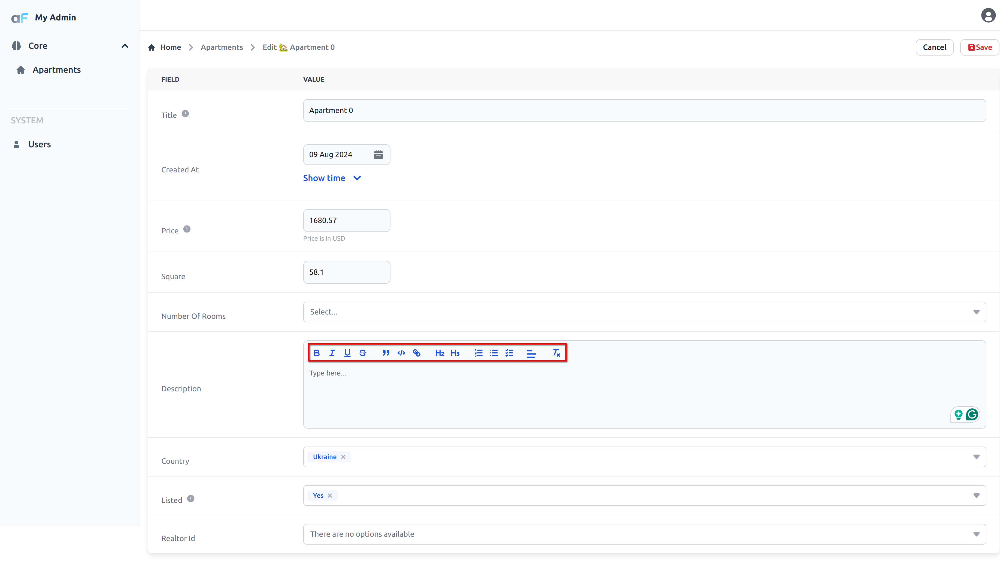

# Rich editor

Under the hood this plugin uses [Quill](https://quilljs.com/). Quill is a free, open source WYSIWYG editor built for the modern web.

This plugin allows you to use Quill editor in your AdminForth application.

## Usage

First, install the plugin:

```bash
npm i @adminforth/rich-editor --save
```

Import plugin:

```ts title="./resources/apartments.ts"
import RichEditorPlugin from "@adminforth/rich-editor";
```

Now instantiate the plugin and add it to the configuration:

```ts title="./resources/apartments.ts"

{
  ...
  resourceId: 'aparts',
  columns: [
    ...
    {
      name: 'description',
//diff-add
      type: AdminForthDataTypes.TEXT, // like plain AdminForthDataTypes.TEXT but renders HTML in show/list views
      components: {
        show: "@/renderers/RichText.vue",
        list: "@/renderers/RichText.vue",
      },
      ...
    }
    ...
  ],
  ...
  plugins: [
    ...
//diff-add
    new RichEditorPlugin({
//diff-add
      htmlFieldName: 'description',
//diff-add
    }),
    ...
  ],
}
```

Now you can see Quill editor in the `description` field in the edit view:



# Multiple editors in one resource

If you need multiple fields in one resource which happens rarely, just add multiple instances of the plugin:

```ts title="./resources/apartments.ts"
{
  ...
  resourceId: 'promotion',
  columns: [
    ...
    {
      name: 'short_description',
      type: AdminForthDataTypes.TEXT,
      components: {
        list: "@/renderers/RichText.vue",
        show: "@/renderers/RichText.vue",
      }
      ...
    },
    {
      name: 'full_description',
      type: AdminForthDataTypes.TEXT,
      components: {
        list: "@/renderers/RichText.vue",
        show: "@/renderers/RichText.vue",
      }
      ...
    }
    ...
  ],
  ...
  plugins: [
    ...
    new QuillEditorPlugin({
      htmlField: 'short_description',
    }),
    new QuillEditorPlugin({
      htmlField: 'full_description',
    }),
    ...
  ],
}
```

## Completion

First, install the completion adapter:

```bash
npm i @adminforth/completion-adapter-open-ai-chat-gpt --save
```

To get completion suggestions for the text in the editor, you can use the `completion` option. This option is an object with the following properties:

```ts title="./resources/apartments.ts"
//diff-add
  import CompletionAdapterOpenAIChatGPT from "@adminforth/completion-adapter-open-ai-chat-gpt";

  new RichEditorPlugin({
      htmlFieldName: 'description',
//diff-add
      completion: {
//diff-add
        adapter: new CompletionAdapterOpenAIChatGPT({
//diff-add
          openAiApiKey: process.env.OPENAI_API_KEY as string,
//diff-add
          model: 'gpt-5-nano', //gpt-5-nano is a default (cheapest one)
          extraRequestBodyParameters: {
//diff-add
            temperature: 0.7 //Model temperature
//diff-add
          }
//diff-add
        }),
//diff-add
        expert: {
//diff-add
          debounceTime: 250,
//diff-add
        }
//diff-add
      }
    }),
```


### Images in Rich editor

First, you need to create resource for images:
```prisma title="schema.prisma"
model description_image {
    id          String   @id
    created_at  DateTime
    resource_id String
    record_id   String
    image_path  String
}
```

```bash
npm run makemigration -- --name add_description_image ; npm run migrate:local
```

```bash
npm i @adminforth/upload --save
npm i @adminforth/storage-adapter-local --save
```

```typescript title="./resources/description_images.ts"
import AdminForthStorageAdapterLocalFilesystem from "@adminforth/storage-adapter-local";
import { AdminForthResourceInput } from "adminforth";
import UploadPlugin from "@adminforth/upload";
import { randomUUID } from 'crypto';

export default {
  dataSource: "maindb",
  table: "description_image",
  resourceId: "description_images",
  label: "Description images",
  columns: [
    {
      name: "id",
      primaryKey: true,
      required: false,
      fillOnCreate: ({ initialRecord }: any) => randomUUID(),
      showIn: {
        create: false,
      },
    },
    {
      name: "created_at",
      required: false,
      fillOnCreate: ({ initialRecord }: any) => new Date().toISOString(),
      showIn: {
        create: false,
      },
    },
    { name: "resource_id", required: false },
    { name: "record_id", required: false },
    { name: "image_path", required: false },
  ],
  plugins: [
    new UploadPlugin({
      pathColumnName: "image_path",
      
      // rich editor plugin supports only 'public-read' ACL images for SEO purposes (instead of presigned URLs which change every time)
      storageAdapter: new AdminForthStorageAdapterLocalFilesystem({
        fileSystemFolder: "./db/uploads/description_images", // folder where files will be stored on disk
        adminServeBaseUrl: "static/source", // the adapter not only stores files, but also serves them for HTTP requests
        mode: "public", // public if all files should be accessible from the web, private only if could be accesed by temporary presigned links
        signingSecret: process.env.ADMINFORTH_SECRET, // secret used to generate presigned URLs
      }),
  
      allowedFileExtensions: [
        "jpg",
        "jpeg",
        "png",
        "gif",
        "webm",
        "exe",
        "webp",
      ],
      maxFileSize: 1024 * 1024 * 20, // 20MB


      filePath: ({ originalFilename, originalExtension, contentType }) =>
        `description_images/${new Date().getFullYear()}/${randomUUID()}/${originalFilename}.${originalExtension}`,


    }),
  ],
} as AdminForthResourceInput;
```
Next, add new resource to `index.ts`:

```typescript title="./index.ts"
import descriptionImage from './resources/description_images.js';

...

  resources: [
    usersResource,
    apartments,
    // diff-add
    descriptionImage
  ],
```

Next, add attachments to RichEditor plugin:

```typescript title="./resources/apartments.ts"
import RichEditorPlugin from '@adminforth/rich-editor';

// ... existing resource configuration ...

new RichEditorPlugin({
  htmlFieldName: 'description',
  attachments: {
    attachmentResource: "description_images",
    attachmentFieldName: "image_path",
    attachmentRecordIdFieldName: "record_id",
    attachmentResourceIdFieldName: "resource_id",
  }
})
