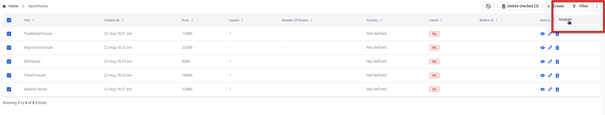
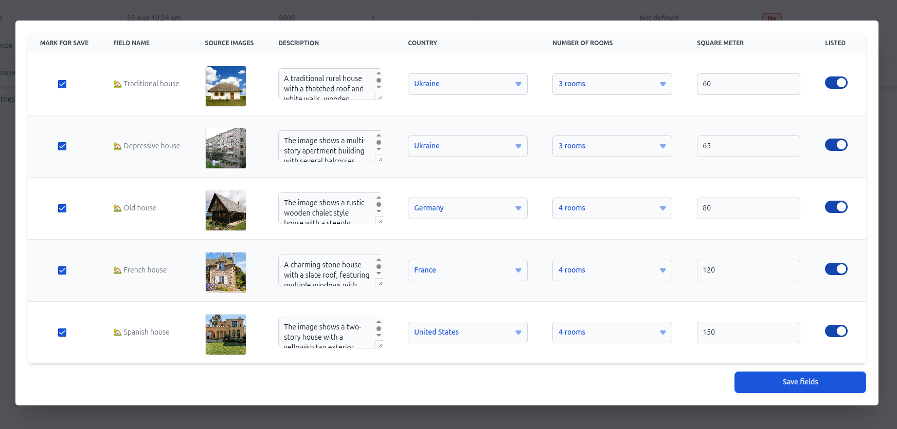
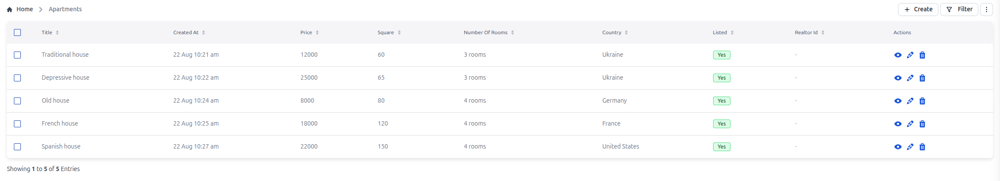
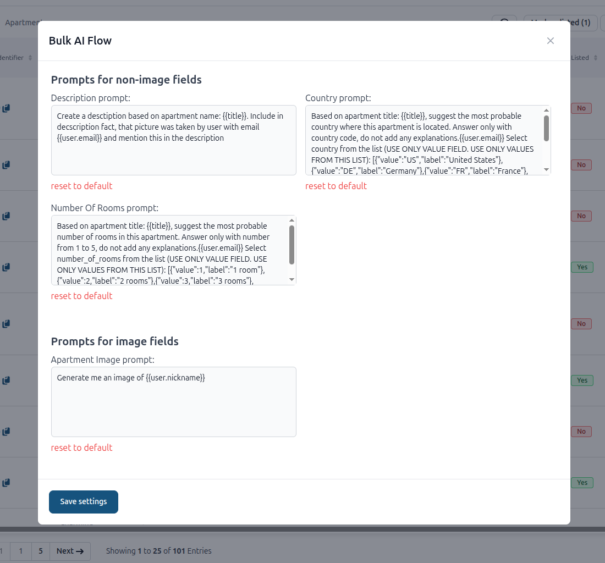

# Bulk AI Flow

This plugin allows filling fields in multiple selected records based on data from other fields using LLM.
This also supports vision tasks so you can ask it to e.g. detect dominant color on image or describe what is on the image. Plugin supports classification to enum options automatically.

## Installation

To install the plugin:

```bash
npm install @adminforth/bulk-ai-flow --save
```

You'll also need an image vision adapter:

```bash
npm install @adminforth/image-vision-adapter-openai --save
```


## Vision mode

This mode covers next generations:

```
- Image(one or many fields) -> to -> Text/Number/Enum/Boolean(one or many fields)
- Image(one or many fields) + Text/Number/Enum/Boolean(one or many fields) -> to -> Text/Number/Enum/Boolean(one or many fields)
```

Lets try both. Add a column for storing the URL or path to the image in the database, add this statement to the `./schema.prisma`:

```ts title="./schema.prisma"
model apartments {
  id                String     @id
  created_at        DateTime?
  title             String
  square_meter      Float?
  price             Decimal
  number_of_rooms   Int?
  description       String?
  country           String?
  listed            Boolean
  realtor_id        String?
//diff-add
  apartment_image   String?
}
```

Migrate prisma schema:

```bash
npm run makemigration -- --name add-apartment-image-url ; npm run migrate:local
```

We will also attach [upload plugin](/docs/tutorial/Plugins/05-0-upload/) to this field.


Add credentials in your `.env` file:
```ts title=".env"
...

//diff-add
OPENAI_API_KEY=your_secret_openai_key

...
```


Add column to `aparts` resource configuration:

```ts title="./resources/apartments.ts"
//diff-add
import BulkAiFlowPlugin  from '@adminforth/bulk-ai-flow';
//diff-add
import AdminForthImageVisionAdapterOpenAi from '@adminforth/image-vision-adapter-openai';
//diff-add
import UploadPlugin from '@adminforth/upload';
//diff-add
import { randomUUID } from 'crypto';
//diff-add
import AdminForthAdapterS3Storage from '@adminforth/storage-adapter-amazon-s3'

export const admin = new AdminForth({
  ...
  resourceId: 'aparts',
  columns: [
    ...
//diff-add
    {
//diff-add
        name: 'apartment_image',
//diff-add
        label: 'Image',
//diff-add
        showIn: { list: false, create: true, edit: true},
//diff-add
    }
    ...
  ],
  plugins: [
    ...
  //diff-add
      new UploadPlugin({
  //diff-add
        storageAdapter: new AdminForthAdapterS3Storage({
  //diff-add
          bucket: process.env.AWS_BUCKET_NAME,
  //diff-add
          region: process.env.AWS_REGION,
  //diff-add
          accessKeyId: process.env.AWS_ACCESS_KEY_ID,
  //diff-add
          secretAccessKey: process.env.AWS_SECRET_ACCESS_KEY,
  //diff-add
          s3ACL: 'public-read',
  //diff-add
        }),
  //diff-add
        pathColumnName: 'apartment_image',
  //diff-add
        allowedFileExtensions: ['jpg', 'jpeg', 'png', 'gif', 'webm', 'webp'],
  //diff-add
        filePath: ({originalFilename, originalExtension, contentType}) => 
  //diff-add
              `aparts/${new Date().getFullYear()}/${randomUUID()}-${originalFilename}.${originalExtension}`,
  //diff-add
      }),

      //diff-add
      new BulkAiFlowPlugin({
      //diff-add
        actionName: 'Analyze',
      //diff-add
        attachFiles: async ({ record }: { record: any }) => {
      //diff-add
        if (!record.apartment_image) {
      //diff-add
          return [];
      //diff-add
        }
      //diff-add
          return [`https://tmpbucket-adminforth.s3.eu-central-1.amazonaws.com/${record.apartment_image}`];
      //diff-add
        },
      //diff-add
        visionAdapter: new AdminForthImageVisionAdapterOpenAi(
      //diff-add
          {
      //diff-add
            openAiApiKey:  process.env.OPENAI_API_KEY as string,
      //diff-add
            model: 'gpt-5-mini',
      //diff-add
          }
      //diff-add
        ),
      //diff-add
        fillFieldsFromImages: { 
      //diff-add
          'description': 'describe what is in the image, also take into account that price is {{price}}', 
      //diff-add
          'country': 'In which country it can be located?', 
      //diff-add
          'number_of_rooms': 'How many rooms are in the apartment? Just try to guess what is a typical one. If you do not know, just guess',
      //diff-add
          'square_meter': 'Try to guess what is the typical square of the apartment in square meters? If you do not know, just guess',
      //diff-add
          'listed': 'Is the apartment should be listed for sale? If you do not know, just guess, return boolean value',
      //diff-add
        },
      //diff-add
      }),
      //diff-add
    ],

  
  ...

});
```
> ⚠️ Make sure your attachFiles function returns a valid array of image URLs or an empty array. Returning anything else may cause an error.

## Usage
1. Select fields you want to fill
2. Click on the three dots menu
3. Click analyze 

4. Wait for finish analyze
5. Check and edit result

6. Save changhes



## Text-to-Text Processing
This is the most basic plugin usage. You can connect any text completion adapter to fill one or several string/number/boolean fields from other fields.

### Example: Translate Names to English
Normalize user names by translating them from any language to English for internal processing.

```ts
import CompletionAdapterOpenAIChatGPT from '@adminforth/completion-adapter-open-ai-chat-gpt/index.js';

// Add to your resource plugins array
new BulkAiFlowPlugin({
  actionName: 'Translate surnames',
  textCompleteAdapter: new CompletionAdapterOpenAIChatGPT({
    openAiApiKey: process.env.OPENAI_API_KEY as string,
    model: 'gpt-5-nano',
    extraRequestBodyParameters: {
      temperature: 0.7
    }
  }),
  fillPlainFields: {
    'full_name_en': 'Translate this name to English: {{users_full_name}}',
  },
}),
```

## Image-to-Text Analysis (Vision)
Analyze images and extract information to fill text, number, enum, or boolean fields.

### Example: Age Detection from Photos

```ts
import AdminForthImageVisionAdapterOpenAi from '@adminforth/image-vision-adapter-openai/index.js';

// Add to your resource plugins array
new BulkAiFlowPlugin({
  actionName: 'Guess age',
  visionAdapter: new AdminForthImageVisionAdapterOpenAi({
    openAiApiKey: process.env.OPENAI_API_KEY as string,
    model: 'gpt-5-mini',
  }),
  fillFieldsFromImages: { 
    'age': 'Analyze the image and estimate the age of the person. Return only a number.',
  },
  attachFiles: async ({ record }) => {
    if (!record.image_url) {
      return [];
    }
    return [`https://users-images.s3.eu-north-1.amazonaws.com/${record.image_url}`];
  },
}),
```

## Text-to-Image generation or image editing
Generate new images based on existing data and/or images using AI image generation adapters.

### Example: Creating Cartoon Avatars

```ts
import ImageGenerationAdapterOpenAI from '@adminforth/image-generation-adapter-openai/index.js';

// Add to your resource plugins array
new BulkAiFlowPlugin({
  actionName: 'Generate cartoon avatars',
  imageGenerationAdapter: new ImageGenerationAdapterOpenAI({
    openAiApiKey: process.env.OPENAI_API_KEY as string,
    model: 'gpt-image-1.5',
  }),
  attachFiles: async ({ record }) => {
    if (!record.user_photo) {
      return [];
    }
    return [`https://bulk-ai-flow-playground.s3.eu-north-1.amazonaws.com/${record.users_photo}`];
  },
  generateImages: {
    users_avatar: {
      prompt: 'Transform this photo into a cartoon-style avatar. Maintain the person\'s features but apply cartoon styling. Do not add text or logos.',
      outputSize: '1024x1024',
      countToGenerate: 2,
      rateLimit: '3/1h'
    },
  },
  bulkGenerationRateLimit: "1/1h"
}),
```

## Rate Limiting and Best Practices

- Use `rateLimit` for individual image generation operations and for the bulk image generation
```ts
  new BulkAiFlowPlugin({
  ...

  generateImages: {
    users_avatar: {
      ... //image re-generation limits
      //diff-add
      rateLimit: '1/5m' // one request per 5 minutes
    }
  },

  ...

  //diff-add
  rateLimits: { // bulk generation limits
  //diff-add
    fillFieldsFromImages: "5/1d", // 5 requests per day
  //diff-add
    fillPlainFields: "3/1h",      // 3 requests per one hour
  //diff-add
    generateImages: "1/2m",       // 2 request per one minute
  //diff-add
  }

  ...

  })
```

- Consider using lower resolution (`512x512`) for faster generation and lower costs
- Test prompts thoroughly before applying to large datasets

## Comparing new and old images

If you want to compare a generated image with an image stored in your storage, you need to add the preview prop in your upload plugin setup:

```ts
  new UploadPlugin({
        ...
    //diff-add
    preview: {
    //diff-add
      previewUrl: ({filePath}) => `https://static.my-domain.com/${filePath}`,
    //diff-add
    }
        ...
  })
```
After generation, you’ll see a button labeled "old image". Clicking it will open a pop-up where you can compare the generated image with the stored one:


## Extra data fields

When creating default prompts, you can use Handlebars to pass data from the record into the prompt:

```ts
  ...
  fillPlainFields: { 
    description: 'Create a description based on the apartment name: {{title}}.'
  },
  ...
```

Each record will receive a unique prompt based on its own title.

If you want to add extra data fields for use in your prompt, implement the `provideAdditionalContextForRecord` callback:

```ts
provideAdditionalContextForRecord({ record, adminUser, resource }) {
  const extraData: any = {};
  if (record.country === 'Spain') {
    // Your logic
    // e.g. extraData.discount = '10%';
  } else {
    // Your logic
  }
  return extraData;
},
fillPlainFields: { 
  description: 'Create a description based on the apartment name: {{title}}. Also include the fact that the apartment has a discount of {{extraData.discount}}.'
},
```

## Allow users to edit generation prompts

If you want to let users adjust generation prompts for their unique cases, add this to the plugin setup:

```ts
...
//diff-add
askConfirmationBeforeGenerating: true,
...
```

The user will now see a popup with a "Start generation" button and an "Edit prompts" button, allowing them to modify the prompt before running it.




> ☝️ Updated prompts are stored in the user's local storage. Changes are local to that browser and do not affect other users or devices.

## Processing big sets of data ( filtered records )

There might be cases when you want to process more records than can fit your list view.
Here you can use the `recordSelector` param.
It can be `checkbox` (default) or `filtered`.
`filtered` uses all filtered records for generation, so you can even process the whole resource.


```ts
        new BulkAiFlowPlugin({          
          actionName: 'Generate description and Price',

          //diff-add
          recordSelector: 'filtered', // default is 'checkbox'

          ...

        });
```
>❗️❗️❗️ Using `recordSelector: 'filtered'` might be expensive. Before processing large data sets, we recommend starting with smaller sets to make sure everything is fine.


## Limiting amount of parallel requests using p-limit

If you are processing large sets of data, you might want to limit the number of parallel requests. For this, you can use the `concurrencyLimit` param:

```ts
        new BulkAiFlowPlugin({          
          actionName: 'Generate description and Price',

          //diff-add
          concurrencyLimit: 5, //default is 10

          ...

        });
```

And there won't be more than 5 parallel requests being handled.

## Confirming long-running generations

For very large datasets, you can pause generation at specific checkpoints so users can review results before continuing.
Use the `askConfirmation` option to define confirmation breakpoints by processed record count.

```ts
new BulkAiFlowPlugin({
  actionName: 'Generate descriptions',
  // ...adapters + fields

  //diff-add
  askConfirmation: [
    { afterRecords: 10 },
    { afterRecords: 30 },
    { everyRecords: 1000 },
  ],
});
```

**How it works:**
- `afterRecords: N` — show a confirmation once, after the first $N$ records.
- `everyRecords: N` — show a confirmation after every $N$ records.
