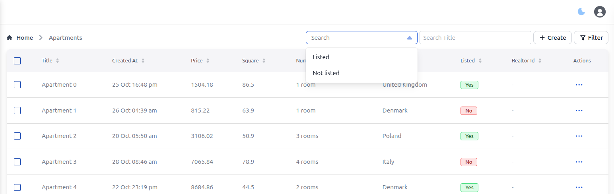

# Quick filters
Allows you to add search input or select with preseted filters at the list view

## Setup

First, install the plugin:
```bash
pnpm i @adminforth/quick-filters
```
Then add it to yours resource:

```ts title="./resources/apartments.ts"
import QuickFiltersPlugin from '@adminforth/quick-filters';
```

And finally add it to list of plugins:

```ts title="./resources/apartments.ts"
  plugins: [
    ...
    //diff-add
    new QuickFiltersPlugin({
      //diff-add
      filters: [
        //diff-add
        {
          //diff-add
          name: 'Listed',
          //diff-add
          enum: [
            //diff-add
            { label: 'Listed', filters: () => Filters.EQ('listed', true) },
            //diff-add 
            { label: 'Not listed', filters: () => Filters.EQ('listed', false) },
            //diff-add
          ]
          //diff-add
        },
        //diff-add
        {
          //diff-add
          name: 'Title',
          //diff-add
          searchInput: (searchVal) => Filters.ILIKE('title', searchVal)
          //diff-add
        },
        //diff-add
      ]
      //diff-add
    }),
    ...
  ]
```




