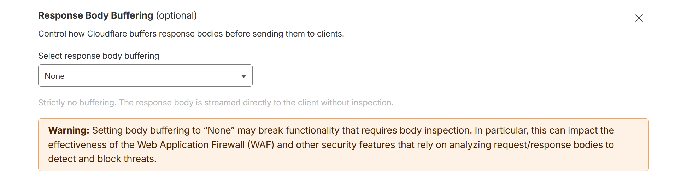

> TODO: this plugin tutorial is in progress, some information might be missing, we are actively working on it now. If you have any questions regarding this plugin, please reach out to us in GitHub issues


# Agent Plugin

This plugin adds an AI agent with a chat surface to AdminForth which is capable of default skills like searching/editing data and extending with custom skills. 

It stores session history in your own resources and uses any AdminForth completion adapter to generate responses.

## Installation

```bash
pnpm i @adminforth/agent --save
pnpm i @adminforth/completion-adapter-open-ai-chat-gpt --save
```

Add your LLM credentials to `.env`:

```env title=.env
...
OPENAI_API_KEY=your_key
```

You can replace the OpenAI adapter with any completion adapter from [List of adapters](/docs/tutorial/ListOfAdapters/).

## Setup

First create two resources for sessions and turns:

```ts title="./resources/agent_resources/sessions.ts"
import AdminForth, { AdminForthDataTypes } from 'adminforth';
import type { AdminForthResourceInput } from 'adminforth';
import { randomUUID } from 'crypto';

export default {
  dataSource: 'sqlite',
  table: 'sessions',
  resourceId: 'sessions',
  label: 'Sessions',
  columns: [
    {
      name: 'id',
      primaryKey: true,
      type: AdminForthDataTypes.STRING,
      fillOnCreate: () => randomUUID(),
      showIn: {
        edit: false,
        create: false,
      },
    },
    {
      name: 'title',
      type: AdminForthDataTypes.STRING,
    },
    {
      name: 'turns',
      type: AdminForthDataTypes.INTEGER,
    },
    {
      name: 'asker_id',
      type: AdminForthDataTypes.STRING,
    },
    {
      name: 'created_at',
      type: AdminForthDataTypes.DATETIME,
      fillOnCreate: () => (new Date()).toISOString(),
      showIn: {
        edit: false,
        create: false,
      },
    },
  ],
} as AdminForthResourceInput;
```

```ts title="./resources/agent_resources/turns.ts"
import AdminForth, { AdminForthDataTypes } from 'adminforth';
import type { AdminForthResourceInput } from 'adminforth';
import { randomUUID } from 'crypto';

export default {
  dataSource: 'sqlite',
  table: 'turns',
  resourceId: 'turns',
  label: 'Turns',
  columns: [
    {
      name: 'id',
      primaryKey: true,
      type: AdminForthDataTypes.STRING,
      fillOnCreate: () => randomUUID(),
      showIn: {
        edit: false,
        create: false,
      },
    },
    {
      name: 'session_id',
      type: AdminForthDataTypes.STRING,
    },
    {
      name: 'created_at',
      type: AdminForthDataTypes.DATE,
      fillOnCreate: () => (new Date()).toISOString(),
      showIn: {
        edit: false,
        create: false,
      },
    },
    {
      name: 'prompt',
      type: AdminForthDataTypes.TEXT,
    },
    {
      name: 'response',
      type: AdminForthDataTypes.TEXT,
    },
  ],
} as AdminForthResourceInput;
```

`asker_id` must store the current admin user's primary key, and `created_at` should be filled automatically because the plugin sorts sessions and turns by it. The `turns` field can stay nullable, but the plugin configuration still expects it.

Add matching tables to your schema:

```prisma title='./schema.prisma'
model sessions {
  id         String   @id
  title      String
  turns      Int?
  asker_id   String
  created_at DateTime
}

model turns {
  id         String   @id
  session_id String
  created_at DateTime
  prompt     String?
  response   String?
}
```

Run migration:

```bash
pnpm makemigration --name add-adminforth-agent-tables ; pnpm migrate:local
```

Register both resources in your app:

```ts title="./index.ts"
import sessions_resource from './resources/agent_resources/sessions.js';
import turns_resource from './resources/agent_resources/turns.js';

export const admin = new AdminForth({
  ...
  resources: [
    ...
    sessions_resource,
    turns_resource,
  ],
  ...
});
```

Then attach the plugin once, usually to your `adminuser` resource:

```ts title="./resources/adminuser.ts"
import AdminForthAgent from '@adminforth/agent';
import CompletionAdapterOpenAIChatGPT from '@adminforth/completion-adapter-open-ai-chat-gpt';

...

plugins: [
  ...
  new AdminForthAgent({
    completionAdapter: new CompletionAdapterOpenAIChatGPT({
      openAiApiKey: process.env.OPENAI_API_KEY as string,
      model: 'gpt-5.4-mini',
    }),
    maxTokens: 10000,
    reasoning: 'none',
    sessionResource: {
      resourceId: 'sessions',
      idField: 'id',
      titleField: 'title',
      turnsField: 'turns',
      askerIdField: 'asker_id',
      createdAtField: 'created_at',
    },
    turnResource: {
      resourceId: 'turns',
      idField: 'id',
      sessionIdField: 'session_id',
      createdAtField: 'created_at',
      promptField: 'prompt',
      responseField: 'response',
      // optional
      // debugField: 'debug',
    },
  }),
]
```

The plugin adds a chat surface to the admin UI and keeps session history per admin user.

## Reverse proxy and CDN configuration for streaming

The agent streams responses from `<baseURL>/adminapi/v1/agent/response` using server-sent events, where `<baseURL>` is your AdminForth base path or an empty string when deployed at the domain root. If your proxy buffers responses, the UI will receive the answer only after generation is finished.

For Nginx, disable response buffering on this endpoint. The critical line is `proxy_buffering off;`.

```nginx
location <baseURL>/adminapi/v1/agent/response {
  proxy_http_version 1.1;
  proxy_read_timeout 600s;
  proxy_set_header X-Forwarded-For $proxy_add_x_forwarded_for;
  proxy_set_header Host $http_host;
  proxy_set_header Connection "";
  proxy_buffering off;  # required for streaming
  proxy_pass http://127.0.0.1:3500;
}
```

Traefik forwards streaming responses immediately by default. The line that must stay off this route is any buffering middleware attachment such as `traefik.http.routers.adminforth-agent.middlewares=buffering@docker`. If your main router uses extra middlewares, create a dedicated router for the agent stream endpoint and do not attach buffering to it:

```yaml title='./compose.yml'
services:
  adminforth:
    labels:
      - "traefik.enable=true"
      - "traefik.http.services.adminforth.loadbalancer.server.port=3500"

      - "traefik.http.routers.adminforth.rule=PathPrefix(`/`)"
      - "traefik.http.routers.adminforth.tls=true"
      - "traefik.http.routers.adminforth.tls.certresolver=myresolver"
      - "traefik.http.routers.adminforth.middlewares=secure-headers,buffering@docker"

      - "traefik.http.routers.adminforth-agent.rule=Path(`<baseURL>/adminapi/v1/agent/response`)"
      - "traefik.http.routers.adminforth-agent.priority=100"
      - "traefik.http.routers.adminforth-agent.service=adminforth"
      - "traefik.http.routers.adminforth-agent.tls=true"
      - "traefik.http.routers.adminforth-agent.tls.certresolver=myresolver"
      # keep buffering OFF for SSE
      # do not add:
      # - "traefik.http.routers.adminforth-agent.middlewares=buffering@docker"
```

  Replace `<baseURL>` with the same base path you use for AdminForth. For example, when `ADMIN_BASE_URL = '/admin/'`, the endpoint becomes `/admin/adminapi/v1/agent/response`.

### CDN

  Cloudflare by default buffers responses, which breaks streaming. To fix it, create a page rule for your domain with a "Response Body Buffering" setting turned off for the agent stream endpoint (`<baseURL>/adminapi/v1/agent/response`).




## Custom skills and tools


Place you skills in `custom/skills/<skill_name>/SKILL.md` file. The plugin will pick them up automatically and make available in agent's toolbox.


To define custom tools, create api endpoints, prefer `admin.express.withSchema(...)` from [Custom Pages / API docs](/docs/tutorial/Customization/customPages/). That exposes machine-readable request and response schemas the agent can use.

In skills markdown file, merge which tool exactlu agent should load.


Skill example:

// TODO


