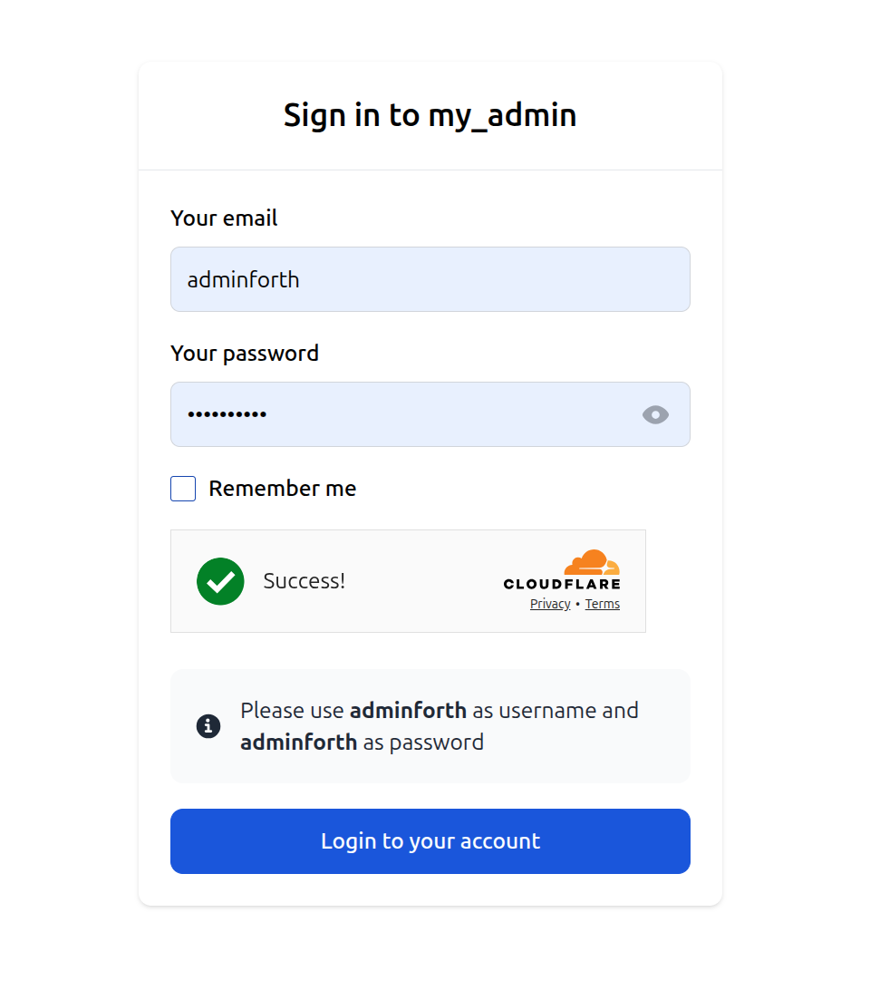

# Login Captcha

(this plugin experemental and not yet fully tested)

This plugin provides a captcha for the login page to enhance security.

## Installation

To install the plugin, run the following command:

```bash
pnpm i @adminforth/login-captcha
```

You will also need to install a captcha adapter. For example, to use the Cloudflare adapter, run:

```bash
pnpm i @adminforth/login-captcha-adapter-cloudflare
```

## Usage

To use the plugin, add it to your user resource file. Here's an example:

```ts title="./resources/adminuser.ts"
// Import the plugin and adapter
import CaptchaPlugin from "@adminforth/login-captcha";
import CaptchaAdapterCloudflare from "@adminforth/login-captcha-adapter-cloudflare";

...

// Add the plugin to the `plugins` array
plugins: [
    new CaptchaPlugin({ 
      captchaAdapter: new CaptchaAdapterCloudflare({
        siteKey: "YOUR_SITE_KEY", // Replace with your site key
        secretKey: "YOUR_SECRET_KEY", // Replace with your secret key
      }),
    }),
]
```

## Preventing token reuse

A captcha token stays valid at the provider for a short period, which means the same token could be replayed for several logins. To prevent this, pass an optional [key-value adapter](/docs/tutorial/Adapters/key-value-adapters) via `keyValueAdapter`. Each token is recorded once it has been used for a successful login, and any later attempt with the same token is rejected.

```bash
pnpm i @adminforth/key-value-adapter-ram
```

```ts title="./resources/adminuser.ts"
// Import the plugin, captcha adapter and a key-value adapter
import CaptchaPlugin from "@adminforth/login-captcha";
import CaptchaAdapterCloudflare from "@adminforth/login-captcha-adapter-cloudflare";
import RamKeyValueAdapter from "@adminforth/key-value-adapter-ram";

...

plugins: [
    new CaptchaPlugin({
      captchaAdapter: new CaptchaAdapterCloudflare({
        siteKey: "YOUR_SITE_KEY", // Replace with your site key
        secretKey: "YOUR_SECRET_KEY", // Replace with your secret key
      }),
      // Store used tokens to prevent them from being replayed
      keyValueAdapter: new RamKeyValueAdapter(),
      // Optional: how long (in seconds) a used token is remembered. Should be at least as long
      // as the captcha provider keeps the token valid. Defaults to 300 (5 minutes).
      tokenTimeToLiveSeconds: 300,
    }),
]
```

You can use any of the available [key-value adapters](/docs/tutorial/Adapters/key-value-adapters) (RAM, Redis, LevelDB or Resource-based). For multi-process or replicated deployments use a centralized adapter such as Redis, so used tokens are shared across all processes.

## Result

After setting up the plugin, your login page will include a captcha. Below is an example of how it will look:


