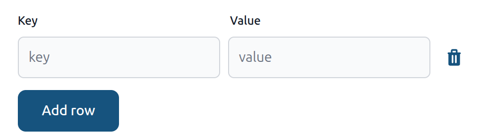

# JSON Editor

The JSON Editor plugin replaces the default text input for JSON columns with a structured key-value editor. Users can add, edit, and delete individual pairs without writing raw JSON.

Values support all standard JSON types: strings, numbers, booleans, `null`, arrays, and nested objects.

## Installation

```bash
pnpm install @adminforth/json-editor --save
```

## Setting up

Import and attach the plugin to an existing column in your resource:

```ts title="./resources/apartments.ts"
//diff-add
import JsonEditorPlugin from '@adminforth/json-editor';

export default {
  ...
  plugins: [
    ...
//diff-add
    new JsonEditorPlugin({
//diff-add
      fieldName: 'description',
//diff-add
    }),
  ],
}
```

> The plugin works on columns with type `json`, `string`, or `text`. The stored value must be a JSON object (`{}`). Top-level arrays and primitives are not supported.



## Value types

Values are entered in JSON notation:

| Input | Saved as |
|---|---|
| `"hello"` | string |
| `42` | number |
| `true` / `false` | boolean |
| `null` | null |
| `[1, "x", true]` | array |
| `{"key": 1}` | nested object |

## Validation

Saving is blocked when:

- **Duplicate keys** - two rows share the same key name.
- **Invalid JSON value** - the value field is not valid JSON (e.g. `hello` without quotes). The error identifies the row: `Row 2: value is not valid JSON`.

An empty value field is allowed and saved as an empty string `""`.
