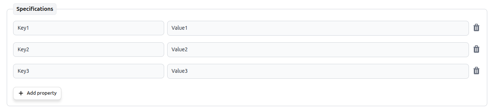

# JSON Form

The JSON Form plugin renders a rich, schema-driven form for a **JSON** column instead of the default raw text area. You describe the shape of the data with a JSON Schema (extended with a few `x-*` keywords for layout and validation messages) and the form is generated by [**jedison**](https://germanbisurgi.github.io/jedison-docs/), a JSON-Schema form generator, mounted inside the AdminForth create/edit views.

Unlike the [JSON Editor](/docs/tutorial/Plugins/json-editor) plugin (a generic key-value editor), the JSON Form plugin gives you a fixed, validated form: nested objects, arrays, enums, discriminated unions, grids, tabs and typed inputs — all driven by a schema you control.

## Installation

```bash
pnpm add @adminforth/json-form --save
```

## Setting up

The plugin works **only with `json` columns**. If the target column is not of type `json`, the plugin throws during config validation.

First, update the schema:

```title="./schema.prisma"
model apartments {
      ...
  //diff-add
  config    Json? 
}
```
and make a migration:

```bash
pnpm makemigration --name add-apartment-config; pnpm migrate:local
```

Then make sure the target column is declared with the `json` datatype:

```ts title="./resources/apartments.ts"
import { AdminForthDataTypes } from 'adminforth';

export default {
  ...
  columns: [
    ...
//diff-add
    {
//diff-add
      name: 'config',
//diff-add
      type: AdminForthDataTypes.JSON,   // required: must be JSON
//diff-add
      label: 'Config',
//diff-add
    },
  ],
}
```

And finally import and attach the plugin, passing the field name and a schema:

```ts title="./resources/apartments.ts"
//diff-add
import JsonFormPlugin from '@adminforth/json-form';

export default {
  ...
  plugins: [
    ...
//diff-add
    new JsonFormPlugin({
//diff-add
      fieldName: 'config',
//diff-add
      schema: {
//diff-add
        title: 'RPG Character Creator',
//diff-add
        description: 'Create and customize your adventurer',
//diff-add
        type: 'object',
//diff-add
        'x-format': 'nav-vertical',
//diff-add
        properties: {
//diff-add
          identity: {
//diff-add
            title: 'Identity',
//diff-add
            type: 'object',
//diff-add
            'x-format': 'grid',
//diff-add
            required: ['name'],
//diff-add
            properties: {
//diff-add
              name: {
//diff-add
                title: 'Name',
//diff-add
                type: 'string',
//diff-add
                minLength: 2,
//diff-add
                'x-grid': { columns: 6 },
//diff-add
                'x-messages': { required: 'Every adventurer needs a name!' },
//diff-add
                default: 'Thalion Oakenshield',
//diff-add
              },
//diff-add
              // ...
//diff-add
            },
//diff-add
          },
//diff-add
          // ...
//diff-add
        },
//diff-add
      },
//diff-add
    }),
  ],
}
```

The same form is rendered in both the create and edit views for the `config` field.

## Key-value renderer

Since using JSON as key-value storage is a popular use case, the JSON Form plugin provides a custom key-value editor:

```js title="schema example"
schema: {
  "title": "Specifications",
  "type": "object",
  "additionalProperties": {
      "type": "string"
  }
}
```



Any object that declares no `properties` and does not set `additionalProperties: false` is rendered this way by default, so no extra keyword is needed to opt in. Rows are added inline, without a popup: the new key starts empty and gets the focus, the key itself is applied when the input loses focus or on `Enter`, and the trash button removes the entry right away. Renaming a key to one that already exists is refused with an inline message.

The value cell holds the regular editor for whatever `additionalProperties` describes, so values are not limited to strings — nested objects and arrays work too, and keep their own formatting and validation rules.

