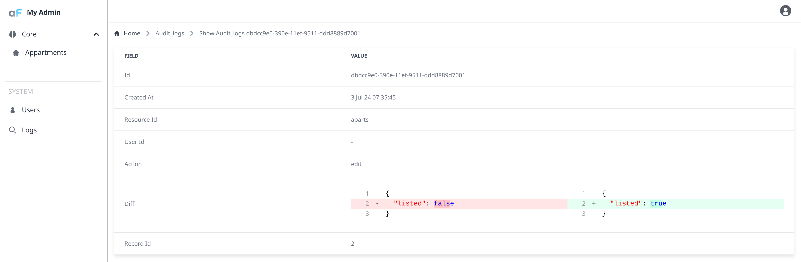

AuditLog plugin allows to limit access to the resource actions (list, show, create, update, delete) based on custom callback.
Callback accepts [AdminUser](/docs/api/types/AdminForthConfig/type-aliases/AdminUser/) which you can use to define access rules.


## Installation


Plugin is already installed into adminforth, to import:

```ts
import AuditLogPlugin from 'adminforth/plugins/AuditLogPlugin';
```
If yu are using pure Node without TypeScript, you can use the following code:

```js
import AuditLogPlugin from 'adminforth/dist/plugins/AuditLogPlugin/index.ts';
```

[Getting Started](<../01-gettingStarted.md>) will be used as base for this example.


## Creating table for storing activity data
For the first, to track records changes, we need to set up the database and table with certain fields inside where tracked data will be stored.

In this example, you should create this table in your own database:
```sql
CREATE TABLE audit_logs(
    id uuid NOT NULL,  -- identifier of applied change record 
    created_at timestamp without time zone, -- timestamp of applied change
    resource_id varchar(255), -- identifier of resource where change were applied
    user_id uuid, -- identifier of user who made the changes
    "action" varchar(255), -- type of change (create, edit, delete)
    diff text, -- delta betwen before/after versions
    record_id varchar, -- identifier of record that been changed
    PRIMARY KEY(id)
);
```


## Setting up the resource and dataSource for plugin
Logger sets up for all the resources by default. But you can exclude unwanted resources with option "excludeResourceIds". In this example, we'll exclude resource "users" from logging.

Also, it excludes itself to avoid infinte logging loop.

```ts
    dataSources: [
        ...
        {
            id: 'db2',
            url: '<url to your database>',
        },
    ],
    resources: [
    ...
    {
        dataSource: 'db2', table: 'audit_logs',
        columns: [
            { name: 'id', primaryKey: true, required: false, fillOnCreate: ({initialRecord}: any) => uuid() },
            { name: 'created_at', required: false },
            { name: 'resource_id', required: false },
            { name: 'user_id', required: false },
            { name: 'action', required: false },
            { name: 'diff', required: false },
            { name: 'record_id', required: false },
        ],
        options: {
            allowedActions: {
                edit: false,
                delete: false,
            }
        },
        plugins: [
            new AuditLogPlugin({
                excludeResourceIds: ['users'],
                resourceColumns: {
                    resourceIdColumnName: 'resource_id',
                    resourceActionColumnName: 'action',
                    resourceDataColumnName: 'diff',
                    resourceUserIdColumnName: 'user_id',
                    resourceRecordIdColumnName: 'record_id',
                    resourceCreatedColumnName: 'created_at'
                }
            }),
        ],
    }
    ]
```

Also, we need to add it to menu:
```ts
{
    label: 'Logs',
    icon: 'flowbite:search-outline',
    resourceId: 'audit_logs',
}
```

That's it! Now you can see the logs in the table 



See [API Reference](/docs/api/plugins/AuditLogPlugin/types/type-aliases/PluginOptions.md) for more all options.
