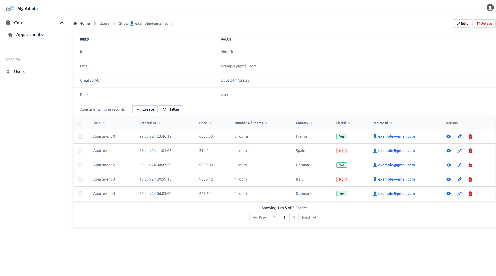

Foreign inline list plugin allows to display a list (table) of items from a foreign table in the show view.

## Usage


Import plugin:

```ts
import ForeignInlineListPlugin from 'adminforth/plugins/ForeignInlineListPlugin';
```
If you are using pure Node without TypeScript, you can use the following code:

```js
import ForeignInlineListPlugin from 'adminforth/dist/plugins/ForeignInlineListPlugin/index.js';
```

In [Getting Started](<../01-gettingStarted.md>) we created a `'aparts'` resource which has a field `'realtor_id'`.
This field refers to record from `'users'` resource. This means that we can display a list of appartments in the user's show view.

Add to your `'users'` resource configuration (which we created in ), plugin instance:


```ts title="./index.ts"
{ 
    ...
    resourceId: 'users',
    ...
//diff-add
    plugins: [
//diff-add
      new ForeignInlineListPlugin({
//diff-add
        foreignResourceId: 'aparts',
//diff-add
        modifyTableResourceConfig: (resourceConfig: AdminForthResource) => {
//diff-add
          // hide column 'square_meter' from both 'list' and 'filter'
//diff-add
          const column = resourceConfig.columns.find((c: AdminForthResourceColumn) => c.name === 'square_meter')!.showIn = [];
//diff-add
          resourceConfig.options!.listPageSize = 1;
//diff-add
          // feel free to console.log and edit resourceConfig as you need
//diff-add
        },
//diff-add
      }),
//diff-add
    ],
}
```

You can use `modifyTableResourceConfig` callback to modify what columns to show in the list and filter of the foreign table.



See [API Reference](/docs/api/plugins/ForeignInlineListPlugin/types/type-aliases/PluginOptions) for more all options.